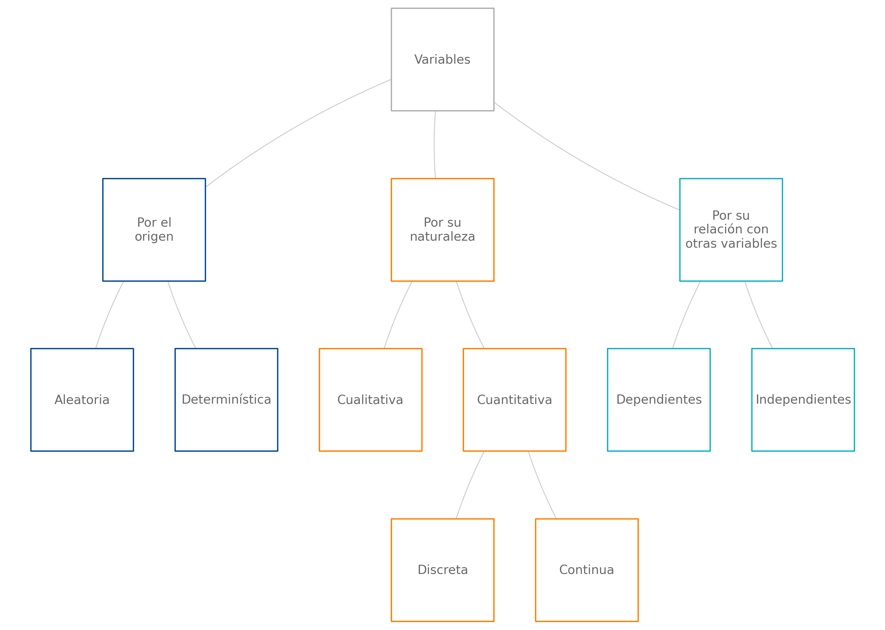
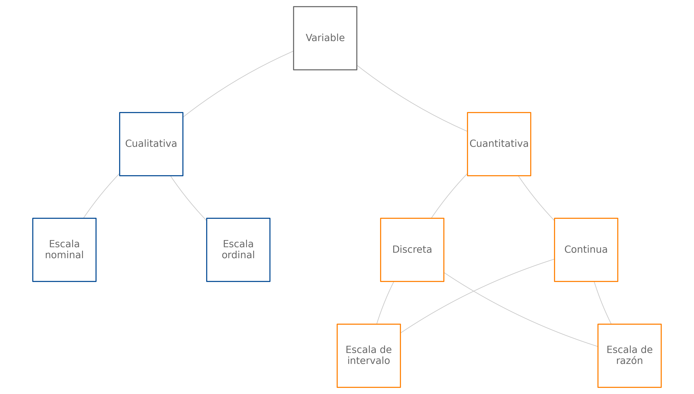
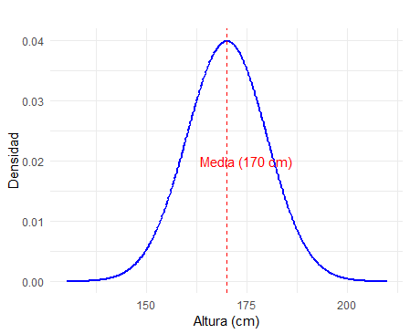
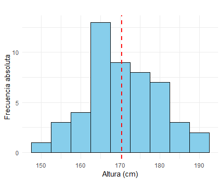
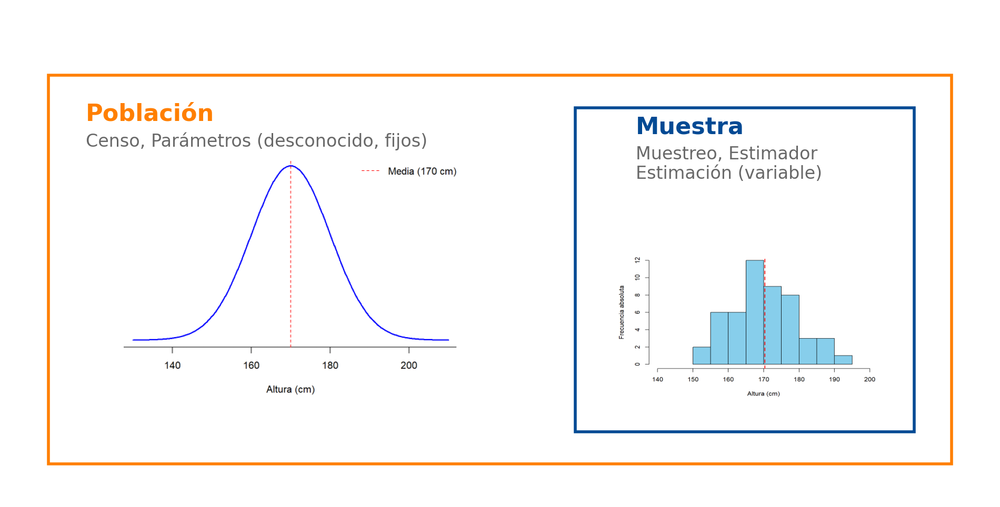
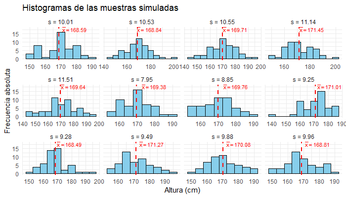

```{r setup, include=FALSE}
knitr::opts_chunk$set(echo = TRUE, comment = NA)
library(readr)
library(tidyverse)
library(DT)
library(paqueteMETODOS)

data("CarreraLuz22")
data("evaluacion")
data("inflacionov22")
```

</br>

<h2>Representación de datos</h2>

Una de las formas más efectivas para organizar y resumir conjuntos amplios de datos es mediante el uso de **indicadores** (como medidas de tendencia central, variabilidad y orden), **tablas de frecuencias** y **gráficas**, ya que estas herramientas permiten condensar la información y facilitan su interpretación. Aunque estas modalidades ofrecen información complementaria, las **gráficas** son particularmente útiles cuando se busca **transmitir una idea de manera rápida e intuitiva**. Por el contrario, las **tablas de frecuencias** y los **indicadores** resultan más apropiados en contextos que demandan un **análisis detallado o una mayor precisión** en los datos.

Los indicadores, tablas y gráficas pueden integrarse en distintos formatos de comunicación, como informes estadísticos, tableros interactivos, pósteres o infografías.

En este contexto, el siguiente tablero permite visualizar en tiempo real los paquetes de **R** que están siendo descargados. El tamaño de los círculos representa las frecuencias de descarga de cada paquete, destacando aquellos con mayor frecuencia mediante círculos más grandes.


</br><br/>

<iframe src="https://testing-apps.shinyapps.io/flexdashboard-shiny-crandash/" width="1000" height="800"></iframe>

<center>
<sub>
Fuente : Tomado de [CRAN Download Monitor](https://testing-apps.shinyapps.io/flexdashboard-shiny-crandash)
</sub>
</center>

<br/>


<br/><br/>
<h2>Estadística</h2>

<br/><br/>
<h3>¿Qué es Estadística?</h3>

Algunas definiciones de la estadística son las siguientes:

<div class="caja-nota">
> *"Estudio matemático de la incertidumbre y la variabilidad que proporciona herramientas y métodos para describir, modelar y analizar fenómenos aleatorios, y tomar decisiones basadas en la información disponible."*  
> — Kolmogorov, A. N. (1933) 
</div>

<div class="caja-nota">
> *"Ciencia que trata de la toma de decisiones en presencia de incertidumbre mediante el uso de datos observados."*  
> — Fisher, R. A. (1959)
</div>

<div class="caja-nota">
> *"Conjunto de métodos para recopilar, organizar, resumir, presentar y analizar datos, así como para obtener conclusiones válidas y tomar decisiones razonables basadas en tal análisis."*  
> — Walpole, R. E. (2012)
</div>

<div class="caja-nota">
> *"Ciencia que utiliza métodos para recopilar, describir, analizar e interpretar datos, así como para tomar decisiones basadas en dichos análisis."*  
> — Anderson, D. R. (2013)
</div>


<br/><br/>
<h3>¿Dónde y cómo surge?</h3>

La **Estadística** surge como la herramienta ideal para abordar los efectos de incertidumbre inherentes a la gran mayoría de procesos biológicos, químicos, industriales y de comportamiento humano, donde predominan el azar y la incertidumbre.

En su desarrollo histórico, la estadística ha atravesado las siguientes etapas:

* Conteo de poblaciones, riquezas y recursos naturales (Antes de Cristo – siglo XVII).

* Cuantificación de probabilidades de éxito en los juegos de azar (siglo XVIII). 

* Optimización de la producción agrícola (siglo XIX).  

* Herramienta de apoyo en el desarrollo científico y tecnológico en todas las áreas del conocimiento.
</br>

<br/><br/>
<h3>¿Cuál es su objetivo?</h3>

El objetivo principal de la **Estadística** radica en procesar, analizar y modelar la información contenida en bases de datos con el propósito de extraer conocimiento útil para la toma de decisiones informadas. Cabe señalar que los datos representan mediciones, conteos, cualidades o características individuales, mientras que la información se genera al integrar dichos datos con herramientas, métodos y modelos estadísticos, así como al considerar factores contextuales relevantes. Este proceso de transformación permite desarrollar criterios bien fundamentados, lo que facilita la toma de decisiones efectivas y basadas en evidencia.


<div class="caja-nota">
> *"Llegará el día en el que el pensamiento estadístico será una condición tan necesaria para la convivencia eficiente como la capacidad de leer y escribir".*  
> — Anderson, D. R. (2013)
</div>
</br>

<br/><br/>
<h3>¿Dónde aplicarla?</h3>

La **Estadística** es una ciencia transversal a las diversas disciplinas del conocimiento, como, por ejemplo, finanzas, ingeniería, salud, economía, contabilidad, mercadeo, sociología, entre muchas otras. Algunos ejemplos de su aplicación son:

* *Finanzas*: permite segmentar clientes, predecir fraudes, estimar el riesgo de una inversión o la asignación de un préstamo por parte de una entidad bancaria, determinar tendencias del mercado y medir la satisfacción del cliente.

* *Ingeniería*: facilita el control de calidad de productos, la predicción del consumo de recursos como energía, y el pronóstico del tiempo de fallo de equipos.

* *Salud*: permite determinar factores de riesgo y sobrevida de pacientes con cáncer, evaluar la eficacia de tratamientos y, en general, realizar investigaciones que contribuyen a generar mejores terapias para diversas enfermedades.

* *Economía*: permite estudiar los determinantes del desempleo o el crecimiento económico en una región.

Asimismo, en las actividades cotidianas, existen numerosos ejemplos en los que es fundamental disponer de información confiable para tomar decisiones fundamentadas. Por ejemplo, en el ámbito de la movilidad, las aplicaciones de navegación emplean análisis estadísticos para predecir los tiempos de viaje y recomendar rutas más rápidas, utilizando datos de tráfico en tiempo real. Otro caso se encuentra en las finanzas personales, donde los hogares evalúan sus gastos mensuales y analizan tendencias de consumo con el propósito de planificar presupuestos y evitar deudas.

</br>


<div class="caja-actividad">
<h3>Actividad:</h3>

>De acuerdo con tu área de profesión, identifica alguna situación o actividad donde sea necesaria la Estadística.
>
</div>


</br></br>
<h2>Unidad de análisis</h2>

Una *unidad de análisis o unidad muestral* es el elemento concreto sobre el cual se realiza la observación o medición, y su selección adecuada es crucial para el éxito de cualquier estudio estadístico. Definir correctamente las unidades muestrales es fundamental para garantizar que:

* El proceso de muestreo sea válido y eficiente. 

* Los datos recolectados sean consistentes y útiles para responder a las preguntas de investigación.  

* Las conclusiones obtenidas sean generalizables a la población, siempre que la muestra sea representativa.  


<div class="caja-ejemplo">
<h3>Ejemplos:</h3>
<p> A continuación se presentan algunos estudios y la *unidad muestral* que se considera.
</p>

<p>
-  En un estudio sobre el nivel de satisfacción de los clientes de un banco, la  *unidad muestral* corresponde a cada *cliente* encuestado. Por ejemplo, el banco podría seleccionar una muestra de clientes que han utilizado sus servicios en el último mes para evaluar su experiencia y satisfacción. 

-  En un análisis de calidad de un producto, la *unidad muestral* podría ser cada producto individual evaluado. Por ejemplo, en una fábrica de *botellas plásticas*, las unidades muestrales son las botellas individuales seleccionadas aleatoriamente de una línea de producción para verificar si cumplen con los estándares de calidad. 

-  En un estudio agrícola, la *unidad muestral* podría ser cada *parcela de tierra* seleccionada para formar parte del muestreo. Por ejemplo, en una investigación sobre la fertilidad del suelo, las parcelas individuales se eligen dentro de un terreno más grande para analizar características específicas del suelo.

-  En un estudio diseñado para evaluar la calidad del agua en un río, se definen como *unidades muestrales* las *muestras de agua* recolectadas en puntos específicos del río. Cada muestra puede ser tomada en diferentes ubicaciones, profundidades o momentos del día, dependiendo del diseño del estudio.  

   
</p>

</div>


<div class="caja-actividad">
<h3>Actividad:</h3>


<p>
>
A continuación, se presentan tres escenarios relacionados con estudios de investigación. Lee cada uno cuidadosamente y determina la **unidad muestral** en el estudio. 
>
</br>
>
- Un estudio busca medir el impacto de un nuevo programa de enseñanza de matemáticas en una población estudiantil. Para ello, se seleccionan estudiantes de diferentes escuelas que participan en el programa y se les aplica una prueba estandarizada antes y después de su implementación. 
>
</br>
>
- En una fábrica de licuadoras, el equipo de calidad desea verificar si los productos ensamblados cumplen con los estándares establecidos. Durante el proceso, se seleccionan aleatoriamente licuadoras de cada lote de producción y se evalúan en función de su funcionamiento y durabilidad.
>
</br>
>
- Un equipo de investigadores estudia la calidad del aire en diferentes zonas de una ciudad. Para ello, colocan estaciones de monitoreo en puntos estratégicos que recolectan muestras de aire durante intervalos regulares. Los datos recolectados incluyen concentraciones de partículas contaminantes y gases.
>

</div>


</br></br>
<h2>Variable</h2>

En el marco de la estadística, una *variable* es una función que traduce los resultados del espacio muestral (resultados posibles de un experimento aleatorio) en valores concretos (números reales) sobre los cuales se pueden asignar probabilidades, permitiendo analizar y modelar fenómenos aleatorios de manera sistemática.

En términos más coloquiales, una *variable* corresponde a los resultados registrados a partir de la unidad de análisis. Se asocia una medición o conteo (número) o una cualidad (categoría) a la unidad muestral, de acuerdo con reglas predeterminadas en el estudio. Las variables se pueden clasificar según su *origen*, *naturaleza* o *relación con otras variables*. En la **Figura 1.1** se muestra un resumen de la clasificación de las variables.
<br/>


<center>
```{r, echo=FALSE, out.width="100%", fig.align = "center"}

```
**Figura 1.1** Clasificación de las variables de acuerdo a su origen, naturaleza y relaciones.
</center>
</br>

<h3>Por su origen</h3>

Una *variable aleatoria* es una función matemática que asigna valores numéricos a los resultados de un experimento aleatorio. Su principal característica es que sus valores no son predecibles con certeza antes de realizar el experimento, pero su comportamiento puede modelarse mediante una distribución de probabilidad, lo que permite describir la probabilidad de que tome ciertos valores o intervalos. Estas variables son esenciales en estudios estadísticos, ya que modelan fenómenos sujetos al azar.

Una *variable determinística* es aquella cuyo valor está completamente definido por una regla o fórmula matemática y no está sujeto a incertidumbre. Esto significa que, dado un conjunto de condiciones iniciales, el valor de la variable es único y predecible. En la **Tabla 1.1** se presenta la comparación entre variable aleatoria y determinística.

**Tabla 1.1** Comparación entre variable aleatoria y determinística.  

| **Aspecto**              | **Variable aleatoria**                                | **Variable determinística**                           |
|--------------------------|-----------------------------------------------------|-----------------------------------------------------|
| **Definición**            | Depende de resultados aleatorios.                   | Determinada por reglas o relaciones matemáticas.     |
| **Predecibilidad**        | No se puede predecir con certeza; se describe con probabilidad. | Totalmente predecible dada la información inicial.  |
| <span style="color:#C75000">**Ejemplos**</span>               | Resultado de lanzar un dado balanceado al aire. Si los tres primeros resultados del lanzamiento son 1, 2 y 3, no se puede predecir el cuarto resultado como el número 4, puede ser cualquiera de los 6 números. Sin embargo, en 600 lanzamientos del dado, se estima que aproximadamente en 100 casos cae el número 4.                        | Cálculo de la velocidad: \(v = d / t\).             |
| **Representación matemática** | Se define como una función \(X: S \to \mathbb{R}\), donde \( S \) es el conjunto determinado por los resultados posibles del experimento aleatorio. En el ejemplo, el experimento es lanzar el dado y sus resultados posibles los números del 1 al 6.  | Se define como una función determinística \(Y = f(x)\). En el ejemplo, la variable dependiente \(Y\) es la velocidad y las independientes \(d\) (distancia) y \(t\) (tiempo). |

</br>

<h3>Por su naturaleza</h3>

En estadística, las variables se clasifican según su naturaleza en dos categorías principales: **variables cualitativas** y **variables cuantitativas**. Estas categorías reflejan el tipo de información que las variables representan y las operaciones que se pueden realizar con ellas.

Las **variables cualitativas** describen atributos, características o categorías que no pueden medirse numéricamente. Su principal propósito es clasificar o etiquetar los elementos de estudio, y no se pueden realizar operaciones matemáticas con sus valores. Estas se clasifican en dos grupos: ordinales y nominales. En las variables cualitativas nominales, las categorías no tienen un orden específico, mientras que en las variables ordinales, las categorías tienen un orden lógico o jerárquico. En la **Tabla 1.2** se presenta la comparación entre variables ordinal y nominal.

**Tabla 1.2** Comparación entre variable ordinal y nominal. 

| **Tipo de Variable**     | **Definición**                                                       | <span style="color:#C75000">**Ejemplos**</span>                             |
|--------------------------|---------------------------------------------------------------------|-------------------------------------------|
| **Cualitativa nominal**  | Categorías sin orden inherente.                                     |- Estado civil (soltero, casado, divorciado).<br>- Estado de una transacción respecto al fraude (1=fraude, 0=no fraude).<br>             |
| **Cualitativa ordinal**  | Categorías con un orden lógico o jerárquico.                        |- Nivel de satisfacción (bajo, medio, alto). <br> - Grados académicos (licenciatura, maestría, doctorado).  <br> - Estrato socioeconómico de un predio (1, 2, 3, 4, 5, y 6). |

Las **variables cuantitativas** representan valores numéricos que permiten realizar operaciones matemáticas, como sumas y promedios. Estas variables reflejan cantidades que resultan de mediciones o conteos y se clasifican en dos grupos: **continuas** y **discretas**.

Las **variables discretas** corresponden a aquellas cuyo conjunto de posibles valores puede tomar un número finito o infinito numerable de valores (por ejemplo, enteros positivos junto con el cero) y suelen proceder de conteos. Por otro lado, las **variables continuas** pueden tomar cualquier valor dentro de un rango infinito no numerable, como es el caso de los valores en el campo de los números reales. Estas últimas suelen estar asociadas a procesos de medición.  En la **Tabla 1.3** se presenta la comparación entre variables discreta y continua.

**Tabla 1.3** Comparación entre variable discreta y continua. 

| **Tipo de Variable**     | **Definición**                                                      | <span style="color:#C75000">**Ejemplos**</span>                              |
|--------------------------|---------------------------------------------------------------------|-------------------------------------------|
| **Cuantitativa discreta**| Valores numéricos enteros, asociados a conteos.                     | - Número de hijos en una familia (0, 1, 2, etc.).  <br> - Número de automóviles vendidos en un mes (0, 1, 2, etc.).  <br> - Número de transacciones diarias de un cliente (0, 1, 2, 3, etc.).       |
| **Cuantitativa continua**| Valores numéricos reales, asociados a mediciones precisas.          | - Altura de una persona (1.65 metros, 1.732 metros, 1 metro, etc.).  <br> - Tiempo requerido para completar una tarea (3.5 horas, 2 horas, etc.).  <br> - El Índice de Precios al Consumidor (IPC), que mide la variación promedio de los precios de un conjunto de bienes y servicios representativos adquiridos por los hogares en un periodo determinado (101.23, 102.56, etc.). Los valores del IPC son producto de mediciones basadas en precios de bienes y servicios recolectados regularmente, como alimentos, transporte, vivienda y educación. |

</br>

<h3>Por su relación con otras variables</h3>

Las variables pueden clasificarse según su relación en **variables independientes**, **dependientes**, **intervinientes** y **de control**. Esta clasificación se basa en la influencia que tienen unas sobre otras y su papel en un análisis estadístico o experimental.

Una  variable independiente es la variable que el investigador manipula o selecciona para observar su efecto en otra variable. No depende de otras variables dentro del contexto del estudio.  Mientras que la variable dependiente es la variable que se mide o estudia para observar los efectos de la variable independiente. Su valor depende de los cambios realizados en la variable independiente. En un estudio sobre el impacto de las horas de estudio en el rendimiento académico, las horas de estudio serían la variable independiente y  el rendimiento académico (como la calificación) sería la variable dependiente.

Una variable interviniente es una variable que no se mide directamente en el estudio pero que puede influir en la relación entre la variable independiente y la dependiente. También conocida como variable mediadora o moderadora, y la variable de control es una variable que el investigador mantiene constante o regula para evitar que afecte la relación entre la variable independiente y la dependiente. Permite aislar el efecto de la variable independiente.  En el estudio anterior, factores como la calidad del sueño o el nivel de estrés del estudiante podrían actuar como variables intervinientes. Mientras que la edad de los estudiantes podría ser una variable de control para asegurarse de que las diferencias en el rendimiento no se deban a la edad. En la **Tabla 1.4** se presenta la comparación entre variables por su relación con otras variables.

**Tabla 1.4** Comparación entre independiente, dependiente, interviniente y de control.  

| **Aspecto**              | **Variable independiente**                      | **Variable dependiente**                     | **Variable interviniente**                      | **Variable de control**                      |
|--------------------------|------------------------------------------------|----------------------------------------------|------------------------------------------------|----------------------------------------------|
| **Definición**            | Variable manipulada o seleccionada para observar su efecto en otra. | Variable que se mide o estudia para observar el efecto de la variable independiente. | Variable que no se mide directamente, pero influye en la relación entre la independiente y la dependiente. | Variable mantenida constante para evitar que afecte la relación entre la independiente y la dependiente. |
| **Propósito**             | Explorar su impacto en otra variable.          | Reflejar los cambios generados por la independiente. | Identificar o considerar factores adicionales que podrían afectar la relación principal. | Aislar el efecto de la independiente y garantizar la validez del estudio. |
| <span style="color:#C75000">**Ejemplos**</span>              | - Tipo de fertilizante en un cultivo (orgánico o químico). <br> - Tiempo (horas) de sueño en un estudio sobre el rendimiento cognitivo. | - Producción de la cosecha (en kilogramos). <br> - Puntaje obtenido en un test de memoria. | - Tipo de suelo en un experimento agrícola. <br> - Nivel de estrés en un análisis del rendimiento cognitivo. | - Condiciones climáticas constantes en el cultivo. <br> - Edad de los participantes en el estudio cognitivo. |
| **Relación matemática**   | Actúa como una entrada o predictor en modelos estadísticos: \( Y = f(X) + \epsilon \). | Se define como una respuesta o salida que depende de la independiente. | Se considera como un moderador o mediador que ajusta el efecto de \(X\) sobre \(Y\). | No entra directamente en la relación \(X\) - \(Y\), pero puede afectar indirectamente si no se controla. |

</br>

<h3>Escalas de medición</h3>

Determinar el tipo de escala de medición de una variable es fundamental, ya que define el tipo de análisis estadístico a realizar y la forma más adecuada de presentar los datos gráficamente. Las escalas de medición se clasifican en cuatro niveles principales: **nominal**, **ordinal**, **de intervalo** y **de razón**. Cada una tiene características específicas que influyen en las operaciones estadísticas permitidas y en su interpretación.

Las variables con escala de medición **nominal** tienen categorías cuyos valores no pueden ser ordenados de manera natural. No existe una jerarquía o relación de mayor o menor entre las categorías. Por otro lado, las variables con escala **ordinal** poseen categorías que pueden ser ordenadas de manera lógica o jerárquica.  En la **Tabla 1.5** se presenta la comparación entre escala nominal y ordinal.

**Tabla 1.5** Comparación entre escala nominal y ordinal.  

| **Aspecto**              | **Nominal**                                | **Ordinal**                               |
|--------------------------|--------------------------------------------|------------------------------------------|
| **Definición**           | Categorías sin orden inherente.            | Categorías con un orden lógico o jerárquico. |
| **Características**      | No existe jerarquía entre los valores.     | Existe jerarquía; las categorías pueden ser ordenadas. |
| <span style="color:#C75000">**Ejemplos**</span>               | - Profesión (ingeniero, estadístico, administrador, etc.). </br> - Nacionalidad (colombiano, venezolano, ecuatoriano, etc.). </br> - Religión (católico, cristiano, evangélico, agnóstico, etc.).         | - Nivel educativo (primaria, secundaria, universitario, especialización, maestría, doctorado). </br> - Nivel de estrés (bajo, medio, alto). </br> - Evaluación de un servicio (excelente, muy bueno, bueno, regular, muy regular). |

Las variables de **intervalo** son numéricas y tienen la particularidad de que el valor cero (0) es arbitrario y no implica la ausencia de la característica medida. Las diferencias entre los valores son significativas y uniformes, pero no se pueden realizar operaciones de proporción, ya que el cero no es absoluto. Por otro lado, en la escala **de razón**, el valor cero (0) indica ausencia de la característica medida. Esta escala permite realizar todo tipo de operaciones matemáticas, incluyendo sumas, restas, multiplicaciones y divisiones, lo que posibilita interpretar proporciones y relaciones entre los valores. En la  **Tabla 1.6** y **Figura 1.1** se resume y comparan los tipos de escala.

**Tabla 1.6** Comparación entre escala de intervalo y de razón.  

| **Aspecto**              | **Intervalo**                              | **Razón**                                  |
|--------------------------|--------------------------------------------|-------------------------------------------|
| **Definición**           | El cero es arbitrario y no implica ausencia de la característica medida. | El cero indica ausencia de la característica medida. |
| **Características**      | Las diferencias entre valores son significativas, pero no se pueden realizar proporciones. | Permite realizar cualquier operación matemática, incluyendo proporciones. |
| <span style="color:#C75000">**Ejemplos**</span>              | Temperatura (°C, °F, °K).                  | Número de hijos, salario, ventas mensuales. |


<center>
```{r, echo=FALSE, out.width="100%", fig.align = "center"}

```
**Figura 1.1** Clasificación de las variables y tipo de escalas de medición. 
</center>


<div class="caja-actividad">
<h3>Actividad:</h3>

>
<p>
A continuación, se presentan descripciones de variables utilizadas en diferentes estudios. Tu tarea será analizar cada variable y **clasificarla según el origen, naturaleza y relación** con otras variables. 
>
</br>
>
- Un estudio mide el rendimiento físico de atletas en una prueba de resistencia. Las variables recolectadas incluyen: Tiempo total en minutos para completar la prueba, frecuencia cardiaca promedio durante la prueba y altura del atleta. 
>
</br>
>
- Un estudio busca determinar los factores que afectan el rendimiento agrícola en hectáreas de cultivo. Las variables incluyen: Producción en kilogramos por hectárea, cantidad de fertilizante aplicado (en kg), nivel de lluvia (en mm) durante el ciclo agrícola y tipo de suelo (arenoso, arcilloso, limoso).
>
</br>
>
- En un ensayo clínico, se evalúa la efectividad de un nuevo medicamento. Las variables recolectadas son: Reducción del nivel de glucosa en sangre (en mg/dL), dosis administrada del medicamento (en mg), edad del paciente y presencia de efectos secundarios (sí/no).
>
</p>


</div>


</br></br>
<h2>Población</h2>

En estadística, la **población** es el conjunto total de valores posibles que puede tomar una **variable** dentro de un contexto determinado. Estos valores pueden estar asociados a individuos, objetos, eventos o cualquier *unidad de análisis* definida en el estudio.

\[
\text{Población} = \{x_1, x_2, x_3, \dots, x_N\},
\]

donde \(x_i\) representa un valor particular de la variable para el \(i\)-ésimo elemento de la población, y \(N\) es el tamaño de la población (puede ser finito o infinito).

La población se define con respecto a una o varias variables específicas que se desean estudiar. 

</br>

<div class="caja-ejemplo">
<h3>Ejemplo:</h3>
<p>
-  Si la variable es **"peso de una persona"**, la población podría ser *"el peso de todos los habitantes de Cali en el 2024"*.  
  (*Unidad de análisis*: habitante de Cali en el periodo 2024).  

- Si la variable es **"altura de una persona"**, la población podría ser *"la altura de los estudiantes matriculados en la universidad para el periodo 2024-1"*.  
  (*Unidad de análisis*: estudiante matriculado en la universidad para el periodo 2024-1).  

- Si la variable es **"número de habitantes"**, la población podría ser *"el número de habitantes en cada ciudad de Colombia a diciembre 31 de 2023"*.  
  (*Unidad de análisis*: ciudad de Colombia a diciembre 31 de 2023).  

- Si la variable es **"estrato socioeconómico de un predio"**, la población podría ser *"el estrato socioeconómico de los predios de Cali a diciembre de 2024"*.  
  (*Unidad de análisis*: predios de Cali para el 2024).  

- Si la variable es **"estado fraudulento de una transacción"**, la población podría ser *"el estado de las transacciones de Bancolombia en diciembre de 2024"*.  
  (*Unidad de análisis*: transacciones de Bancolombia a diciembre de 2024). 
</p>
</div>


Para un mismo conjunto de *unidades de análisis* en un estudio, puede ser de interés analizar diferentes variables, lo que lleva a definir **distintas poblaciones de estudio** según el enfoque estadístico y formal de lo que se entiende por población.


</br></br>
<h2>Muestra aleatoria</h2>

En estadística, una **muestra aleatoria** es un subconjunto de la población, seleccionado de manera que cada elemento de la población tenga una probabilidad conocida y no nula de ser incluido en la muestra. Matemáticamente, si la población se define como:

\[
\text{Población} = \{x_1, x_2, x_3, \dots, x_N\},
\]

entonces una muestra aleatoria es un subconjunto de \(n\) elementos seleccionados de la población:

\[
\text{Muestra} = \{x_{1}, x_{2}, x_{3}, \dots, x_{n}\}, \quad \text{donde } n \leq N.
\]

Una muestra aleatoria **independiente e idénticamente distribuida** (\(i.i.d\)) cumple con las siguientes condiciones:

- **Selección aleatoria**: Los valores de la muestra se obtienen de un experimento aleatorio o proceso de selección en el que cada unidad tiene una probabilidad conocida y no nula de ser seleccionada. No hay sesgos sistemáticos en la selección de los elementos.

-  **Independencia estadística**: Los valores de la muestra son estadísticamente independientes entre sí. El valor observado para una unidad no afecta el valor observado para otra. Es decir, el conocimiento de un dato no proporciona información sobre otro.

-  **Distribución idéntica**: Todos los valores de la muestra provienen de la misma distribución de probabilidad. Cada observación sigue las mismas características de la población, como la misma media, varianza y forma de la distribución.

Estas propiedades son esenciales en estadística porque garantizan que los resultados de los análisis sean confiables y las inferencias válidas.


<div class="caja-ejemplo">
<h3>Ejemplo:</h3>
<p>
Suponga que la población representa las alturas de los adultos en una ciudad. Se sabe que estas alturas siguen de forma acampanada con promedio de 170 cm y desviación estándar de 10 cm. En la unidad siguiente se estudiará esta districuón como una **distribución normal** con una media o promedio (\(\mu\)) de 170 cm y una desviación estándar (\(\sigma\)) de 10 cm, lo que se denota como:

\[
X \sim N(\mu = 170, \sigma = 10)
\]

Ahora, al extrar una muestra aleatoria de tamaño \(n = 50\) de esta población bajo las siguientes condiciones:

- Cada observación es seleccionada de manera **aleatoria**.

- Las observaciones son **independientes** entre sí.

- Todas las observaciones provienen de la misma distribución normal \(N(\mu = 170, \sigma = 10)\).</br>

Entonces podemos denotar la información como:

 **Población**:
   \[
   X \sim N(\mu = 170, \sigma = 10)
   \]

**Muestra i.i.d**:
   \[
   X_1, X_2, \dots, X_{50} \overset{\text{i.i.d}}{\sim} N(\mu = 170, \sigma = 10)
   \]

La **población** corresponde a las alturas de todos los adultos en la ciudad, mientras que la **muestra aleatoria i.i.d.** consiste en 50 registros de alturas de adultos seleccionados aleatoriamente, con sus alturas medidas en centímetros. El resultado podría ser algo como:

\[
\text{Muestra} = \{160.5, 172.3, 168.7, 180.1, 165.4, \dots\}
\]

Se puede representar esta **población** y simular una **muestra aleatoria** utilizando el software **R**. Los resultados de los siguientes códigos se presentan en las **Figuras 1.2** y **1.3**.

<pre>
# Cargar librería ggplot2
library(ggplot2)

# Configuración de parámetros de la población
mu <- 170  # Media de la población
sigma <- 10  # Desviación estándar de la población

# Crear un rango de valores para la población
x <- seq(mu - 4 * sigma, mu + 4 * sigma, length.out = 500)

# Calcular la densidad de la distribución normal
densidad <- dnorm(x, mean = mu, sd = sigma)

# Crear un data frame para ggplot
datos <- data.frame(Altura = x, Densidad = densidad)

# Graficar con ggplot2
plot_pob <- ggplot(datos, aes(x = Altura, y = Densidad)) +
  geom_line(color = "blue", linewidth = 1) +  # Línea de densidad con `linewidth`
  geom_vline(xintercept = mu, color = "red", linetype = "dashed") +  # Línea en la media
  labs(title = "",
       x = "Altura (cm)",
       y = "Densidad") +
  theme_minimal() +  # Tema minimalista
  theme(plot.title = element_text(hjust = 0.5)) +  # Centrar título
  annotate("text", x = mu + 5, y = max(densidad) / 2, 
           label = "Media (170 cm)", color = "red", angle = 0)

# Mostrar el gráfico
print(plot_pob)
</pre>

```{r,eval=TRUE}
# Cargar librería ggplot2
library(ggplot2)

# Configuración de parámetros de la población
mu <- 170  # Media de la población
sigma <- 10  # Desviación estándar de la población

# Crear un rango de valores para la población
x <- seq(mu - 4 * sigma, mu + 4 * sigma, length.out = 500)

# Calcular la densidad de la distribución normal
densidad <- dnorm(x, mean = mu, sd = sigma)

# Crear un data frame para ggplot
datos <- data.frame(Altura = x, Densidad = densidad)

# Graficar con ggplot2
plot_pob <- ggplot(datos, aes(x = Altura, y = Densidad)) +
  geom_line(color = "blue", linewidth = 1) +  # Línea de densidad con `linewidth`
  geom_vline(xintercept = mu, color = "red", linetype = "dashed") +  # Línea en la media
  labs(title = "",
       x = "Altura (cm)",
       y = "Densidad") +
  theme_minimal() +  # Tema minimalista
  theme(plot.title = element_text(hjust = 0.5)) +  # Centrar título
  annotate("text", x = mu + 5, y = max(densidad) / 2, 
           label = "Media (170 cm)", color = "red", angle = 0)

# Mostrar el gráfico
# print(plot_pob)
```

</br>


```{r, echo=FALSE, out.width="50%", fig.align = "center"}

```

**Figura 1.2** Curva de densidad de la población con media (poblacional) de 170 cm y desviación estándar (poblacional) de 10 cm. 

<pre>
# Cargar librería ggplot2
library(ggplot2)

# Configuración de parámetros de la población
set.seed(123)  # Para reproducibilidad
mu <- 170      # Media de la población
sigma <- 10    # Desviación estándar de la población
n <- 50        # Tamaño de la muestra

# Simulación de la muestra iid
muestra <- rnorm(n, mean = mu, sd = sigma)
promedio <- mean(muestra)
desviacion <- sd(muestra)

# Crear un data frame para ggplot
datos <- data.frame(Altura = muestra)

# Graficar el histograma con ggplot2
plot_hist <- ggplot(datos, aes(x = Altura)) +
  geom_histogram(binwidth = 5, fill = "skyblue", color = "black") +  # Histograma
  geom_vline(xintercept = promedio, color = "red", linetype = "dashed", linewidth = 1) +  # Línea de la media muestral
  labs(title = "",
       x = "Altura (cm)",
       y = "Frecuencia absoluta") +
  theme_minimal()  # Estilo minimalista

# Mostrar el gráfico
print(plot_hist)
</pre>

```{r,eval=TRUE}
# Cargar librería ggplot2
library(ggplot2)

# Configuración de parámetros de la población
set.seed(123)  # Para reproducibilidad
mu <- 170      # Media de la población
sigma <- 10    # Desviación estándar de la población
n <- 50        # Tamaño de la muestra

# Simulación de la muestra iid
muestra <- rnorm(n, mean = mu, sd = sigma)
promedio <- mean(muestra)
desviacion <- sd(muestra)

# Crear un data frame para ggplot
datos <- data.frame(Altura = muestra)

# Graficar el histograma con ggplot2
plot_hist <- ggplot(datos, aes(x = Altura)) +
  geom_histogram(binwidth = 5, fill = "skyblue", color = "black") +  # Histograma
  geom_vline(xintercept = promedio, color = "red", linetype = "dashed", linewidth = 1) +  # Línea de la media muestral
  labs(title = "",
       x = "Altura (cm)",
       y = "Frecuencia absoluta") +
  theme_minimal()  # Estilo minimalista

# Mostrar el gráfico
# print(plot_hist)
```
</br>


```{r, echo=FALSE, out.width="50%", fig.align = "center"}

```


**Figura 1.3** La distribución de las alturas de una muestra \(i.i.d.\) que tiene una **media muestral** \(\bar{x} = 170.344\) y una **desviación estándar muestral** \(s = 9.2587\). Estos resultados fueron obtenidos utilizando `set.seed(123)` para generar la muestra aleatoria de la población. Si se cambia el valor de la semilla (`123`), la muestra aleatoria seleccionada será diferente, lo que resultará en valores distintos para la media \(\bar{x}\) y la desviación estándar \(s\).
</p>
</div>


</br></br>
<h2>Parámetro, estimador y estimación</h2>

En el *enfoque frecuentista*, un **parámetro** es un valor fijo y desconocido que describe una propiedad poblacional. Los datos muestrales permiten calcular **estimaciones** para aproximar el valor del parámetro y realizar inferencias estadísticas sobre la población.  

Algunos ejemplos comunes de parámetros son: la **media poblacional**, la **varianza poblacional** y la **proporción poblacional**. Estos son denotados, en general, como \(\theta\).  

Un **estimador** es una **función matemática** aplicada a los datos muestrales para aproximar un **parámetro desconocido** de la población. El estimador utiliza información de la muestra para proporcionar una **estimación** del valor verdadero del parámetro.  

Dado un parámetro poblacional \(\theta\) (como la media \(\mu\), varianza \(\sigma^2\) o proporción \(p\)), un **estimador** se define como una función de las observaciones de una muestra aleatoria:

\[
\hat{\theta} = T(X_1, X_2, \dots, X_n),
\]

donde:

- \(\hat{\theta}\) es el **estimador** del parámetro \(\theta\). 

- \(X_1, X_2, \dots, X_n\) son los valores observados en la muestra.  

- \(T\) es la función que define cómo se calcula el estimador.  

<br/>

<div class="caja-ejemplo">
<h3>Ejemplos:</h3>
<p>
- **Media muestral (\(\bar{X}\))**:  

   - Estimador de la **media poblacional** (\(\mu\)).  
   
   - Fórmula:  
     \[
     \bar{X} = \frac{1}{n} \sum_{i=1}^n X_i
     \]

- **Desviación estándar muestral (\(S\))**:  

   - Estimador de la **desviación estándar poblacional** (\(\sigma\)).  
   
   - Fórmula:  
     \[
     S = \sqrt{\frac{1}{n-1} \sum_{i=1}^n (X_i - \bar{X})^2}
     \]
</p>
</div> 


En el ejemplo anterior, los **parámetros poblacionales** son la **media** y la **desviación estándar** de las alturas, con valores de \(170 \, \text{cm}\) y \(10 \, \text{cm}\), respectivamente. Las **fórmulas** del **promedio muestral** y de la **desviación estándar muestral** actúan como los **estimadores**.  

Los resultados de aplicar estas fórmulas a los datos de la muestra son las **estimaciones puntuales de los parámetros**. En este caso, las **estimaciones** de la media y la desviación estándar poblacional son:  

- **Media muestral**: \(170.344 \, \text{cm}\), 

- **Desviación estándar muestral**: \(9.2587 \, \text{cm}\).  

En la **Figura 1.4** relacionamos algunos de los términos principales que se relacionan con muestra y población.

</br>

<center>
```{r, echo=FALSE, out.width="70%", fig.align = "center"}

```
**Figura 1.4** Representación de la relación entre población  y  muestra. 
</center>

</br></br>

<div class="caja-ejemplo">
<h3>Ejemplos:</h3>
<p>
Este ejemplo amplía el caso descrito anteriormente. En esta ocasión, se seleccionan 12 muestras aleatorias de tamaño 50 provenientes de la misma población descrita en el ejemplo previo. Para cada muestra, se elabora un histograma que representa la distribución de las alturas, y se calculan tanto la media como la desviación estándar. La **Figura 1.5** presenta los histogramas obtenidos, junto con los valores de la media y la desviación estándar para cada muestra aleatoria, utilizando los códigos proporcionados a continuación.
<pre>
# Cargar librería ggplot2
library(ggplot2)

# Configuración de parámetros
set.seed(42)  # Cambia este valor para otros resultados reproducibles
mu <- 170      # Media de la población
sigma <- 10    # Desviación estándar de la población
n <- 50        # Tamaño de cada muestra
num_muestras <- 12  # Número de muestras

# Generar 12 muestras y calcular estadísticas
muestras <- replicate(num_muestras, rnorm(n, mean = mu, sd = sigma))
estadisticas <- apply(muestras, 2, function(muestra) {
  c(promedio = mean(muestra), desviacion = sd(muestra))
})

# Preparar datos para gráficos con etiquetas personalizadas
datos_graficos <- data.frame(
  Altura = as.vector(muestras),
  Muestra = rep(paste("s =", round(estadisticas["desviacion", ], 2)), each = n)  # Etiquetas con s
)

# Crear etiquetas con expresión matemática para promedio muestral
medias <- data.frame(
  Muestra = paste("s =", round(estadisticas["desviacion", ], 2)),  # Etiquetas personalizadas
  Media = estadisticas["promedio", ],
  Etiqueta = paste0("bar(x) == ", round(estadisticas["promedio", ], 2))  # Expresión para promedio muestral
)

# Graficar histogramas por muestra con la media
plot_histogramas <- ggplot(datos_graficos, aes(x = Altura)) +
  geom_histogram(binwidth = 5, fill = "skyblue", color = "black") +
  geom_vline(data = medias, aes(xintercept = Media), color = "red", linetype = "dashed", linewidth = 1) +
  geom_text(data = medias, aes(x = Media + 10, y = 15, label = Etiqueta), 
            color = "red", vjust = -0.5, size = 3, parse = TRUE) +  # Etiqueta con expresión matemática
  facet_wrap(~Muestra, scales = "free_x", ncol = 4) +  # Etiquetas personalizadas en facetas
  scale_y_continuous(limits = c(0, 18)) +  # Límite del eje Y
  labs(title = "Histogramas de las muestras simuladas",
       x = "Altura (cm)", y = "Frecuencia absoluta") +
  theme_minimal()

# Mostrar los gráficos
print(plot_histogramas)

# Mostrar las estadísticas calculadas
print(estadisticas)
</pre>

```{r,eval=TRUE}
# Cargar librería ggplot2
library(ggplot2)

# Configuración de parámetros
set.seed(42)  # Cambia este valor para otros resultados reproducibles
mu <- 170      # Media de la población
sigma <- 10    # Desviación estándar de la población
n <- 50        # Tamaño de cada muestra
num_muestras <- 12  # Número de muestras

# Generar 12 muestras y calcular estadísticas
muestras <- replicate(num_muestras, rnorm(n, mean = mu, sd = sigma))
estadisticas <- apply(muestras, 2, function(muestra) {
  c(promedio = mean(muestra), desviacion = sd(muestra))
})

# Preparar datos para gráficos con etiquetas personalizadas
datos_graficos <- data.frame(
  Altura = as.vector(muestras),
  Muestra = rep(paste("s =", round(estadisticas["desviacion", ], 2)), each = n)  # Etiquetas con s
)

# Crear etiquetas con expresión matemática para promedio muestral
medias <- data.frame(
  Muestra = paste("s =", round(estadisticas["desviacion", ], 2)),  # Etiquetas personalizadas
  Media = estadisticas["promedio", ],
  Etiqueta = paste0("bar(x) == ", round(estadisticas["promedio", ], 2))  # Expresión para promedio muestral
)

# Graficar histogramas por muestra con la media
plot_histogramas <- ggplot(datos_graficos, aes(x = Altura)) +
  geom_histogram(binwidth = 5, fill = "skyblue", color = "black") +
  geom_vline(data = medias, aes(xintercept = Media), color = "red", linetype = "dashed", linewidth = 1) +
  geom_text(data = medias, aes(x = Media + 10, y = 15, label = Etiqueta), 
            color = "red", vjust = -0.5, size = 3, parse = TRUE) +  # Etiqueta con expresión matemática
  facet_wrap(~Muestra, scales = "free_x", ncol = 4) +  # Etiquetas personalizadas en facetas
  scale_y_continuous(limits = c(0, 18)) +  # Límite del eje Y
  labs(title = "Histogramas de las muestras simuladas",
       x = "Altura (cm)", y = "Frecuencia absoluta") +
  theme_minimal()

# Mostrar los gráficos
#print(plot_histogramas)

# Mostrar las estadísticas calculadas
#print(estadisticas)
```


```{r, echo=FALSE, out.width="100%", fig.align = "center"}

```
**Figura 1.5** Histograma, media y desviación estándar de las alturas por cada muestra aleatoria. Estos resultados fueron obtenidos utilizando `set.seed(42)`. Si se cambia el valor de la semilla (`42`), las muestras aleatorias seleccionadas serán diferentes, lo que resultará en valores distintos para la media \(\bar{x}\) y la desviación estándar \(s\). 

</p>
</div> 

</br></br>


</br></br>

<div class="caja-actividad">
<h3>Actividad:</h3>
 <p>
 >
Genera 10 muestras aleatorias de tamaño 100 provenientes de una población que sigue una distribución exponencial con una media de 10 y una desviación estándar de 10. Para cada muestra, estima la media y la desviación estándar. Utiliza la función `rexp(n=100, rate=0.1)`  para generar las muestras.
>
</p>
</div>

