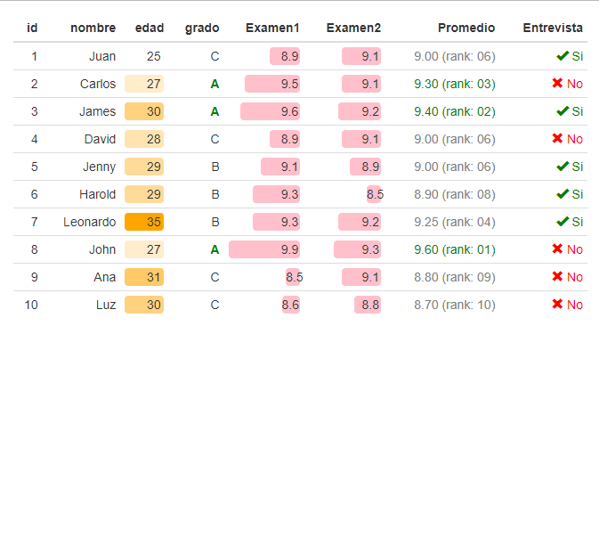

```{r setup, include=FALSE}
knitr::opts_chunk$set(echo = TRUE, comment = NA)

#install.packages("devtools") # Solo una vez
#devtools::install_github("dgonxalex80/paqueteMETODOS", force = TRUE)
library(readr)
library(tidyverse)
library(DT)
library(paqueteMETODOS)

data("CarreraLuz22")
Cali <- readRDS("docs/data/Cali.RDS")
```

<br/><br/>

Las tablas de frecuencia constituyen una herramienta fundamental para resumir información, ya que permiten obtener una primera impresión de los valores presentes en una variable, así como identificar posibles errores de sistematización o datos faltantes (`NA`).

Para contar el número de datos faltantes en una base de datos, se puede utilizar la combinación de las funciones `table()` e `is.na()`. Adicionalmente, es posible detectar problemas de sistematización, como categorías de una misma variable que presentan notaciones inconsistentes.

<div class="caja-ejemplo">
<h3>Ejemplo:</h3>
<p> 

Un ejemplo ilustrativo es la variable **ubicacion** de la base de datos `Cali`, construida a partir de la información sobre casos de Covid-19 disponible en el portal de **Datos Abiertos de Colombia** (<https://www.datos.gov.co/>).

A continuación, se presenta un fragmento de código que muestra cómo utilizar funciones clave para identificar datos faltantes y detectar posibles inconsistencias en la notación de las categorías de una variable.


<pre>
library(paqueteMETODOS)
data("vivienda_faltantes")

# Contar datos faltantes
faltantes<- table(is.na(vivienda_faltantes))

# Verificar la variable 'ubicacion'
conteo<- table(Cali$ubicacion)
conteo
</pre>

```{r}
library(paqueteMETODOS)
data("vivienda_faltantes")

# Contar datos faltantes
faltantes<- table(is.na(vivienda_faltantes))

# Verificar la variable 'ubicacion'
conteo<- table(Cali$ubicacion)
```

Al analizar las categorías de la variable **ubicacion**, se observan inconsistencias en la notación, ya que una misma categoría aparece representada de diferentes maneras: `casa`, `Casa` y `CASA`. Estas inconsistencias pueden dificultar el análisis y la interpretación de los datos, especialmente en la generación de tablas de frecuencia y resúmenes estadísticos. Adicionalmente se observan 3,343 observaciones sin información para la variable.

<pre>
  casa         Casa         CASA    Fallecido   Hospital   Hospital   UCI 
  300         393547         5         8929       20            1 
  
  N/A 
  3343 
</pre>

</p>
</div>

</br></br>


</br>

<h2>Variables cualitativas</h2>

</br>

Las distribuciones de frecuencia, también conocidas como tablas de frecuencia, son herramientas útiles para agrupar datos y obtener una visión más clara de sus características. Estas tablas están compuestas por una **primera columna** que presenta **las clases** (filas de la tabla), las cuales corresponden a las **categorías** observadas de una **variable cualitativa**.

Cuando la variable tiene una escala de medición **nominal**, el **ordenamiento** de las categorías dentro de la tabla de frecuencias queda **a discreción del investigador**. Por el contrario, si la variable posee una **escala ordinal**, el **ordenamiento** de las categorías debe **respetar la jerarquía** inherente a dicha escala, asegurando que refleje adecuadamente la relación entre las categorías. 

Para las variables **cualitativas en escala nominal**, las tablas de frecuencia constan de tres columnas principales, organizadas de la siguiente manera:

<div class="content-box-blue">

| **Columna** | **Símbolo** | **Descripción**                                                                                   |
|:------------|:------------|:--------------------------------------------------------------------------------------------------|
| c1          |             | Representa los diferentes valores que toma la variable.                                           |
| c2          | $n_{i}$     | Frecuencia absoluta, que indica el conteo de cada uno de los valores distintos que toma la variable.|
| c3          | $f_{i}$     | Frecuencia relativa, expresada como el porcentaje de la cantidad total de datos correspondientes a cada valor. |

</div>

En el caso de las variables **cualitativas en escala ordinal**, además de las columnas descritas en el ejemplo anterior, se incorporan dos columnas adicionales que permiten analizar los datos en función de su acumulación. Estas son:

<div class="content-box-blue">

| **Columna** | **Símbolo** | **Descripción**                                                                                  |
|:------------|:------------|:-------------------------------------------------------------------------------------------------|
| c4          | $N_{i}$     | Frecuencia absoluta acumulada, que indica el conteo de los casos menores o iguales al nivel correspondiente.|
| c5          | $F_{i}$     | Frecuencia relativa acumulada, que expresa el porcentaje acumulado hasta el nivel correspondiente. |

</div>


<div class="caja-ejemplo">
<h3>Ejemplo:</h3>
<p> 

En este ejemplo se presentan los códigos de **R** y la tabla para una **variable cualitativa nominal**: confederaciones participantes en Qatar 2022.

<pre>
# Instalar y cargar el paquete necesario
# install.packages("kableExtra")
library(kableExtra)

# Datos
Confederaciones <- c("Africa - CFA", "Asia - AFC", "Europa - UEFA", "Centro, Norte América - CONCACAF", "Oceanía - OFC", "Suramérica - COMEBOL")
Frecuencia_abs <- c(5, 5, 13, 4, 0, 4)
Frecuencia_rel <- Frecuencia_abs / sum(Frecuencia_abs)

# Crear el dataframe
df <- data.frame(Confederaciones, Frecuencia_abs, Frecuencia_rel)

# Crear la tabla formateada con kableExtra
tabla11 <- df %>%
kbl() %>%
kable_paper(full_width = FALSE) %>%
row_spec(0, bold = TRUE) %>%
column_spec(2:3, width = "1cm") %>%
collapse_rows(columns = 1, valign = "middle")

# Mostrar la tabla formateada
# tabla11
</pre>

```{r, warning=FALSE, message=FALSE}
# Instalar y cargar el paquete necesario
# install.packages("kableExtra")
library(kableExtra)

# Datos
Confederaciones <- c("Africa - CFA", "Asia - AFC", "Europa - UEFA", "Centro, Norte América - CONCACAF", "Oceanía - OFC", "Suramérica - COMEBOL")
Frecuencia_abs <- c(5, 5, 13, 4, 0, 4)
Frecuencia_rel <- Frecuencia_abs / sum(Frecuencia_abs)

# Crear el dataframe
df <- data.frame(Confederaciones, Frecuencia_abs, Frecuencia_rel)

# Crear la tabla formateada con kableExtra
tabla11 <- df %>%
kbl() %>%
kable_paper(full_width = FALSE) %>%
row_spec(0, bold = TRUE) %>%
column_spec(2:3, width = "1cm") %>%
collapse_rows(columns = 1, valign = "middle")

# Mostrar la tabla formateada
# tabla11
```

**Tabla 1.6** Distribución del número de equipos participantes en Qatar 2022 por confederaciones.


<pre>
Confederaciones	                    Frecuencia_abs	      Frecuencia_rel
Africa - CFA	                            05	    0.1612903
Asia - AFC  	                            05	    0.1612903
Europa - UEFA	                            13	    0.4193548
Centro, Norte América - CONCACAF	        04	    0.1290323
Oceanía - OFC	                            00	    0.0000000
Suramérica - COMEBOL	                    04	    0.1290323
</pre>
<center>
<sub>
Fuente : [wikipedia](https://es.wikipedia.org/wiki/Clasificaci%C3%B3n_para_la_Copa_Mundial_de_F%C3%BAtbol_de_2022)
</sub>
</center>


En la **Tabla 1.6**, se destaca la mayor participación de los países afiliados a la UEFA, que representan 13 países, equivalentes al 41.9% del total de participantes. Les siguen la CFA y la AFC, cada una con una participación del 16.1%.

</p>
</div>

</br>


<div class="caja-ejemplo">
<h3>Ejemplo:</h3>
<p> 

En este ejemplo, se presentan los códigos utilizados y la tabla resultante para la **variable cualitativa ordinal**: Nivel de calificación (ver **Tabla 1.7**).

<pre>
# Crear un vector que contiene los niveles de calificación, replicando cada categoría
# según su frecuencia observada.
Nivel.Calificacion = c( 
  rep("1. Muy regular", 12837),   # Repite la categoría "1. Muy regular" 12,837 veces.
  rep("2. Regular", 21988),       # Repite la categoría "2. Regular" 21,988 veces.
  rep("3. Bueno", 22300),         # Repite la categoría "3. Bueno" 22,300 veces.
  rep("4. Muy bueno", 24466),     # Repite la categoría "4. Muy bueno" 24,466 veces.
  rep("5. Excelente", 22313)      # Repite la categoría "5. Excelente" 22,313 veces.
)

# Generar una tabla de frecuencias absolutas de la variable `Nivel.Calificacion`.
t1 = table(Nivel.Calificacion)

# Generar una tabla de frecuencias detallada que incluye frecuencias absolutas,
# relativas, acumuladas y porcentajes, utilizando la función `freq()` del paquete `summarytools`.

# summarytools::freq(Nivel.Calificacion)
</pre>

```{r, fig.align='center'}
# Crear un vector que contiene los niveles de calificación, replicando cada categoría
# según su frecuencia observada.
Nivel.Calificacion = c( 
  rep("1. Muy regular", 12837),   # Repite la categoría "1. Muy regular" 12,837 veces.
  rep("2. Regular", 21988),       # Repite la categoría "2. Regular" 21,988 veces.
  rep("3. Bueno", 22300),         # Repite la categoría "3. Bueno" 22,300 veces.
  rep("4. Muy bueno", 24466),     # Repite la categoría "4. Muy bueno" 24,466 veces.
  rep("5. Excelente", 22313)      # Repite la categoría "5. Excelente" 22,313 veces.
)

# Generar una tabla de frecuencias absolutas de la variable `Nivel.Calificacion`.
t1 = table(Nivel.Calificacion)

# Generar una tabla de frecuencias detallada que incluye frecuencias absolutas,
# relativas, acumuladas y porcentajes, utilizando la función `freq()` del paquete `summarytools`.

# summarytools::freq(Nivel.Calificacion)

```


**Tabla 1.7** : Nivel de satisfacción usuarios aerolinea, servicio de alimentación/bebidas. 

<pre>
Frequencies  
Calificacion  
Type: Character  

                         Freq   % Valid   % Valid Cum.   % Total   % Total Cum.
-------------------- -------- --------- -------------- --------- --------------
      1. Muy regular    12837     12.35          12.35     12.35          12.35
          2. Regular    21988     21.16          33.52     21.16          33.52
            3. Bueno    22300     21.46          54.98     21.46          54.98
        4. Muy bueno    24466     23.55          78.53     23.55          78.53
        5. Excelente    22313     21.47         100.00     21.47         100.00
               Total   103904    100.00         100.00    100.00         100.00
</pre>

En este caso, el orden de los resultados es relevante, dado que se trata de una variable en escala ordinal. Se observa que el 33.52% de las respuestas corresponden a las categorías Regular y Muy regular, mientras que el 66.48% restante agrupa respuestas favorables, correspondientes a las categorías Bueno, Muy bueno y Excelente.

</p>
</div>


<br/>

<div class="caja-ejemplo">
<h3>Ejemplo:</h3>
<p> 

Con el paquete `formattable`, es posible construir tablas más elegantes y visualmente atractivas, lo que facilita tanto la interpretación como el análisis de datos. A continuación, se presenta un conjunto de datos ficticio con información de estudiantes, acompañado de los códigos utilizados para aplicar formatos personalizados. Los resultados obtenidos se muestran en la **Tabla 1.8**.

La intensidad de los colores asignados a los valores de las variables permite identificar de manera inmediata aquellos valores más altos, proporcionando un enfoque visual que mejora la comprensión de los datos.

<pre>
# Crear un data frame con información ficticia de estudiantes
df <- data.frame(
  id = 1:10,  # Identificador único para cada estudiante
  nombre = c("Juan", "Carlos", "James", "David", "Jenny",
             "Harold", "Leonardo", "John", "Ana", "Luz"),  # Nombres de los estudiantes
  edad = c(25, 27, 30, 28, 29, 29, 35, 27, 31, 30),  # Edades de los estudiantes
  grado = c("C", "A", "A", "C", "B", "B", "B", "A", "C", "C"),  # Grados asignados (A, B, C)
  Examen1 = c(8.9, 9.5, 9.6, 8.9, 9.1, 9.3, 9.3, 9.9, 8.5, 8.6),  # Calificaciones del primer examen
  Examen2 = c(9.1, 9.1, 9.2, 9.1, 8.9, 8.5, 9.2, 9.3, 9.1, 8.8),  # Calificaciones del segundo examen
  Promedio = c(9, 9.3, 9.4, 9, 9, 8.9, 9.25, 9.6, 8.8, 8.7),  # Promedio de calificaciones
  Entrevista = c(TRUE, FALSE, TRUE, FALSE, TRUE, TRUE, TRUE, FALSE, FALSE, FALSE),  # Resultado de la entrevista (TRUE para aprobado, FALSE para no aprobado)
  stringsAsFactors = FALSE  # Evitar que las columnas de texto se conviertan automáticamente en factores
)

# Cargar la librería 'formattable' para dar formato visual a los datos
library(formattable)

# Aplicar formato a las columnas del data frame y visualizarlo
formattable(df, list(
  # Aplicar un degradado de color en la columna 'edad'
  edad = color_tile("white", "orange"),
  
  # Dar formato a la columna 'grado' resaltando en verde y en negrita los valores "A"
  grado = formatter("span", 
                    style = x ~ ifelse(x == "A", 
                                       style(color = "green", font.weight = "bold"), NA)),
  
  # Normalizar las columnas 'Examen1' y 'Examen2' y representarlas como barras horizontales
  area(col = c(Examen1, Examen2)) ~ normalize_bar("pink", 0.2),
  
  # Formatear la columna 'Promedio' mostrando el valor con dos decimales y su rango,
  # resaltando en verde los 3 primeros promedios más altos
  Promedio = formatter("span",
                       style = x ~ style(color = ifelse(rank(-x) <= 3, "green", "gray")),
                       x ~ sprintf("%.2f (rank: %02d)", x, rank(-x))),
  
  # Dar formato a la columna 'Entrevista', usando íconos e indicando "Sí" o "No" en texto
  Entrevista = formatter("span",
                         style = x ~ style(color = ifelse(x, "green", "red")),
                         x ~ icontext(ifelse(x, "ok", "remove"), ifelse(x, "Sí", "No")))
))
</pre>


```{r, fig.align='center', warning=FALSE, message=FALSE, eval=FALSE}
# Crear un data frame con información ficticia de estudiantes
df <- data.frame(
  id = 1:10,  # Identificador único para cada estudiante
  nombre = c("Juan", "Carlos", "James", "David", "Jenny",
             "Harold", "Leonardo", "John", "Ana", "Luz"),  # Nombres de los estudiantes
  edad = c(25, 27, 30, 28, 29, 29, 35, 27, 31, 30),  # Edades de los estudiantes
  grado = c("C", "A", "A", "C", "B", "B", "B", "A", "C", "C"),  # Grados asignados (A, B, C)
  Examen1 = c(8.9, 9.5, 9.6, 8.9, 9.1, 9.3, 9.3, 9.9, 8.5, 8.6),  # Calificaciones del primer examen
  Examen2 = c(9.1, 9.1, 9.2, 9.1, 8.9, 8.5, 9.2, 9.3, 9.1, 8.8),  # Calificaciones del segundo examen
  Promedio = c(9, 9.3, 9.4, 9, 9, 8.9, 9.25, 9.6, 8.8, 8.7),  # Promedio de calificaciones
  Entrevista = c(TRUE, FALSE, TRUE, FALSE, TRUE, TRUE, TRUE, FALSE, FALSE, FALSE),  # Resultado de la entrevista (TRUE para aprobado, FALSE para no aprobado)
  stringsAsFactors = FALSE  # Evitar que las columnas de texto se conviertan automáticamente en factores
)

# Cargar la librería 'formattable' para dar formato visual a los datos
library(formattable)

# Aplicar formato a las columnas del data frame y visualizarlo
formattable(df, list(
  # Aplicar un degradado de color en la columna 'edad'
  edad = color_tile("white", "orange"),
  
  # Dar formato a la columna 'grado' resaltando en verde y en negrita los valores "A"
  grado = formatter("span", 
                    style = x ~ ifelse(x == "A", 
                                       style(color = "green", font.weight = "bold"), NA)),
  
  # Normalizar las columnas 'Examen1' y 'Examen2' y representarlas como barras horizontales
  area(col = c(Examen1, Examen2)) ~ normalize_bar("pink", 0.2),
  
  # Formatear la columna 'Promedio' mostrando el valor con dos decimales y su rango,
  # resaltando en verde los 3 primeros promedios más altos
  Promedio = formatter("span",
                       style = x ~ style(color = ifelse(rank(-x) <= 3, "green", "gray")),
                       x ~ sprintf("%.2f (rank: %02d)", x, rank(-x))),
  
  # Dar formato a la columna 'Entrevista', usando íconos e indicando "Sí" o "No" en texto
  Entrevista = formatter("span",
                         style = x ~ style(color = ifelse(x, "green", "red")),
                         x ~ icontext(ifelse(x, "ok", "remove"), ifelse(x, "Sí", "No")))
))
```

**Tabla 1.8** : Distribución de frecuencia de la información de los estudiantes del proceso de admisión. 

```{r, echo=FALSE, out.width="100%", fig.align = "center"}

```

<center>
<sub>
Tomada de : https://renkun-ken.github.io/formattable/ 
- MIT License.
</sub>
</center>

</p>
</div>


