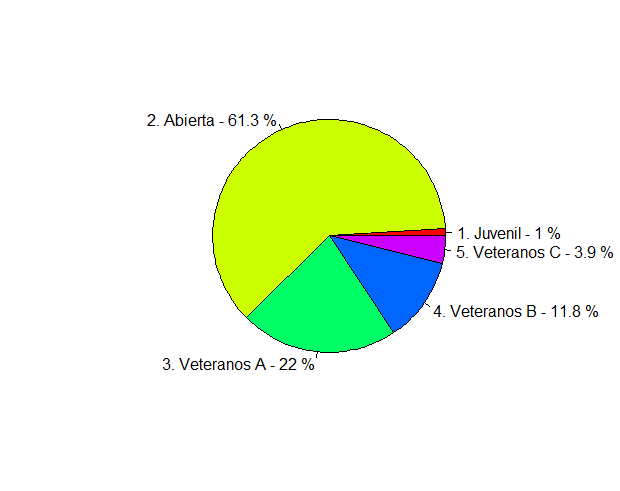
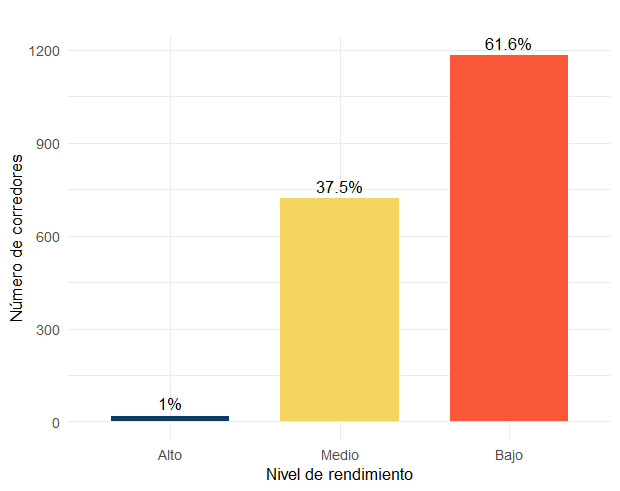
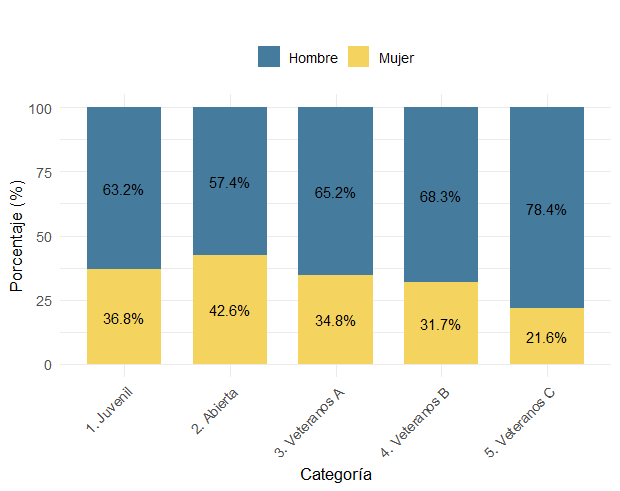
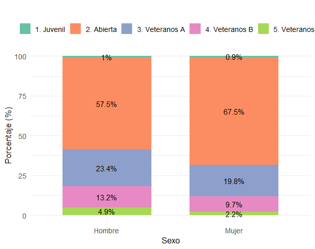

```{r setup, include=FALSE}
knitr::opts_chunk$set(echo = TRUE, comment = NA)
library(readr)
library(tidyverse)
library(DT)
library(paqueteMETODOS)

data("CarreraLuz22")
data("evaluacion")
data("inflacionov22")
```

</br><br/>
<h2>Variable cualitativa o cuantitativa discreta</h2>


Para las **variables cualitativas nominales**, su visualización se puede realizar mediante una **gráfica circular** o **de torta**, como también el **gráfico de barras**. Estos gráficos permites identificar rápidamente la categoría con mayor participación, representada por el área  más grande o barra más alta en la gráfica.

Las **variables cualitativas ordinales**  o **variables cuantitativas discretas**  representan categorías con un **orden intrínseco**, lo que facilita interpretaciones basadas en jerarquías o niveles. Para visualizar este tipo de variables, se suelen emplear **diagramas de barras**. Este formato destaca las diferencias en frecuencia o proporción de las categorías, manteniendo el orden jerárquico de las mismas.


<br/><br/>
<h3>Gráfica circular o de torta</h3>

Entre las ventajas de usar este gráfico:

- **Identificación visual**: Facilita la comparación de las proporciones de cada categoría.

- **Porcentajes**: Además de las etiquetas, se pueden incluir los porcentajes de participación, proporcionando una interpretación más clara.


En caso de que la variable tenga muchas categorías, es posible reagrupar las categorías con **bajas frecuencias** en una sola llamada **"Otras"**. Esto mejora la presentación gráfica al reducir el número de segmentos y mantener la claridad de la información.


La representación con gráficas circulares es una herramienta valiosa para:

- Comunicar la proporción relativa de las categorías de forma visual y efectiva.

- Destacar la participación de cada categoría en el total.

- Mejorar la interpretación y presentación de datos cualitativos.


<br/><br/>
<div class="caja-ejemplo">
<h3>Ejemplo:</h3>
<p> 
En este ejemplo, se presentan los códigos en **R** para generar un **gráfico de pastel** (ver **Figura 1.12**) que representa las frecuencias de la variable `categoria` en el conjunto de datos `CarreraLuz22`.

<pre>
# Establecer configuración regional en español para etiquetas
Sys.setlocale("LC_ALL", "es_ES.UTF-8")

# Cargar los datos
data <- CarreraLuz22

# Crear tabla de frecuencias absolutas
frecuencias <- table(data$categoria)

# Calcular los porcentajes
porcentajes <- prop.table(frecuencias) * 100

# Crear etiquetas con categoría y porcentaje
etiquetas <- paste(names(frecuencias), "-", round(porcentajes, 1), "%")

# Generar gráfico de pastel con porcentajes
pie(frecuencias,
    labels = etiquetas,
    main = "Distribución de corredores por categoría",
    col = rainbow(length(frecuencias))
)

</pre>

```{r,warning=FALSE,message=FALSE,echo=FALSE,eval=FALSE}
# Establecer configuración regional en español para etiquetas
#Sys.setlocale("LC_ALL", "es_ES.UTF-8")

# Cargar los datos
data <- CarreraLuz22

# Crear tabla de frecuencias absolutas
frecuencias <- table(data$categoria)

# Calcular los porcentajes
porcentajes <- prop.table(frecuencias) * 100

# Crear etiquetas con categoría y porcentaje
etiquetas <- paste(names(frecuencias), "-", round(porcentajes, 1), "%")

# Generar gráfico de pastel con porcentajes
pie(frecuencias,
    labels = etiquetas,
    main = "",
    col = rainbow(length(frecuencias))
)
```


<br/><br/>
<center>
```{r, echo=FALSE, out.width="90%", fig.align = "center"}

```
**Figura 1.12** Distribución por categorías del nivel del corredor.
</center>
<br/><br/>


La **Figura 1.12** presenta la distribución de porcentaje por cada tipo de corredor. A continuación la salida computacional de los porcentajes.

<pre>
> porcentajes

    1. Juvenil     2. Abierta 3. Veteranos A 4. Veteranos B 5. Veteranos C 
     0.9885536     61.3423517     22.0083247     11.8106139      3.8501561
</pre>

De acuerdo con la **Figura 1.12**, la mayoría de los corredores se concentra en las categorías Abierta y Veteranos A, con participaciones aproximadas del 61.3% y 22%, respectivamente. En contraste, las categorías Juvenil y Veteranos C presentan una participación marginal, con cerca del 1% y 3.9% del total de corredores.

</p>
</div>


<br/><br/>
<div class="caja-actividad">
<h3>Actividad:</h3>
>
En esta actividad, se presenta un código para explorar cómo generar un **gráfico de pastel** utilizando la función `PieChart` del paquete `lessR`. Este gráfico incluye características personalizables como colores, etiquetas de porcentajes y estilos adicionales.<br/>
>
<pre>
# Cargar las librerías necesarias
library(paqueteMETODOS)
# install.packages("lessR")
library(lessR)
# Cargar los datos
data = CarreraLuz22
# Generar el gráfico de pastel
PieChart(categoria, 
         hole = 0,              # Sin agujero en el centro
         values = "%",          # Mostrar porcentajes
         data = CarreraLuz22,   # Especificar el conjunto de datos
         fill = "blues",        # Paleta de colores en tonos azules
         main = "",             # Título del gráfico
         values_size = 0.8)     # Tamaño de los valores mostrados
</pre>
<br/>

```{r, eval=FALSE,echo=FALSE}
# Cargar las librerías necesarias
library(paqueteMETODOS)
# install.packages("lessR")
library(lessR)
# Cargar los datos
data = CarreraLuz22
# Generar el gráfico de pastel
PieChart(categoria, 
         hole = 0,              # Sin agujero en el centro
         values = "%",          # Mostrar porcentajes
         data = CarreraLuz22,   # Especificar el conjunto de datos
         fill = "blues",        # Paleta de colores en tonos azules
         main = "",             # Título del gráfico
         values_size = 0.8)     # Tamaño de los valores mostrados
```
</div>
<br/><br/>


<br/><br/>
<h3>Diagrama de barras simple </h3>


Los **gráficos de barras** son representaciones visuales útiles para analizar variables **ordinales** o **cuantitativas discretas** (especialmente cuando tienen pocos valores únicos). Este tipo de visualización permite:

- Examinar la **distribución jerárquica** de las categorías cuando existe un orden natural (por ejemplo, niveles de satisfacción o calificaciones).

- Facilitar la **interpretación visual** de los datos, mostrando de forma clara la frecuencia o proporción de cada categoría.

- Identificar **patrones** o **tendencias** dentro de las mediciones, como categorías predominantes o comportamientos extremos.

Además, el uso de **colores** en los gráficos de barras puede ayudar a comunicar mejor el significado de las categorías. Una práctica común es aplicar **paletas tipo "semáforo"**, especialmente en contextos de evaluación:

  - **Rojo**: Categorías desfavorables o con baja calificación.

  - **Amarillo**: Categorías intermedias o promedio.

  - **Verde** (o azul): Categorías positivas o de alto rendimiento.


<br/><br/>
<div class="caja-ejemplo">
<h3>Ejemplo:</h3>
<p> 
A continuación, se presenta un fragmento de código en **R** para construir un gráfico de barras simple (ver **Figura 1.13**) que representa la categorización del tiempo de carrera en niveles bajo, medio y alto. 

<pre>
# Establecer configuración regional (solo si es necesario)
Sys.setlocale("LC_ALL", "es_ES.UTF-8")

# Cargar librerías
library(ggplot2)
library(paqueteMETODOS)

# Cargar los datos
data <- CarreraLuz22

# Convertir a minutos
data$tiempo_min <- data$timerun / 60

# Categorizar el rendimiento
data$rendimiento <- cut(
  data$tiempo_min,
  breaks = c(-Inf, 40, 60, Inf),
  labels = c("Alto", "Medio", "Bajo")
)

# Crear tabla de frecuencias
frecuencia <- as.data.frame(table(data$rendimiento))
colnames(frecuencia) <- c("Rendimiento", "Frecuencia")

# Calcular porcentaje
frecuencia$Porcentaje <- round(100 * frecuencia$Frecuencia / sum(frecuencia$Frecuencia), 1)

# Graficar
ggplot(frecuencia, aes(x = Rendimiento, y = Frecuencia, fill = Rendimiento)) +
  geom_bar(stat = "identity", width = 0.7) +
  geom_text(aes(label = paste0(Porcentaje, "%")), 
            vjust = -0.5, size = 4.5) +
  scale_fill_manual(values = c("Alto" = "#0d3b66", "Medio" = "#f4d35e", "Bajo" = "#f95738")) +
  labs(
    title = "Distribución del rendimiento por tiempo (minutos)",
    x = "Nivel de rendimiento",
    y = "Número de corredores"
  ) +
  theme_minimal(base_size = 13) +
  theme(legend.position = "none")
</pre>

```{r,eval=FALSE,echo=FALSE}
# Establecer configuración regional (solo si es necesario)
# Sys.setlocale("LC_ALL", "es_ES.UTF-8")

# Cargar librerías
library(ggplot2)
library(paqueteMETODOS)

# Cargar los datos
data <- CarreraLuz22

# Convertir a minutos
data$tiempo_min <- data$timerun / 60

# Categorizar el rendimiento
data$rendimiento <- cut(
  data$tiempo_min,
  breaks = c(-Inf, 40, 60, Inf),
  labels = c("Alto", "Medio", "Bajo")
)

# Crear tabla de frecuencias
frecuencia <- as.data.frame(table(data$rendimiento))
colnames(frecuencia) <- c("Rendimiento", "Frecuencia")

# Calcular porcentaje
frecuencia$Porcentaje <- round(100 * frecuencia$Frecuencia / sum(frecuencia$Frecuencia), 1)

# Graficar
ggplot(frecuencia, aes(x = Rendimiento, y = Frecuencia, fill = Rendimiento)) +
  geom_bar(stat = "identity", width = 0.7) +
  geom_text(aes(label = paste0(Porcentaje, "%")), 
            vjust = -0.5, size = 4.5) +
  scale_fill_manual(values = c("Alto" = "#0d3b66", "Medio" = "#f4d35e", "Bajo" = "#f95738")) +
  labs(
    title = "",
    x = "Nivel de rendimiento",
    y = "Número de corredores"
  ) +
  theme_minimal(base_size = 13) +
  theme(legend.position = "none")

```


<br/><br/>
<center>
```{r, echo=FALSE, out.width="90%", fig.align = "center"}

```
**Figura 1.13** Distribución del rendimiento por tiempo (minutos).
</center>
<br/><br/>

De la **Figura 1.13** se puede decir lo siguiente:

  - Bajo rendimiento (tiempos mayores a 60 minutos) agrupa a la mayoría de los corredores, con un 61.6% del total. Esto indica que más de la mitad de los participantes tardaron más de una hora en completar la carrera.

  - Rendimiento medio (entre 40 y 60 minutos) corresponde al 37.5% de los corredores, lo que sugiere que un grupo considerable tuvo un desempeño moderado.

  - Alto rendimiento (menos de 30 minutos) representa apenas el 1% de los corredores, lo que refleja que muy pocos lograron tiempos excepcionales en la carrera.

</p>
</div>


<br/><br/>
<div class="caja-actividad">
<h3>Actividad:</h3>
<p>
>
En esta actividad, se presentan dos fragmentos de código que permiten explorar cómo generar gráficos de barras estáticos y gráficos interactivos para representar los datos de evaluación de un proceso de inducción.
>
<br/>
**Código 1: Gráfico estático con `ggplot2`**: El primer código genera un **gráfico de barras estático** utilizando `ggplot2`, con colores personalizados para cada categoría.
>
<pre>
library(ggplot2)
>
# Datos de evaluación
ev <- c(5, 13, 30, 52, 35)
categories <- c("Muy regular", "Regular", "Bueno", "Muy bueno", "Excelente")
ev_data <- data.frame(Categoria = factor(categories, levels = categories), Frecuencia = ev)
>
# Crear el gráfico de barras con ggplot2
ggplot(ev_data, aes(x = Categoria, y = Frecuencia, fill = Categoria)) +
  geom_bar(stat = "identity", width = 0.7) +
  scale_fill_manual(values = c("#f95738", "#ee964b", "#f4d35e", "#faf0ca", "#0d3b66")) +
  labs(
    title = "Evaluación proceso de inducción",
    x = "Categoría",
    y = "Frecuencia"
  ) +
  theme_minimal() +
  theme(legend.position = "none")  # Esta línea quita la leyenda
</pre>
<br/>

```{r, eval=FALSE}
library(ggplot2)

# Datos de evaluación
ev <- c(5, 13, 30, 52, 35)
categories <- c("Muy regular", "Regular", "Bueno", "Muy bueno", "Excelente")
ev_data <- data.frame(Categoria = factor(categories, levels = categories), Frecuencia = ev)

# Crear el gráfico de barras con ggplot2
ggplot(ev_data, aes(x = Categoria, y = Frecuencia, fill = Categoria)) +
  geom_bar(stat = "identity", width = 0.7) +
  scale_fill_manual(values = c("#f95738", "#ee964b", "#f4d35e", "#faf0ca", "#0d3b66")) +
  labs(
    title = "Evaluación proceso de inducción",
    x = "Categoría",
    y = "Frecuencia"
  ) +
  theme_minimal() +
  theme(legend.position = "none")  # Esta línea quita la leyenda
```
>
<br/>
**Código 2: Gráfico interactivo con plotly**: El segundo código convierte el gráfico de barras generado con `ggplot2` en un gráfico interactivo utilizando `plotly`.
>
<pre>
library(ggplot2)
library(plotly)
>
# Datos de evaluación
ev <- c(5, 13, 30, 52, 35)
categories <- c("Muy regular", "Regular", "Bueno", "Muy bueno", "Excelente")
ev_data <- data.frame(Categoria = factor(categories, levels = categories), Frecuencia = ev)
>
# Crear el gráfico de barras con ggplot2
plot <- ggplot(ev_data, aes(x = Categoria, y = Frecuencia, fill = Categoria)) +
  geom_bar(stat = "identity", width = 0.7) +
  scale_fill_manual(values = c("#f95738", "#ee964b", "#f4d35e", "#faf0ca", "#0d3b66")) +
  labs(
    title = "Evaluación proceso de inducción",
    x = "Categoría",
    y = "Frecuencia"
  ) +
  theme_minimal() +
  theme(legend.position = "none")  # Esta línea quita la leyenda
>
# Convertir el gráfico de ggplot2 a un gráfico interactivo de plotly
plotly_graph <- ggplotly(plot, tooltip = c("x", "y"))
>
# Imprimir el gráfico interactivo
print(plotly_graph)
</pre>
<br/>

```{r, eval=FALSE}
library(ggplot2)
library(plotly)

# Datos de evaluación
ev <- c(5, 13, 30, 52, 35)
categories <- c("Muy regular", "Regular", "Bueno", "Muy bueno", "Excelente")
ev_data <- data.frame(Categoria = factor(categories, levels = categories), Frecuencia = ev)

# Crear el gráfico de barras con ggplot2
plot <- ggplot(ev_data, aes(x = Categoria, y = Frecuencia, fill = Categoria)) +
  geom_bar(stat = "identity", width = 0.7) +
  scale_fill_manual(values = c("#f95738", "#ee964b", "#f4d35e", "#faf0ca", "#0d3b66")) +
  labs(
    title = "Evaluación proceso de inducción",
    x = "Categoría",
    y = "Frecuencia"
  ) +
  theme_minimal() +
  theme(legend.position = "none")  # Esta línea quita la leyenda

# Convertir el gráfico de ggplot2 a un gráfico interactivo de plotly
plotly_graph <- ggplotly(plot, tooltip = c("x", "y"))

# Imprimir el gráfico interactivo
print(plotly_graph)
```

>
<br/>
**Explora los códigos**:
>
- Ejecútalos para generar tanto el gráfico estático como el gráfico interactivo.
>
- Observa cómo el gráfico interactivo permite explorar más detalles, como los valores exactos de las barras. 
>
<br/>
**Modifica el código**:
>
- Cambia los colores en `scale_fill_manual` para personalizar el diseño.
>
- Ajusta el ancho de las barras con el argumento width en `geom_bar`.
>
- En el gráfico interactivo, experimenta con las opciones de `tooltip` en `ggplotly`.
>
<br/>
**Reflexión**: 
>
- Compara los gráficos estático e interactivo.
>
- ¿En qué situaciones usarías cada tipo de gráfico?
>
- ¿Qué ventajas ofrece el gráfico interactivo frente al estático?
</p>
</div>


<br/><br/>
<h3>Diagrama de barras compuesto </h3>


Cuando se desea representar **dos variables cualitativas simultáneamente**, se requiere construir una **tabla cruzada** o **tabla de doble entrada**, la cual muestra cómo se distribuyen conjuntamente ambas variables.

A partir de esta tabla se puede generar un **gráfico de barras compuesto**, que facilita la **visualización comparativa** de la relación entre ambas variables. Este tipo de gráfico permite:

- Observar cómo se distribuyen los valores de una variable dentro de cada categoría de la otra.

- Comparar las proporciones o frecuencias relativas entre subgrupos.

- Detectar posibles asociaciones o diferencias notorias en la distribución conjunta de las variables.


Es importante destacar que los diagramas de barras compuestos también pueden aplicarse cuando una de las variables es cuantitativa discreta con pocos valores distintos. En estos casos, dicha variable puede ser tratada como categórica, permitiendo construir una tabla cruzada y representar visualmente la relación entre ambas variables. Esta técnica resulta útil, por ejemplo, para analizar cómo se distribuye el número de hijos (0, 1, 2, 3 o más) según el sexo, nivel educativo u otra variable cualitativa, facilitando la comparación de frecuencias o proporciones entre categorías.

<br/>
<div class="caja-ejemplo">
<h3>Ejemplo:</h3>
<p>
En este ejemplo, se presentan los códigos en **R** para construir un **gráfico de barras compuesto** (ver **Figura 1.14**). Este gráfico representa la distribución del porcentaje de atletas por categoría de tipo de atleta versus el sexo, utilizando colores diferenciados para cada sexo. 

<br/>
<pre>
Sys.setlocale("LC_ALL", "es_ES.UTF-8")

# Cargar librerías necesarias
library(ggplot2)
library(paqueteMETODOS)
library(dplyr)

# Cargar los datos
data("CarreraLuz22")

# Crear tabla de frecuencias cruzadas y calcular proporciones por categoría
conteo_df <- CarreraLuz22 |>
  count(Sexo = sex, Categoría = categoria) |>
  group_by(Categoría) |>
  mutate(
    Porcentaje = round(n / sum(n) * 100, 1),
    Etiqueta = paste0(Porcentaje, "%")
  )

# Gráfico de barras proporcionales (100%)
ggplot(conteo_df, aes(x = Categoría, y = Porcentaje, fill = Sexo)) +
  geom_bar(stat = "identity", position = "stack", width = 0.7) +
  geom_text(aes(label = Etiqueta),
            position = position_stack(vjust = 0.5),
            size = 4, color = "black") +
  scale_fill_manual(values = c("Hombre" = "#457b9d", "Mujer" = "#f4d35e")) +
  labs(
    title = "Distribución porcentual por categoría y sexo",
    x = "Categoría",
    y = "Porcentaje (%)"
  ) +
  theme_minimal(base_size = 13) +
  theme(
    legend.position = "top",
    legend.title = element_blank(),
    axis.text.x = element_text(angle = 45, hjust = 1)
  )
</pre>

```{r,echo=FALSE,eval=FALSE}

#Sys.setlocale("LC_ALL", "es_ES.UTF-8")

# Cargar librerías necesarias
library(ggplot2)
library(paqueteMETODOS)
library(dplyr)

# Cargar los datos
data("CarreraLuz22")

# Crear tabla de frecuencias cruzadas y calcular proporciones por categoría
conteo_df <- CarreraLuz22 |>
  count(Sexo = sex, Categoría = categoria) |>
  group_by(Categoría) |>
  mutate(
    Porcentaje = round(n / sum(n) * 100, 1),
    Etiqueta = paste0(Porcentaje, "%")
  )

# Gráfico de barras proporcionales (100%)
ggplot(conteo_df, aes(x = Categoría, y = Porcentaje, fill = Sexo)) +
  geom_bar(stat = "identity", position = "stack", width = 0.7) +
  geom_text(aes(label = Etiqueta),
            position = position_stack(vjust = 0.5),
            size = 4, color = "black") +
  scale_fill_manual(values = c("Hombre" = "#457b9d", "Mujer" = "#f4d35e")) +
  labs(
    title = "",
    x = "Categoría",
    y = "Porcentaje (%)"
  ) +
  theme_minimal(base_size = 13) +
  theme(
    legend.position = "top",
    legend.title = element_blank(),
    axis.text.x = element_text(angle = 45, hjust = 1)
  )
```

Los valores de **R** resultantes que determinan la tabla cruzada de la **Tabla 1.8** (equivalentes a los de  la **Tabla 1.9**) son los siguientes:

<pre>
> conteo_df
# A tibble: 10 × 5
# Groups:   Categoría [5]
   Sexo   Categoría          n Porcentaje Etiqueta
   <chr>  <chr>          <int>      <dbl> <chr>   
 1 Hombre 1. Juvenil        12       63.2 63.2%   
 2 Hombre 2. Abierta       677       57.4 57.4%   
 3 Hombre 3. Veteranos A   276       65.2 65.2%   
 4 Hombre 4. Veteranos B   155       68.3 68.3%   
 5 Hombre 5. Veteranos C    58       78.4 78.4%   
 6 Mujer  1. Juvenil         7       36.8 36.8%   
 7 Mujer  2. Abierta       502       42.6 42.6%   
 8 Mujer  3. Veteranos A   147       34.8 34.8%   
 9 Mujer  4. Veteranos B    72       31.7 31.7%   
10 Mujer  5. Veteranos C    16       21.6 21.6%
</pre>


<br/><br/>
<center>
**Tabla 1.8** Número de mujeres y hombres por categoría del corredor.
</center> 

| Categoría          | Hombre | Mujer | Total |
|--------------------|:------:|:-----:|:-----:|
| 1. Juvenil         | 12     | 7     | 19    |
| 2. Abierta         | 677    | 502   | 1179  |
| 3. Veteranos A     | 276    | 147   | 423   |
| 4. Veteranos B     | 155    | 72    | 227   |
| 5. Veteranos C     | 58     | 16    | 74    |
| **Total**          | **1178** | **744** | **1922** |

<br/><br/>
<center>
**Tabla 1.9** Porcentaje de mujeres y hombres por categoría del corredor.
</center> 


| Categoría          | Hombre (%) | Mujer (%) | Total (%) |
|--------------------|:----------:|:---------:|:---------:|
| 1. Juvenil         | 63.2       | 36.8      | 100       |
| 2. Abierta         | 57.4       | 42.6      | 100       |
| 3. Veteranos A     | 65.2       | 34.8      | 100       |
| 4. Veteranos B     | 68.3       | 31.7      | 100       |
| 5. Veteranos C     | 78.4       | 21.6      | 100       |


La gráfica de la **Figura 1.14** muestra la distribución porcentual del sexo por categoría de corredor de la tabla cruzada **Tabla 1.9**.

<br/><br/>
<center>
```{r, echo=FALSE, out.width="90%", fig.align = "center"}

```
**Figura 1.14** Distribución porcentual de sexo por tipo de corredor.
</center>
<br/><br/>

En la **Figura 1.14** se observa que la proporción por sexo no es similar entre las diferentes categorías de corredores. Las proporciones de participación masculina y femenina varían de forma notable según la categoría:

- A medida que se avanza hacia las categorías de mayor edad (`Veteranos`), la participación femenina disminuye progresivamente, pasando de un 36.8% en `Juvenil`, a 34.8% en `Veteranos A`, 31.7% en `Veteranos B`, y alcanzando apenas un 21.6% en `Veteranos C`.

- La única excepción parcial a esta tendencia es la categoría `Abierta`, donde la participación femenina (42.6%) supera levemente a la observada en la categoría `Juvenil`, aunque sigue siendo inferior a la masculina (57.4%).

- En conjunto, estos resultados indican que el porcentaje de participación por sexo sí varía según la categoría del corredor, consistentemente se observa una mayor proporción de hombres en todas las categorías, con una diferencia más marcada en los grupos de mayor edad.

Al realizar este tipo de gráficos surge una pregunta clave:  ¿Qué se debe analizar? ¿El porcentaje de sexo dentro de cada categoría de corredor o el porcentaje de categorías dentro de cada sexo?

Ambas perspectivas son válidas, pero responden a preguntas distintas:

- Analizar el porcentaje de sexo por tipo de corredor permite ver la distribución de hombres y mujeres dentro de cada categoría.

- Analizar el porcentaje de tipo de corredor por sexo muestra cómo se distribuyen los corredores, según su sexo, en las distintas categorías.

A continuación, se presentará un gráfico que permite analizar la proporción de categorías dentro de cada sexo, es decir, cómo se distribuyen los tipos de corredor entre hombres y mujeres.


<pre>
# Establecer configuración regional (opcional en algunos sistemas)
Sys.setlocale("LC_ALL", "es_ES.UTF-8")

# Cargar librerías necesarias
library(ggplot2)
library(paqueteMETODOS)
library(dplyr)

# Cargar los datos
data("CarreraLuz22")

# Crear tabla de frecuencias cruzadas y calcular proporciones por sexo
conteo_df <- CarreraLuz22 |>
  count(Sexo = sex, Categoría = categoria) |>
  group_by(Sexo) |>
  mutate(
    Porcentaje = round(n / sum(n) * 100, 1),
    Etiqueta = paste0(Porcentaje, "%")
  )

# Gráfico de barras proporcionales (100%) por sexo
ggplot(conteo_df, aes(x = Sexo, y = Porcentaje, fill = Categoría)) +
  geom_bar(stat = "identity", position = "stack", width = 0.7) +
  geom_text(aes(label = Etiqueta),
            position = position_stack(vjust = 0.5),
            size = 4, color = "black") +
  scale_fill_brewer(palette = "Set2") +
  labs(
    title = "Distribución porcentual de categorías dentro de cada sexo",
    x = "Sexo",
    y = "Porcentaje (%)"
  ) +
  theme_minimal(base_size = 13) +
  theme(
    legend.position = "top",
    axis.text.x = element_text(angle = 0, hjust = 0.5),
    legend.title = element_blank()
  )
</pre>


```{r,echo=FALSE,eval=FALSE}
# Establecer configuración regional (opcional en algunos sistemas)
# Sys.setlocale("LC_ALL", "es_ES.UTF-8")

# Cargar librerías necesarias
library(ggplot2)
library(paqueteMETODOS)
library(dplyr)

# Cargar los datos
data("CarreraLuz22")

# Crear tabla de frecuencias cruzadas y calcular proporciones por sexo
conteo_df <- CarreraLuz22 |>
  count(Sexo = sex, Categoría = categoria) |>
  group_by(Sexo) |>
  mutate(
    Porcentaje = round(n / sum(n) * 100, 1),
    Etiqueta = paste0(Porcentaje, "%")
  )

# Gráfico de barras proporcionales (100%) por sexo
ggplot(conteo_df, aes(x = Sexo, y = Porcentaje, fill = Categoría)) +
  geom_bar(stat = "identity", position = "stack", width = 0.7) +
  geom_text(aes(label = Etiqueta),
            position = position_stack(vjust = 0.5),
            size = 4, color = "black") +
  scale_fill_brewer(palette = "Set2") +
  labs(
    title = "",
    x = "Sexo",
    y = "Porcentaje (%)"
  ) +
  theme_minimal(base_size = 13) +
  theme(
    legend.position = "top",
    axis.text.x = element_text(angle = 0, hjust = 0.5),
    legend.title = element_blank()
  )
```


<br/><br/>
<center>
```{r, echo=FALSE, out.width="90%", fig.align = "center"}

```
**Figura 1.15** Distribución porcentual de tipo de corredor por sexo.
</center>
<br/><br/>
</p>
</div>


De acuerdo con la **Figura 1.15**, la distribución de los corredores por categoría varía según el sexo:

- En ambos sexos, la categoría `Abierta` es la predominante, aunque su peso relativo es mayor en las mujeres (67.5%) que en los hombres (57.5%).

- Los hombres presentan una mayor representación proporcional en las categorías de mayor edad (`Veteranos A`, `Veteranos B` y `Veteranos C`), con porcentajes de 23.4%, 13.2% y 4.9% respectivamente, en comparación con las mujeres (19.8%, 9.7% y 2.2%).

- La categoría `Juvenil` tiene una participación muy baja y similar en ambos sexos, 1% de los hombres y 0.9% de las mujeres.


<br/><br/>
<div class="caja-actividad">
<h3>Actividad:</h3>
>
En esta actividad, se presenta un código para explorar cómo generar un **gráfico de barras apilado** utilizando `ggplot2` y `plotly`. Este gráfico muestra la distribución de atletas por categoría y sexo. También se incluye una actividad para representar el gráfico invirtiendo las variables.
<br/>
<pre>
# Cargar las librerías necesarias
library(ggplot2)
library(plotly)
library(paqueteMETODOS)
>
# Cargar los datos
data("CarreraLuz22")
# Gráfico de barras por categoría y sexo
p1 = ggplot(CarreraLuz22, aes(x = categoria, fill = sex)) +
  geom_bar(position = "stack", width = 0.7) +                    
  labs(
    title = "Número de atletas por categoría y sexo",            
    x = "Categorías",                                            
    y = "Número de atletas"                                      
  ) +
  scale_fill_manual(values = c("#0d3b66", "#f4d35e")) +          
  theme_minimal() +                                              
  theme(
    legend.position = "top",                                     
    legend.title = element_blank()                               
  )
>
# Convertir el gráfico a interactivo
ggplotly(p1)
>
# Gráfico de barras por sexo y categoría
p2 = ggplot(CarreraLuz22, aes(x = sex, fill = categoria)) +
  geom_bar(position = "stack", width = 0.7) +                    
  labs(
    title = "Número de atletas por sexo y categoría",            
    x = "Sexo",                                                  
    y = "Número de atletas"                                      
  ) +
  scale_fill_brewer(palette = "Set3") +                          
  theme_minimal() +                                              
  theme(
    legend.position = "top",                                     
    legend.title = element_blank()                               
  )
>
# Convertir el gráfico a interactivo
ggplotly(p2)
</pre>
>
<br/>

```{r, eval=FALSE,echo=FALSE}
# Cargar las librerías necesarias
library(ggplot2)
library(plotly)
library(paqueteMETODOS)

# Cargar los datos
data("CarreraLuz22")

# Gráfico de barras por categoría y sexo
p1 = ggplot(CarreraLuz22, aes(x = categoria, fill = sex)) +
  geom_bar(position = "stack", width = 0.7) +                    
  labs(
    title = "Número de atletas por categoría y sexo",            
    x = "Categorías",                                            
    y = "Número de atletas"                                      
  ) +
  scale_fill_manual(values = c("#0d3b66", "#f4d35e")) +          
  theme_minimal() +                                              
  theme(
    legend.position = "top",                                     
    legend.title = element_blank()                               
  )

# Convertir el gráfico a interactivo
ggplotly(p1)

# Gráfico de barras por sexo y categoría
p2 = ggplot(CarreraLuz22, aes(x = sex, fill = categoria)) +
  geom_bar(position = "stack", width = 0.7) +                    
  labs(
    title = "Número de atletas por sexo y categoría",            
    x = "Sexo",                                                  
    y = "Número de atletas"                                      
  ) +
  scale_fill_brewer(palette = "Set3") +                          
  theme_minimal() +                                              
  theme(
    legend.position = "top",                                     
    legend.title = element_blank()                               
  )

# Convertir el gráfico a interactivo
ggplotly(p2)
```

¿Cuál de los dos gráficos prefieres? ¿Por qué?
</div>


