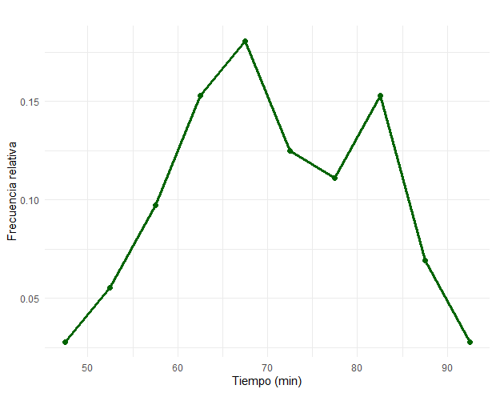
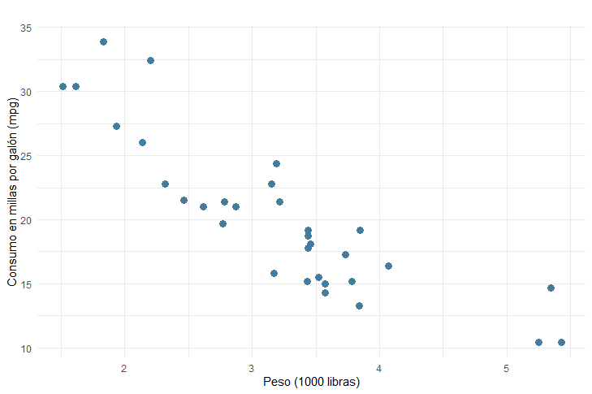

```{r setup, include=FALSE}
knitr::opts_chunk$set(echo = TRUE, comment = NA)
library(readr)
library(tidyverse)
library(DT)
library(paqueteMETODOS)
library(plotly)

data("CarreraLuz22")
data("evaluacion")
data("inflacionov22")
```

</br></br>
<h2>Variables cuantitativas</h2>

Para las **variables cuantitativas** es fundamental utilizar gráficos que permitan visualizar sus principales características, como el **centro**, la **dispersión** y la **forma** de la distribución de los datos. Estos gráficos no solo facilitan la interpretación, sino que también son herramientas clave para el análisis exploratorio de datos.


---

</br></br>
<h3>Diagrama de tallos y hojas</h3>

Este gráfico permite observar la distribución de los datos en detalle, proporcionando una representación tabular y gráfica simultáneamente. Es especialmente útil para conjuntos de datos pequeños, ya que permite identificar valores individuales y agruparlos en clases.

</br></br>
<div class="caja-ejemplo">
<h3>Ejemplo:</h3>
<p> 
En este ejemplo, se construye un **diagrama de tallos y hojas** para visualizar los tiempos empleados por las atletas de la categoría `Veteranas B`  en la carrera. Este tipo de gráfico es especialmente útil para observar la distribución de los datos en detalle.

<pre>
Sys.setlocale("LC_ALL", "es_ES.UTF-8")

# Selección de la base de datos
dataFc4 <- subset(CarreraLuz22, 
      CarreraLuz22$sex == "Mujer" 
      & CarreraLuz22$categoria == "4. Veteranos B")

# Variable de interés: tiempo en minutos
x <- dataFc4$timerun / 60

# Construcción del diagrama de tallos y hojas
stem(x) # Diagrama de tallos y hojas
</pre>

```{r,eval=FALSE,echo=FALSE}
Sys.setlocale("LC_ALL", "es_ES.UTF-8")

# Selección de la base de datos
dataFc4 <- subset(CarreraLuz22, CarreraLuz22$sex == "Mujer" & CarreraLuz22$categoria == "4. Veteranos B")

# Variable de interés: tiempo en minutos
x <- dataFc4$timerun / 60

# Construcción del diagrama de tallos y hojas
stem(x) # Diagrama de tallos y hojas
```
</p>

Respecto a la **Figura 1.16**, los **tallos** representan la parte entera de los tiempos en minutos. Las **hojas** muestran las cifras decimales asociadas a cada intervalo de tallos. Por ejemplo, la salida

<pre>
The decimal point is 1 digit(s) to the right of the |

  4 | 68
</pre>

**Tallo**: El número 4 antes del símbolo | representa la parte entera del valor, es decir, 40 minutos.

**Hojas**: Los números 6 y 8 después del | representan las décimas de minuto, es decir, 0.6 y 0.8.

**Números representados**: 46.8 minutos y 48.0 minutos.

Se observa que los valores están mayormente agrupados entre 60 y 70 minutos, con algunos valores en los extremos inferiores y superiores. 

<pre>
The decimal point is 1 digit(s) to the right of the |

  4 | 68
  5 | 2234
  5 | 6888899
  6 | 01233334
  6 | 5555566666778899
  7 | 00111334
  7 | 5667788
  8 | 0001112333334
  8 | 57899
  9 | 04
</pre>
**Figura 1.16** Gráfico de barras compuesto.
</div>


---

</br></br>
<h3>Histograma</h3>

Representa la frecuencia de los datos distribuidos en intervalos o clases  (`bins`). Se recomienda que el número de divisiones sea **entre 7 y 15**. En **R**, el número de clases  que se usa por defecto al construir un histograma con la función `hist()` depende de la regla de Sturges. Esta regla estima el número de clases \( k \) a partir del tamaño de la muestra \( n \) mediante la fórmula: \( k = \lceil \log_2(n) + 1 \rceil \), donde:

  - \( k \) es el número de clases (o bins),
    
  - \( n \) es el número de observaciones en el conjunto de datos,
    
  - \( \lceil \cdot \rceil \) es la función techo (redondeo hacia arriba).

Si la variable es continua y ha sido discretizada, es preferible utilizar intervalos con límites de números enteros en lugar de decimales. Esto ayuda a representar con mayor claridad el fenómeno observado, evitando interpretaciones confusas derivadas de límites poco significativos.

Este tipo de gráfico permite identificar la **forma de la distribución**, mostrando características como:

  - **Simetría** o **asimetría**.
  
  - **Moda(s)**: Picos en la frecuencia que indican valores predominantes.
  
  - **Dispersión**: Anchura de los intervalos con mayor frecuencia.
  
Es uno de los gráficos más comunes en análisis exploratorio.


</br></br>
<div class="caja-ejemplo">
<h3>Ejemplo:</h3>
<p> 
En este ejemplo se construye un **histograma** con número de clases de acuerdo con la regla de Sturges (ver **Figura 1.17**), para visualizar los tiempos empleados por las atletas  de la categoría `Veteranas B` en la carrera.

<pre>
Sys.setlocale("LC_ALL", "es_ES.UTF-8")

# Cargar librerías
library(paqueteMETODOS)
library(ggplot2)

# Cargar datos
data("CarreraLuz22")

# Selección de datos
dataFc4 <- subset(CarreraLuz22, 
            CarreraLuz22$sex == "Mujer" 
            & CarreraLuz22$categoria == "4. Veteranos B") # Dataset de mujeres

# Variable a graficar
dataFc4$timerun_min <- dataFc4$timerun / 60

# Calcular los intervalos y frecuencias del histograma
hist_data <- hist(dataFc4$timerun_min, breaks="Sturges", plot = FALSE) 

# Mostrar los cortes e intervalos
cat("Cortes de los intervalos:\n", hist_data$breaks, "\n\n")
cat("Frecuencias por intervalo:\n", hist_data$counts, "\n\n")

# Mostrar los intervalos y sus frecuencias en formato tabular
intervalos <- data.frame(
  Intervalo = paste0("[", head(hist_data$breaks, -1), ", ", tail(hist_data$breaks, -1), ")"),
  Frecuencia = hist_data$counts
)

print(intervalos)

# Creación del histograma con ggplot2
ggplot(dataFc4, aes(x = timerun_min)) +
  geom_histogram(
    bins = 10,
    fill = "#ee964b",
    color = "black"
  ) +
  labs(
    title = "",
    x = "Tiempo (min)",
    y = "Frecuencia"
  ) +
  theme_minimal()
</pre>

```{r, eval=FALSE,echo=FALSE}

Sys.setlocale("LC_ALL", "es_ES.UTF-8")

# Cargar librerías
library(paqueteMETODOS)
library(ggplot2)

# Cargar datos
data("CarreraLuz22")

# Selección de datos
dataFc4 <- subset(CarreraLuz22, 
            CarreraLuz22$sex == "Mujer" 
            & CarreraLuz22$categoria == "4. Veteranos B") # Dataset de mujeres

# Variable a graficar
dataFc4$timerun_min <- dataFc4$timerun / 60

# Calcular los intervalos y frecuencias del histograma
hist_data <- hist(dataFc4$timerun_min, breaks="Sturges", plot = FALSE) 

# Mostrar los cortes e intervalos
cat("Cortes de los intervalos:\n", hist_data$breaks, "\n\n")
cat("Frecuencias por intervalo:\n", hist_data$counts, "\n\n")

# Mostrar los intervalos y sus frecuencias en formato tabular
intervalos <- data.frame(
  Intervalo = paste0("[", head(hist_data$breaks, -1), ", ", tail(hist_data$breaks, -1), ")"),
  Frecuencia = hist_data$counts
)

print(intervalos)

# Creación del histograma con ggplot2
ggplot(dataFc4, aes(x = timerun_min)) +
  geom_histogram(
    bins = 10,
    fill = "#ee964b",
    color = "black"
  ) +
  labs(
    title = "",
    x = "Tiempo (min)",
    y = "Frecuencia"
  ) +
  theme_minimal()
```


<center>
```{r, echo=FALSE, out.width="100%", fig.align = "center"}

```
**Figura 1.17** Distribución de los tiempos empleados por las atletas mujeres de la categoría `Veteranas B`.
</center>
</br>

La información de las clases (intervalos) y frecuencias absolutas de la **Figura 1.17** se presentan a continuación. Con 70 datos, la regla de Sturges sugiere 8 clases, pero **R** puede usar 10 clases para representar mejor los datos en el histograma. Esto ocurre porque **R** ajusta los cortes automáticamente para mejorar la visualización. Aunque utiliza la fórmula de Sturges como base, también considera el rango de los datos y redondea los extremos de los intervalos, lo que puede resultar en un número mayor de clases, como lo es en este ejemplo. Esto es normal y no representa un error, sino un ajuste interno para facilitar la interpretación gráfica.

<pre>
   Intervalo Frecuencia
1   [45, 50)          2
2   [50, 55)          4
3   [55, 60)          7
4   [60, 65)         11
5   [65, 70)         13
6   [70, 75)          9
7   [75, 80)          8
8   [80, 85)         11
9   [85, 90)          5
10  [90, 95)          2
</pre>

Respecto a la **Figura 1.17**, se pueden interpretar aspectos como los siguientes:

   - La frecuencia disminuye rápidamente desde 7 en el intervalo \([55, 60)\) hasta solo 2 en el intervalo \([45, 50)\), lo que indica que los valores más bajos son menos frecuentes y la cola izquierda es relativamente corta.
   
   - La disminución hacia los valores altos es más gradual, con 11 observaciones en \([80, 85)\), 5 en \([85, 90)\) y 2 en \([90, 95)\). Esto sugiere que hay valores grandes que extienden la cola derecha.
   
  - Los intervalos con mayor frecuencia (\([60, 70)\) y \([80, 85)\)) sugieren indicios de bimodalidad, posiblemente debido a subgrupos con tiempos típicos diferentes.

  - La mayoría (\(72 \%\)) de las participantes completan su actividad en un rango de \(60\) a \(85\) minutos, lo que describe el comportamiento típico de la categoría.

Un análisis más detallado con medidas de tendencia central, dispersión y una evaluación de valores extremos como de simetría complementará esta interpretación.

</p>
</div>


<br/>
<div class="caja-actividad">
<h3>Actividad:</h3>

En esta actividad, se analiza y ejecuta un código que utiliza **R** para generar un histograma de los tiempos registrados para las mujeres de la categoría "Veteranas B" en la Carrera La Luz 2022. A continuación, se describe y analiza cada paso del código.

<pre>
library(paqueteMETODOS)  # Cargar el paquete con los datos de la carrera
library(ggplot2)        # Generar gráficos estáticos

# Cargar los datos de la carrera
data("CarreraLuz22")

# Filtrar los datos para mujeres de la categoría "Veteranos B"
dataFc4 <- subset(CarreraLuz22, (CarreraLuz22$sex == "Mujer" & CarreraLuz22$categoria == "4. Veteranos B"))

# Crear el histograma con ggplot2
p <- ggplot(dataFc4, aes(x = timerun/60)) +
  geom_histogram(bins = 6, fill = "#ee964b", color = "white", alpha = 0.7) +
  labs(
    title = "Distribución de los tiempos mujeres Veteranas B",
    x = "Tiempo (min)",
    y = "Frecuencia"
  ) +
  theme_minimal()  # Aplicar un tema limpio y moderno

# Convertir el gráfico en interactivo con ggplotly
ggplotly(p)
</pre>


```{r, eval=FALSE}
library(paqueteMETODOS)  # Cargar el paquete con los datos de la carrera
library(ggplot2)        # Generar gráficos estáticos

# Cargar los datos de la carrera
data("CarreraLuz22")

# Filtrar los datos para mujeres de la categoría "Veteranos B"
dataFc4 <- subset(CarreraLuz22, (CarreraLuz22$sex == "Mujer" & CarreraLuz22$categoria == "4. Veteranos B"))

# Crear el histograma con ggplot2
p <- ggplot(dataFc4, aes(x = timerun/60)) +
  geom_histogram(bins = 6, fill = "#ee964b", color = "white", alpha = 0.7) +
  labs(
    title = "Distribución de los tiempos mujeres Veteranas B",
    x = "Tiempo (min)",
    y = "Frecuencia"
  ) +
  theme_minimal()  # Aplicar un tema limpio y moderno

# Convertir el gráfico en interactivo con ggplotly
ggplotly(p)
```
</div>


---

</br></br>
<h3>Polígonos de frecuencia</h3>


Este gráfico es similar al histograma, pero conecta los puntos medios de cada intervalo mediante líneas. 

Proporciona una visualización más suave y continua de la distribución de frecuencias. 

Es útil para comparar la distribución de diferentes conjuntos de datos en un mismo gráfico.

</br></br>
<div class="caja-ejemplo">
<h3>Ejemplo:</h3>
<p> 
En este ejemplo se construye un **polígono de frecuencia**  para visualizar los tiempos empleados por las atletas  de la categoría `Veteranas B` en la carrera. En el eje vertical se usa frecuencia absoluta, frecuencia relativa y densidad. Adicionalmente, se comparan los tiempos de mujeres y hombres usando poligonos. 

<pre>
Sys.setlocale("LC_ALL", "es_ES.UTF-8")

# Cargar librerías
library(paqueteMETODOS)
library(ggplot2)

# Cargar datos
data("CarreraLuz22")

# Filtrar datos: Mujeres en la categoría 4. Veteranos B
dataFc4 <- subset(CarreraLuz22, sex == "Mujer" & categoria == "4. Veteranos B")

# Convertir el tiempo a minutos
dataFc4$timerun_min <- dataFc4$timerun / 60

# Calcular histograma sin graficar
hist_data <- hist(dataFc4$timerun_min, plot = FALSE)

# Total de observaciones
n <- sum(hist_data$counts)

# Construir tabla de frecuencias
intervalos <- data.frame(
  `Límite inferior` = head(hist_data$breaks, -1),
  `Límite superior` = tail(hist_data$breaks, -1),
  Intervalo = paste0("[", head(hist_data$breaks, -1), ", ", tail(hist_data$breaks, -1), ")"),
  Frecuencia = hist_data$counts,
  Relativa = round(hist_data$counts / n, 3),
  Densidad = round(hist_data$density, 3)
)

# Mostrar la tabla
print(intervalos)


# Polígono de frecuencia absoluta
ggplot(intervalos_df, aes(x = x, y = Frecuencia)) +
  geom_line(color = "steelblue", linewidth = 1.2) +
  geom_point(color = "steelblue", size = 2) +
  labs(title = "Polígono de frecuencia absoluta",
       x = "Tiempo (min)",
       y = "Frecuencia") +
  theme_minimal()

# Polígono de frecuencia relativa
ggplot(intervalos_df, aes(x = x, y = Frecuencia_relativa)) +
  geom_line(color = "darkgreen", linewidth = 1.2) +
  geom_point(color = "darkgreen", size = 2) +
  labs(title = "Polígono de frecuencia relativa",
       x = "Tiempo (min)",
       y = "Frecuencia relativa") +
  theme_minimal()

# Polígono de densidad
ggplot(intervalos_df, aes(x = x, y = Densidad)) +
  geom_line(color = "tomato", linewidth = 1.2) +
  geom_point(color = "tomato", size = 2) +
  labs(title = "Polígono de densidad",
       x = "Tiempo (min)",
       y = "Densidad") +
  theme_minimal()
</pre>

```{r, eval=FALSE,echo=FALSE}
Sys.setlocale("LC_ALL", "es_ES.UTF-8")

# Cargar librerías
library(paqueteMETODOS)
library(ggplot2)

# Cargar datos
data("CarreraLuz22")

# Filtrar datos: Mujeres en la categoría 4. Veteranos B
dataFc4 <- subset(CarreraLuz22, sex == "Mujer" & categoria == "4. Veteranos B")

# Convertir el tiempo a minutos
dataFc4$timerun_min <- dataFc4$timerun / 60

# Calcular histograma sin graficar
hist_data <- hist(dataFc4$timerun_min, plot = FALSE)

# Total de observaciones
n <- sum(hist_data$counts)

# Construir tabla de frecuencias
intervalos <- data.frame(
  `Límite inferior` = head(hist_data$breaks, -1),
  `Límite superior` = tail(hist_data$breaks, -1),
  Intervalo = paste0("[", head(hist_data$breaks, -1), ", ", tail(hist_data$breaks, -1), ")"),
  Frecuencia = hist_data$counts,
  Relativa = round(hist_data$counts / n, 3),
  Densidad = round(hist_data$density, 3)
)

# Mostrar la tabla
print(intervalos)


# Polígono de frecuencia absoluta
ggplot(intervalos_df, aes(x = x, y = Frecuencia)) +
  geom_line(color = "steelblue", linewidth = 1.2) +
  geom_point(color = "steelblue", size = 2) +
  labs(title = "Polígono de frecuencia absoluta",
       x = "Tiempo (min)",
       y = "Frecuencia") +
  theme_minimal()

# Polígono de frecuencia relativa
ggplot(intervalos_df, aes(x = x, y = Frecuencia_relativa)) +
  geom_line(color = "darkgreen", linewidth = 1.2) +
  geom_point(color = "darkgreen", size = 2) +
  labs(title = "Polígono de frecuencia relativa",
       x = "Tiempo (min)",
       y = "Frecuencia relativa") +
  theme_minimal()

# Polígono de densidad
ggplot(intervalos_df, aes(x = x, y = Densidad)) +
  geom_line(color = "tomato", linewidth = 1.2) +
  geom_point(color = "tomato", size = 2) +
  labs(title = "Polígono de densidad",
       x = "Tiempo (min)",
       y = "Densidad") +
  theme_minimal()
```


<center>
```{r, echo=FALSE, out.width="100%", fig.align = "center"}

```
**Figura 1.18** Distribución de los tiempos empleados por las atletas mujeres de la categoría `Veteranas B` usando frecuencia absoluta.
</center>
</br>

<center>
```{r, echo=FALSE, out.width="100%", fig.align = "center"}

```
**Figura 1.19** Distribución de los tiempos empleados por las atletas mujeres de la categoría `Veteranas B` usando frecuencia relativa.
</center>
</br>

<center>
```{r, echo=FALSE, out.width="100%", fig.align = "center"}

```
**Figura 1.20** Distribución de los tiempos empleados por las atletas mujeres de la categoría `Veteranas B` usando densidad.
</center>
</br>

La información de las clases (intervalos) y frecuencias absolutas de las **Figuras 1.18, 1.19, 1.20** se presentan a continuación.

<pre>
> print(intervalos)
   Límite.inferior Límite.superior Intervalo Frecuencia Relativa Densidad
1               45              50  [45, 50)          2    0.028    0.006
2               50              55  [50, 55)          4    0.056    0.011
3               55              60  [55, 60)          7    0.097    0.019
4               60              65  [60, 65)         11    0.153    0.031
5               65              70  [65, 70)         13    0.181    0.036
6               70              75  [70, 75)          9    0.125    0.025
7               75              80  [75, 80)          8    0.111    0.022
8               80              85  [80, 85)         11    0.153    0.031
9               85              90  [85, 90)          5    0.069    0.014
10              90              95  [90, 95)          2    0.028    0.006

</pre>

A partir de los intervalos obtenidos del histograma, es posible calcular la **frecuencia relativa** y la **densidad** para cada clase. A continuación, se ilustran los cálculos usando como ejemplo el intervalo **[65, 70)** del resumen generado anteriormente.


La **frecuencia relativa** se calcula como:

$$
\text{Frecuencia relativa} = \frac{\text{Frecuencia}}{n}
$$

donde \( n \) representa el total de observaciones. En este caso:

$$
\frac{13}{72} \approx 0.181
$$

La **densidad** se obtiene dividiendo la frecuencia relativa entre la **amplitud del intervalo**:

$$
\text{Densidad} = \frac{\text{Frecuencia relativa}}{\text{Amplitud del intervalo}}
$$

Para el intervalo **[65, 70)**, la amplitud es:

$$
70 - 65 = 5
$$

Entonces:

$$
\text{Densidad} = \frac{0.181}{5} = 0.036
$$

Como **todas las clases tienen la misma amplitud**, los **polígonos de frecuencia** basados en frecuencia **absoluta**, **relativa** o **densidad** tendrán **la misma forma**, aunque cambie la escala del eje vertical. Esto significa que se puede usar cualquiera de las tres representaciones para comparar la forma de la distribución.


Respecto a los **polígonos de frecuencias** presentados en las **Figuras 1.18, 1.19** y **1.20**, los cuales se diferencian únicamente por la **medida utilizada en el eje vertical** (frecuencia absoluta, relativa y densidad), se observa que:

- Las **formas de las curvas son idénticas**, ya que todos los intervalos tienen la **misma amplitud**.

- Por tanto, las **interpretaciones generales sobre la distribución** de los datos **coinciden con las del histograma** mostrado en el ejemplo anterior, el cual empleó **frecuencia absoluta** en el eje vertical.


A continuación se presenta los códigos para realizar la comparación de la distribución de los tiempos de mujeres y hombres veteranos en la **Figura 1.21**.

<pre>
# Establecer configuración regional
Sys.setlocale("LC_ALL", "es_ES.UTF-8")

# Cargar librerías
library(paqueteMETODOS)
library(ggplot2)
library(dplyr)
library(tidyr)

# Cargar datos
data("CarreraLuz22")

# Filtrar datos para categoría específica
data_filtrada <- CarreraLuz22 %>%
  filter(categoria == "4. Veteranos B") %>%
  mutate(timerun_min = timerun / 60)

# Crear cortes del histograma de mujeres
cortes <- hist(data_filtrada$timerun_min[data_filtrada$sex == "Mujer"], breaks = 10, plot = FALSE)$breaks

# Crear variable intervalo
data_filtrada <- data_filtrada %>%
  mutate(intervalo = cut(timerun_min, breaks = cortes, include.lowest = TRUE, right = FALSE))

# Calcular frecuencias por intervalo y sexo
frecuencias <- data_filtrada %>%
  count(intervalo, sex) %>%
  pivot_wider(names_from = sex, values_from = n, values_fill = 0)

# Extraer niveles válidos del factor intervalo
niveles_intervalos <- levels(data_filtrada$intervalo)
intervalos_validos <- data.frame(Intervalo = niveles_intervalos)
intervalos_validos <- intervalos_validos %>%
  mutate(
    `Límite inferior` = as.numeric(sub("\\[|\\)|\\]", "", sub(",.*", "", Intervalo))),
    `Límite superior` = as.numeric(sub("\\[|\\)|\\]", "", sub(".*,", "", Intervalo))),
    x = (`Límite inferior` + `Límite superior`) / 2
  )

# Unir tabla de frecuencias con los límites
frecuencias <- frecuencias %>%
  right_join(intervalos_validos, by = c("intervalo" = "Intervalo")) %>%
  replace_na(list(Hombre = 0, Mujer = 0)) %>%
  mutate(
    P_Mujer = round(Mujer / sum(Mujer) * 100, 1),
    P_Hombre = round(Hombre / sum(Hombre) * 100, 1)
  )

# Mostrar tabla resultante
print(frecuencias)

# Graficar polígonos de porcentaje por sexo
ggplot(frecuencias, aes(x = x)) +
  geom_line(aes(y = P_Mujer, color = "Mujer"), linewidth = 1.2) +
  geom_point(aes(y = P_Mujer, color = "Mujer"), size = 2) +
  geom_line(aes(y = P_Hombre, color = "Hombre"), linewidth = 1.2) +
  geom_point(aes(y = P_Hombre, color = "Hombre"), size = 2) +
  scale_color_manual(values = c("Mujer" = "#f4d35e", "Hombre" = "#457b9d")) +
  labs(
    title = "Polígono comparativo de porcentaje por sexo",
    x = "Tiempo (min)",
    y = "Porcentaje (%)",
    color = "Sexo"
  ) +
  theme_minimal(base_size = 13)

</pre>


```{r, eval=FALSE,echo=FALSE}
# Establecer configuración regional
Sys.setlocale("LC_ALL", "es_ES.UTF-8")

# Cargar librerías
library(paqueteMETODOS)
library(ggplot2)
library(dplyr)
library(tidyr)

# Cargar datos
data("CarreraLuz22")

# Filtrar datos para categoría específica
data_filtrada <- CarreraLuz22 %>%
  filter(categoria == "4. Veteranos B") %>%
  mutate(timerun_min = timerun / 60)

# Crear cortes del histograma de mujeres
cortes <- hist(data_filtrada$timerun_min[data_filtrada$sex == "Mujer"], breaks = 10, plot = FALSE)$breaks

# Crear variable intervalo
data_filtrada <- data_filtrada %>%
  mutate(intervalo = cut(timerun_min, breaks = cortes, include.lowest = TRUE, right = FALSE))

# Calcular frecuencias por intervalo y sexo
frecuencias <- data_filtrada %>%
  count(intervalo, sex) %>%
  pivot_wider(names_from = sex, values_from = n, values_fill = 0)

# Extraer niveles válidos del factor intervalo
niveles_intervalos <- levels(data_filtrada$intervalo)
intervalos_validos <- data.frame(Intervalo = niveles_intervalos)
intervalos_validos <- intervalos_validos %>%
  mutate(
    `Límite inferior` = as.numeric(sub("\\[|\\)|\\]", "", sub(",.*", "", Intervalo))),
    `Límite superior` = as.numeric(sub("\\[|\\)|\\]", "", sub(".*,", "", Intervalo))),
    x = (`Límite inferior` + `Límite superior`) / 2
  )

# Unir tabla de frecuencias con los límites
frecuencias <- frecuencias %>%
  right_join(intervalos_validos, by = c("intervalo" = "Intervalo")) %>%
  replace_na(list(Hombre = 0, Mujer = 0)) %>%
  mutate(
    P_Mujer = round(Mujer / sum(Mujer) * 100, 1),
    P_Hombre = round(Hombre / sum(Hombre) * 100, 1)
  )

# Mostrar tabla resultante
print(frecuencias)

# Graficar polígonos de porcentaje por sexo
ggplot(frecuencias, aes(x = x)) +
  geom_line(aes(y = P_Mujer, color = "Mujer"), linewidth = 1.2) +
  geom_point(aes(y = P_Mujer, color = "Mujer"), size = 2) +
  geom_line(aes(y = P_Hombre, color = "Hombre"), linewidth = 1.2) +
  geom_point(aes(y = P_Hombre, color = "Hombre"), size = 2) +
  scale_color_manual(values = c("Mujer" = "#f4d35e", "Hombre" = "#457b9d")) +
  labs(
    title = "Polígono comparativo de porcentaje por sexo",
    x = "Tiempo (min)",
    y = "Porcentaje (%)",
    color = "Sexo"
  ) +
  theme_minimal(base_size = 13)

```

La tabla de porcentaje de atletas por cada tipo y sexo es la siguiente:

<pre>
> print(frecuencias)
# A tibble: 10 × 8
   intervalo Hombre Mujer `Límite inferior` `Límite superior`     x P_Mujer P_Hombre
   <chr>      <int> <int>             <dbl>             <dbl> <dbl>   <dbl>    <dbl>
 1 [45,50)       10     2                45                50  47.5     2.8      6.8
 2 [50,55)       27     4                50                55  52.5     5.6     18.4
 3 [55,60)       33     7                55                60  57.5     9.7     22.4
 4 [60,65)       30    11                60                65  62.5    15.3     20.4
 5 [65,70)       20    13                65                70  67.5    18.1     13.6
 6 [70,75)       10     9                70                75  72.5    12.5      6.8
 7 [75,80)        5     8                75                80  77.5    11.1      3.4
 8 [80,85)        5    11                80                85  82.5    15.3      3.4
 9 [85,90)        5     5                85                90  87.5     6.9      3.4
10 [90,95]        2     2                90                95  92.5     2.8      1.4

</pre>

<center>
```{r, echo=FALSE, out.width="100%", fig.align = "center"}
knitr::include_graphics("img/fig1.21a.png")
```
**Figura 1.21** Comparación de la distribución de los tiempos empleados  mujeres y hombres de la categoría `Veteranas B`.
</center>
</br>


La **Figura 1.21** muestra que los hombres presentan tiempos más rápidos, mientras que las mujeres exhiben una mayor dispersión y tienden a participar en intervalos de tiempo más prolongados.

- **Los hombres tienden a concentrarse en los tiempos más bajos**. El 67.6% finalizó la carrera en menos de **65 minutos**, con un pico de participación del **22.4%** en el intervalo **[55,60)**. Esto refleja una mayor concentración de rendimiento y tiempos más acelerados en comparación con las mujeres.

- **La curva masculina decrece de forma pronunciada** después del pico, lo que indica menor variabilidad en los tiempos. En contraste, **la curva femenina es más aplanada**, lo cual refleja una mayor diversidad en los tiempos y una disminución más gradual tras el primer pico.

- En la curva de porcentaje para las mujeres se identifican **dos picos** en la distribución de los tiempos: el primero en el intervalo **[65,70)** minutos, con un **18.1%** de participación, y el segundo en **[80,85)** minutos, con un **15.3%**. La presencia de estos dos picos sugiere una distribución **bimodal**, es decir, existen dos subgrupos diferenciados: uno que alcanza mejores tiempos en el rango de 65 a 70 minutos, y otro que participa con tiempos más prolongados, entre 80 y 85 minutos.

Para mejorar el análisis comparativo de los tiempos entre hombres y mujeres en la categoría de veteranos, se recomienda calcular indicadores adicionales como medidas de **tendencia central**, **dispersión**, **posición** y detección de **valores atípicos**, entre otros.

</p>
</div>


---


</br></br>
<h3>Curvas de densidad</h3>

Las **curvas de densidad** son representaciones gráficas que estiman la distribución de una variable continua a través de una función suave, sin necesidad de agrupar los datos en intervalos fijos como lo hacen los histogramas o los polígonos de frecuencia.

Se construyen mediante métodos de **estimación kernel**, una técnica que asigna a cada dato una curva pequeña (*kernel*) y luego suma estas curvas para obtener una representación continua de la distribución. El tipo y el ancho de estas curvas (el *ancho de banda*) determinan el grado de suavizado.

A diferencia del **polígono de frecuencia**, que conecta puntos obtenidos a partir de un histograma, la curva de densidad no depende de la elección de intervalos y proporciona una visualización más flexible y menos segmentada de los datos.

Las curvas de densidad son especialmente útiles para:

  - Comparar la forma empírica de los datos con **modelos teóricos de distribución** como la Normal, la Uniforme o la Ji-cuadrado.
  
  - Identificar características clave de la distribución:
  
    - **Centro**: Representado por la(s) cima(s) de la curva.
    
    - **Dispersión**: Estimada por el ancho general de la curva.
    
    - **Forma**: Permite evaluar la simetría, presencia de colas largas o múltiples picos (*modas*).


</br></br>
<div class="caja-ejemplo">
<h3>Ejemplo:</h3>
<p> 
En este ejemplo se construyen **curvas de densidad** para comparar los tiempos empleados por mujeres y hombres  de la categoría `Veteranas B` en la carrera. 


<pre>
# Establecer configuración regional
Sys.setlocale("LC_ALL", "es_ES.UTF-8")

# Cargar librerías necesarias
library(ggplot2)
library(dplyr)
library(paqueteMETODOS)

# Cargar los datos
data("CarreraLuz22")

# Filtrar datos para categoría "4. Veteranos B" y calcular tiempo en minutos
data_vb <- CarreraLuz22 %>%
  filter(categoria == "4. Veteranos B") %>%
  mutate(
    tiempo_min = timerun / 60,
    Sexo = factor(sex, levels = c("Hombre", "Mujer"))
  )

# Crear gráfico de curvas de densidad
ggplot(data_vb, aes(x = tiempo_min, fill = Sexo, color = Sexo)) +
  geom_density(alpha = 0.3, linewidth = 1.2) +
  scale_fill_manual(values = c("Hombre" = "#457b9d", "Mujer" = "#f4d35e")) +
  scale_color_manual(values = c("Hombre" = "#457b9d", "Mujer" = "#f4d35e")) +
  labs(
    title = "Curvas de densidad de los tiempos por sexo",
    x = "Tiempo (min)",
    y = "Densidad",
    fill = "Sexo",
    color = "Sexo"
  ) +
  theme_minimal(base_size = 13)
</pre>

```{r, eval=FALSE,echo=FALSE}
# Establecer configuración regional
Sys.setlocale("LC_ALL", "es_ES.UTF-8")

# Cargar librerías necesarias
library(ggplot2)
library(dplyr)
library(paqueteMETODOS)

# Cargar los datos
data("CarreraLuz22")

# Filtrar datos para categoría "4. Veteranos B" y calcular tiempo en minutos
data_vb <- CarreraLuz22 %>%
  filter(categoria == "4. Veteranos B") %>%
  mutate(
    tiempo_min = timerun / 60,
    Sexo = factor(sex, levels = c("Hombre", "Mujer"))
  )

# Crear gráfico de curvas de densidad
ggplot(data_vb, aes(x = tiempo_min, fill = Sexo, color = Sexo)) +
  geom_density(alpha = 0.3, linewidth = 1.2) +
  scale_fill_manual(values = c("Hombre" = "#457b9d", "Mujer" = "#f4d35e")) +
  scale_color_manual(values = c("Hombre" = "#457b9d", "Mujer" = "#f4d35e")) +
  labs(
    title = "",
    x = "Tiempo (min)",
    y = "Densidad",
    fill = "Sexo",
    color = "Sexo"
  ) +
  theme_minimal(base_size = 13)
```


<center>
```{r, echo=FALSE, out.width="100%", fig.align = "center"}

```
**Figura 1.22** Comparación de la distribución de los tiempos empleados por  mujeres y hombres de la categoría `Veteranas B`.
</center>
</br>

La **Figura 1.22** muestra que los hombres tienden a tener un mejor rendimiento y menor variabilidad, mientras que las mujeres presentan una mayor diversidad en los tiempos de finalización, con dos posibles subgrupos diferenciados por su desempeño, en detalle se puede decir lo siguiente:

- Los hombres presentan tiempos más cortos: su curva de densidad se ubica principalmente entre los 50 y 70 minutos, con un pico alrededor de 55–60 minutos, lo que indica una mayor concentración de tiempos en ese rango. Esto sugiere mayor rapidez y menor dispersión en los tiempos de carrera masculina.

- Las mujeres tienen una distribución más dispersa y desplazada hacia tiempos más largos. Aunque el primer pico ocurre cerca de los 65 minutos, se observa un segundo aumento de densidad hacia los 80 minutos, lo que confirma la bimodalidad previamente observada. Esto sugiere la presencia de dos grupos de rendimiento entre las mujeres: uno con tiempos cercanos a los hombres, y otro con tiempos más largos.

- La curva femenina es más extendida, lo que implica mayor variabilidad en los tiempos. En contraste, la curva de los hombres es más alta y estrecha, indicando una distribución más concentrada.

Para mejorar el análisis comparativo de los tiempos entre hombres y mujeres en la categoría de veteranos, se recomienda calcular indicadores adicionales como medidas de tendencia central (media, mediana), dispersión (desviación estándar, coeficiente de variación), posición (cuartiles, deciles) y detección de valores atípicos, entre otros.


</p>
</div>


---

</br></br>
<h3>Gráfico de cajas (Boxplot)</h3>

Resume los datos de manera compacta, mostrando:

  - La **mediana** como medida de tendencia central.
  
  - Los **cuartiles** como indicadores de posición.
  
  - El **rango intercuartílico** y los valores extremos o atípicos.
  
Es ideal para comparar la dispersión entre diferentes grupos o identificar atípicos o anomalías en los datos.


</br>
<h4>Cálculo de valores atípicos a partir de los cuartiles</h4>


La detección de **valores atípicos** en un conjunto de datos puede realizarse utilizando los **cuartiles** y el **rango intercuartílico (RIC)**. Este método es ampliamente utilizado en análisis exploratorio de datos y está representado gráficamente en los **diagramas de caja (boxplots)**.

Los pasos para identificar los valores atípicos son los siguientes:

1. Calcular el primer cuartil (Q1): Es el valor que deja el 25% de los datos por debajo.

2. Calcular el tercer cuartil (Q3): Es el valor que deja el 75% de los datos por debajo.

3. Calcular el rango intercuartílico (RIC):
   \[
   RIC = Q3 - Q1
   \]

4. Determinar los límites para identificar atípicos:

   - Límite inferior:
     \[
     \text{Límite inferior} = Q1 - 1.5 \times RIC
     \]
     
   - Límite superior:
     \[
     \text{Límite superior} = Q3 + 1.5 \times RIC
     \]

5. Clasificar como valores atípicos:

   - Cualquier observación menor que el **límite inferior**.
   
   - Cualquier observación mayor que el **límite superior**.

Estos valores son considerados atípicos porque se alejan significativamente del rango central donde se concentra la mayoría de los datos.


</br></br>
<div class="caja-ejemplo">
<h3>Ejemplo:</h3>
<p> 
En este ejemplo se construyen **gráficos de cajas** y se determinan **datos atípicos** para comparar los tiempos empleados por mujeres y hombres  de la categoría `Veteranas B` en la carrera.  A continuación se presentan los códigos de **R** para elaborar los gráficos y calcular las estadísticas relacionadas con los gráficos.


<pre>
# Establecer configuración regional
Sys.setlocale("LC_ALL", "es_ES.UTF-8")

# Cargar librerías necesarias
library(paqueteMETODOS)
library(ggplot2)
library(dplyr)
library(tidyr)
library(e1071)

# Cargar datos
data("CarreraLuz22")

# Filtrar datos de la categoría "4. Veteranos B" y convertir el tiempo a minutos
datos_veteranos <- CarreraLuz22 %>%
  filter(categoria == "4. Veteranos B") %>%
  mutate(timerun_min = timerun / 60)

# Crear el gráfico boxplot comparativo (eje Y inicia en 0)
ggplot(datos_veteranos, aes(x = sex, y = timerun_min, fill = sex)) +
  geom_boxplot(outlier.color = "black") +
  scale_fill_manual(values = c("Hombre" = "#457b9d", "Mujer" = "#f4d35e")) +
  labs(
    title = "",
    x = "Sexo",
    y = "Tiempo (min)"
  ) +
  ylim(0, 110) +
  theme_minimal(base_size = 13) +
  theme(legend.position = "none")

# Función para calcular resumen incluyendo límites para atípicos
resumen_boxplot <- function(x) {
  q <- quantile(x, probs = c(0.25, 0.5, 0.75), na.rm = TRUE)
  IQR <- q[3] - q[1]
  lim_inf <- q[1] - 1.5 * IQR
  lim_sup <- q[3] + 1.5 * IQR
  outliers_menores <- x[x < lim_inf]
  outliers_mayores <- x[x > lim_sup]
  data.frame(
    Limite_inferior = round(lim_inf, 2),
    Limite_superior = round(lim_sup, 2),
    Atipicos_menores = paste(round(outliers_menores, 1), collapse = ", "),
    Atipicos_mayores = paste(round(outliers_mayores, 1), collapse = ", ")
  )
}

# Tabla resumen con límites y atípicos
tabla_resumen <- datos_veteranos %>%
  group_by(sex) %>%
  summarise(across(timerun_min, resumen_boxplot, .names = "{.fn}")) %>%
  unnest(cols = everything())

print(tabla_resumen)

# Tabla resumen 2 con medidas estadísticas incluyendo cuartiles
tabla_resumen2 <- datos_veteranos %>%
  group_by(sex) %>%
  summarise(
    Minimo = min(timerun_min),
    Q1 = quantile(timerun_min, 0.25, na.rm = TRUE),
    Mediana = quantile(timerun_min, 0.5, na.rm = TRUE),
    Q3 = quantile(timerun_min, 0.75, na.rm = TRUE),
    Maximo = max(timerun_min, na.rm = TRUE),
    Media = round(mean(timerun_min, na.rm = TRUE), 2),
    Desviacion = round(sd(timerun_min, na.rm = TRUE), 2),
    CV = round((sd(timerun_min, na.rm = TRUE) / mean(timerun_min, na.rm = TRUE)) * 100, 1),
    Asimetria = round(skewness(timerun_min, na.rm = TRUE), 2),
    Curtosis = round(kurtosis(timerun_min, na.rm = TRUE), 2)
  )

print(tabla_resumen2)
</pre>

```{r, eval=FALSE,echo=FALSE}
# Establecer configuración regional
Sys.setlocale("LC_ALL", "es_ES.UTF-8")

# Cargar librerías necesarias
library(paqueteMETODOS)
library(ggplot2)
library(dplyr)
library(tidyr)
library(e1071)

# Cargar datos
data("CarreraLuz22")

# Filtrar datos de la categoría "4. Veteranos B" y convertir el tiempo a minutos
datos_veteranos <- CarreraLuz22 %>%
  filter(categoria == "4. Veteranos B") %>%
  mutate(timerun_min = timerun / 60)

# Crear el gráfico boxplot comparativo (eje Y inicia en 0)
ggplot(datos_veteranos, aes(x = sex, y = timerun_min, fill = sex)) +
  geom_boxplot(outlier.color = "black") +
  scale_fill_manual(values = c("Hombre" = "#457b9d", "Mujer" = "#f4d35e")) +
  labs(
    title = "",
    x = "Sexo",
    y = "Tiempo (min)"
  ) +
  ylim(0, 110) +
  theme_minimal(base_size = 13) +
  theme(legend.position = "none")

# Función para calcular resumen incluyendo límites para atípicos
resumen_boxplot <- function(x) {
  q <- quantile(x, probs = c(0.25, 0.5, 0.75), na.rm = TRUE)
  IQR <- q[3] - q[1]
  lim_inf <- q[1] - 1.5 * IQR
  lim_sup <- q[3] + 1.5 * IQR
  outliers_menores <- x[x < lim_inf]
  outliers_mayores <- x[x > lim_sup]
  data.frame(
    Limite_inferior = round(lim_inf, 2),
    Limite_superior = round(lim_sup, 2),
    Atipicos_menores = paste(round(outliers_menores, 1), collapse = ", "),
    Atipicos_mayores = paste(round(outliers_mayores, 1), collapse = ", ")
  )
}

# Tabla resumen con límites y atípicos
tabla_resumen <- datos_veteranos %>%
  group_by(sex) %>%
  summarise(across(timerun_min, resumen_boxplot, .names = "{.fn}")) %>%
  unnest(cols = everything())

print(tabla_resumen)

# Tabla resumen 2 con medidas estadísticas incluyendo cuartiles
tabla_resumen2 <- datos_veteranos %>%
  group_by(sex) %>%
  summarise(
    Minimo = min(timerun_min),
    Q1 = quantile(timerun_min, 0.25, na.rm = TRUE),
    Mediana = quantile(timerun_min, 0.5, na.rm = TRUE),
    Q3 = quantile(timerun_min, 0.75, na.rm = TRUE),
    Maximo = max(timerun_min, na.rm = TRUE),
    Media = round(mean(timerun_min, na.rm = TRUE), 2),
    Desviacion = round(sd(timerun_min, na.rm = TRUE), 2),
    CV = round((sd(timerun_min, na.rm = TRUE) / mean(timerun_min, na.rm = TRUE)) * 100, 1),
    Asimetria = round(skewness(timerun_min, na.rm = TRUE), 2),
    Curtosis = round(kurtosis(timerun_min, na.rm = TRUE), 2)
  )

print(tabla_resumen2)
```


<center>
```{r, echo=FALSE, out.width="100%", fig.align = "center"}

```
**Figura 1.23** Comparación de la distribución de los tiempos empleados por  mujeres y hombres de la categoría `Veteranas B`.
</center>
</br>


<br/><br/>
<center>
**Tabla 1.10** Estadísticas de comparación de tiempos de hombres y mujeres.
</center> 
```{r, eval=TRUE,echo=FALSE,warning=FALSE}
# Establecer configuración regional
#Sys.setlocale("LC_ALL", "es_ES.UTF-8")

# Cargar librerías necesarias
library(knitr)

tabla_resumen <- data.frame(
  Sexo = c("Hombre", "Mujer"),
  Mínimo = c(37.8, 45.8),
  Q1 = c(54.0, 63.2),
  Mediana = c(60.2, 68.8),
  Q3 = c(66.3, 79.9),
  Máximo = c(105, 93.6),
  Atípicos_menores = c("", ""),
  Atípicos_mayores = c("85.5, 85.6, 86.2, 88.5, 89, 91.8, 92.5, 94.1, 95.1, 105", "")
)

kable(tabla_resumen, align = "c")
```


<br/><br/>
<center>
**Tabla 1.11** Estadísticas de comparación de tiempos de hombres y mujeres.
</center> 
```{r, eval=TRUE,echo=FALSE,warning=FALSE}
# Establecer configuración regional
#Sys.setlocale("LC_ALL", "es_ES.UTF-8")

# Cargar librerías necesarias
library(knitr)

# Crear el data frame con las estadísticas
tabla_resumen2 <- data.frame(
  sex = c("Hombre", "Mujer"),
  Media = c(61.8, 70.4),
  Desviación = c(11.3, 11.0),
  CV = c(18.3, 15.6),
  Asimetría = c(0.87, 0),
  Curtosis = c(1.14, -0.78)
)

# Mostrar tabla con formato en HTML
kable(tabla_resumen2,
      col.names = c("Sexo", "Media", "Desviación", "CV (%)", "Asimetría", "Curtosis"))
```


Respecto a los resultados anteriores, se puede interpretar lo siguiente:

- El tiempo total registrado en la carrera para los hombres estuvo entre **37.8** y **105.3 minutos**, mientras que para las mujeres osciló entre **45.8** y **93.6 minutos**. Ver **Figura 1.23** y **Tabla 1.10**.

- Mientras que la **mitad de las mujeres** finalizó en **68.8 minutos o menos**, **más del 75% de los hombres** ya habían concluido antes de ese tiempo, pues su tercer cuartil fue **66.3 minutos**. Ver **Figura 1.23** y **Tabla 1.10**.

- En el grupo de los hombres se identificaron **10 valores atípicos superiores**, con tiempos que oscilan entre **85.5 y 105.3 minutos**. En el grupo de mujeres **no se detectaron tiempos atípicos**. Ver **Figura 1.23** y **Tabla 1.10**.

- El **coeficiente de variación (CV)** fue de **18.3%** en hombres y **15.6%** en mujeres. Esto indica que, en términos relativos respecto a su promedio, **los hombres presentan una mayor dispersión**, aunque ambos grupos se clasifican dentro de una **variabilidad moderada** (CV < 20%). Ver **Tabla 1.11**.

- El **coeficiente de asimetría** fue **positivo (0.87)** en hombres, lo cual sugiere una **asimetría a la derecha** (valores extremos altos), mientras que para las mujeres fue **0**, indicando una **distribución simétrica**. Ver **Tabla 1.11**.

- El **coeficiente de curtosis** fue **1.14** en hombres y **-0.78** en mujeres. Esto indica que los tiempos de los hombres presentan una **distribución más apuntada** y con **colas más pesadas**, mientras que en las mujeres se observa una **distribución más aplanada**. Ver **Tabla 1.11**.

En resumen, las mujeres presentan **tiempos promedio y medianos más altos**, pero con **menor variabilidad relativa** y una distribución **más simétrica y aplanada**. En contraste, los hombres muestran **mayor dispersión**, **asimetría positiva** y **presencia de valores extremos**.

Estos resultados deben interpretarse en conjunto con los gráficos anteriores, como las **curvas de densidad comparativas** y los **polígonos de frecuencia**, los cuales permiten visualizar y comparar la **forma de la distribución de los tiempos** entre mujeres y hombres.

Los **gráficos de cajas (boxplots)** y los **resúmenes estadísticos** proporcionan información valiosa sobre medidas de **posición**, **dispersión** y **valores atípicos**, pero **no capturan completamente la forma de la distribución**, como la presencia de **modas múltiples**, **asimetrías sutiles** o **cola pesada**.

Por tanto, para obtener una visión más completa del comportamiento de los tiempos por sexo, es fundamental complementar este análisis con gráficos que representen la **distribución continua** de los datos, como los histogramas suavizados mediante **curvas de densidad** o los **polígonos comparativos de frecuencia**.


</p>
</div>


<div class="caja-actividad">
<h3>Actividad:</h3>

Esta actividad tiene como objetivo explorar y analizar los datos de la Carrera La Luz 2022 mediante la creación de gráficos boxplot utilizando las bibliotecas `ggplot2` y `plotly`. Los gráficos ayudarán a visualizar la distribución del tiempo de carrera por categorías y sexo, empleando colores personalizados para una mejor presentación visual.

</br>
**Código 1: Boxplot interactivo con plotly**

En este primer ejemplo, se utiliza `ggplot2` para crear un gráfico de cajas que muestra la distribución del tiempo de carrera por sexo. El gráfico es convertido a un formato interactivo utilizando la biblioteca `plotly`.

<pre>
# Para configurar al español (letra ñ)
Sys.setlocale("LC_ALL", "es_ES.UTF-8")

# Cargar paquetes necesarios
library(paqueteMETODOS)  # Paquete con los datos
library(ggplot2)        # Crear gráficos estáticos
library(plotly)         # Convertir gráficos a interactivos

# Cargar el conjunto de datos "CarreraLuz22"
data("CarreraLuz22")

# Crear el gráfico de cajas con ggplot2
p <- ggplot(CarreraLuz22, aes(x = sex, y = timerun/60, fill = sex)) +
  geom_boxplot() +
  labs(
    title = "Distribución del tiempo de carrera La Luz 2022",
    x = "Sexo",
    y = "Tiempo (min)"
  ) +
  scale_fill_manual(values = c("#f4d35e", "#ee964b")) +  # Colores personalizados para cada sexo
  theme_minimal()  # Tema limpio y profesional

# Convertir el gráfico de ggplot2 a un gráfico interactivo con plotly
ggplotly(p)
</pre>

```{r, eval=FALSE}
# Para configurar al español (letra ñ)
Sys.setlocale("LC_ALL", "es_ES.UTF-8")

# Cargar paquetes necesarios
library(paqueteMETODOS)  # Paquete con los datos
library(ggplot2)        # Crear gráficos estáticos
library(plotly)         # Convertir gráficos a interactivos

# Cargar el conjunto de datos "CarreraLuz22"
data("CarreraLuz22")

# Crear el gráfico de cajas con ggplot2
p <- ggplot(CarreraLuz22, aes(x = sex, y = timerun/60, fill = sex)) +
  geom_boxplot() +
  labs(
    title = "Distribución del tiempo de carrera La Luz 2022",
    x = "Sexo",
    y = "Tiempo (min)"
  ) +
  scale_fill_manual(values = c("#f4d35e", "#ee964b")) +  # Colores personalizados para cada sexo
  theme_minimal()  # Tema limpio y profesional

# Convertir el gráfico de ggplot2 a un gráfico interactivo con plotly
ggplotly(p)
```

</br>
**Código 2: Boxplot por categorías con paleta personalizada**

Este segundo ejemplo incluye una paleta de colores personalizada que utiliza un degradado entre dos colores. El gráfico muestra la distribución del tiempo de carrera por categorías dentro de cada sexo.


<pre>
# Para configurar al español (letra ñ)
Sys.setlocale("LC_ALL", "es_ES.UTF-8")

# Cargar paquetes necesarios
library(paqueteMETODOS)  # Paquete con los datos
library(ggplot2)        # Crear gráficos estáticos

# Cargar el conjunto de datos "CarreraLuz22"
data("CarreraLuz22")

# Definir una paleta de colores personalizada para 5 categorías
paleta <- colorRampPalette(c("#001B48", "#97CADB"))(5)

# Crear el gráfico de cajas con ggplot2
p <- ggplot(CarreraLuz22, aes(x = sex, y = timerun/60, fill = categoria)) +
  geom_boxplot() +
  labs(
    title = "Distribución del tiempo de carrera La Luz 2022",
    x = "Sexo",
    y = "Tiempo (min)"
  ) +
  scale_fill_manual(values = paleta) +  # Aplicar la paleta personalizada
  theme_minimal()  # Tema limpio y profesional

# Mostrar el gráfico creado con ggplot2
p
</pre>


```{r, eval=FALSE}
# Para configurar al español (letra ñ)
Sys.setlocale("LC_ALL", "es_ES.UTF-8")

# Cargar paquetes necesarios
library(paqueteMETODOS)  # Paquete con los datos
library(ggplot2)        # Crear gráficos estáticos

# Cargar el conjunto de datos "CarreraLuz22"
data("CarreraLuz22")

# Definir una paleta de colores personalizada para 5 categorías
paleta <- colorRampPalette(c("#001B48", "#97CADB"))(5)

# Crear el gráfico de cajas con ggplot2
p <- ggplot(CarreraLuz22, aes(x = sex, y = timerun/60, fill = categoria)) +
  geom_boxplot() +
  labs(
    title = "Distribución del tiempo de carrera La Luz 2022",
    x = "Sexo",
    y = "Tiempo (min)"
  ) +
  scale_fill_manual(values = paleta) +  # Aplicar la paleta personalizada
  theme_minimal()  # Tema limpio y profesional

# Mostrar el gráfico creado con ggplot2
p
```
</div> 


---

</br></br>
<h3>Gráfico de dispersión</h3>

El **gráfico de dispersión** (o *scatter plot*) es una herramienta fundamental del análisis exploratorio de datos que permite visualizar la **relación entre dos variables cuantitativas**, sean continuas o discretas. El eje horizontal (**X**) representa una variable cuantitativa, y el eje vertical (**Y**) representa otra variable cuantitativa. Cada punto en el plano cartesiano corresponde a una observación del conjunto de datos, es decir, a un par de valores \((x_i, y_i)\) asociados a las dos variables seleccionadas.

Este tipo de gráfico se utiliza para detectar relaciones o patrones entre variables, como tendencias lineales o no lineales, identificar valores atípicos o explorar la viabilidad de ajustar un **modelo estadístico**, como la regresión lineal, entre otros propósitos.

Una nube de puntos **ascendente** sugiere una relación positiva entre las variables. Una nube **descendente** indica una relación negativa. En cambio, una **dispersión sin forma clara** sugiere ausencia de correlación.


</br></br>
<div class="caja-ejemplo">
<h3>Ejemplo:</h3>
<p>

Un buen ejemplo para realizar un gráfico de dispersión con datos en **R** es el conjunto de datos integrado `mtcars`, que viene incluido por defecto en **R**. Este dataset contiene información sobre distintos modelos de autos, y permite explorar relaciones entre variables como el consumo de combustible, peso, potencia, entre otras.

El siguiente código genera un **gráfico de dispersión** que permite visualizar la relación entre el peso del vehículo y su consumo de combustible, medido en millas por galón (ver **Figura 1.24**). Este tipo de visualización es útil para explorar posibles patrones o tendencias entre las variables antes de ajustar un modelo estadístico.


<pre>
# Cargar la librería
library(ggplot2)

# Usar el dataset mtcars
data(mtcars)

# Crear gráfico de dispersión
ggplot(mtcars, aes(x = wt, y = mpg)) +
  geom_point(color = "#457b9d", size = 3) +
  labs(
    title = "",
    x = "Peso (1000 libras)",
    y = "Consumo en millas por galón (mpg)"
  ) +
  theme_minimal()
</pre>


```{r, eval=FALSE,echo=FALSE}
# Cargar la librería
library(ggplot2)

# Usar el dataset mtcars
data(mtcars)

# Crear gráfico de dispersión
ggplot(mtcars, aes(x = wt, y = mpg)) +
  geom_point(color = "#457b9d", size = 3) +
  labs(
    title = "",
    x = "Peso (1000 libras)",
    y = "Consumo en millas por galón (mpg)"
  ) +
  theme_minimal()
```


<center>
```{r, echo=FALSE, out.width="100%", fig.align = "center"}

```
**Figura 1.24** Relación entre peso del vehículo y consumo de combustible.
</center>
</br>


A partir de la **Figura 1.24** se pueden destacar los siguientes aspectos:

- Se observa una tendencia descendente clara, lo cual sugiere una relación negativa entre el peso del vehículo y su eficiencia de combustible. Es decir, a medida que el peso del vehículo aumenta, el rendimiento en millas por galón tiende a disminuir.

- Esta relación parece no lineal en los extremos, aunque en su mayor parte podría ajustarse adecuadamente con un modelo lineal simple como aproximación inicial.

- La nube de puntos está bastante concentrada, sin embargo, se identifican algunos vehículos particularmente ligeros o pesados que presentan consumos de combustible atípicamente bajos. Por ejemplo, hay **tres vehículos con pesos superiores a 5000 libras** y **dos observaciones cercanas a las 10 millas por galón**, lo cual se aleja del patrón general observado en los datos. Estos casos podrían requerir un análisis específico de **valores atípicos** para determinar si corresponden a errores, condiciones particulares o comportamientos extremos legítimos.

</p>
</div>

---

</br></br>
<h3>Series de tiempo</h3>

Intuitiamente, una **serie de tiempo** es un conjunto de observaciones de una variable cuantitativa registradas en intervalos de tiempo regulares o irregulares. Representa cómo evoluciona una variable a lo largo del tiempo. Es útil para:

  - **Identificar tendencias**: Cambios a largo plazo en la variable.
  
  - **Detectar estacionalidad**: Fluctuaciones regulares y repetitivas en períodos de tiempo.
  
  - **Analizar patrones cíclicos**: Oscilaciones irregulares a largo plazo.


</br></br>
<div class="caja-ejemplo">
<h3>Ejemplo:</h3>
<p> 

En este ejemplo se construye una **gráfica de series de tiempo** de la inflación en Colombia en el periodo  1946 - 2023 (ver **Figura 1.25**).


```{r, fig.align='center',eval=FALSE}
# Para configurar al español (letra ñ)
Sys.setlocale("LC_ALL", "es_ES.UTF-8")

# Cargar paquetes necesarios
library(ggplot2)
library(dplyr)

# Crear el conjunto de datos como data.frame
inflacion <- c(99.31, 88.3, 66, 66.7, 20.5, 8.9, 2.3, 7.3, 8.8, 1.72, 8.47, 18.75, 9.21, 20.23, 6.74, 6.32, 
               6.93, 32.41, 8.39, 14.84, 12.92, 7.46, 6.48, 8.26, 6.83, 13.91, 13.86, 23.48, 26.06, 17.69, 
               25.79, 28.3, 18.73, 28.82, 25.96, 26.36, 24.04, 16.66, 18.26, 22.45, 20.95, 24, 28.1, 26.2, 
               32.4, 26.8, 25.1, 22.6, 22.6, 19.5, 21.69, 17.7, 16.7, 13.2, 9.3, 8.5, 7.4, 7.8, 6.3, 5.4, 
               4.7, 6.3, 7.9, 7.2, 3.17, 4, 3.6, 2.3, 3.7, 6.8, 9, 5.5, 3.7, 3.9, 3.90, 5.6, 13.12, 9.28)
years <- seq(1946, 2023) # Generar los años
data_inflacion <- data.frame(Year = years, Inflation = inflacion)

# Crear el gráfico con ggplot2

ggplot(data_inflacion, aes(x = Year, y = Inflation)) +
  geom_line(color = "#ee964b", linewidth = 1.2) + # Usar linewidth en lugar de size
  geom_point(color = "#0d3b66", size = 1.5) +
  labs(
    title = "Inflación en Colombia (1946 - 2023)",
    subtitle = "Tasa de inflación acumulada anual",
    x = "Año", 
    y = "Inflación (%)"
  ) +
  theme_minimal() +
  theme(
    plot.title = element_text(hjust = 0.5, size = 16, face = "bold"),
    plot.subtitle = element_text(hjust = 0.5, size = 12),
    axis.title = element_text(size = 12),
    axis.text = element_text(size = 10)
  ) +
  scale_x_continuous(breaks = seq(1946, 2023, by = 10)) +
  scale_y_continuous(labels = scales::comma_format())
```


<center>
```{r, echo=FALSE, out.width="100%", fig.align = "center"}

```
**Figura 1.25** Gráfica de serie de tiempo de la inflación.</br>
<sub>
Fuente : [wikipedia](https://es.wikipedia.org/wiki/Anexo:Variaci%C3%B3n_de_la_inflaci%C3%B3n_de_Colombia_desde_1946)
</sub>
</center>
</br>


El gráfico de la **Figura 1.25** presenta la evolución de la **tasa de inflación acumulada anual en Colombia** desde 1946 hasta 2023. A continuación, se describen los principales hallazgos:

</br>
**Comportamiento general de la inflación**

- **1946-1955**:

  - La inflación inicia en niveles muy altos, alcanzando cerca del **100%** en 1946.
  
  - Durante esta década, se observa una tendencia descendente significativa, estabilizándose en niveles bajos hacia los años 1950.

- **1955-1970**:

  - Este período está marcado por fluctuaciones importantes, con picos y valles recurrentes.
  
  - La inflación oscila entre niveles moderados del **10% al 25%**, con ocasionales repuntes.

- **1970-1990**:

  - Durante estas dos décadas, la inflación se mantiene alta y volátil, con picos frecuentes que superan el **30%**, especialmente en los años 1980.
  
  - Este período refleja una elevada inestabilidad inflacionaria.

- **1990-2020**:

  - A partir de los años 1990, se observa una tendencia descendente sostenida en la inflación.
  
  - Para el año 2020, la inflación se reduce a niveles bajos, cercanos al **3%**, en línea con los objetivos de política monetaria.

- **2020-2023**:

  - En los últimos años, hay un ligero repunte de la inflación, alcanzando valores cercanos al **10%**, posiblemente influenciado por factores recientes como la pandemia y choques globales.

---

</br>
**Ciclos y puntos críticos**

- **Punto más alto**: 

  - La inflación más alta se registra en **1946**, con una tasa cercana al **100%**.
  
- **Décadas de alta inflación**:

  - Los años **1980** y **1990** presentan inflación persistentemente alta, posiblemente asociada a crisis económicas y políticas globales y locales.

- **Tendencia descendente**:

  - Desde los años 2000, la inflación ha mostrado una reducción constante, gracias a políticas económicas más efectivas, como la adopción de metas de inflación por parte del Banco de la República.

- **Repunte reciente**:

  - Entre 2020 y 2023, la inflación muestra un aumento moderado, reflejo de problemas globales como interrupciones en las cadenas de suministro, políticas expansivas y los efectos de la pandemia.


</p>
</div>


<div class="caja-actividad">
<h3>Actividad:</h3>

Esta actividad tiene como objetivo explorar un código que utiliza las bibliotecas `ggplot2` y `gganimate` para crear un gráfico animado que muestra la evolución de la inflación en Colombia desde 1946 hasta 2023. A continuación, se describe y analiza cada sección del código.

<pre>
install.packages("gganimate")
library(tidyverse)  # Incluye ggplot2 y herramientas para manipulación de datos
library(gganimate)  # Permite generar animaciones con ggplot2

# Datos de inflación
inflacion <- c(99.31, 88.3, 66, 66.7, 20.5, 8.9, 2.3, 7.3, 8.8, 1.72, 8.47, 
               18.75, 9.21, 20.23, 6.74, 6.32, 6.93, 32.41, 8.39, 14.84, 
               12.92, 7.46, 6.48, 8.26, 6.83, 13.91, 13.86, 23.48, 26.06, 
               17.69, 25.79, 28.3, 18.73, 28.82, 25.96, 26.36, 24.04, 16.66, 
               18.26, 22.45, 20.95, 24, 28.1, 26.2, 32.4, 26.8, 25.1, 22.6, 
               22.6, 19.5, 21.69, 17.7, 16.7, 13.2, 9.3, 8.5, 7.4, 7.8, 6.3, 
               5.4, 4.7, 6.3, 7.9, 7.2, 3.17, 4, 3.6, 2.3, 3.7, 6.8, 9, 5.5, 
               3.7, 3.9, 3.90, 5.6, 13.12, 9.28)

# Rango de años correspondiente a los datos de inflación
year <- seq(as.Date("1946-12-31"), as.Date("2023-12-31"), by = "1 year")

# Crear un data frame con los datos
df <- data.frame(year, inflacion)

# Crear el gráfico animado con ggplot2 y gganimate
ggplot(df, aes(x = year, y = inflacion)) +
  geom_point() +  # Puntos que representan los datos de inflación por año
  geom_line() +   # Línea que conecta los puntos
  theme_minimal() +  # Aplicar un tema limpio y profesional
  labs(
    title = "Inflación en Colombia (1946-2023)",
    x = "Año",
    y = "Inflación (%)"
  ) +
  transition_reveal(year)  # Crear la animación que revela los datos a través del tiempo
</pre>

```{r, eval=FALSE}
install.packages("gganimate")
library(tidyverse)  # Incluye ggplot2 y herramientas para manipulación de datos
library(gganimate)  # Permite generar animaciones con ggplot2

# Datos de inflación
inflacion <- c(99.31, 88.3, 66, 66.7, 20.5, 8.9, 2.3, 7.3, 8.8, 1.72, 8.47, 
               18.75, 9.21, 20.23, 6.74, 6.32, 6.93, 32.41, 8.39, 14.84, 
               12.92, 7.46, 6.48, 8.26, 6.83, 13.91, 13.86, 23.48, 26.06, 
               17.69, 25.79, 28.3, 18.73, 28.82, 25.96, 26.36, 24.04, 16.66, 
               18.26, 22.45, 20.95, 24, 28.1, 26.2, 32.4, 26.8, 25.1, 22.6, 
               22.6, 19.5, 21.69, 17.7, 16.7, 13.2, 9.3, 8.5, 7.4, 7.8, 6.3, 
               5.4, 4.7, 6.3, 7.9, 7.2, 3.17, 4, 3.6, 2.3, 3.7, 6.8, 9, 5.5, 
               3.7, 3.9, 3.90, 5.6, 13.12, 9.28)

# Rango de años correspondiente a los datos de inflación
year <- seq(as.Date("1946-12-31"), as.Date("2023-12-31"), by = "1 year")

# Crear un data frame con los datos
df <- data.frame(year, inflacion)

# Crear el gráfico animado con ggplot2 y gganimate
ggplot(df, aes(x = year, y = inflacion)) +
  geom_point() +  # Puntos que representan los datos de inflación por año
  geom_line() +   # Línea que conecta los puntos
  theme_minimal() +  # Aplicar un tema limpio y profesional
  labs(
    title = "Inflación en Colombia (1946-2023)",
    x = "Año",
    y = "Inflación (%)"
  ) +
  transition_reveal(year)  # Crear la animación que revela los datos a través del tiempo
```
</div>


