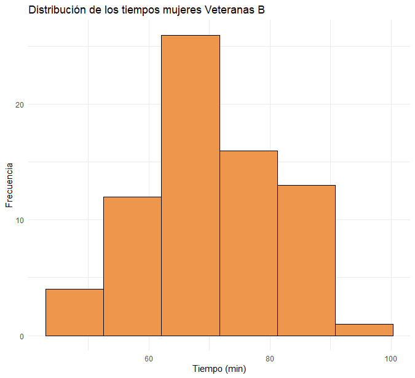
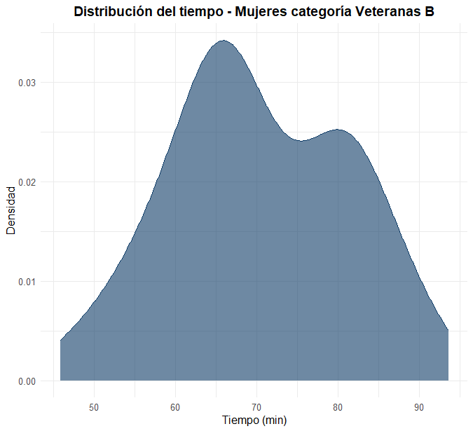

```{r setup, include=FALSE}
knitr::opts_chunk$set(echo = TRUE, comment = NA)
library(readr)
library(tidyverse)
library(DT)
library(paqueteMETODOS)
library(plotly)

data("CarreraLuz22")
data("evaluacion")
data("inflacionov22")
```

</br>


<h3>Variables cuantitativas</h3>

Para las **variables cuantitativas** en escalas de **intervalo** o **razón**, es fundamental utilizar gráficos que permitan visualizar sus principales características, como el **centro**, la **dispersión** y la **forma** de la distribución de los datos. Estos gráficos no solo facilitan la interpretación, sino que también son herramientas clave para el análisis exploratorio de datos.


</br></br>
<h4>Tipos de gráficos para una variable</h4>

</br>
1. **Diagrama de tallos y hojas**:

- Este gráfico permite observar la distribución de los datos en detalle, proporcionando una representación tabular y gráfica     simultáneamente.
   
- Es especialmente útil para conjuntos de datos pequeños, ya que permite identificar valores individuales y agruparlos en clases.

- Aunque no es nativo de `ggplot2`, se puede aproximar mediante histogramas con intervalos pequeños.

</br>
2. **Gráfico de Cajas (Boxplot)**:

- Resume los datos de manera compacta, mostrando:

  - La **mediana** como medida de tendencia central.
  
  - Los **cuartiles** para evaluar la dispersión.
  
  - El **rango intercuartílico** y los valores extremos o atípicos.
  
- Es ideal para comparar la dispersión entre diferentes grupos o identificar anomalías en los datos.

</br>   
3. **Histograma**:

- Representa la frecuencia de los datos distribuidos en intervalos específicos (bins).

- **Número de Intervalos**: Se recomienda que el número de divisiones sea **entre 7 y 15**. Este rango permite resumir los datos de manera efectiva sin perder detalles importantes ni sobrecargar la gráfica.

- **Tamaño de los Intervalos**: Si la variable es continua y ha sido discretizada, es preferible utilizar intervalos con límites de números enteros en lugar de decimales. Esto ayuda a representar con mayor claridad el fenómeno observado, evitando interpretaciones confusas derivadas de límites poco significativos.

- Permite identificar la **forma de la distribución**, mostrando características como:

  - **Simetría** o **asimetría**.
  
  - **Moda(s)**: Picos en la frecuencia que indican valores predominantes.
  
  - **Dispersión**: Anchura de los intervalos con mayor frecuencia.
  
- Es uno de los gráficos más comunes en análisis exploratorio.

</br>   
4. **Poligonos de frecuencia**:

- Similar al histograma, pero conecta los puntos medios de cada intervalo mediante líneas.

- Proporciona una visualización más suave y continua de la distribución de frecuencias.

- Es útil para comparar la distribución de diferentes conjuntos de datos en un mismo gráfico.

</br>
5. **Curvas de densidad**:

- Representan una estimación suave de la distribución de los datos, basada en técnicas de kernel.

- Muestran la forma general de la distribución sin segmentar los datos en intervalos como el histograma.

- Las curvas de densidad son útiles para establecer comparaciones con modelos teóricos de probabilidad, como: Distribución Normal, Distribución Uniforme, Distribución Ji-cuadrado.

- Permiten identificar:

  - **Centro**: Posición de los picos en la curva.
  
  - **Dispersión**: Anchura de la curva.
  
  - **Forma**: Simetría o asimetría de la distribución.

</br>
6. **Series de Tiempo:**

- Una **serie de tiempo** es un conjunto de observaciones de una variable cuantitativa registradas en intervalos de tiempo regulares o irregulares.

- Representa cómo evoluciona una variable a lo largo del tiempo.

- Es útil para:

  - **Identificar tendencias**: Cambios a largo plazo en la variable.
  
  - **Detectar estacionalidad**: Fluctuaciones regulares y repetitivas en períodos de tiempo.
  
  - **Analizar patrones cíclicos**: Oscilaciones irregulares a largo plazo.


</br></br>
<div class="caja-ejemplo">
<h3>Ejemplo:</h3>
<p> 
En este ejemplo, se construye un **diagrama de tallos y hojas** para visualizar los tiempos empleados por las atletas de la categoría **Veteranas B** en la carrera. Este tipo de gráfico es especialmente útil para observar la distribución de los datos en detalle.

<pre>
# Selección de la base de datos
dataFc4 <- subset(CarreraLuz22, CarreraLuz22$sex == "Mujer" & CarreraLuz22$categoria == "4. Veteranos B")

# Variable de interés: tiempo en minutos
x <- dataFc4$timerun / 60

# Construcción del diagrama de tallos y hojas
stem(x) # Diagrama de tallos y hojas
</pre>

```{r,eval=FALSE}
# Selección de la base de datos
dataFc4 <- subset(CarreraLuz22, CarreraLuz22$sex == "Mujer" & CarreraLuz22$categoria == "4. Veteranos B")

# Variable de interés: tiempo en minutos
x <- dataFc4$timerun / 60

# Construcción del diagrama de tallos y hojas
stem(x) # Diagrama de tallos y hojas
```
</p>

Este tipo de gráfico (ver **Figura 1.34**) es especialmente útil para observar la distribución de los datos en detalle. Los **tallos** representan la parte entera de los tiempos en minutos. Las **hojas** muestran las cifras decimales asociadas a cada intervalo de tallos. Por ejemplo, la salida

<pre>
The decimal point is 1 digit(s) to the right of the |

  4 | 68
</pre>

**Tallo**: El número 4 antes del símbolo | representa la parte entera del valor, es decir, 40 minutos.</br>
**Hojas**: Los números 6 y 8 después del | representan las décimas de minuto, es decir, 0.6 y 0.8.</br>
**Números representados**: 46.8 minutos y 48.0 minutos.</br>

Se observa que los valores están mayormente agrupados entre 60 y 70 minutos, con algunos valores en los extremos inferiores y superiores. Se pueden identificar patrones que sugieren una distribución asimétrica hacia la derecha.

<pre>
The decimal point is 1 digit(s) to the right of the |

  4 | 68
  5 | 2234
  5 | 6888899
  6 | 01233334
  6 | 5555566666778899
  7 | 00111334
  7 | 5667788
  8 | 0001112333334
  8 | 57899
  9 | 04
</pre>
**Figura 1.34** Gráfico de barras compuesto.
</div>


</br></br>
<div class="caja-ejemplo">
<h3>Ejemplo:</h3>
<p> 
En este ejemplo se construye un **histograma** (ver **Figura 1.35**) para visualizar los tiempos empleados por las atletas de la categoría **Veteranas B** en la carrera.

<pre>
library(paqueteMETODOS)
library(ggplot2)

# Cargar datos
data("CarreraLuz22")

# Selección de datos
dataFc4 <- subset(CarreraLuz22, CarreraLuz22$sex == "Mujer" & CarreraLuz22$categoria == "4. Veteranos B") # Dataset de mujeres

# Variable a graficar
dataFc4$timerun_min <- dataFc4$timerun / 60

# Creación del histograma con ggplot2
ggplot(dataFc4, aes(x = timerun_min)) +
  geom_histogram(
    bins = 6,
    fill = "#ee964b",
    color = "black"
  ) +
  labs(
    title = "Distribución de los tiempos mujeres Veteranas B",
    x = "Tiempo (min)",
    y = "Frecuencia"
  ) +
  theme_minimal()
</pre>

```{r, eval=FALSE}
library(paqueteMETODOS)
library(ggplot2)

# Cargar datos
data("CarreraLuz22")

# Selección de datos
dataFc4 <- subset(CarreraLuz22, CarreraLuz22$sex == "Mujer" & CarreraLuz22$categoria == "4. Veteranos B") # Dataset de mujeres

# Variable a graficar
dataFc4$timerun_min <- dataFc4$timerun / 60

# Creación del histograma con ggplot2
ggplot(dataFc4, aes(x = timerun_min)) +
  geom_histogram(
    bins = 6,
    fill = "#ee964b",
    color = "black"
  ) +
  labs(
    title = "Distribución de los tiempos mujeres Veteranas B",
    x = "Tiempo (min)",
    y = "Frecuencia"
  ) +
  theme_minimal()
```


<center>
```{r, echo=FALSE, out.width="100%", fig.align = "center"}

```
**Figura 1.35** Distribución de los tiempos empleados por las atletas mujeres de la categoría **Veteranas B**.
</center>
</br>

</p>
</div>


</br></br>
<div class="caja-ejemplo">
<h3>Ejemplo:</h3>
<p> 

En este ejemplo se construye un **diagrama de densidad** (ver **Figura 1.36**) para visualizar los tiempos empleados por las atletas de la categoría **Veteranas B** en la carrera.

<pre>
# Cargar paquetes necesarios
library(paqueteMETODOS)
library(ggplot2)

# Cargar datos
data("CarreraLuz22")

# Selección de datos: Mujeres en la categoría "4. Veteranos B"
dataFc4 <- subset(CarreraLuz22, sex == "Mujer" & categoria == "4. Veteranos B")

# Crear una nueva variable en minutos
dataFc4$timerun_min <- dataFc4$timerun / 60

# Crear gráfico de densidad
ggplot(dataFc4, aes(x = timerun_min)) +
  geom_density(fill = "#0d3b66", alpha = 0.6, color = "#0d3b66") +
  labs(
    title = "Distribución del tiempo - Mujeres categoría Veteranas B",
    x = "Tiempo (min)",
    y = "Densidad"
  ) +
  theme_minimal() +
  theme(
    plot.title = element_text(hjust = 0.5, size = 14, face = "bold"),
    axis.text = element_text(size = 10),
    axis.title = element_text(size = 12)
  )
</pre>

```{r, eval=FALSE}
# Cargar paquetes necesarios
library(paqueteMETODOS)
library(ggplot2)

# Cargar datos
data("CarreraLuz22")

# Selección de datos: Mujeres en la categoría "4. Veteranos B"
dataFc4 <- subset(CarreraLuz22, sex == "Mujer" & categoria == "4. Veteranos B")

# Crear una nueva variable en minutos
dataFc4$timerun_min <- dataFc4$timerun / 60

# Crear gráfico de densidad
ggplot(dataFc4, aes(x = timerun_min)) +
  geom_density(fill = "#0d3b66", alpha = 0.6, color = "#0d3b66") +
  labs(
    title = "Distribución del tiempo - Mujeres categoría Veteranas B",
    x = "Tiempo (min)",
    y = "Densidad"
  ) +
  theme_minimal() +
  theme(
    plot.title = element_text(hjust = 0.5, size = 14, face = "bold"),
    axis.text = element_text(size = 10),
    axis.title = element_text(size = 12)
  )
```


<center>
```{r, echo=FALSE, out.width="100%", fig.align = "center"}

```
**Figura 1.36** Distribución de los tiempos empleados por las atletas mujeres de la categoría **Veteranas B**.
</center>
</br>

</p>
</div>


</br></br>
<div class="caja-ejemplo">
<h3>Ejemplo:</h3>
<p> 

En este ejemplo se construye un **diagrama de cajas** (ver **Figura 1.37**) para visualizar los tiempos empleados por las atletas de la categoría **Veteranas B** en la carrera.

<pre>
# Cargar paquetes necesarios
library(paqueteMETODOS)
library(ggplot2)

# Cargar datos
data("CarreraLuz22")

# Crear una nueva variable en minutos
CarreraLuz22$timerun_min <- CarreraLuz22$timerun / 60

# Crear el gráfico de cajas
ggplot(CarreraLuz22, aes(x = sex, y = timerun_min, fill = sex)) +
  geom_boxplot(alpha = 0.8) +
  scale_fill_manual(values = c("#f4d35e", "#ee964b")) +
  labs(
    title = "Distribución del tiempo - Carrera La Luz 2022",
    x = "Sexo",
    y = "Tiempo (min)"
  ) +
  theme_minimal() +
  theme(
    plot.title = element_text(hjust = 0.5, size = 14, face = "bold"),
    axis.text = element_text(size = 10),
    axis.title = element_text(size = 12),
    legend.position = "none"
  )
</pre>

```{r, eval=FALSE}
# Cargar paquetes necesarios
library(paqueteMETODOS)
library(ggplot2)

# Cargar datos
data("CarreraLuz22")

# Crear una nueva variable en minutos
CarreraLuz22$timerun_min <- CarreraLuz22$timerun / 60

# Crear el gráfico de cajas
ggplot(CarreraLuz22, aes(x = sex, y = timerun_min, fill = sex)) +
  geom_boxplot(alpha = 0.8) +
  scale_fill_manual(values = c("#f4d35e", "#ee964b")) +
  labs(
    title = "Distribución del tiempo - Carrera La Luz 2022",
    x = "Sexo",
    y = "Tiempo (min)"
  ) +
  theme_minimal() +
  theme(
    plot.title = element_text(hjust = 0.5, size = 14, face = "bold"),
    axis.text = element_text(size = 10),
    axis.title = element_text(size = 12),
    legend.position = "none"
  )
```


<center>
```{r, echo=FALSE, out.width="100%", fig.align = "center"}
knitr::include_graphics("img/caja_muj.png")
```
**Figura 1.37** Distribución de los tiempos empleados por las atletas mujeres de la categoría **Veteranas B**.
</center>
</br>

</p>
</div>


</br></br>
<div class="caja-ejemplo">
<h3>Ejemplo:</h3>
<p> 

En este ejemplo se construye una **gráfica de series de tiempo** de la inflación en Colombia en el periodo  1946 - 2023 (ver **Figura 1.38**).


```{r, fig.align='center',eval=FALSE}
# Para configurar al español (letra ñ)
Sys.setlocale("LC_ALL", "es_ES.UTF-8")

# Cargar paquetes necesarios
library(ggplot2)
library(dplyr)

# Crear el conjunto de datos como data.frame
inflacion <- c(99.31, 88.3, 66, 66.7, 20.5, 8.9, 2.3, 7.3, 8.8, 1.72, 8.47, 18.75, 9.21, 20.23, 6.74, 6.32, 
               6.93, 32.41, 8.39, 14.84, 12.92, 7.46, 6.48, 8.26, 6.83, 13.91, 13.86, 23.48, 26.06, 17.69, 
               25.79, 28.3, 18.73, 28.82, 25.96, 26.36, 24.04, 16.66, 18.26, 22.45, 20.95, 24, 28.1, 26.2, 
               32.4, 26.8, 25.1, 22.6, 22.6, 19.5, 21.69, 17.7, 16.7, 13.2, 9.3, 8.5, 7.4, 7.8, 6.3, 5.4, 
               4.7, 6.3, 7.9, 7.2, 3.17, 4, 3.6, 2.3, 3.7, 6.8, 9, 5.5, 3.7, 3.9, 3.90, 5.6, 13.12, 9.28)
years <- seq(1946, 2023) # Generar los años
data_inflacion <- data.frame(Year = years, Inflation = inflacion)

# Crear el gráfico con ggplot2

ggplot(data_inflacion, aes(x = Year, y = Inflation)) +
  geom_line(color = "#ee964b", linewidth = 1.2) + # Usar linewidth en lugar de size
  geom_point(color = "#0d3b66", size = 1.5) +
  labs(
    title = "Inflación en Colombia (1946 - 2023)",
    subtitle = "Tasa de inflación acumulada anual",
    x = "Año", 
    y = "Inflación (%)"
  ) +
  theme_minimal() +
  theme(
    plot.title = element_text(hjust = 0.5, size = 16, face = "bold"),
    plot.subtitle = element_text(hjust = 0.5, size = 12),
    axis.title = element_text(size = 12),
    axis.text = element_text(size = 10)
  ) +
  scale_x_continuous(breaks = seq(1946, 2023, by = 10)) +
  scale_y_continuous(labels = scales::comma_format())
```


<center>
```{r, echo=FALSE, out.width="100%", fig.align = "center"}
knitr::include_graphics("img/serie-ejem.png")
```
**Figura 1.38** Gráfica de serie de tiempo de la inflación.
<sub>
Fuente : [wikipedia](https://es.wikipedia.org/wiki/Anexo:Variaci%C3%B3n_de_la_inflaci%C3%B3n_de_Colombia_desde_1946)
</sub>
</center>
</br>

</p>
</div>


<div class="caja-actividad">
<h3>Actividad:</h3>
Explora el código oculto
```{r, eval=FALSE}
library(paqueteMETODOS)
library(ggplot2)
library(plotly)

data("CarreraLuz22")

# Crear el boxplot con ggplot2
p =ggplot(CarreraLuz22, aes(x = sex, y = timerun/60, fill = sex)) +
geom_boxplot() +
labs(title = "Distribución del tiempo de carrera La Luz 2022",
x = "Sexo",
y = "Tiempo (min)") +
scale_fill_manual(values = c("#f4d35e", "#ee964b")) +
theme_minimal()
ggplotly(p)
```
```{r, eval=FALSE}
library(paqueteMETODOS)
library(ggplot2)
data("CarreraLuz22")

# Definir la paleta de 5 colores
paleta <- colorRampPalette(c("#001B48", "#97CADB"))(5)

# Crear el boxplot con ggplot2
p <- ggplot(CarreraLuz22, aes(x = sex, y = timerun/60, fill = categoria)) +
geom_boxplot() +
labs(title = "Distribución del tiempo de carrera La Luz 2022",
x = "Sexo",
y = "Tiempo (min)") +
scale_fill_manual(values = paleta) +
theme_minimal()

# Mostrar el gráfico ggplot2
p
```
</div> 


<br/>
<div class="caja-actividad">
<h3>Actividad:</h3>
Explora el código oculto
```{r, eval=FALSE}
library(paqueteMETODOS)
library(ggplot2)

data("CarreraLuz22")

# Selección de bases
dataFc4 <- subset(CarreraLuz22, (CarreraLuz22$sex == "Mujer" & CarreraLuz22$categoria == "4. Veteranos B"))

# Crear el histograma con ggplot2
p = ggplot(dataFc4, aes(x = timerun/60)) +
geom_histogram(bins = 6, fill = "#ee964b", color = "white", alpha = 0.7) +
labs(title = "Distribución de los tiempos mujeres Veteranas B",
x = "Tiempo (min)",
y = "Frecuencia") +
theme_minimal()

ggplotly(p)
```
</div>


<div class="caja-actividad">
<h3>Actividad:</h3>
Explora el código oculto
```{r, eval=FALSE}
library(tidyverse)
library(gganimate)

# Datos de inflación
inflacion <- c(99.31, 88.3,66,66.7,20.5,8.9,2.3,7.3,8.8,1.72,8.47,18.75,9.21,20.23,6.74,6.32,6.93,32.41,8.39,14.84,12.92,7.46,6.48,8.26,6.83,13.91,13.86,23.48,26.06,17.69,25.79,28.3,18.73,28.82,25.96,26.36,24.04,16.66,18.26,22.45,20.95,24,28.1,26.2,32.4,26.8,25.1,22.6,22.6,19.5,21.69,17.7,16.7,13.2,9.3,8.5,7.4,7.8,6.3,5.4,4.7,6.3,7.9,7.2,3.17,4,3.6,2.3,3.7,6.8,9,5.5,3.7,3.9,3.90,5.6,13.12,9.28)
year <- seq(as.Date("1946-12-31"), as.Date("2023-12-31"), by = "1 year")

# Crear un data frame con los datos
df <- data.frame(year, inflacion)

# Crear el gráfico animado con ggplot2 y gganimate
ggplot(df, aes(x=year, y=inflacion)) + geom_point() + 
geom_line() + theme_minimal() +transition_reveal(year)


```
</div>


<br/><br/>
<h3>ggplot2</h3>

Aunque en los retos o actividades  previos se ha empleado el paquete gráfico `ggplot2`, a continuación se hace una presentación de su sintaxis.


```{r, echo=FALSE, out.width="10%", fig.align = "left"}
knitr::include_graphics("img/ggplot2.png")
```

<br/>
<h4>Gráficos con ggplot2</h4>

```{r, echo=FALSE, out.width="50%", fig.align = "left"}
knitr::include_graphics("img/ge_themes.png")
```

<br/><br/>

+ **Data**: capa de los datos

+ **Aesthetics**: capa estética (**aes**), definimos las variables a utilizar en el gráfico

+ **Geometries**: capa de geometrías, se define el tipo de gráfica a realizar

+ **Facets**: capa de facetas, permite detallar la gráfica por categorías

+ **Statistics**: capa de estadística, permite agregar modelos

+ **Coordinates**: capa de coordenadas, permite ajustar las escalas de los ejes

+ **Theme**: capas de características del gráfico que no dependen de  los datos

<br/><br/>

<center>
<sub>
Fuente: [Visualizacion de datos con ggplot2](https://rstudio.com/wp-content/uploads/2015/03/ggplot2-cheatsheet.pdf)
</sub>
</center>

1. Se declara la data y las variables

```{r,fig.height=5}
library(readr)
library(ggplot2)
ggplot(CarreraLuz22, aes(y=edad , x=timerun/60))   # Lienso con escalas 
```

2. Se determina el tipo de gráfico a realizar con las variables declaradas

<br/><br/>

```{r,fig.height=5}
ggplot(CarreraLuz22, aes(y=edad , x=timerun/60))+
geom_point()     # Gráfico de puntos

```

<br/>

Para declarar el tipo de gráfico se emplean diferentes geometrías, en este caso se utiliza `geom_point()`

|                   |                    |                     |                      |
|:------------------|:-------------------|:--------------------|:---------------------|
|geo_point()        |geom_bar()          |geom_col()           |stat_count()          |
|geom_boxplot()     |stat_boxplot()      |geom_density()       |stat_density()        |
|geom_histogram()   |geom_violin()       |                     |                      |

<br/><br/>

```{r,fig.height=5}
ggplot(CarreraLuz22, aes(y=edad , x=timerun/60))+
geom_point()+
facet_wrap(~ sex)   # Separación por sexo

```

3. Se declaran las capas y las estadística a emplea.

<br/><br/>

```{r, message=FALSE, warning=FALSE,fig.height=5}
ggplot(CarreraLuz22, aes(y=edad , x=timerun/60))+
facet_wrap(~ categoria)+ 
stat_smooth(method = "loess" , formula =y ~ x)  # Ajuste de modelo 
```

4. Se definen capas de coordenadas para dar límites a los ejes.

<br/><br/>

```{r, message=FALSE, warning=FALSE,fig.height=5}

ggplot(CarreraLuz22, aes(y=edad , x=timerun/60))+
facet_wrap(~ categoria)+ 
stat_smooth(method = "loess" , formula =y ~ x)+        
coord_cartesian(ylim = c(15, 80), xlim = c(35,180))  # Ajuste de escalas ejes 
```


<br/><br/>

5. Se adicionan titulos y etiquetes de los ejes.

```{r, fig.height=5}
ggplot(CarreraLuz22, aes(y=edad , x=timerun/60))+
facet_wrap(~ categoria)+ 
stat_smooth(method = "loess" , formula =y ~ x)+
coord_cartesian(ylim = c(15, 80), xlim = c(35,180))+
labs(title = "Tiempos Carrera La Luz  2022",  y= "Edad", x= "Tiempo (min)")  # Titulo y etiquetas 
```

**Listo !!**


<br/><br/>
<h3>Otros gráficos con ggplot2</h3>

```{r, fig.height=5, fig.width=12}
# Selección del grupo - Hombres categoría Abierta
data("CarreraLuz22")
CarreraLuz22M = subset(CarreraLuz22, CarreraLuz22$sex=="Hombre")
CarreraLuz22_c2M = subset(CarreraLuz22M, CarreraLuz22M$categoria=="2. Abierta")

# Definición tamaño de letras
Theme1 = theme(axis.title.x = element_text(size = 16),   
axis.text.x = element_text(size = 10),
axis.title.y = element_text(size = 16),
# axis.text.y = element_blank(),
axis.text = element_text( size = 10),
legend.title = element_text(size = 10),
legend.text = element_text(size = 10),  
strip.text = element_text(size=10),
title =element_text(size=10, face='bold') )# Tamaño letra por grupos

# Cálculo de los cuartiles
cuartiles1=data.frame(prob=c(0.25,0.5,0.75),
valor=quantile(CarreraLuz22_c2M$timerun,  c(0.25,0.5,0.75),na.rm = TRUE)/60 )
q=cuartiles1$valor

# Construcción de la gráfica
p4=ggplot(CarreraLuz22_c2M, aes(x=timerun/60, y=" ")) +
geom_jitter(color="#034A94", size=2, alpha=0.9)+ 
scale_color_manual(values="#034A94") +
geom_point(data=cuartiles1, aes(x=valor), color="#FF7F00",size=3)+
geom_boxplot(alpha = 0.4)+
labs(title = " ", y= "",  x= "tiempo (min)")+ 
geom_text(size=6,data = NULL, x = q[1], y = 0.5, label = "Q1",col="#FF7F00")+
geom_text(size=6,data = NULL, x = q[2], y = 0.5, label = "Q2",col="#FF7F00") +
geom_text(size=6,data = NULL, x = q[3], y = 0.5, label = "Q3",col="#FF7F00") +
geom_text(size=6,data = NULL, x = 96, y = 0.5, label = "atípicos",col="#FF7F00") +  
Theme1
p4 
```


