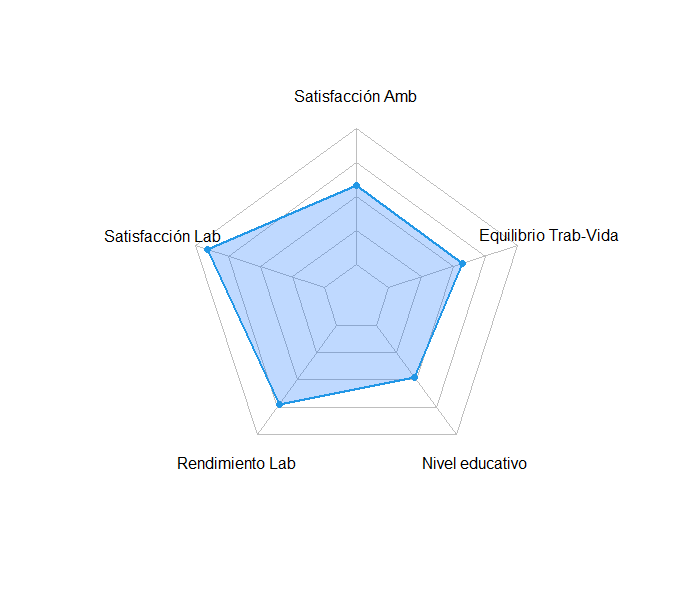
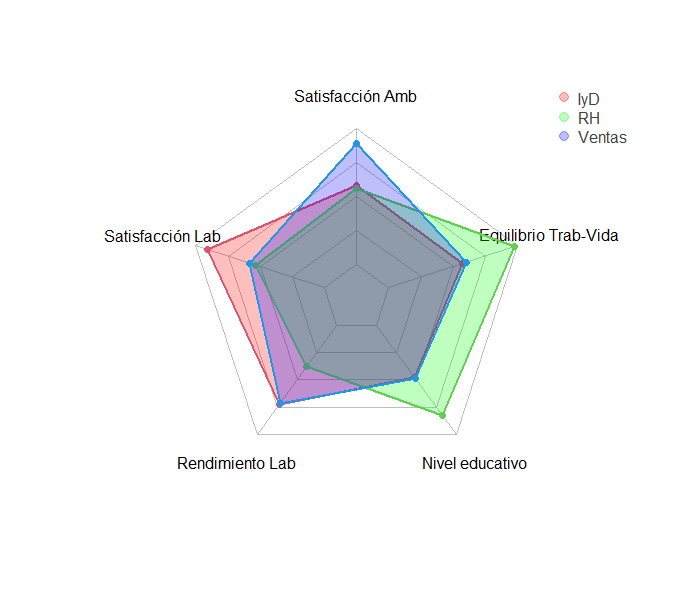
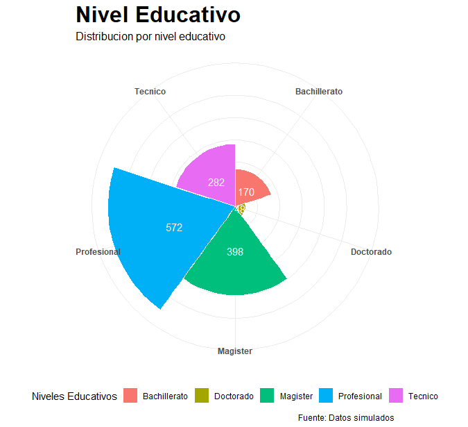
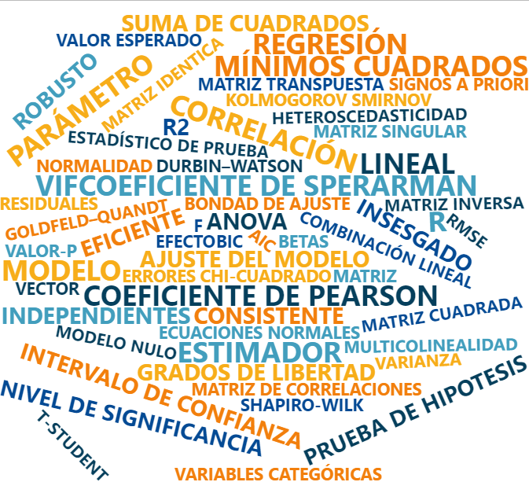

```{r setup, include=FALSE}
knitr::opts_chunk$set(echo = TRUE, comment = NA)
library(readr)
library(tidyverse)
library(DT)
library(paqueteMETODOS)

data("CarreraLuz22")
data("evaluacion")
data("inflacionov22")
```


<br/><br/>
<h3>Gráfico de radar</h3>

El gráfico de radar, también conocido como gráfico de telaraña, es una herramienta visual que permite comparar múltiples variables de manera simultánea, facilitando el análisis y la interpretación de información compleja.


<br/><br/>
<div class="caja-ejemplo">
<h3>Ejemplo:</h3>
<p> 
Este gráfico de radar (**Figura 1.26**), generado mediante el paquete `fmsb`, permite visualizar y comparar cinco indicadores relacionados con aspectos laborales y personales: satisfacción con el ambiente, satisfacción laboral, rendimiento laboral, nivel educativo y equilibrio entre trabajo y vida personal. Los valores de cada indicador se representan en una escala de 1 a 4, donde 1 corresponde al nivel más bajo y 4 al más alto. El gráfico destaca la contribución individual de cada indicador en forma de un polígono, con líneas de referencia en la cuadrícula para facilitar la interpretación. Además, incluye un área de relleno azul semitransparente que proporciona un enfoque visual claro y efectivo para analizar los datos.
<br/>


<pre>
# Instalar el paquete necesario (descomentar si no está instalado)
# install.packages("fmsb")

# Cargar la biblioteca fmsb
library(fmsb)

# Establecer una semilla para reproducibilidad
set.seed(1)

# Vector de valores a graficar
x <- c(2.744017, 3.726327, 3.162331, 2.424298, 2.725286)

# Crear un data frame para el gráfico de radar
df <- data.frame(
  rbind(
    rep(4, 5),  # Límite superior de la escala (máximo valor)
    rep(1, 5),  # Límite inferior de la escala (mínimo valor)
    x           # Valores a graficar
  )
)

# Asignar nombres descriptivos a las columnas
colnames(df) <- c(
  "Satisfacción Amb",     # Satisfacción con el ambiente
  "Satisfacción Lab",     # Satisfacción laboral
  "Rendimiento Lab",      # Rendimiento laboral
  "Nivel educativo",      # Nivel educativo
  "Equilibrio Trab-Vida"  # Equilibrio entre trabajo y vida personal
)

# Generar el gráfico de radar
radarchart(
  df,
  cglty = 1,                    # Tipo de línea de la cuadrícula (línea sólida)
  cglcol = "gray",              # Color de la cuadrícula
  pcol = 4,                     # Color de la línea que conecta los puntos (azul)
  plwd = 2,                     # Grosor de la línea
  pfcol = rgb(0, 0.4, 1, 0.25)  # Color de relleno (azul semitransparente)
)
</pre>


```{r, warning=FALSE, message=FALSE, fig.align='center', fig.height=8, fig.width=10,eval=FALSE}
# Instalar el paquete necesario (descomentar si no está instalado)
# install.packages("fmsb")

# Cargar la biblioteca fmsb
library(fmsb)

# Establecer una semilla para reproducibilidad
set.seed(1)

# Vector de valores a graficar
x <- c(2.744017, 3.726327, 3.162331, 2.424298, 2.725286)

# Crear un data frame para el gráfico de radar
df <- data.frame(
  rbind(
    rep(4, 5),  # Límite superior de la escala (máximo valor)
    rep(1, 5),  # Límite inferior de la escala (mínimo valor)
    x           # Valores a graficar
  )
)

# Asignar nombres descriptivos a las columnas
colnames(df) <- c(
  "Satisfacción Amb",     # Satisfacción con el ambiente
  "Satisfacción Lab",     # Satisfacción laboral
  "Rendimiento Lab",      # Rendimiento laboral
  "Nivel educativo",      # Nivel educativo
  "Equilibrio Trab-Vida"  # Equilibrio entre trabajo y vida personal
)

# Generar el gráfico de radar
radarchart(
  df,
  cglty = 1,                    # Tipo de línea de la cuadrícula (línea sólida)
  cglcol = "gray",              # Color de la cuadrícula
  pcol = 4,                     # Color de la línea que conecta los puntos (azul)
  plwd = 2,                     # Grosor de la línea
  pfcol = rgb(0, 0.4, 1, 0.25)  # Color de relleno (azul semitransparente)
)
```


<center>
```{r, echo=FALSE, out.width="100%", fig.align = "center"}

```
**Figura 1.26** Gráfico de radar de indicadores laborales y personales.
</center>
</br>

</p>
</div>


<br/><br/>
<div class="caja-ejemplo">
<h3>Ejemplo:</h3>
<p> 
El gráfico de radar (ver **Figura 1.27**) presentado compara visualmente el desempeño de tres grupos (**IyD**, **RH**, y **Ventas**) en relación con cinco indicadores clave:<br/>


1. **Satisfacción con el ambiente** (Satisfacción Amb).

2. **Satisfacción laboral** (Satisfacción Lab).

3. **Rendimiento laboral** (Rendimiento Lab).

4. **Nivel educativo**.

5. **Equilibrio entre trabajo y vida personal** (Equilibrio Trab-Vida).

<br/>
El gráfico tiene como objetivo:

- **Comparar** el desempeño de los tres grupos en los cinco indicadores.

- **Identificar fortalezas y debilidades**:

  - Las áreas más amplias representan mejores resultados en un indicador específico.
  
  - Las áreas más pequeñas señalan posibles puntos de mejora.
  
- **Visualizar patrones**: Ayuda a detectar similitudes o diferencias entre los grupos de forma intuitiva.

<br/>
Respecto a los elementos del gráfico:

- **Líneas**: Sirven como referencia para interpretar los valores de los indicadores, con una escala de **1** (mínimo) a **4** (máximo).

- **Áreas coloreadas**: Cada grupo está representado por un área de color semitransparente:

  - **Rojo** para IyD.
  
  - **Verde** para RH.
  
  - **Azul** para Ventas.
  
  Estas áreas facilitan la comparación visual entre los grupos.
  
- **Leyenda**: Ubicada en la parte superior derecha, asocia los colores con los grupos correspondientes, mejorando la comprensión del gráfico.

<br/>
Interpretación del gráfico: 

El gráfico es una herramienta eficaz para evaluar el desempeño relativo de cada grupo en los indicadores clave. Los datos permiten:

- **Resaltar indicadores destacados** donde los grupos tienen mejores resultados.

- **Detectar áreas de mejora**, identificando indicadores con valores más bajos.

- **Facilitar la toma de decisiones**, al ofrecer una visualización clara de las diferencias y similitudes entre los grupos.


<pre>
# Configurar el idioma para soportar caracteres especiales en español (letra ñ, acentos)
Sys.setlocale("LC_ALL", "es_ES.UTF-8")

# Instalar el paquete necesario (descomentar si no está instalado)
# install.packages("fmsb")

# Cargar la biblioteca fmsb para gráficos de radar
library(fmsb)


# Vector de valores: tres grupos con cinco indicadores cada uno
valores <- c(
  2.744017, 3.726327, 3.162331, 2.424298, 2.725286,   # Grupo 1
  2.682540, 2.603175, 2.142857, 3.476190, 3.920635,   # Grupo 2
  3.679372, 2.751121, 3.136771, 2.451233, 2.816143    # Grupo 3
)

# Convertir el vector en una matriz (3 filas, 5 columnas)
matriz_puntos <- matrix(valores, nrow = 3, byrow = TRUE)

# Crear un data frame con límites superiores e inferiores
df2 <- data.frame(
  rbind(
    rep(4, 5),  # Límite superior (valor máximo en la escala)
    rep(1, 5),  # Límite inferior (valor mínimo en la escala)
    matriz_puntos  # Valores de los tres grupos
  )
)

# Asignar nombres descriptivos a las columnas (indicadores)
colnames(df2) <- c(
  "Satisfacción Amb",     # Satisfacción con el ambiente
  "Satisfacción Lab",     # Satisfacción laboral
  "Rendimiento Lab",      # Rendimiento laboral
  "Nivel educativo",      # Nivel educativo
  "Equilibrio Trab-Vida"  # Equilibrio entre trabajo y vida personal
)


# Colores semitransparentes para las áreas de los tres grupos
colores_areas <- c(
  rgb(1, 0, 0, 0.25),  # Rojo semitransparente para el grupo 1
  rgb(0, 1, 0, 0.25),  # Verde semitransparente para el grupo 2
  rgb(0, 0, 1, 0.25)   # Azul semitransparente para el grupo 3
)

# Crear el gráfico de radar
radarchart(
  df2,
  cglty = 1,        # Tipo de línea de la cuadrícula (línea sólida)
  cglcol = "gray",  # Color de las líneas de la cuadrícula (gris)
  pcol = 2:4,       # Colores para las líneas de los grupos
  plwd = 2,         # Grosor de las líneas de los grupos
  plty = 1,         # Tipo de línea (todas sólidas)
  pfcol = colores_areas  # Colores de relleno para las áreas
)


legend(
  "topright",                       # Ubicación de la leyenda
  legend = c("IyD", "RH", "Ventas"),  # Nombres de los grupos
  bty = "n",                        # Sin borde alrededor de la leyenda
  pch = 20,                         # Tipo de símbolo para la leyenda (círculo)
  col = colores_areas,              # Colores de los grupos
  text.col = "grey25",              # Color del texto de la leyenda
  pt.cex = 2                        # Tamaño de los símbolos en la leyenda
)
</pre>


```{r, warning=FALSE, message=FALSE, fig.align='center', fig.height=8, fig.width=10, eval=FALSE}
# Configurar el idioma para soportar caracteres especiales en español (letra ñ, acentos)
Sys.setlocale("LC_ALL", "es_ES.UTF-8")

# Instalar el paquete necesario (descomentar si no está instalado)
# install.packages("fmsb")

# Cargar la biblioteca fmsb para gráficos de radar
library(fmsb)


# Vector de valores: tres grupos con cinco indicadores cada uno
valores <- c(
  2.744017, 3.726327, 3.162331, 2.424298, 2.725286,   # Grupo 1
  2.682540, 2.603175, 2.142857, 3.476190, 3.920635,   # Grupo 2
  3.679372, 2.751121, 3.136771, 2.451233, 2.816143    # Grupo 3
)

# Convertir el vector en una matriz (3 filas, 5 columnas)
matriz_puntos <- matrix(valores, nrow = 3, byrow = TRUE)

# Crear un data frame con límites superiores e inferiores
df2 <- data.frame(
  rbind(
    rep(4, 5),  # Límite superior (valor máximo en la escala)
    rep(1, 5),  # Límite inferior (valor mínimo en la escala)
    matriz_puntos  # Valores de los tres grupos
  )
)

# Asignar nombres descriptivos a las columnas (indicadores)
colnames(df2) <- c(
  "Satisfacción Amb",     # Satisfacción con el ambiente
  "Satisfacción Lab",     # Satisfacción laboral
  "Rendimiento Lab",      # Rendimiento laboral
  "Nivel educativo",      # Nivel educativo
  "Equilibrio Trab-Vida"  # Equilibrio entre trabajo y vida personal
)


# Colores semitransparentes para las áreas de los tres grupos
colores_areas <- c(
  rgb(1, 0, 0, 0.25),  # Rojo semitransparente para el grupo 1
  rgb(0, 1, 0, 0.25),  # Verde semitransparente para el grupo 2
  rgb(0, 0, 1, 0.25)   # Azul semitransparente para el grupo 3
)

# Crear el gráfico de radar
radarchart(
  df2,
  cglty = 1,        # Tipo de línea de la cuadrícula (línea sólida)
  cglcol = "gray",  # Color de las líneas de la cuadrícula (gris)
  pcol = 2:4,       # Colores para las líneas de los grupos
  plwd = 2,         # Grosor de las líneas de los grupos
  plty = 1,         # Tipo de línea (todas sólidas)
  pfcol = colores_areas  # Colores de relleno para las áreas
)


legend(
  "topright",                       # Ubicación de la leyenda
  legend = c("IyD", "RH", "Ventas"),  # Nombres de los grupos
  bty = "n",                        # Sin borde alrededor de la leyenda
  pch = 20,                         # Tipo de símbolo para la leyenda (círculo)
  col = colores_areas,              # Colores de los grupos
  text.col = "grey25",              # Color del texto de la leyenda
  pt.cex = 2                        # Tamaño de los símbolos en la leyenda
)

```

<center>
```{r, echo=FALSE, out.width="100%", fig.align = "center"}

```
**Figura 1.27** Gráfico de radar.
</center>
</br>

</p>
</div>


<br/><br/>
<h3>Gráfico de barras polar</h3>

El gráfico de barras polares se utiliza principalmente para representar variables categóricas con múltiples valores, ofreciendo una visualización clara y efectiva. Además, es una herramienta útil para mostrar el nivel alcanzado en un indicador mediante la contribución de un grupo de variables, facilitando la interpretación y el análisis de datos en contextos comparativos.


<br/><br/>
<div class="caja-ejemplo">
<h3>Ejemplo:</h3>
<p> 
Este código crea un gráfico de barras polares (**Figura 1.14**) que representa la distribución de personas según su nivel educativo. Utilizando datos categóricos (niveles educativos: Bachillerato, Técnico, Profesional, Magíster y Doctorado) y sus respectivas frecuencias, el gráfico transforma las barras en un formato circular para facilitar la comparación visual. 

<pre>
# Cargar la biblioteca tidyverse para manipulación de datos y gráficos
library(tidyverse)

# Crear un data frame con datos educativos
data <- data.frame(
  variable = c("Bachillerato", "Tecnico", "Profesional", "Magister", "Doctorado"),  # Sin acentos
  value = c(170, 282, 572, 398, 48)  # Cantidad de personas por nivel educativo
)

# Crear el gráfico en coordenadas polares
plot <- ggplot(data, aes(x = variable, y = value, fill = factor(variable))) +
  geom_col(width = 1, color = "white") + 
  coord_polar() + 
  geom_text(aes(label = value), position = position_stack(vjust = 0.5), color = "white", size = 4) +
  labs(
    title = "Nivel Educativo",
    subtitle = "Distribucion por nivel educativo",  # Sin acento
    caption = "Fuente: Datos simulados"
  ) +
  scale_fill_manual(
    values = c("#F8766D", "#A3A500", "#00BF7D", "#00B0F6", "#E76BF3"),
    name = "Niveles Educativos"
  ) +
  theme_minimal() +
  theme(
    axis.title.x = element_blank(),
    axis.title.y = element_blank(),
    axis.ticks = element_blank(),
    axis.text.y = element_blank(),
    axis.text.x = element_text(face = "bold"),
    plot.title = element_text(size = 24, face = "bold"),
    plot.subtitle = element_text(size = 12),
    legend.position = "bottom"
  )

# Imprimir el gráfico
plot
</pre>

```{r, warning=FALSE, message=FALSE, fig.align='center', fig.height=8, fig.width=10,eval=FALSE}
# Cargar la biblioteca tidyverse para manipulación de datos y gráficos
library(tidyverse)

# Crear un data frame con datos educativos
data <- data.frame(
  variable = c("Bachillerato", "Tecnico", "Profesional", "Magister", "Doctorado"),  # Sin acentos
  value = c(170, 282, 572, 398, 48)  # Cantidad de personas por nivel educativo
)

# Crear el gráfico en coordenadas polares
plot <- ggplot(data, aes(x = variable, y = value, fill = factor(variable))) +
  geom_col(width = 1, color = "white") + 
  coord_polar() + 
  geom_text(aes(label = value), position = position_stack(vjust = 0.5), color = "white", size = 4) +
  labs(
    title = "Nivel Educativo",
    subtitle = "Distribucion por nivel educativo",  # Sin acento
    caption = "Fuente: Datos simulados"
  ) +
  scale_fill_manual(
    values = c("#F8766D", "#A3A500", "#00BF7D", "#00B0F6", "#E76BF3"),
    name = "Niveles Educativos"
  ) +
  theme_minimal() +
  theme(
    axis.title.x = element_blank(),
    axis.title.y = element_blank(),
    axis.ticks = element_blank(),
    axis.text.y = element_blank(),
    axis.text.x = element_text(face = "bold"),
    plot.title = element_text(size = 24, face = "bold"),
    plot.subtitle = element_text(size = 12),
    legend.position = "bottom"
  )

# Imprimir el gráfico
plot
```

<center>
```{r, echo=FALSE, out.width="100%", fig.align = "center"}

```
**Figura 1.28** Gráfico de barras polares.
</center>
</br>


El gráfico (**Figura 1.28**) refleja que la mayoría de las personas en este conjunto de datos han alcanzado niveles educativos intermedios o altos (Profesional y Magíster), mientras que los niveles extremos (Doctorado y Bachillerato) tienen una representación más baja. Esto podría sugerir un contexto donde la educación superior y la formación avanzada están priorizadas, pero con un número reducido de personas que alcanzan el máximo nivel académico (Doctorado).
</p>
</div>


<br/><br/>
<h3>Nube de palabras</h3>

La nube de palabras es una representación visual utilizada en el análisis de texto, particularmente en minería de texto. Esta herramienta permite identificar de manera rápida y efectiva las palabras más frecuentes en un conjunto de texto, facilitando la detección de patrones y tendencias clave.


<br/><br/>
<div class="caja-ejemplo">
<h3>Ejemplo:</h3>
<p> 
El código genera una nube de palabras a partir de un conjunto de conceptos estadísticos y econométricos, donde el tamaño de cada palabra refleja su frecuencia, y los colores personalizados mejoran la visualización y diferenciación entre términos.
<br/>

<pre>
# Cargar la librería para generar nubes de palabras
library("wordcloud2")


# Lista de palabras clave relacionadas con conceptos estadísticos y de modelos
palabras <- c(
  "MODELO", "REGRESIÓN", "LINEAL", "CORRELACIÓN", "PARÁMETRO",
  "ESTIMADOR", "NORMALIDAD", "HETEROSCEDASTICIDAD", "MULTICOLINEALIDAD",
  "ERRORES", "RESIDUALES", "BETAS", "MÍNIMOS CUADRADOS",
  "COEFICIENTE DE PEARSON", "COEFICIENTE DE SPERARMAN", "MATRIZ",
  "VECTOR", "COMBINACIÓN LINEAL", "MATRIZ CUADRADA", "MATRIZ SINGULAR",
  "MATRIZ IDENTICA", "MATRIZ TRANSPUESTA", "MATRIZ INVERSA",
  "MATRIZ DE VARIANZAS COVARIANZAS", "VARIANZA", "VALOR ESPERADO", "R",
  "ECUACIONES NORMALES", "INSESGADO", "EFICIENTE", "CONSISTENTE", "ROBUSTO",
  "INDEPENDIENTES", "VARIANZA CONSTANTE", "SHAPIRO-WILK", "KOLMOGOROV SMIRNOV",
  "GOLDFELD–QUANDT", "DURBIN–WATSON", "T-STUDENT", "CHI-CUADRADO", "F",
  "NIVEL DE SIGNIFICANCIA", "INTERVALO DE CONFIANZA", "PRUEBA DE HIPOTESIS",
  "ANOVA", "SUMA DE CUADRADOS", "GRADOS DE LIBERTAD", "MODELO NULO",
  "ESTADÍSTICO DE PRUEBA", "VALOR-P", "BONDAD DE AJUSTE", "AIC", "R2", "BIC",
  "RMSE", "AJUSTE DEL MODELO", "VARIABLES CATEGÓRICAS", "EFECTO",
  "SIGNOS A PRIORI", "MATRIZ DE CORRELACIONES", "VIF"
)

# Frecuencias asociadas a cada palabra
replicas <- c(
  5, 5, 5, 5, 5, 5, 3, 3, 3, 3, 3, 3, 5, 5, 5, 3, 3, 3, 3, 3, 3, 3, 3, 5,
  3, 3, 5, 3, 4, 4, 4, 4, 4, 4, 3, 3, 3, 3, 3, 3, 3, 4, 4, 4, 4, 4, 4, 3,
  3, 3, 3, 3, 4, 3, 3, 4, 3, 3, 3, 3, 5
)

# Crear un vector con palabras repetidas según las frecuencias
nube1 <- rep(palabras, replicas)

# Generar un data frame con las frecuencias de cada palabra
t <- data.frame(table(nube1))


wordcloud2(
  data = t,
  size = 0.2,                      # Tamaño general de las palabras
  color = rep_len(                 # Asignar colores alternados
    c("#F27F0C", "#F7AD19", "#053F5C", "#429EBD", "#034A94"),
    nrow(t)                        # Ajustar a la cantidad de palabras
  )
)
</pre>

```{r, warning=FALSE, eval=FALSE}
# Cargar la librería para generar nubes de palabras
library("wordcloud2")


# Lista de palabras clave relacionadas con conceptos estadísticos y de modelos
palabras <- c(
  "MODELO", "REGRESIÓN", "LINEAL", "CORRELACIÓN", "PARÁMETRO",
  "ESTIMADOR", "NORMALIDAD", "HETEROSCEDASTICIDAD", "MULTICOLINEALIDAD",
  "ERRORES", "RESIDUALES", "BETAS", "MÍNIMOS CUADRADOS",
  "COEFICIENTE DE PEARSON", "COEFICIENTE DE SPERARMAN", "MATRIZ",
  "VECTOR", "COMBINACIÓN LINEAL", "MATRIZ CUADRADA", "MATRIZ SINGULAR",
  "MATRIZ IDENTICA", "MATRIZ TRANSPUESTA", "MATRIZ INVERSA",
  "MATRIZ DE VARIANZAS COVARIANZAS", "VARIANZA", "VALOR ESPERADO", "R",
  "ECUACIONES NORMALES", "INSESGADO", "EFICIENTE", "CONSISTENTE", "ROBUSTO",
  "INDEPENDIENTES", "VARIANZA CONSTANTE", "SHAPIRO-WILK", "KOLMOGOROV SMIRNOV",
  "GOLDFELD–QUANDT", "DURBIN–WATSON", "T-STUDENT", "CHI-CUADRADO", "F",
  "NIVEL DE SIGNIFICANCIA", "INTERVALO DE CONFIANZA", "PRUEBA DE HIPOTESIS",
  "ANOVA", "SUMA DE CUADRADOS", "GRADOS DE LIBERTAD", "MODELO NULO",
  "ESTADÍSTICO DE PRUEBA", "VALOR-P", "BONDAD DE AJUSTE", "AIC", "R2", "BIC",
  "RMSE", "AJUSTE DEL MODELO", "VARIABLES CATEGÓRICAS", "EFECTO",
  "SIGNOS A PRIORI", "MATRIZ DE CORRELACIONES", "VIF"
)

# Frecuencias asociadas a cada palabra
replicas <- c(
  5, 5, 5, 5, 5, 5, 3, 3, 3, 3, 3, 3, 5, 5, 5, 3, 3, 3, 3, 3, 3, 3, 3, 5,
  3, 3, 5, 3, 4, 4, 4, 4, 4, 4, 3, 3, 3, 3, 3, 3, 3, 4, 4, 4, 4, 4, 4, 3,
  3, 3, 3, 3, 4, 3, 3, 4, 3, 3, 3, 3, 5
)

# Crear un vector con palabras repetidas según las frecuencias
nube1 <- rep(palabras, replicas)

# Generar un data frame con las frecuencias de cada palabra
t <- data.frame(table(nube1))


wordcloud2(
  data = t,
  size = 0.2,                      # Tamaño general de las palabras
  color = rep_len(                 # Asignar colores alternados
    c("#F27F0C", "#F7AD19", "#053F5C", "#429EBD", "#034A94"),
    nrow(t)                        # Ajustar a la cantidad de palabras
  )
)
```


<center>
```{r, echo=FALSE, out.width="100%", fig.align = "center"}

```
**Figura 1.29** Gráfico de nube de palabras.
</center>
</br>


</p>
</div>


<br/><br/>
<div class="caja-ejemplo">
<h3>Ejemplo:</h3>
<p> 
Este código utiliza el conjunto de datos `gapminder` para crear una animación que muestra la evolución de los 15 países con mayor PIB per cápita a lo largo del tiempo. Primero, los datos se procesan para calcular el ranking anual de los países en función de su PIB per cápita, seleccionando únicamente los 15 primeros para cada año. Luego, se genera un gráfico de barras horizontales que cambia dinámicamente con el paso de los años, destacando los nombres de los países, sus valores de PIB per cápita y el año correspondiente. La animación incluye transiciones suaves y un diseño minimalista, proporcionando una representación visual clara y atractiva de cómo el desarrollo económico ha variado entre los países a lo largo de las décadas.
<br/>

<pre>
# Cargar librerías necesarias
library(dplyr)        # Manipulación de datos
library(gapminder)    # Conjunto de datos gapminder
library(gganimate)    # Creación de animaciones con ggplot2


# Cargar el conjunto de datos gapminder
datos <- gapminder

# Ver las primeras filas del conjunto de datos original
head(datos)

# Filtrar los 15 países con mayor PIB per cápita para cada año
datos2 <- datos %>%
  group_by(year) %>%                           # Agrupar los datos por año
  arrange(year, desc(gdpPercap)) %>%           # Ordenar por año y PIB per cápita (de mayor a menor)
  mutate(ranking = row_number()) %>%           # Asignar un ranking según el PIB per cápita
  filter(ranking <= 15)                        # Seleccionar solo los primeros 15 países

# Ver las primeras filas del conjunto de datos filtrado
head(datos2)


animacion <- datos2 %>%
  ggplot() +
  # Barras que representan el PIB per cápita por país y año
  geom_col(aes(ranking, gdpPercap, fill = country)) +
  
  # Etiquetas con el valor del PIB per cápita en cada barra
  geom_text(aes(ranking, gdpPercap, label = round(gdpPercap, 2)), hjust = -0.1) +
  
  # Etiquetas con el nombre del país en el eje
  geom_text(aes(ranking, y = 0, label = country), hjust = 1.1) +
  
  # Etiqueta que muestra el año en la esquina superior derecha
  geom_text(aes(x = 15, y = max(gdpPercap), label = as.factor(year)),
            vjust = 0.2, alpha = 0.5, col = "gray", size = 20) +
  
  # Configuración de coordenadas para invertir el eje X y ajustar el gráfico
  coord_flip(clip = "off", expand = FALSE) +
  scale_x_reverse() +
  
  # Tema minimalista y ajustes visuales
  theme_minimal() +
  theme(
    panel.grid = element_blank(),         # Eliminar la cuadrícula
    legend.position = "none",             # Ocultar la leyenda
    axis.ticks.y = element_blank(),       # Eliminar marcas del eje Y
    axis.title.y = element_blank(),       # Ocultar título del eje Y
    axis.text.y = element_blank(),        # Eliminar etiquetas del eje Y
    plot.margin = margin(1, 4, 1, 3, "cm")# Ajustar márgenes del gráfico
  ) +
  
  # Configuración de la animación
  transition_states(year,                 # Animar por año
                    state_length = 0,     # Duración del estado
                    transition_length = 2 # Duración de la transición
  ) +
  enter_fade() +                          # Efecto de entrada (desvanecimiento)
  exit_fade() +                           # Efecto de salida (desvanecimiento)
  ease_aes('quadratic-in-out')            # Suavizar la animación


# Configuración de la animación
animate(
  animacion,
  width = 700,          # Ancho del gráfico
  height = 432,         # Alto del gráfico
  fps = 25,             # Cuadros por segundo
  duration = 15,        # Duración total de la animación en segundos
  rewind = FALSE        # No reiniciar la animación al final
)
</pre>


```{r,eval=FALSE}
# Cargar librerías necesarias
library(dplyr)        # Manipulación de datos
library(gapminder)    # Conjunto de datos gapminder
library(gganimate)    # Creación de animaciones con ggplot2


# Cargar el conjunto de datos gapminder
datos <- gapminder

# Ver las primeras filas del conjunto de datos original
head(datos)

# Filtrar los 15 países con mayor PIB per cápita para cada año
datos2 <- datos %>%
  group_by(year) %>%                           # Agrupar los datos por año
  arrange(year, desc(gdpPercap)) %>%           # Ordenar por año y PIB per cápita (de mayor a menor)
  mutate(ranking = row_number()) %>%           # Asignar un ranking según el PIB per cápita
  filter(ranking <= 15)                        # Seleccionar solo los primeros 15 países

# Ver las primeras filas del conjunto de datos filtrado
head(datos2)


animacion <- datos2 %>%
  ggplot() +
  # Barras que representan el PIB per cápita por país y año
  geom_col(aes(ranking, gdpPercap, fill = country)) +
  
  # Etiquetas con el valor del PIB per cápita en cada barra
  geom_text(aes(ranking, gdpPercap, label = round(gdpPercap, 2)), hjust = -0.1) +
  
  # Etiquetas con el nombre del país en el eje
  geom_text(aes(ranking, y = 0, label = country), hjust = 1.1) +
  
  # Etiqueta que muestra el año en la esquina superior derecha
  geom_text(aes(x = 15, y = max(gdpPercap), label = as.factor(year)),
            vjust = 0.2, alpha = 0.5, col = "gray", size = 20) +
  
  # Configuración de coordenadas para invertir el eje X y ajustar el gráfico
  coord_flip(clip = "off", expand = FALSE) +
  scale_x_reverse() +
  
  # Tema minimalista y ajustes visuales
  theme_minimal() +
  theme(
    panel.grid = element_blank(),         # Eliminar la cuadrícula
    legend.position = "none",             # Ocultar la leyenda
    axis.ticks.y = element_blank(),       # Eliminar marcas del eje Y
    axis.title.y = element_blank(),       # Ocultar título del eje Y
    axis.text.y = element_blank(),        # Eliminar etiquetas del eje Y
    plot.margin = margin(1, 4, 1, 3, "cm")# Ajustar márgenes del gráfico
  ) +
  
  # Configuración de la animación
  transition_states(year,                 # Animar por año
                    state_length = 0,     # Duración del estado
                    transition_length = 2 # Duración de la transición
  ) +
  enter_fade() +                          # Efecto de entrada (desvanecimiento)
  exit_fade() +                           # Efecto de salida (desvanecimiento)
  ease_aes('quadratic-in-out')            # Suavizar la animación


# Configuración de la animación
animate(
  animacion,
  width = 700,          # Ancho del gráfico
  height = 432,         # Alto del gráfico
  fps = 25,             # Cuadros por segundo
  duration = 15,        # Duración total de la animación en segundos
  rewind = FALSE        # No reiniciar la animación al final
)
```
</p>
</div>
