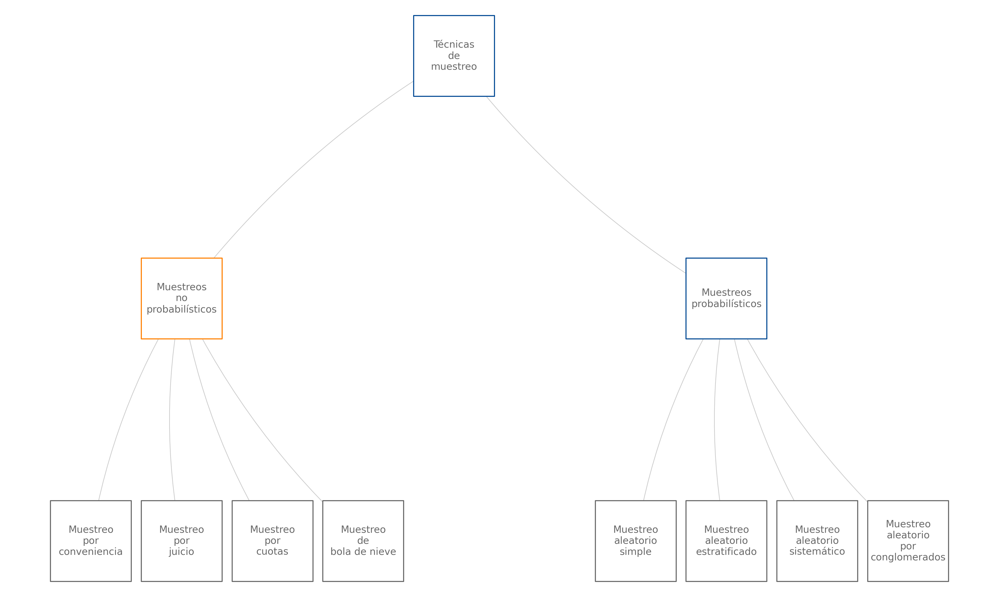

```{r setup, include=FALSE}
knitr::opts_chunk$set(echo = TRUE, comment = NA)

c1 ="#FF7F00"  # naranja - color primario 
c2 ="#034A94"  # azul oscuro - color secundario
c3 ="#0EB0C6"  # azul claro - color terciario
c4 ="#686868"  # gris - color texto

# <span style="color:#FF7F00"> **naranja**</span> 
# <span style="color:#034A94"> **azul oscuro**</span>
# <span style="color:#0EB0C6"> **azul claro**</span>  

```

```{r, warning=FALSE, message=FALSE, fig.align='center'}
#library("tm")
#library("SnowballC")
library("wordcloud2")
library("RColorBrewer")

palabras= c("Estadística", 
            "Análisis descriptivo","Inferencia estadística",
            "Validez", "Unidad de análisis", 
            "Variable aleatoria", 
            "Variable cualitativa", "Variable cuantitativa",
            "Variable discreta", "Variable continua", "Escala nominal",
            "Escala ordinal", "Escala de intervalo", "Escala de razón" ,
            "Población", "Muestra", "Parámetro", "Estimador", 
            "Muestreo", "Tipo de muestreo",
            "Muestreo probabilistico", "Muestreo no probabilistico",
            "Muestreo por conveniencia",
            "Muestreo por juicio",
            "Muestreo por cuotas",
            "Muestreo bola de nieve",
            "Muestreo aleatorio simple",
            "Muestreo aleatorio estratificado",
            "Muestreo aleatorio sistemático",
            "Muestreo aleatorio por conglomerados")

frecuencia = c(10, 8, 8, 
              7, 7, 7, 7, 7, 7, 
              5,5,  5, 5, 5, 5, 4, 4, 4, 4, 6, 
              6, 6,  5, 5, 5, 4, 5, 6, 5,6) 

nube1=rep(palabras, frecuencia)
t=data.frame(table(nube1))

dword=t[,1]
dfreq=t[,2]
set.seed(1234)
# wordcloud(words = dword, freq = dfreq, min.freq = 1,
#            max.words=200, random.order=FALSE, rot.per=0.35, 
#            colors=brewer.pal(8, "Dark2"))

#c("#F27F0C", "#F7AD19", "#053F5C", "#429EBD", "#034A94")
library(wordcloud2)
wordcloud2(data = t, 
           size = 0.5, 
           color=rep_len( c("#F27F0C", "#F7AD19", "#053F5C", "#429EBD", "#034A94"), 
                          nrow(demoFreq)),
           rotateRatio = 0)
```


</br></br>
<h2>Análisis descriptivo</h2>


La **estadística descriptiva** se especializa en la recopilación, organización, resumen y presentación de datos, con el propósito de facilitar su interpretación, análisis y modelamiento. Mediante herramientas y técnicas específicas, esta rama de la estadística se enfoca exclusivamente en describir y representar las características fundamentales de un conjunto de datos. Es importante destacar que la **estadística descriptiva no permite realizar inferencias ni generalizar conclusiones hacia una población más amplia**; su alcance se limita a analizar y comunicar de manera clara y efectiva los patrones y tendencias observados en los datos disponibles.

</br>


<div class="caja-ejemplo">
<h3>Ejemplo:</h3>
En este ejemplo se supone que una empresa de distribución tiene como objetivo analizar sus gastos logísticos mensuales para obtener una visión integral de sus costos operativos. La base de datos disponible comprende los costos mensuales de los últimos tres años, clasificados en cuatro categorías principales: transporte, almacenamiento, mantenimiento de inventarios y gestión administrativa.

---

**Etapa 1: Cálculo de estadísticas**

El primer paso en el análisis consiste en calcular **medidas descriptivas** que permitan comprender las características fundamentales de los gastos e identificar posibles errores e inconsistencias:

- **Medidas de tendencia central**: Se calculan valores como la media y la mediana para representar un resumen de los datos mediante un único valor representativo que refleja el centro de la distribución.  

- **Medidas de dispersión**: Se obtienen indicadores como la desviación estándar y el coeficiente de variación, los cuales proporcionan información sobre la variabilidad y consistencia de los costos.  

- **Medidas de posición**: Se calculan percentiles y cuartiles, que proporcionan información sobre cómo los datos se distribuyen a lo largo de su rango. 

Estas medidas proporcionan información para identitificar atípicos e inconsistencias. 

---

**Etapa 2: Visualización para identificación de errores y datos faltantes**

En esta etapa se elaboran **gráficos informativos** para facilitar la identificación de errores, datos faltantes y valores atípicos en la base de datos. Algunas de las herramientas visuales utilizadas incluyen:

- **Gráficos de cajas (boxplots)**: Permiten identificar rápidamente valores atípicos en cada categoría de gasto. Estos valores podrían ser indicativos de errores en el registro o reflejar eventos inusuales que deben analizarse.  

- **Gráficos especializados para datos faltantes**: Ayudan a comprender patrones de ausencia de información y detectar posibles sesgos en los datos faltantes. Esta etapa es crucial para entender las razones detrás de la falta de reportes de gastos y planificar su corrección.

Un análisis riguroso de los **valores atípicos** es esencial, ya que estos pueden sesgar las medidas descriptivas y dificultar una interpretación precisa. Se evalúa si deben corregirse, eliminarse o transformarse según su origen y relevancia.

---

**Etapa 3: Transformación e imputación de datos faltantes**

En caso de que los datos presenten distribuciones que dificulten el análisis, puede ser necesario aplicar **transformaciones** (e.g., normaliozación o de estandarización) para garantizar que las técnicas estadísticas utilizadas sean apropiadas. También se deben tomar decisiones respecto a los datos atípicos identificados, en algunos casos se les pueden considerar como datos faltantes. Posteriormente, se procede a la **imputación de datos faltantes** mediante métodos adecuados, como la imputación basada en la media, modelos de regresión o técnicas más avanzadas, como la imputación múltiple.

---

**Etapa 4: Resumen y visualización de los resultados**

Tras realizar la limpieza de datos, la identificación y tratamiento de valores atípicos, las transformaciones y la imputación de datos faltantes, se calculan los indicadores más relevantes para resumir la información de los gastos. Además, se construyen gráficos comparativos y de resumen que permiten una visualización clara de los resultados obtenidos, lo que facilita la interpretación y continuar con la etapa de modelamiento de manera confiable..

Las **herramientas de estadística descriptiva**, no solo facilitan una comprensión detallada y visual de los gastos logísticos de los tres años, sino que también constituyen la base para etapas posteriores de modelado e inferencia estadística. Estas etapas adicionales permitirían realizar predicciones y proyecciones más precisas, apoyando la toma de decisiones estratégicas para mejorar la eficiencia operativa de la empresa.
</div>


</br></br>
<h2>Inferencia estadística</h2>

La **estadística inferencial** se refiere a la aplicación de herramientas analíticas, como la *estimación puntual* y por *intervalos* de un parámetro poblacional, y las *pruebas de hipótesis*, que evalúan afirmaciones sobre dichos parámetros. Su propósito principal es permitir la generalización de conclusiones acerca de una población de estudio a partir de los datos obtenidos de una muestra aleatoria representativa de la población. 

Este proceso se fundamenta en conceptos de probabilidad, variable aleatoria, los cuales son esenciales para cuantificar la incertidumbre inherente a las estimaciones y conclusiones derivadas de la muestra, proporcionando niveles de confianza que respaldan la validez de los resultados.

<div class="caja-ejemplo">
<h3>Ejemplo:</h3>
<p>
Una empresa de manufactura desea analizar los costos  y evaluar si la implementación de un *nuevo proceso* de producción automatizado reduce significativamente **el costo promedio**  en comparación con el *proceso anterior*, que dependía mayormente de trabajo manual. Este nuevo proceso incluye la incorporación de maquinaria más eficiente y un rediseño en la disposición de las estaciones de trabajo para optimizar los tiempos de producción.

Debido a limitaciones de tiempo y recursos, la empresa realiza un experimento aleatorio para seleccionar *30 lotes* producidos utilizando el nuevo proceso. Se recopilan los *costos de producción asociados a estos lotes (muestra aleatoria)* y se comparan con los costos históricos registrados bajo el proceso tradicional.  

La inferencia estadística se utiliza para evaluar si la reducción observada en el costo promedio de la muestra es estadísticamente significativa y puede generalizarse al resto de la producción. Para ello, se plantea una **prueba de hipótesis**, en la que la hipótesis nula establece que *no hay diferencia entre los costos promedio* entre ambos procesos, mientras que la hipótesis alternativa sostiene que *el nuevo proceso reduce el costo promedio*.  

Si los resultados de la prueba de hipótesis demuestran que la diferencia es significativa, la empresa podría tomar decisiones fundamentadas para implementar el nuevo proceso de producción a gran escala, lo que contribuiría a una reducción de costos sostenida y a un aumento en la competitividad.  

</p>
</div>


Es importante aclarar que esta etapa es posterior a la aplicación de herramientas de la estadística descriptiva, limpieza de datos, análisis de atípicos e imputación de datos faltantes.


</br></br>
<h2>Validez</h2>

En el contexto estadístico, *validez* se refiere a la medida en que un instrumento, método o modelo mide lo que realmente pretende medir.

La *validez interna* evalúa si los resultados de un estudio reflejan con precisión la relación entre las variables dentro del mismo. Por ejemplo, en un experimento controlado, garantiza que los cambios observados en la variable dependiente se deban exclusivamente a la manipulación de la variable independiente y no a factores externos.

La *validez externa* se refiere a la capacidad de generalizar los resultados obtenidos a otras poblaciones, contextos o períodos. Por ejemplo, un modelo predictivo desarrollado para una región específica tiene validez externa si también es aplicable en otras regiones con características similares.

La *validez de constructo* mide si el instrumento o método realmente captura lo que pretende evaluar. Por ejemplo, un cuestionario diseñado para medir "satisfacción del cliente" debe incluir preguntas relevantes que aborden diferentes aspectos de la satisfacción.

Adicionalmente, la *validez estadística* evalúa si los métodos estadísticos utilizados son apropiados para el análisis de los datos y si las conclusiones derivadas de ellos son válidas. Por ejemplo, es necesario verificar si se cumplen los supuestos de un modelo de regresión lineal antes de interpretar los coeficientes.

La *validez* es crucial para garantizar que los datos, las conclusiones y las decisiones tomadas a partir de análisis estadísticos sean fiables y útiles. Sin validez, los resultados pueden ser engañosos, lo que podría conducir a decisiones incorrectas o mal fundamentadas.


<div class="caja-ejemplo">
<h3>Ejemplo:</h3>
<p>
Un estudio tiene como objetivo estimar el *ingreso promedio por vivienda de las familias en la ciudad de Cali*. Sin embargo, si el estudio incluye únicamente a familias cuyos predios pertenecen al estrato 1, no se puede concluir que el ingreso promedio calculado para este grupo representa el ingreso promedio de todas las familias de la ciudad.

Esto se debe a que la muestra seleccionada no es representativa de la población (ingreso de familias en Cali). Al considerar únicamente a un segmento socioeconómico específico, se excluyen de manera sistemática las familias de los estratos 2 al 6, lo que introduce un sesgo de selección. Este sesgo limita la capacidad de generalizar los resultados obtenidos en el estudio al conjunto completo de familias en la ciudad.  

Para obtener conclusiones válidas y generalizables, sería necesario diseñar un muestreo representativo que contemple a familias de todos los estratos socioeconómicos en proporciones adecuadas, reflejando la diversidad y composición de las familias de Cali.  

</p>
</div>


</br></br>
<h2>Asociación y causalidad</h2>

La **causalidad** implica que un cambio en la variable independiente (causa) produce un cambio en la variable dependiente (efecto). Es decir, existe una relación directa y verificable donde una variable influye sobre la otra. Se requiere una dirección clara de causa a efecto y se busca establecer que la relación observada no se debe al azar ni a factores externos.

Austin Bradford Hill planteó nueve criterios en 1965 para evaluar la causalidad en estudios epidemiológicos. Aunque en ciertas aplicaciones o resúmenes estos se sintetizan, aquí se presentan los nueve criterios originales:

- **Temporalidad**: La causa debe preceder al efecto. Este es el único criterio indispensable para establecer causalidad. Sin evidencia de que el supuesto factor causal ocurra antes del efecto, no se puede concluir que exista una relación causal.

-  **Fuerza de la asociación**:  Una relación estadísticamente fuerte entre la causa y el efecto aumenta la probabilidad de que la relación sea causal. Una mayor fuerza de asociación reduce la probabilidad de que la relación observada sea debida al azar o a factores de confusión.

-  **Consistencia**: La relación debe ser consistente en diferentes estudios, poblaciones, lugares y momentos. Si el efecto se observa repetidamente bajo diversas condiciones, es más probable que sea causal.

- **Especificidad**:  Una causa específica debe producir un efecto específico. Aunque este criterio no siempre se cumple (por ejemplo, en enfermedades multifactoriales), su presencia refuerza la evidencia de causalidad.

-  **Plausibilidad**:  Debe haber una explicación biológica o lógica que sustente la relación causal. Este criterio depende del conocimiento científico disponible en el momento.

- **Coherencia**:   La relación debe ser coherente con los conocimientos ya establecidos sobre la biología del fenómeno, la historia natural de la enfermedad o datos experimentales relacionados.

-  **Relación dosis-respuesta**:  A mayor exposición a la causa, mayor debe ser el efecto observado. Este criterio refuerza la causalidad, aunque su ausencia no necesariamente la descarta.

- **Prueba experimental**:  La relación debe ser comprobable mediante experimentos controlados, cuando sea posible. Los experimentos proporcionan evidencia directa de causalidad.

-  **Analogía**:  Si existen relaciones causales similares ya establecidas, esto refuerza la probabilidad de que la relación en estudio sea causal. Por ejemplo, si una sustancia química similar ya ha demostrado ser dañina, es plausible que otra de la misma clase también lo sea.

La **asociación** describe una relación estadística entre dos variables, donde un cambio en una variable está relacionado con un cambio en la otra, pero **no necesariamente implica causalidad**. Puede existir una asociación estadística entre dos variables sin que una cause directamente el cambio en la otra. En algunos casos, la asociación puede deberse a factores de confusión o variables intervinientes. Se evalúa mediante medidas estadísticas, como el coeficiente de correlación de Pearson.


<div class="caja-ejemplo">
<h3>Ejemplos:</h3>
<p> **Consumo de helado y casos de insolación**: En días calurosos, aumentan tanto el consumo de helado como los casos de insolación. Sin embargo, el calor e intensidad de rayos del sol (variable interviniente) es la causa subyacente, no el consumo de helado. Este ejemplo ilustra una **asociación espuria**, donde dos variables están correlacionadas debido a una tercera variable (el clima), sin que exista causalidad entre ellas. Este tipo de situaciones refuerza la importancia de identificar variables de confusión o intervinientes en los estudios estadísticos. A continuación, se analizan algunos criterios de causalidad que no se cumplen:
</p>

<p>
-  **Plausibilidad**: No hay una explicación biológica o lógica que indique que consumir helado cause insolación. Por el contrario, el calor es una causa plausible para ambos eventos. 

-  **Coherencia**: Los datos podrían ser coherentes con la asociación estadística, pero esto no respalda la causalidad directa, ya que el calor explica ambos fenómenos. 

-  **Relación dosis-respuesta**: No hay evidencia de que consumir más helado incremente el riesgo de insolación. Por lo tanto, este criterio no se cumple.

-  **Prueba experimental**: No existen experimentos que demuestren que consumir helado cause insolación.  

-  **Analogía**: No existen fenómenos similares que respalden que el consumo de un alimento como el helado cause insolación.    
</p>

<p> **Consumo de cigarrillos y el desarrollo de cáncer de pulmón**: Existe una fuerte asociación estadística entre el consumo de cigarrillos y el desarrollo de cáncer de pulmón.  La relación entre fumar y el cáncer de pulmón cumple con los criterios de causalidad de Bradford Hill, lo que permite argumentar que fumar **causa cáncer de pulmón**. A continuación, revisamos el cumplimiento de los criterios para evaluar causalidad:   </p>

<p>
- **Temporalidad**: Los estudios longitudinales han demostrado que el riesgo aumenta después de años de exposición al tabaco.  

- **Fuerza de la asociación**: La probabilidad de desarrollar cáncer de pulmón en fumadores es significativamente mayor que en no fumadores (riesgo relativo alto).  

-  **Consistencia**: La relación se ha observado en múltiples estudios, poblaciones y contextos diferentes. 

- **Especificidad**: Aunque fumar también está asociado con otras enfermedades (como enfisema), el vínculo con el cáncer de pulmón es particularmente fuerte. 

- **Plausibilidad**: Existe un mecanismo biológico bien establecido, las sustancias químicas en el tabaco dañan las células pulmonares y provocan mutaciones.  

- **Coherencia**: Los hallazgos son consistentes con el conocimiento médico sobre los efectos del tabaco en los pulmones.  

- **Relación dosis-respuesta**: Cuanto más se fuma (en tiempo y cantidad), mayor es el riesgo de desarrollar cáncer de pulmón. 

- **Prueba experimental**: Estudios en animales han demostrado que la exposición a las sustancias químicas del tabaco puede inducir cáncer.  

- **Analogía**: Otras sustancias carcinógenas (como el asbesto) también están asociadas con el desarrollo de cáncer de pulmón, lo que refuerza la plausibilidad.
</p>

</div>


<div class="caja-actividad">
<h3>Actividad:</h3>
 <p>
 >
En una ciudad, se observa que las ventas de sombrillas aumentan en los mismos períodos en los que también aumentan los accidentes de tráfico. ¿Es causal la relación entre las ventas de sombrillas y los accidentes de tráfico? ¿Qué otros factores podrían explicar esta asociación?
>
 </p>
</div>


</br></br>
<h2>Tipos de muestreo</h2>

Para seleccionar una muestra, podemos utilizar **muestreos probabilísticos** o **no probabilísticos**.  

</br>


<h3>Muestreo no probabilístico</h3>

Es un método de selección de muestras en el que **no se utiliza un proceso aleatorio** para elegir los elementos de la población. En este tipo de muestreo, no todos los elementos tienen la misma probabilidad conocida y no nula de ser seleccionados, lo que significa que la muestra puede **no ser representativa** de la población. Como consecuencia, **no es posible realizar inferencias estadísticas válidas** sobre la población, ya que el proceso de selección introduce sesgos.  Los resultados no se pueden generalizar de manera probabilística más allá de los casos observados. Entre estos tipos de muestreo se encuentran el muestreo por cuotas y el muestreo bola de nieve.

</br>

<h4>Muestreo por cuotas</h4>


El muestreo por cuotas es un método en el que se busca que la muestra reproduzca, de la manera más precisa posible, las características conocidas de las unidades muestrales que determinan una población. Estas características se distribuyen en fracciones denominadas cuotas, que representan proporciones específicas de las unidades totales.

Este tipo de muestreo es especialmente útil cuando se dispone de información previa sobre ciertos atributos de las unidades muestrales, como el sexo, la edad u otros criterios relevantes para el estudio.

En una investigación, se puede establecer una muestra que respete las proporciones de hombres y mujeres presentes en un grupo que es objetivo de estudio, así como la distribución de grupos etarios. En estudios políticos, es común incluir cuotas basadas en los resultados de elecciones anteriores para tener una representación adecuada.

</br>

<h4>Muestreo bola de nieve</h4>

El muestreo por bola de nieve es una técnica utilizada para estudiar grupos difíciles de acceder o poco representadas, en las cuales no se dispone de un marco muestral formal. Es particularmente adecuado en investigaciones que involucran a grupos como consumidores de drogas ilegales, personas con enfermedades raras o inmigrantes en situación laboral activa.

</br></br>

<h3>Muestreo probabilístico</h3>

  Es un método en el que **cada elemento de la población tiene una probabilidad conocida y no nula** de ser seleccionado en la muestra. Esto garantiza que la muestra sea **representativa** de la población, permitiendo aplicar técnicas estadísticas para hacer **inferencias válidas** sobre los parámetros poblacionales. A continuación, presentamos algunos de los tipos puros de muestreo probabilístico.  
</br>


<h4>Muestreo aleatorio simple</h4>

El muestreo aleatorio simple es un método de selección en el que **todas las unidades muestrales** que componen la población tienen **la misma probabilidad de ser elegidas** para formar parte de la muestra.  

Para implementarlo, es necesario disponer de un **listado completo de los elementos que determinan la población**, conocido como **marco muestral**. Este marco debe cumplir dos condiciones fundamentales:  La **exhaustividad**, que implica incluir todas  las unidades muestrales que determinan la población y la ausencia de **duplicaciones**, es decir,  cada unidad muestral debe aparecer solo una vez.  


El *procedimiento* consiste en asignar un **número único** a cada elemento del marco muestral y, posteriormente, seleccionar **al azar** una cantidad \(n\) de elementos, que corresponde al **tamaño de la muestra**. La **aleatoriedad** de la selección se garantiza mediante tablas de números aleatorios o  generadores electrónicos de números aleatorios.  

Una **ventaja importante** del muestreo aleatorio simple es que **es que no requiere conocer de antemano ninguna característica de la población**.  


Entre las **limitaciones** de este método se encuentra la **dependencia del marco muestral**, ya que es necesario contar con un listado completo y actualizado de las unidades que determinan la población, lo cual no siempre es viable en estudios grandes o complejos. Además, los **costos de localización** pueden ser elevados, ya que si las unidades seleccionadas están geográficamente dispersas, acceder a ellas puede resultar **costoso y poco eficiente**.

Por estas razones, el muestreo aleatorio simple suele combinarse con **otras técnicas de muestreo** que permiten abordar estas dificultades de manera más eficiente.

</br>

<h4>Muestreo aleatorio sistemático</h4>

El muestreo aleatorio sistemático es un procedimiento alternativo al muestreo aleatorio simple que **simplifica la selección** de la muestra. En este método, se elige de manera aleatoria un elemento inicial del marco muestral, y a partir de él se seleccionan los elementos siguientes a **intervalos regulares predefinidos**.  

El *procedimiento* consta de tres pasos, como describimos a continuación.

- **Cálculo del intervalo (\(r\))**:  
   Se divide el **tamaño de la población** (\(N\)) entre el **tamaño de la muestra** (\(n\)):  
   \[
   r = \frac{N}{n}.
   \]

- **Selección del elemento inicial**:  
   Se elige **aleatoriamente** un número entre \(1\) y \(r\), denominado \(a\). Este número corresponde al **primer elemento** de la muestra.  

- **Selección de los elementos siguientes**:  
   A partir del elemento inicial \(a\), se seleccionan los elementos ubicados a intervalos regulares \(r\):  
   \[
   a, a + r, a + 2r, \dots, a + (n-1)r.
   \]  

 
Entre las **ventajas** del método se encuentran las siguientes:

- **Facilidad de implementación**: Evita el uso repetido de números aleatorios, lo que simplifica el proceso de selección.  

- **Representación equitativa**: Siempre que el marco muestral no presente una tendencia específica (como un orden cronológico), el muestreo sistemático garantiza que todos los elementos estén **equitativamente representados**. 

- **Eficiencia**: Reduce la probabilidad de que los elementos seleccionados se concentren en una sola sección de la lista.  

Respecto a las **limitaciones**, este método no es adecuado cuando la población presenta **comportamientos cíclicos**, ya que podría introducir **sesgos**.  

<div class="caja-ejemplo">
<h3>Ejemplos:</h3>
<p>
- Si se seleccionan intervalos de 7 días en un estudio semanal, los días elegidos siempre serán los mismos, lo que ignoraría las diferencias entre días laborales y fines de semana. 

- En un hospital, seleccionar días específicos podría omitir variaciones importantes en los ingresos de pacientes que dependen del día de la semana.  

Aunque el muestreo sistemático generalmente requiere un marco muestral completo, puede adaptarse a situaciones donde este no esté disponible, como en poblaciones en movimiento. Ejemplos comunes incluyen:  

- Encuestas en colas o filas, donde se selecciona a una persona cada \(r\) posiciones, asegurando la inclusión equitativa de individuos a lo largo de la fila, tal como el hecho de encuestar a cada décima persona en una fila para ingresar al cine.  

- Encuestas de boca de urna, donde se seleccionan votantes a intervalos regulares conforme salen de los centros de votación, logrando una muestra representativa de quienes votaron en diferentes horarios (mañana, tarde, cierre de jornada).
</p>
</div>

 

</br>

<h4>Muestreo estratificado</h4>

El muestreo estratificado es un procedimiento en el que la población se divide en **subconjuntos de unidades homogéneas**, denominados **estratos**, en función de alguna característica conocida **a priori**. Esta característica, utilizada como base para la división, se conoce como **criterio de estratificación**.


El *procedimiento* consta de los siguientes pasos:

- **Definición de los estratos**:  
   Las unidades que determinan la población se dividen en **estratos homogéneos internamente**, es decir, subconjuntos en los cuales los individuos comparten características similares respecto a la variable de interés. Al mismo tiempo, se espera que los estratos sean **heterogéneos entre sí**, es decir, diferentes entre ellos en función del criterio de estratificación.

- **Selección de la muestra**:  
   Se extraen muestras de **cada estrato** por separado, garantizando que todos los subconjuntos estén representados.
   
El muestreo estratificado es especialmente útil cuando se busca **obtener estimaciones más exactas** de los parámetros de la **población** y **mejorar la precisión** de las estimaciones para **cada estrato individual**.  

La ganancia en la precisión es mayor si los estratos son  **homogéneos internamente** 
(los elementos dentro de cada estrato son similares) y   **heterogéneos entre sí** (los estratos son claramente diferentes entre ellos) respecto a la variable de interés.


 <div class="caja-ejemplo">
<h3>Ejemplo:</h3>
<p>
Un ejemplo práctico, supongamos que se desea **estimar el consumo de bebidas alcohólicas** de personas jóvenes. Para ello, se utiliza el **nivel socioeconómico** como **criterio de estratificación**, ya que esta variable podría influir en los patrones de consumo.  

- El total de unidades muestrales que determinan la población se divide en **tres estratos homogéneos**: 

   - Nivel socioeconómico **alto**  
   
   - Nivel socioeconómico **medio**  
   
   - Nivel socioeconómico **bajo**  
   
- En este caso, el número de estratos será \( k = 3 \). Se selecciona una muestra de jóvenes de **cada estrato**, asegurando la representatividad de los diferentes niveles socioeconómicos.
</p>
</div>


La **precisión** de la estratificación dependerá del grado de detalle con que pueda medirse el nivel socioeconómico. A medida que se busca una mayor precisión, será necesario contar con **más información previa** sobre la población.


En algunas ocasiones, los estratos están **predefinidos de manera inmediata**, sin necesidad de aplicar criterios complejos. 

<div class="caja-ejemplo">
<h3>Ejemplo:</h3>
<p>
Si se desea **estimar el salario medio** de los empleados de una universidad, una **estratificación natural** puede realizarse en función del **tipo de cargo**:

- **Personal de aseo**  

- **Técnicos encargados de la infraestructura tecnológica**  

- **Profesores** (con distintos niveles salariales)  

- **Administrativos**  

En este caso, la estratificación por tipo de cargo garantiza que la muestra sea representativa de todos los grupos laborales de la universidad.
</p>
</div>

Otro tipo de método probabilístico es el muestreo por conglomerados. Algunos tipos adicionales de muestreo se presentan en la **Figura 1.30**.

<center>
```{r, echo=FALSE, out.width="100%", fig.align = "center"}

```

**Figura 1.30** Algunos tipos de muestreo.

</center>

<br/><br/>

<div class="caja-reto">
<h3>Reto:</h3>
>¿A qué tipo de muestreo corresponde el uso de **redes sociales** para la selección de muestras por internet?  
</div>

