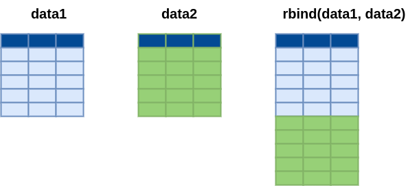
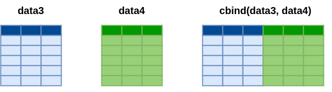

```{r setup, include=FALSE}
knitr::opts_chunk$set(echo = TRUE, message = FALSE, warning = FALSE, comment = NA)

# install.packages('gtools')
# install.packages("TeachingSampling")

#load library
library(gtools)
library(TeachingSampling)
library(readr)
library(paqueteMETODOS)
library(tidyverse)
library(VIM)

c1="#FF7F00"
c2="#034A94"
c3="#0EB0C6"
c4="#686868"

library(paqueteMETODOS)
data("vivienda_faltantes")

data("rotacionNA")      # carga data set rotacionNA del paqueteMETODOS
set.seed(123)           # fija semilla para numeros aleatorios
rotacionNA<-sample_n(rotacionNA, 1000) # toma una muestra de tamaño 1000 de la data
datosNA <- rotacionNA  # copia el contenido a datosNA


```


</br></br>
<h2>Ordenar</h2>


```{r, echo=FALSE, out.width="60%", fig.align = "center"}

```

**Figura 1.32** Etapa Ordenar en el desarrollo de un proyecto de ciencia de datos. 

Una de las tareas más importantes al llevar a cabo un proyecto de ciencia de datos es la **preparación de los datos** (también conocida como **limpieza de datos** o *data cleaning*), la cual resulta fundamental para garantizar un modelamiento adecuado. En esta sección, todas estas tareas forman parte de la etapa **Ordenar**, que comprende las siguientes actividades, las cuales inician después de importar una base de datos (ver **Figura 1.32**) conformada por una matriz con \(n\) filas (registros) y \(m\) columnas (variables):

1. **Cambio de formato de variables**: Transformación entre formatos corto y largo para ajustarse a las necesidades específicas del análisis. 

    - En el **formato corto**, cada unidad de análisis (como un individuo, sujeto o entidad) se representa en una única fila, y las diferentes variables o mediciones asociadas a esa unidad se registran en columnas separadas.  
  
    - En el **formato largo**, cada medición o registro se representa como una fila única, con variables adicionales que indican las características de esa medición (como tiempo, condición o categoría).

2. **Adición de registros**: Incremento del número de filas mediante la combinación de registros provenientes de dos bases de datos.  

3. **Incorporación de nuevas variables**: Adición de columnas provenientes de otras bases de datos.  

4. **Eliminación de registros duplicados**: Identificación y eliminación de filas repetidas dentro de la base de datos.  

5. **Gestión de datos faltantes**: En el software **R**, los datos faltantes se representan con `NA`, y su reemplazo se realiza mediante técnicas adecuadas dependiendo del tipo de dato faltante.  

6. **Detección de datos extraños o atípicos**: Identificación de valores que no se ajustan a las tendencias generales de los datos. 


</br>

A continuación, se presentan algunos de estos aspectos clave, los cuales son esenciales para preparar y acondicionar la base de datos de interés antes de iniciar el análisis de datos. 

---

</br></br>
<h3>Adición de registros</h3>

Esta etapa implica combinar datos provenientes de múltiples fuentes en una única estructura, lo que permite realizar un análisis más completo y holístico. La fusión de datos se utiliza comúnmente cuando se trabaja con conjuntos de datos que comparten una o más variables en común, como identificadores únicos, fechas o categorías. Este proceso es esencial para consolidar información fragmentada y obtener una visión integral del fenómeno estudiado.


<br/>
<div class="caja-ejemplo">
<h3>Ejemplo:</h3>
<p>

En **R**, uno de los paquetes más utilizados para realizar la fusión de datos es el paquete `dplyr`, que forma parte del grupo de paquetes agrupados en `tidyverse`. Este paquete ofrece una amplia variedad de funciones que facilitan la manipulación y combinación de conjuntos de datos de manera eficiente y legible.


```{r, echo=FALSE, out.width="70%", fig.align = "center"}

```

Para ilustrar la **adición de registros**, en este ejemplo se utilizan dos muestras, `data1` y `data2`, extraídas de la base `rotacion`, que forma parte del paquete `paqueteMETODOS`. Estas muestras serán combinadas para mostrar cómo se pueden agregar registros provenientes de distintas fuentes en una única estructura de datos.


`data1` contiene información de cuatro variables correspondientes a 6 personas. Por otro lado, `data2` incluye las mismas  variables (columnas 2 a 5) pero correspondientes a otras 6 personas. El objetivo es combinar ambos conjuntos de datos, logrando una única base con un total de 12 registros. 

<pre>
# Cargar la librería
library(paqueteMETODOS)

# Cargar la base de datos
data("rotacion")

# Creación de vector con números del 1 al 1470
id = 1:1470

# Agregando id a la base de datos
data= data.frame(id, rotacion)

# Selección de filas y columnas
data1 = data[1:6,c(2,3,4,5)]

# Selección de filas y columnas
data2 = data[7:12,c(2,3,4,5)]
</pre>
</br>

```{r,eval=FALSE,echo=FALSE}
library(paqueteMETODOS)
data("rotacion")
id = 1:1470
data= data.frame(id, rotacion)

data1 = data[1:6,c(2,3,4,5)]
data1

data2 = data[7:12,c(2,3,4,5)]
data2
```


Para combinar estas dos bases de datos, se emplea la función `rbind()` del paquete `dplyr`. Esta función permite apilar filas de conjuntos de datos con la misma estructura, asegurando que las columnas coincidan en nombre y tipo. Al aplicar `rbind()`, los registros de ambas bases (`data1` y `data2`) se agrupan en una única base consolidada que incluye los 12 registros originales.

<pre>
library(dplyr)
data20 = rbind(data1,data2)
data20
</pre>

```{r,eval=FALSE,echo=FALSE}
library(dplyr)
data20 = rbind(data1,data2)
data20
```
</p>
</div>


---

<br/><br/>
<h3>Incorporación de nuevas variables</h3>

En la adición de variables, existen dos escenarios principales: El primero corresponde a la unión de columnas contenidas en diferentes bases de datos que están ordenadas de manera idéntica. En este caso, las nuevas columnas se añaden directamente, asegurando que los registros coincidan en la misma posición. Es crucial verificar que ambas bases compartan exactamente el mismo orden para evitar inconsistencias, ya que no se utiliza un identificador único.

El segundo caso involucra bases de datos que contienen una llave o identificador común que permite indexar sus registros. Esta llave actúa como un vínculo entre las bases, asegurando que las columnas añadidas se alineen correctamente con el registro correspondiente en ambas bases. Este enfoque es más robusto y se adapta mejor a bases de datos de mayor tamaño o que carecen de un orden uniforme.

Ambos métodos enriquecen las bases de datos al integrar información adicional, facilitando análisis más detallados y precisos, pero es fundamental seleccionar el método adecuado según las características de los datos y el contexto del análisis.

<br/>

Caso 1
```{r, echo=FALSE, out.width="70%", fig.align = "center"}

```

Caso 2
```{r, echo=FALSE, out.width="70%", fig.align = "center"}
knitr::include_graphics("img/mezcla35.png")
```


<br/><br/>
<div class="caja-ejemplo">
<h3>Ejemplo:</h3>
<p>

Para ilustrar la incorporación de nuevas variables, se utiliza una muestra de la base de datos `rotacion` contenida en el paquete `paqueteMET`. A partir de esta base, se conforman tres subconjuntos de datos denominados `data3`, `data4` y `data5`.

El conjunto de datos `data3` está compuesto por 10 registros y tres variables, incluyendo `id` (columna 1), que se utiliza en este caso para verificar que los registros están ordenados de manera coherente. 

El conjunto de datos `data4` también incluye el identificador `id` junto con otras dos variables adicionales que complementan la información proporcionada en `data3`. Esta base amplía la información disponible para el análisis.

Finalmente, `data5` contiene las mismas variables que `data4` pero con algunos registros en común (específicamente, las filas 3 al 10). Este conjunto permite demostrar cómo combinar bases de datos que comparten tanto variables como registros.

A continuación se presentan los códigos que generan las bases de datos.

<pre>
library(paqueteMETODOS)
data("rotacion")
id = 1:1470
data= data.frame(id, rotacion)
data3 = data[1:10,c(1,2,3)]
data4 = data[1:10,c(1,4,5)]
data5 = data[3:12,c(1,4,5)]
</pre>


```{r,eval=FALSE,echo=FALSE}
library(paqueteMETODOS)
data("rotacion")
id = 1:1470
data= data.frame(id, rotacion)
data3 = data[1:10,c(1,2,3)]
data4 = data[1:10,c(1,4,5)]
data5 = data[3:12,c(1,4,5)]
```


`cbind()` es una función utilizada para combinar dos o mas conjuntos por columnas, agregando un conjunto de columnas. En este ejemplo pega dos datas, en este caso `data3`, `data4` las  que presentan el mismo orden de registros.

La función `cbind()` se utiliza para combinar dos o más conjuntos de datos por columnas, agregando un conjunto de columnas a otro, siempre que ambos conjuntos compartan el mismo número y orden de registros. En este ejemplo, se utiliza `cbind()` para unir `data3` y `data4`, asegurando que los registros en ambas bases de datos estén alineados correctamente.

El uso de `cbind()` es especialmente adecuado en situaciones donde las bases de datos comparten un identificador o una estructura de registros consistente, pero contienen variables complementarias. Esto permite enriquecer la base de datos original con nueva información sin perder la coherencia en la alineación de los datos.

<pre>
cbind(data3, data4[,2:3])
</pre>


```{r,eval=FALSE,echo=FALSE}
cbind(data3, data4[,2:3])
```


La función `merge()` se utiliza para combinar conjuntos de datos utilizando columnas clave específicas, lo que permite unir bases de datos incluso cuando tienen un número diferente de registros. Este método es especialmente útil para incorporar nuevas variables a un conjunto de datos base, asegurando que los registros coincidan a través de una llave común.

En este ejemplo, se emplea `merge()` para combinar `data3` con `data5`, utilizando la columna `id` como clave. Esto asegura que las nuevas variables de `data5` se añadan correctamente a los registros correspondientes en `data3`, respetando la relación definida por la llave compartida.

<pre>
merge(data3, data5, by = "id", all = TRUE)
</pre>


```{r,eval=FALSE,echo=FALSE}
merge(data3, data5, by = "id", all = TRUE)
```

</p>
</div>


<br/><br/>
<div class="caja-nota">
<h3>Nota:</h3>
<p>

>La función `cbind()` permite combinar dos o más bases de datos (en este caso, `data3` y `data4`) que tienen el mismo número de filas y corresponden a las mismas unidades muestrales (en este ejemplo, personas). Para evitar que la variable `id` aparezca duplicada en la nueva base de datos, se elimina la columna `id` de `data4`, dejando únicamente las columnas 2 y 3, lo cual se realiza mediante el comando `data4[, 2:3]`. Esto garantiza que la base resultante no tenga variables repetidas.

>Por otro lado, la función `merge()` permite unir bases de datos utilizando un índice único que identifique cada registro (en este caso, `id`), sin necesidad de que los registros de las bases a combinar se encuentren ordenados previamente. En este ejemplo, se utilizan las bases `data3` y `data5`. La base `data3` contiene registros de personas con `id` del 1 al 12, mientras que `data5` incluye registros correspondientes a las personas con `id` del 3 al 14. Por este motivo, `data3` se toma como base, y a partir de ella se agregan los registros de `data5` que coinciden al comparar sus `id`. Como resultado, los registros de las personas con `id` 1 y 2 permanecen vacíos (`NA`) en las columnas correspondientes a `data5`.

</p>
</div>
    

<br/><br/>
<div class="caja-actividad">
<h3>Actividad:</h3>
>
<p>
Desde el paquete `paqueteMETODOS`, importe las siguientes bases de datos relacionadas con los participantes de una carrera:  
<br/>
`CarreraLu22_c1F` - Mujeres, categoría juvenil        <br/>
`CarreraLu22_c1M` - Hombres, categoría juvenil        <br/>
`CarreraLu22_c2F` - Mujeres, categoría abierta        <br/>
`CarreraLu22_c2M` - Hombres, categoría abierta        <br/>
`CarreraLu22_c3F` - Mujeres, categoría veteranos A    <br/>
`CarreraLu22_c3M` - Hombres, categoría veteranos A    <br/>
`CarreraLu22_c4F` - Mujeres, categoría veteranos B    <br/>
`CarreraLu22_c4M` - Hombres, categoría veteranos B    <br/>
`CarreraLu22_c5F` - Mujeres, categoría veteranos C    <br/>
`CarreraLu22_c5M` - Hombres, categoría veteranos C    <br/>
`CarreraLu22F` - Mujeres                              <br/>
`CarreraLu22M` - Hombres                              <br/>
A partir de esta información, reconstruya la base de datos original `CarreraLuz22` disponible en el paquete `paqueteMETODOS`.
<br/>
<pre>
library(paqueteMETODOS)
data("CarreraLuz22")  # contiene todos los datos
</pre>
>
</p>
</div>

---

</br></br>
<h3>Gestión de datos faltantes</h3>


Un **dato faltante** se refiere a la ausencia de un valor en un conjunto de datos donde se esperaba que estuviera presente. Este fenómeno puede originarse por diversas razones, como errores durante la recopilación de información, datos no registrados o falta de respuesta en encuestas. Los datos faltantes representan un desafío significativo en el análisis, ya que pueden comprometer la **validez**, **precisión** y **representatividad** de los resultados obtenidos.


</br></br>
<h4>Tipos  de datos faltantes</h4>

Según Rubin (1976), los datos faltantes se clasifican en tres categorías: **Datos Faltantes Completamente al Azar (MCAR - Missing Completely At Random)**, **Datos Faltantes al Azar (MAR - Missing At Random)** y **Datos Faltantes No al Azar (MNAR - Missing Not At Random)**. En la **Tabla 1.14** se comparan los distintos tipos de datos faltantes.


</br></br>
1. Datos Faltantes Completamente al Azar (MCAR - Missing Completely At Random)

La ausencia de datos MCAR se refiere a situaciones en las que la falta de información no está relacionada ni con los valores observados ni con los valores faltantes. Este tipo de datos faltantes no introduce sesgos en los análisis estadísticos, lo que garantiza que las estimaciones obtenidas sean válidas y representativas de la población. Sin embargo, la eliminación de casos con datos faltantes puede reducir la potencia estadística, entendida como la capacidad de una prueba estadística para detectar un efecto o una diferencia cuando realmente existe en la población. Por lo tanto, aunque los datos MCAR sean ideales desde el punto de vista metodológico, el manejo de estos requiere un balance cuidadoso para preservar la representatividad y la capacidad de los análisis realizados.


</br></br>
<div class="caja-ejemplo">
<h3>Ejemplo:</h3>
<p>
- Una encuesta pierde algunas respuestas debido a un **fallo técnico aleatorio** en el sistema de registro. 

- Un archivo de datos se corrompe parcialmente por un **error de almacenamiento**. 

- En un estudio experimental, un animal se pierde debido a un **accidente** no relacionado con las características del experimento.
</p>
</div>


</br></br>
2. Datos Faltantes al Azar (MAR - Missing At Random)


La ausencia de datos MAR ocurre cuando la probabilidad de que un dato esté ausente depende de los valores observados en otras variables del conjunto de datos, pero no está relacionada directamente con los valores faltantes en sí mismos. Este tipo de ausencia de datos puede manejarse de manera efectiva utilizando técnicas adecuadas de modelado, ya que no introduce sesgos significativos en los análisis si se aborda correctamente. La adecuada gestión de los datos MAR permite preservar la validez de las inferencias y conclusiones estadísticas, siempre que las estrategias de imputación o modelado consideren las dependencias existentes con las variables observadas.


</br></br>
<div class="caja-ejemplo">
<h3>Ejemplo:</h3>
<p>

- En un estudio sobre el uso de métodos anticonceptivos, es más probable que las mujeres **afiliadas a una religión** que desalienta su uso no respondan preguntas relacionadas. Sin embargo, esta ausencia de datos no está directamente vinculada al método anticonceptivo específico, sino a una característica observada: su afiliación religiosa.


- En un censo poblacional, las familias con un **mayor número de integrantes** tienden a omitir ciertas preguntas debido a la complejidad de completar múltiples formularios. No obstante, esta omisión no está directamente relacionada con las respuestas faltantes específicas.


- En un estudio sobre el peso de niños en edad escolar, los datos faltantes pueden deberse a la **ausencia de los padres en las citas** programadas para las mediciones. Esta falta de información no está vinculada directamente al peso de los niños, sino a factores como la disponibilidad de los padres.
</p>
</div>


</br></br>
3. Datos Faltantes No al Azar (MNAR - Missing Not At Random)

La ausencia de datos MNAR ocurre cuando los valores faltantes están relacionados directamente con los mismos valores que faltan o con la variable que los contiene. Este tipo de datos faltantes puede introducir **sesgos significativos** en el análisis, ya que la probabilidad de que un valor esté ausente depende del valor que falta.

El tratamiento de datos MNAR es especialmente desafiante y requiere supuestos adicionales o el uso de modelos especializados que consideren el mecanismo que genera los datos faltantes. Técnicas como modelos de selección, modelos de sesgo de no respuesta o enfoques bayesianos pueden ser necesarios para abordar este problema de manera adecuada.


</br></br>
<div class="caja-ejemplo">
<h3>Ejemplo:</h3>
<p>
- En una encuesta de ingresos, las personas con **altos salarios** suelen omitir las preguntas relacionadas con su ingreso, posiblemente por motivos de privacidad.

- En un estudio sobre consumo de alcohol, los individuos con un **alto consumo** evitan responder preguntas sobre la cantidad que consumen, probablemente debido al estigma asociado. 

- En un cuestionario de salud mental, las personas que presentan **altos niveles de estrés** no completan la sección correspondiente debido a su estado emocional, lo que genera un sesgo en los datos recopilados.
</p>
</div>


**Tabla 1.14**: Resumen de los tipos de datos faltantes  

| **Tipo**   | **Dependencia**                                                | **Impacto**                          |  <span style="color:#C75000">**Ejemplos**</span>                                                                                                    |
|------------|----------------------------------------------------------------|--------------------------------------|---------------------------------------------------------------------------------------------------------------|
| **MCAR**   | No depende de valores observados ni faltantes                  | No introduce sesgo                   | - Fallo técnico aleatorio. <br> - Error de almacenamiento. <br> - Accidente con un sujeto experimental.       |
| **MAR**    | Depende de valores observados en otras variables, no de los faltantes             | Sesgo bajo si se trata adecuadamente | - Religión desalienta métodos anticonceptivos. <br> - Familias numerosas omiten preguntas en censos.          |
| **MNAR**   | Depende de los valores faltantes o de las variables en sí mismas | Introduce sesgos significativos      | - Altos ingresos no reportados en encuestas. <br> - Alto consumo de alcohol no declarado. <br> - Estrés elevado evita respuestas. |


Identificar el **tipo de datos faltantes** es esencial para seleccionar la estrategia adecuada de tratamiento. Los datos **MCAR** son los más fáciles de manejar, mientras que los **MNAR** presentan desafíos significativos debido a los sesgos introducidos por su dependencia directa de los valores faltantes.

A continuación, se presentan las principales técnicas organizadas en categorías.


</br></br>
<h4>Técnicas de imputación  de datos faltantes</h4>


</br></br>
1. Eliminación de datos faltantes

Estas técnicas consisten en excluir observaciones o variables con datos faltantes, y las estrategias más comunes son la **eliminación completa**y la **eliminación parcial**.

En la **eliminación completa**, se eliminan todas las observaciones que contienen al menos un dato faltante en las variables de interés. Esta estrategia es fácil de implementar y no introduce sesgos si los datos faltantes son **MCAR**. Sin embargo, presenta limitaciones importantes, como la reducción significativa del tamaño de la muestra y el riesgo de sesgo en los resultados cuando los datos faltantes no cumplen la condición de **MCAR**.

Por otro lado, la **eliminación parcial** permite utilizar todas las observaciones disponibles para cada análisis específico, ignorando los datos faltantes únicamente en ese análisis particular. Este enfoque tiene la ventaja de aprovechar más datos que la eliminación completa, lo que mantiene un tamaño de muestra más grande para cada análisis. No obstante, también presenta desventajas, como la dificultad para interpretar los resultados cuando se realizan múltiples análisis, y no es adecuada si existe un alto nivel de dependencia entre las variables con datos faltantes.


</br></br>
<div class="caja-ejemplo">
<h3>Ejemplo:</h3>
<p>
En este ejemplo se analizan los datos faltantes de una muestra aleatoria de tamaño \(n = 1,000\) de la base de datos `rotacionNA`. Esta base de datos pertenece al paquete `paqueteMETODOS`. La muestra se genera con la semilla 123 (`set.seed(123)`) y  se puede obtener utilizando el siguiente código:


<pre>
library(paqueteMETODOS) # carga el paqueteMETODOS
data("rotacionNA")      # carga el dataset rotacionNA
set.seed(123)           # fija semilla para reproducibilidad
rotacionNA <- sample_n(rotacionNA, 1000) # selecciona una muestra de tamaño 1000
datosNA <- rotacionNA   # copia el contenido a datosNA
</pre>

```{r, eval=FALSE,echo=FALSE}
library(paqueteMETODOS) # carga el paqueteMETODOS
data("rotacionNA")      # carga el dataset rotacionNA
set.seed(123)           # fija semilla para reproducibilidad
rotacionNA <- sample_n(rotacionNA, 1000) # selecciona una muestra de tamaño 1000
datosNA <- rotacionNA   # copia el contenido a datosNA
```

Con la función `str()` se obtiene una visualización general de la estructura de la base de datos (ver **Figura 1.33**). Esto incluye información sobre el tamaño (número de filas y columnas: 1,000 x 25), las variables que la conforman, los tipos de datos asociados a cada variable (por ejemplo, numérico, carácter, factor), y una muestra de los primeros valores de cada variable.


<pre>
str(datosNA) 
</pre>

```{r, eval=FALSE,echo=FALSE}
str(datosNA)            # Explora la estructura del objeto datosNA
```


<pre>
spc_tbl_ [1,000 × 25] (S3: spec_tbl_df/tbl_df/tbl/data.frame)
 $ id                         : num [1:1000] 415 463 179 526 195 ...
 $ Rotación                   : chr [1:1000] "Si" "No" "No" "Si" ...
 $ Edad                       : num [1:1000] 24 34 46 24 45 39 30 46 34 34 ...
 $ Viaje de Negocios          : chr [1:1000] "Raramente" "Raramente" "Raramente" "Raramente" ...
 $ Departamento               : chr [1:1000] "Ventas" "Ventas" "Ventas" "Ventas" ...
 $ Distancia_Casa             : num [1:1000] 1 21 1 3 2 13 7 2 2 10 ...
 $ Educación                  : num [1:1000] 1 4 2 2 2 4 3 2 4 3 ...
 $ Campo_Educación            : chr [1:1000] "Tecnicos" "Ciencias" "Mercadeo" "Ciencias" ...
 $ Satisfacción_Ambiental     : num [1:1000] 1 4 2 1 1 3 2 4 4 4 ...
 $ Genero                     : chr [1:1000] "F" "M" "F" "F" ...
 $ Cargo                      : chr [1:1000] "Representante_Ventas" "Ejecutivo_Ventas" "Ejecutivo_Ventas" "Ejecutivo_Ventas" ...
 $ Satisfación_Laboral        : num [1:1000] 2 4 1 3 4 2 2 4 4 3 ...
 $ Estado_Civil               : chr [1:1000] "Soltero" "Soltero" "Divorciado" "Soltero" ...
 $ Ingreso_Mensual            : num [1:1000] 3202 5337 10453 4577 16792 ...
 $ Trabajos_Anteriores        : num [1:1000] 1 1 1 9 9 6 1 3 0 1 ...
 $ Horas_Extra                : chr [1:1000] "Si" "No" "No" "No" ...
 $ Porcentaje_aumento_salarial: num [1:1000] 16 12 25 14 23 13 12 14 14 14 ...
 $ Rendimiento_Laboral        : num [1:1000] 3 3 4 3 4 3 3 3 3 3 ...
 $ Años_Experiencia           : num [1:1000] 6 10 24 4 22 21 6 12 6 15 ...
 $ Capacitaciones             : num [1:1000] 4 3 2 3 1 4 3 4 3 3 ...
 $ Equilibrio_Trabajo_Vida    : num [1:1000] 3 3 3 3 3 3 2 2 3 3 ...
 $ Antigüedad                 : num [1:1000] 5 10 24 2 20 19 6 9 5 15 ...
 $ Antigüedad_Cargo           : num [1:1000] 3 7 13 2 8 9 4 8 0 14 ...
 $ Años_ultima_promoción      : num [1:1000] 1 5 15 2 11 15 1 4 1 0 ...
 $ Años_acargo_con_mismo_jefe : num [1:1000] 4 7 7 0 8 2 1 7 2 7 ...
</pre>

**Figura 1.33** Visualización general de la estructura de la base de datos. 


La función `colSums(is.na(datosNA))` permite totalizar el número de datos faltantes (`NA`) por variable en la muestra `datosNA` (ver **Figura 1.34**). Los resultados muestran que las variables **Viaje de Negocio**, **Estado Civil**, **Rotación**, **Género**, **Edad**, **Departamento**, **Años de experiencia**   y **Horas Extras** tienen  22, 18, 17, 13, 11, 11, 11 y 5 datos faltantes respectivamente. Para visualizar qué variables de la muestra contienen datos faltantes y con qué frecuencia se presentan, se puede utilizar el siguiente código:


<pre>
library(dplyr)
faltantes <- colSums(is.na(datosNA)) %>%
as.data.frame()
colnames(faltantes) <- c("Faltantes") # Renombra la columna con un nombre más descriptivo
faltantes <- faltantes %>% arrange(desc(Faltantes)) # Ordena por la cantidad de faltantes
</pre>


```{r,eval=FALSE,echo=FALSE}
library(dplyr)
faltantes <- colSums(is.na(datosNA)) %>%
as.data.frame()
colnames(faltantes) <- c("Faltantes") # Renombra la columna con un nombre más descriptivo
faltantes <- faltantes %>% arrange(desc(Faltantes)) # Ordena por la cantidad de faltantes
```


<pre>
                                 Faltantes
Viaje de Negocios                  22
Estado_Civil                       18
Rotación                           17
Genero                             13
Edad                               11
Departamento                       11
Años_Experiencia                   11
Horas_Extra                         5
id                                  0
Distancia_Casa                      0
Educación                           0
Campo_Educación                     0
Satisfacción_Ambiental              0
Cargo                               0
Satisfación_Laboral                 0
Ingreso_Mensual                     0
Trabajos_Anteriores                 0
Porcentaje_aumento_salarial         0
Rendimiento_Laboral                 0
Capacitaciones                      0
Equilibrio_Trabajo_Vida             0
Antigüedad                          0
Antigüedad_Cargo                    0
Años_ultima_promoción               0
Años_acargo_con_mismo_jefe          0
</pre>

**Figura 1.34** Número de datos faltantes (`NA`) por variable en la muestra `datosNA`. 

La función `gg_miss_var(datosNA)` genera una gráfica que permite visualizar qué variables tienen datos faltantes (ver **Figura 1.35**). Al renderizar el siguiente código, se observa que las variables **Viaje de Negocio**, **Estado Civil**, **Rotación**, **Género**, **Edad**, **Departamento**, **Años de experiencia** y **Horas Extras** presentan datos faltantes.


<pre>
# install.packages("naniar")
library(naniar)
naniar::gg_miss_var(datosNA) # gráfico de datos faltantes
</pre>

```{r, message=FALSE, warning=FALSE,echo=FALSE,eval=FALSE}
# install.packages("naniar")
library(naniar)
# naniar::gg_miss_var(datosNA) # gráfico de datos faltantes
```


```{r, echo=FALSE, out.width="50%", fig.align = "center"}
knitr::include_graphics("img/faltantes1.png")
```

**Figura 1.35** Variables que tienen datos faltantes. 


 
Otra forma de detectar y representar gráficamente los datos faltantes es utilizando la función `md.pattern(datosNA, rotate.names = TRUE)` del paquete `mice`.


El comando `VIM::aggr`, del paquete `VIM`, se emplea para calcular y representar gráficamente el número de datos faltantes en cada variable, así como en combinaciones específicas de variables que tienden a presentar ausencias simultáneamente. Esta función proporciona un análisis exhaustivo y visualmente intuitivo de los patrones de datos faltantes en un conjunto de datos.

En la **Figura 1.36**, se muestra la salida computacional generada por esta función. Cada fila del gráfico corresponde a una combinación de variables, mientras que cada columna representa una de las 25 variables del conjunto de datos. Los datos faltantes en una combinación se indican con un `1`, mientras que la presencia de datos se denota con un `0`.

El análisis de los resultados evidencia que la combinación más frecuente es la número 1, en la cual todas las variables están completas (**Count = 900**), reflejado por la ausencia de valores `1` en esa fila. La segunda combinación más común corresponde a registros donde falta la variable **Años de Experiencia** (**Count = 10**). En este caso, la ausencia de datos en la variable "Años_Experiencia" (identificada como la columna 19) se visualiza mediante un `1` en esa posición. Asimismo, la combinación 14 muestra dos registros (**Count = 2**) con datos faltantes simultáneamente en las variables 2 y 3, que corresponden a "Rotación" y "Edad", respectivamente.


<pre>
# install.packages("VIM")
library(VIM)
VIM::aggr(datosNA, cex.axis = 0.5, cex.lab= 0.8)  # gráficos de datos faltantes
res<-summary(aggr(datosNA, sortVar=TRUE))$combinations
res
head(res[rev(order(res[,2])),])
</pre>

```{r,eval=FALSE,echo=FALSE}
# install.packages("VIM")
library(VIM)
VIM::aggr(datosNA, cex.axis = 0.5, cex.lab= 0.8)  # gráficos de datos faltantes
res<-summary(aggr(datosNA, sortVar=TRUE))$combinations
res
head(res[rev(order(res[,2])),])
```

<pre>
                                        Combinations Count Percent
1  0:0:0:0:0:0:0:0:0:0:0:0:0:0:0:0:0:0:0:0:0:0:0:0:0   900    90.0
2  0:0:0:0:0:0:0:0:0:0:0:0:0:0:0:0:0:0:1:0:0:0:0:0:0    10     1.0
3  0:0:0:0:0:0:0:0:0:0:0:0:0:0:0:1:0:0:0:0:0:0:0:0:0     5     0.5
4  0:0:0:0:0:0:0:0:0:0:0:0:1:0:0:0:0:0:0:0:0:0:0:0:0    16     1.6
5  0:0:0:0:0:0:0:0:0:1:0:0:0:0:0:0:0:0:0:0:0:0:0:0:0    13     1.3
6  0:0:0:0:1:0:0:0:0:0:0:0:0:0:0:0:0:0:0:0:0:0:0:0:0    10     1.0
7  0:0:0:1:0:0:0:0:0:0:0:0:0:0:0:0:0:0:0:0:0:0:0:0:0    20     2.0
8  0:0:0:1:0:0:0:0:0:0:0:0:1:0:0:0:0:0:0:0:0:0:0:0:0     1     0.1
9  0:0:1:0:0:0:0:0:0:0:0:0:0:0:0:0:0:0:0:0:0:0:0:0:0     7     0.7
10 0:0:1:1:0:0:0:0:0:0:0:0:0:0:0:0:0:0:0:0:0:0:0:0:0     1     0.1
11 0:1:0:0:0:0:0:0:0:0:0:0:0:0:0:0:0:0:0:0:0:0:0:0:0    12     1.2
12 0:1:0:0:0:0:0:0:0:0:0:0:0:0:0:0:0:0:1:0:0:0:0:0:0     1     0.1
13 0:1:0:0:0:0:0:0:0:0:0:0:1:0:0:0:0:0:0:0:0:0:0:0:0     1     0.1
14 0:1:1:0:0:0:0:0:0:0:0:0:0:0:0:0:0:0:0:0:0:0:0:0:0     2     0.2
15 0:1:1:0:1:0:0:0:0:0:0:0:0:0:0:0:0:0:0:0:0:0:0:0:0     1     0.1
</pre>

**Figura 1.36** Ciertas combinaciones de variables (que tienden a faltar simultáneamente). 


El gráfico generado por el panel derecho utiliza colores para representar el patrón: el azul indica las variables observadas, mientras que el rojo destaca los valores faltantes.


<pre>
selected_columns <-colnames(datosNA[,c(4,13,2,10,3,5,19,16)])
datos_selected <- datosNA[, selected_columns]
colnames(datos_selected)<-c("V.Neg.", "E.Civ.", "Rotación", "Sexo", "Edad", "Depart.", "T.Exp.", "T.Ext.")
matrixplot(datos_selected, sortby = 2)
</pre>


```{r,eval=FALSE,echo=FALSE}
library(paqueteMETODOS) # carga el paqueteMETODOS
data("rotacionNA")      # carga el dataset rotacionNA
set.seed(123)           # fija semilla para reproducibilidad
rotacionNA <- sample_n(rotacionNA, 1000) # selecciona una muestra de tamaño 1000
datosNA <- rotacionNA    

#Sys.setlocale("LC_ALL", "es_ES.UTF-8")
selected_columns <-colnames(datosNA[,c(4,13,2,10,3,5,19,16)])
datos_selected <- datosNA[, selected_columns]
colnames(datos_selected)<-c("V.Neg.", "E.Civ.", "Rotación", "Sexo", "Edad", "Depart.", "T.Exp.", "T.Ext.")
matrixplot(datos_selected, sortby = 2)
```

```{r, echo=FALSE, out.width="80%", fig.align = "center"}
knitr::include_graphics("img/faltantes2.png")
```

**Figura 1.37** Gráfico matricial que visualiza todas las celdas de una matriz de datos por variables. 

La función `matrixplot` del paquete `VIM` genera un gráfico matricial que visualiza todas las celdas de una matriz de datos mediante el uso de rectángulos (ver **Figura 1.37**). En este gráfico, los datos disponibles se representan utilizando un esquema de color continuo, como una escala de grises, mientras que los datos faltantes o imputados se destacan con un color distintivo, como el rojo.

Esta representación gráfica es especialmente útil para identificar patrones de ausencia de datos y explorar posibles relaciones entre variables. La visualización permite observar tendencias como grupos de datos faltantes que podrían estar relacionados con características específicas de las variables.

Una vez detectada la proporción de datos faltantes, se procede con la primera estrategia de manejo: **eliminarlos por completo**. 

La función `na.omit()` permite **eliminar todos los registros** (filas) de una base de datos que contienen datos faltantes (`NA`). Este método es útil para garantizar que solo se analicen observaciones completas. En este caso, al aplicar `na.omit()` a la base de datos `datosNA`, se eliminan 100 registros, dejando una base final con dimensiones 900 x 25 (ver **Figura 1.38**). A continuación, se muestra el código utilizado para este proceso:


<pre>
library(naniar)
naniar::gg_miss_var(datosSINA)
</pre>

```{r, eval=FALSE,echo=FALSE}
#install.packages("VIM")
datosSINA <- na.omit(datosNA)  # elimina todos los valores con  NA
#VIM::aggr(datosSINA, cex.axis = 0.4, cex.lab= 0.8)
cat("dimensión dataSINA : ", dim(datosSINA))
# install.packages("naniar")
library(naniar)
naniar::gg_miss_var(datosSINA) # gráfico de datos faltantes
```


```{r, echo=FALSE, out.width="80%", fig.align = "center"}
knitr::include_graphics("img/faltantes3.png")
```

**Figura 1.38** Gráfico que muestra que las variables no tienen datos faltantes.

</p>
</div>


</br></br>
2. Técnicas básicas


Las técnicas básicas se emplean para reemplazar los datos faltantes en un conjunto de datos con un único valor estimado o plausible, calculado a partir de la información disponible en las observaciones completas. Aunque son básicas para manejar datos faltantes y resulta fácil de implementar, su uso debe realizarse con precaución debido a limitaciones que podrían afectar la validez de los análisis.

Una de las estrategias más comunes consiste en **reemplazar los valores faltantes utilizando medidas como el promedio, la mediana o la moda** de la variable correspondiente. En este caso, la **moda** es adecuada para variables categóricas, mientras que el **promedio** y la **mediana** son empleados para variables cuantitativas. La mediana, al ser menos sensible a valores atípicos, es generalmente preferible al promedio en estos casos.


En el análisis de series de tiempo o series temporales, se aplican las técnicas de **Forward Fill** y **Backward Fill**. **Forward Fill** rellena los valores faltantes con el dato más reciente disponible en la serie, mientras que **Backward Fill** utiliza el próximo valor conocido en la serie temporal. 

En términos prácticos, una serie de tiempo se define como un conjunto de observaciones numéricas correspondientes a una o más variables, registradas secuencialmente a intervalos de tiempo regulares o irregulares. Estas observaciones pueden abarcar diferentes escalas temporales, como segundos, minutos, días, meses o años. La característica distintiva de las series de tiempo es que el **orden cronológico** de los datos resulta fundamental para su análisis y tratamiento, ya que las relaciones temporales entre las observaciones determinan los patrones y tendencias que pueden ser modelados.


Entre las principales ventajas de estas técnicas se encuentran su **simplicidad**, **facilidad de implementación** y **eficiencia computacional**, incluso en grandes conjuntos de datos. Sin embargo, presentan limitaciones significativas, como la **subestimación de la variabilidad de los datos** y la posible **distorsión de las relaciones entre variables**, lo cual podría comprometer la validez de los análisis posteriores.


</br></br>
<div class="caja-ejemplo">
<h3>Ejemplo:</h3>
<p>
En este ejemplo se aplican técnicas de imputación básicas para manejar los datos faltantes presentes en la muestra aleatoria generada en el ejemplo anterior. Estas técnicas incluyen el reemplazo de los valores faltantes utilizando medidas como la media, la mediana y la moda, dependiendo del tipo de variable y del contexto del análisis.

La **Figura 1.39** presenta la distribución de la variable **Edad**, la cual exhibe aproximadamente una simetría unimodal. Esta característica respalda el uso del promedio como una técnica adecuada para la imputación de los datos faltantes. Sin embargo, también resulta pertinente considerar la mediana, aunque esta se usa especialmente si se desea minimizar el impacto de posibles valores atípicos y sesgo de la distribución.


```{r, echo=FALSE, out.width="50%", fig.align = "center"}
knitr::include_graphics("img/edad.png")
```
**Figura 1.39** Distribución de la variable "Edad".

<pre>
library(ggplot2)
library(gridExtra)  # Para organizar gráficos

# Extraer y limpiar los datos
Edad <- unlist(datosNA[, 3])    # Convertir a vector si es una lista
Edad <- as.numeric(Edad)        # Asegurarse de que sea numérico
Edad <- Edad[is.finite(Edad)]   # Remover valores no válidos

# Crear un dataframe 
datos <- data.frame(Edad)

# Crear el gráfico de boxplot 
boxplot_grafico <- ggplot(datos, aes(x = "", y = Edad)) +
  geom_boxplot(fill = "lightblue", color = "darkblue", outlier.color = "red") +
  theme_minimal(base_size = 14) +
  labs(x = "", y = "Edad (años)") +
  theme(
    axis.text.x = element_blank(),
    panel.grid.major = element_blank(),
    panel.grid.minor = element_blank(),
    axis.line.x = element_line(color = "black"),  
    axis.line.y = element_line(color = "black")   
  )

# Crear el gráfico de densidad 
densidad_grafico <- ggplot(datos, aes(x = Edad)) +
  geom_density(alpha = 0.5, fill = "lightgreen", color = "darkgreen") +
  theme_minimal(base_size = 14) +
  labs(x = "Edad (años)", y = "Densidad") +
  theme(
    panel.grid.major = element_blank(),
    panel.grid.minor = element_blank(),
    axis.line.x = element_line(color = "black"),  # Línea del eje X
    axis.line.y = element_line(color = "black")   # Línea del eje Y
  )

# Combinar los gráficos lado a lado
grid.arrange(boxplot_grafico, densidad_grafico, ncol = 2)
</pre>


```{r, message=FALSE, warning=FALSE,echo=FALSE,eval=FALSE}
library(ggplot2)
library(gridExtra)  # Para organizar gráficos

# Extraer y limpiar los datos
Edad <- unlist(datosNA[, 3])    # Convertir a vector si es una lista
Edad <- as.numeric(Edad)        # Asegurarse de que sea numérico
Edad <- Edad[is.finite(Edad)]   # Remover valores no válidos

# Crear un dataframe 
datos <- data.frame(Edad)

# Crear el gráfico de boxplot 
boxplot_grafico <- ggplot(datos, aes(x = "", y = Edad)) +
  geom_boxplot(fill = "lightblue", color = "darkblue", outlier.color = "red") +
  theme_minimal(base_size = 14) +
  labs(x = "", y = "Edad (años)") +
  theme(
    axis.text.x = element_blank(),
    panel.grid.major = element_blank(),
    panel.grid.minor = element_blank(),
    axis.line.x = element_line(color = "black"),  
    axis.line.y = element_line(color = "black")   
  )

# Crear el gráfico de densidad 
densidad_grafico <- ggplot(datos, aes(x = Edad)) +
  geom_density(alpha = 0.5, fill = "lightgreen", color = "darkgreen") +
  theme_minimal(base_size = 14) +
  labs(x = "Edad (años)", y = "Densidad") +
  theme(
    panel.grid.major = element_blank(),
    panel.grid.minor = element_blank(),
    axis.line.x = element_line(color = "black"),  # Línea del eje X
    axis.line.y = element_line(color = "black")   # Línea del eje Y
  )

# Combinar los gráficos lado a lado
# grid.arrange(boxplot_grafico, densidad_grafico, ncol = 2)
```


Inicialmente, se imputan los datos faltantes de la variable "Edad" utilizando el **promedio** de esta, que es 36.88 años.  Este valor se calcula promediando la edad, omitiendo los datos faltantes mediante `round(mean(datosNA$Edad, na.rm = TRUE), 2)`. Posteriormente, los valores faltantes (`NA`) se reemplazan con este promedio. La **Figura 1.40** muestra cómo después de la imputación de los datos faltantes, la variable "Edad" ya no tiene valores faltantes.


A continuación, se presentan los códigos para realizar la imputación de los datos faltantes de la variable "Edad".

<pre>
library(paqueteMETODOS) # carga el paqueteMETODOS
data("rotacionNA")      # carga el dataset rotacionNA
set.seed(123)           # fija semilla para reproducibilidad
rotacionNA <- sample_n(rotacionNA, 1000) # selecciona una muestra de tamaño 1000
datosNA <- rotacionNA   # copia el contenido a datosNA

# Calcula la media de la variable "Edad"
media_Edad <- round(mean(datosNA$Edad, na.rm = TRUE), 2)

# Reemplaza los valores faltantes con la media
datosNA$Edad[is.na(datosNA$Edad)] <- media_Edad
VIM::aggr(datosNA, cex.axis = 0.4, cex.lab = 0.8)
cat("Media de Edad:", media_Edad)
naniar::gg_miss_var(datosNA) # gráfico de datos faltantes
</pre>

```{r, message=FALSE, warning=FALSE,eval=FALSE,echo=FALSE}
library(paqueteMETODOS) # carga el paqueteMETODOS
data("rotacionNA")      # carga el dataset rotacionNA
set.seed(123)           # fija semilla para reproducibilidad
rotacionNA <- sample_n(rotacionNA, 1000) # selecciona una muestra de tamaño 1000
datosNA <- rotacionNA   # copia el contenido a datosNA

# Calcula la media de la variable "Edad"
media_Edad <- round(mean(datosNA$Edad, na.rm = TRUE), 2)

# Reemplaza los valores faltantes con la media
datosNA$Edad[is.na(datosNA$Edad)] <- media_Edad
# VIM::aggr(datosNA, cex.axis = 0.4, cex.lab = 0.8)
cat("Media de Edad:", media_Edad)
# install.packages("naniar")
library(naniar)
# naniar::gg_miss_var(datosNA) # gráfico de datos faltantes
```


```{r, echo=FALSE, out.width="80%", fig.align = "center"}
knitr::include_graphics("img/faltantes_edad.png")
```

**Figura 1.40** Gráfico que muestra que la variable "Edad" ahora no tiene datos faltantes.


En la **Figura 1.41** se observa que la variable "Tiempo de Experiencia" presenta asimetría y valores atípicos. En este contexto, resulta necesario considerar la imputación de los datos faltantes utilizando la **mediana** en lugar del promedio, dado que la mediana es menos sensible a los valores extremos y proporciona una estimación más robusta para este tipo de distribución.
 

```{r, echo=FALSE, out.width="50%", fig.align = "center"}
knitr::include_graphics("img/experiencia.png")
```

**Figura 1.41** Distribución de la variable "Tiempo de experiencia (años)".


<pre>
library(ggplot2)
library(gridExtra)  # Para organizar gráficos

# Extraer y limpiar los datos
Tiempo_experiencia <- unlist(datosNA[, 19])  # Convertir a vector si es una lista
Tiempo_experiencia <- as.numeric(Tiempo_experiencia)  # Asegurarse de que sea numérico
Tiempo_experiencia <- Tiempo_experiencia[is.finite(Tiempo_experiencia)]  # Remover valores no válidos

# Crear un dataframe válido
datos <- data.frame(Tiempo = Tiempo_experiencia)

# Crear el gráfico de boxplot con líneas en los ejes
boxplot_grafico <- ggplot(datos, aes(x = "", y = Tiempo)) +
  geom_boxplot(fill = "lightblue", color = "darkblue", outlier.color = "red") +
  geom_hline(yintercept = 0, linetype = "solid", color = "black") +  
  geom_vline(xintercept = 0.5, linetype = "solid", color = "black") +  
  theme_minimal(base_size = 14) +
  labs(x = "", y = "Tiempo (años)") +
  theme(
    axis.text.x = element_blank(),  
    panel.grid = element_blank()
  )

# Crear el gráfico de densidad con líneas en los ejes
densidad_grafico <- ggplot(datos, aes(x = Tiempo)) +
  geom_density(alpha = 0.5, fill = "lightgreen", color = "darkgreen") +
  geom_hline(yintercept = 0, linetype = "solid", color = "black") +  # Línea horizontal en Y
  geom_vline(xintercept = 0, linetype = "solid", color = "black") +  # Línea vertical en X
  theme_minimal(base_size = 14) +
  labs(x = "Tiempo (años)", y = "Densidad") +
  theme(
    panel.grid = element_blank()
  )

# Combinar los gráficos lado a lado
grid.arrange(boxplot_grafico, densidad_grafico, ncol = 2)
</pre>


```{r, message=FALSE, warning=FALSE,echo=FALSE,eval=FALSE}
library(ggplot2)
library(gridExtra)  # Para organizar gráficos

# Extraer y limpiar los datos
Tiempo_experiencia <- unlist(datosNA[, 19])  # Convertir a vector si es una lista
Tiempo_experiencia <- as.numeric(Tiempo_experiencia)  # Asegurarse de que sea numérico
Tiempo_experiencia <- Tiempo_experiencia[is.finite(Tiempo_experiencia)]  # Remover valores no válidos

# Crear un dataframe válido
datos <- data.frame(Tiempo = Tiempo_experiencia)

# Crear el gráfico de boxplot con líneas en los ejes
boxplot_grafico <- ggplot(datos, aes(x = "", y = Tiempo)) +
  geom_boxplot(fill = "lightblue", color = "darkblue", outlier.color = "red") +
  geom_hline(yintercept = 0, linetype = "solid", color = "black") +  
  geom_vline(xintercept = 0.5, linetype = "solid", color = "black") +  
  theme_minimal(base_size = 14) +
  labs(x = "", y = "Tiempo (años)") +
  theme(
    axis.text.x = element_blank(),  
    panel.grid = element_blank()
  )

# Crear el gráfico de densidad con líneas en los ejes
densidad_grafico <- ggplot(datos, aes(x = Tiempo)) +
  geom_density(alpha = 0.5, fill = "lightgreen", color = "darkgreen") +
  geom_hline(yintercept = 0, linetype = "solid", color = "black") +  # Línea horizontal en Y
  geom_vline(xintercept = 0, linetype = "solid", color = "black") +  # Línea vertical en X
  theme_minimal(base_size = 14) +
  labs(x = "Tiempo (años)", y = "Densidad") +
  theme(
    panel.grid = element_blank()
  )

# Combinar los gráficos lado a lado
# grid.arrange(boxplot_grafico, densidad_grafico, ncol = 2)
```

A continuación, se presentan los códigos necesarios para imputar los valores faltantes en la variable "Tiempo de Experiencia" utilizando la mediana. Al ejecutar el comando `VIM::aggr(datosNA, cex.axis = 0.5, cex.lab = 0.8)`, se puede observar que, tras la imputación, no existen valores faltantes (`NA`) en dicha variable.


<pre>
datosNA <- rotacionNA
# Calcula la mediana de la variable "Años_Experiencia"
mediana_Años_Experiencia <- round(median(datosNA$Años_Experiencia, na.rm = TRUE),0)
datosNA$Años_Experiencia[is.na(datosNA$Años_Experiencia)] <- mediana_Años_Experiencia
VIM::aggr(datosNA, cex.axis = 0.4, cex.lab= 0.8)
cat("mediana Años_Experiencia : ", mediana_Años_Experiencia)
</pre>


```{r, message=FALSE, warning=FALSE,eval=FALSE,echo=FALSE}
datosNA <- rotacionNA
# Calcula la mediana de la variable "Años_Experiencia"
mediana_Años_Experiencia <- round(median(datosNA$Años_Experiencia, na.rm = TRUE),0)

datosNA$Años_Experiencia[is.na(datosNA$Años_Experiencia)] <- mediana_Años_Experiencia
# VIM::aggr(datosNA, cex.axis = 0.4, cex.lab= 0.8)
cat("mediana Años_Experiencia : ", mediana_Años_Experiencia)
```

En el caso de la variable "Estado Civil", dado que se trata de una variable cualitativa, la imputación se realiza utilizando la **moda**, que en este caso corresponde a la categoría "Casado". A continuación, se presenta el gráfico de barras de la variable (ver **Figura 1.42**) y los códigos necesarios para llevar a cabo la imputación.


```{r, echo=FALSE, out.width="50%", fig.align = "center"}
knitr::include_graphics("img/estadocivil.png")
```

**Figura 1.42** Distribución de la variable "Estado civil".

<pre>
# Cargar la librería ggplot2
library(ggplot2)

# Crear el dataframe con la variable Estado_Civil
estado_civil <- as.factor(datosNA$Estado_Civil)  # Asegúrate de que sea un factor
datos <- data.frame(Estado_Civil = estado_civil)

# Graficar con tema minimalista
plot_estadoc<-ggplot(datos, aes(x = Estado_Civil)) +
  geom_bar(fill = "lightblue", color = "darkblue") +  
  theme_minimal(base_size = 14) +  
  labs(
    x = "Estado Civil",  
    y = "Número de personas"     
  ) +
  theme(
    axis.title = element_text(size = 14),  
    axis.text = element_text(size = 14),   
    panel.grid.major = element_blank(),    
    panel.grid.minor = element_blank()    
  )
print(plot_estadoc)
</pre>


```{r, message=FALSE, warning=FALSE,echo=FALSE,eval=FALSE}
# Cargar la librería ggplot2
library(ggplot2)

# Crear el dataframe con la variable Estado_Civil
estado_civil <- as.factor(datosNA$Estado_Civil)  # Asegúrate de que sea un factor
datos <- data.frame(Estado_Civil = estado_civil)

# Graficar con tema minimalista
plot_estadoc<-ggplot(datos, aes(x = Estado_Civil)) +
  geom_bar(fill = "lightblue", color = "darkblue") +  
  theme_minimal(base_size = 14) +  
  labs(
    x = "Estado Civil",  
    y = "Número de personas"     
  ) +
  theme(
    axis.title = element_text(size = 14),  
    axis.text = element_text(size = 14),   
    panel.grid.major = element_blank(),    
    panel.grid.minor = element_blank()    
  )
# print(plot_estadoc)
```


<pre>
# install.packages("DescTools")
library(DescTools)
moda_Estado_Civil <- Mode(datosNA$Estado_Civil, na.rm = TRUE)
datosNA$Estado_Civil[is.na(datosNA$Estado_Civil)] <- moda_Estado_Civil
# VIM::aggr(datosNA, cex.axis = 0.5, cex.lab= 0.8)
cat("moda Estado_Civil : ", moda_Estado_Civil)
</pre>

```{r, message=FALSE, warning=FALSE,eval=FALSE,echo=FALSE}
# install.packages("DescTools")
library(DescTools)
moda_Estado_Civil <- Mode(datosNA$Estado_Civil, na.rm = TRUE)
datosNA$Estado_Civil[is.na(datosNA$Estado_Civil)] <- moda_Estado_Civil
# VIM::aggr(datosNA, cex.axis = 0.5, cex.lab= 0.8)
cat("moda Estado_Civil : ", moda_Estado_Civil)
```

</p>
</div>


</br></br>
<div class="caja-ejemplo">
<h3>Ejemplo:</h3>
<p>
En este ejemplo, se utiliza el conjunto de datos **AirPassengers**, una serie de tiempo clásica en **R** que registra datos mensuales sobre el número de pasajeros en vuelos internacionales. Este conjunto de datos es ampliamente reconocido y utilizado como referencia para ilustrar técnicas de análisis de series temporales o series de tiempo.

Para este caso, se seleccionan aleatoriamente 10 valores dentro de la base de datos, los cuales se reemplazan con datos faltantes (`NA`) para simular escenarios de datos incompletos. Posteriormente, se aplican técnicas de imputación utilizando la función `zoo::na.locf`. Las imputaciones se realizan mediante los métodos **Forward Fill** (rellenar los valores faltantes con el último valor conocido) y **Backward Fill** (rellenar los valores faltantes con el próximo valor conocido).

Los códigos proporcionados permiten cargar la base de datos AirPassengers, generar los valores faltantes y aplicar las imputaciones mencionadas. Los resultados se reflejan en las columnas ForwardFill y BackwardFill del marco de datos `ap_data`, donde se pueden observar los valores imputados para los datos faltantes.


<pre>
# Cargar librerías

library(zoo)
library(ggplot2)
library(reshape2)


# Configuración de codificación
Sys.setlocale("LC_ALL", "es_ES.UTF-8")

# Datos base
data("AirPassengers")
ap_data <- data.frame(
    Fecha = as.Date(time(AirPassengers), origin = "1970-01-01"),
    Pasajeros = as.numeric(AirPassengers)
)

# Introducir valores faltantes
set.seed(123)
faltantes <- sample(1:nrow(ap_data), 10)
ap_data$Pasajeros[faltantes] <- NA

# Imputaciones
ap_data$ForwardFill <- zoo::na.locf(ap_data$Pasajeros, na.rm = FALSE)
ap_data$BackwardFill <- zoo::na.locf(ap_data$Pasajeros, na.rm = FALSE, fromLast = TRUE)

# Transformar datos
ap_data_long <- melt(ap_data, id.vars = "Fecha", variable.name = "Metodo", value.name = "Valor")
ap_data_long <- ap_data_long[!is.na(ap_data_long$Valor), ]  # Filtrar valores faltantes

# Crear gráfico
plot <- ggplot(ap_data_long, aes(x = Fecha, y = Valor, color = Metodo)) +
    geom_line(linewidth = 1) +
    geom_point(size = 2) +
    labs(
        title = "",
        x = "Fecha", y = "Pasajeros", color = "Método"
    ) +
    theme_minimal(base_size = 14) +
    theme(
        plot.title = element_text(hjust = 0.5, face = "bold"),
        legend.title = element_text(size = 14),
        legend.text = element_text(size = 14)
    )

print(plot)
</pre>


```{r, message=FALSE, warning=FALSE,echo=FALSE,eval=FALSE}
library(zoo)
library(ggplot2)
library(reshape2)

# Configuración de codificación
#Sys.setlocale("LC_ALL", "es_ES.UTF-8")

# Datos base
data("AirPassengers")
ap_data <- data.frame(
    Fecha = as.Date(time(AirPassengers), origin = "1970-01-01"),
    Pasajeros = as.numeric(AirPassengers)
)

# Introducir valores faltantes
set.seed(123)
faltantes <- sample(1:nrow(ap_data), 10)
ap_data$Pasajeros[faltantes] <- NA

# Imputaciones
ap_data$ForwardFill <- zoo::na.locf(ap_data$Pasajeros, na.rm = FALSE)
ap_data$BackwardFill <- zoo::na.locf(ap_data$Pasajeros, na.rm = FALSE, fromLast = TRUE)

# Transformar datos
ap_data_long <- melt(ap_data, id.vars = "Fecha", variable.name = "Metodo", value.name = "Valor")
ap_data_long <- ap_data_long[!is.na(ap_data_long$Valor), ]  # Filtrar valores faltantes

# Crear gráfico
plot <- ggplot(ap_data_long, aes(x = Fecha, y = Valor, color = Metodo)) +
    geom_line(linewidth = 1) +
    geom_point(size = 2) +
    labs(
        title = "",
        x = "Fecha", y = "Pasajeros", color = "Método"
    ) +
    theme_minimal(base_size = 14) +
    theme(
        plot.title = element_text(hjust = 0.5, face = "bold"),
        legend.title = element_text(size = 14),
        legend.text = element_text(size = 14)
    )
#print(plot)
```

En el marco de datos `ap_data`, se pueden observar los valores originales y los imputados para los datos faltantes.

<pre>
> ap_data
         Fecha Pasajeros ForwardFill BackwardFill
1   1949-01-01       112         112          112
2   1949-02-01       118         118          118
3   1949-03-01       132         132          132
4   1949-04-01       129         129          129
5   1949-05-01       121         121          121
6   1949-06-01       135         135          135
7   1949-07-01       148         148          148
8   1949-08-01       148         148          148
9   1949-09-01       136         136          136
10  1949-10-01       119         119          119
11  1949-11-01       104         104          104
12  1949-12-01       118         118          118
13  1950-01-01       115         115          115
14  1950-02-01        NA         115          141
15  1950-03-01       141         141          141
16  1950-04-01       135         135          135
17  1950-05-01       125         125          125
18  1950-06-01       149         149          149
19  1950-07-01       170         170          170
20  1950-08-01       170         170          170
21  1950-09-01       158         158          158
22  1950-10-01       133         133          133
23  1950-11-01       114         114          114
24  1950-12-01       140         140          140
25  1951-01-01       145         145          145
26  1951-02-01       150         150          150
27  1951-03-01       178         178          178
28  1951-04-01       163         163          163
29  1951-05-01       172         172          172
30  1951-06-01       178         178          178
31  1951-07-01       199         199          199
32  1951-08-01       199         199          199
33  1951-09-01       184         184          184
34  1951-10-01       162         162          162
35  1951-11-01       146         146          146
36  1951-12-01       166         166          166
37  1952-01-01       171         171          171
38  1952-02-01       180         180          180
39  1952-03-01       193         193          193
40  1952-04-01       181         181          181
41  1952-05-01       183         183          183
42  1952-06-01       218         218          218
43  1952-07-01        NA         218          242
44  1952-08-01       242         242          242
45  1952-09-01       209         209          209
46  1952-10-01       191         191          191
47  1952-11-01       172         172          172
48  1952-12-01       194         194          194
49  1953-01-01       196         196          196
50  1953-02-01        NA         196          236
51  1953-03-01       236         236          236
52  1953-04-01       235         235          235
53  1953-05-01       229         229          229
54  1953-06-01       243         243          243
55  1953-07-01       264         264          264
56  1953-08-01       272         272          272
57  1953-09-01       237         237          237
58  1953-10-01       211         211          211
59  1953-11-01       180         180          180
60  1953-12-01       201         201          201
61  1954-01-01       204         204          204
62  1954-02-01       188         188          188
63  1954-03-01       235         235          235
64  1954-04-01       227         227          227
65  1954-05-01       234         234          234
66  1954-06-01       264         264          264
67  1954-07-01       302         302          302
68  1954-08-01       293         293          293
69  1954-09-01       259         259          259
70  1954-10-01       229         229          229
71  1954-11-01       203         203          203
72  1954-12-01       229         229          229
73  1955-01-01       242         242          242
74  1955-02-01       233         233          233
75  1955-03-01       267         267          267
76  1955-04-01       269         269          269
77  1955-05-01       270         270          270
78  1955-06-01       315         315          315
79  1955-07-01       364         364          364
80  1955-08-01       347         347          347
81  1955-09-01       312         312          312
82  1955-10-01       274         274          274
83  1955-11-01       237         237          237
84  1955-12-01       278         278          278
85  1956-01-01       284         284          284
86  1956-02-01       277         277          277
87  1956-03-01       317         317          317
88  1956-04-01       313         313          313
89  1956-05-01       318         318          318
90  1956-06-01        NA         318          355
91  1956-07-01        NA         318          355
92  1956-08-01        NA         318          355
93  1956-09-01       355         355          355
94  1956-10-01       306         306          306
95  1956-11-01       271         271          271
96  1956-12-01       306         306          306
97  1957-01-01       315         315          315
98  1957-02-01       301         301          301
99  1957-03-01       356         356          356
100 1957-04-01       348         348          348
101 1957-05-01       355         355          355
102 1957-06-01       422         422          422
103 1957-07-01       465         465          465
104 1957-08-01       467         467          467
105 1957-09-01       404         404          404
106 1957-10-01       347         347          347
107 1957-11-01       305         305          305
108 1957-12-01       336         336          336
109 1958-01-01       340         340          340
110 1958-02-01       318         318          318
111 1958-03-01       362         362          362
112 1958-04-01       348         348          348
113 1958-05-01       363         363          363
114 1958-06-01       435         435          435
115 1958-07-01       491         491          491
116 1958-08-01       505         505          505
117 1958-09-01       404         404          404
118 1958-10-01        NA         404          310
119 1958-11-01       310         310          310
120 1958-12-01       337         337          337
121 1959-01-01       360         360          360
122 1959-02-01       342         342          342
123 1959-03-01       406         406          406
124 1959-04-01       396         396          396
125 1959-05-01       420         420          420
126 1959-06-01       472         472          472
127 1959-07-01       548         548          548
128 1959-08-01       559         559          559
129 1959-09-01       463         463          463
130 1959-10-01       407         407          407
131 1959-11-01       362         362          362
132 1959-12-01       405         405          405
133 1960-01-01       417         417          417
134 1960-02-01       391         391          391
135 1960-03-01       419         419          419
136 1960-04-01       461         461          461
137 1960-05-01        NA         461          535
138 1960-06-01       535         535          535
139 1960-07-01       622         622          622
140 1960-08-01       606         606          606
141 1960-09-01       508         508          508
142 1960-10-01        NA         508          390
143 1960-11-01       390         390          390
144 1960-12-01        NA         390           NA
</pre>

En la **Figura 1.43** se compara la serie de tiempo original (pasajeros) con las series resultantes de la imputación con ambos métodos mencioandos.

```{r, echo=FALSE, out.width="70%", fig.align = "center"}
knitr::include_graphics("img/serie1.png")
```

**Figura 1.43** Representación de la serie de tiempo **AirPassengers**: visualización de los datos originales (Pasajeros) junto con las imputaciones realizadas mediante los métodos Forward Fill y Backward Fill para los valores faltantes.

</p>
</div>


</br></br>
3. Otras técnicas


Otra técnica ampliamente utilizada en el manejo de datos faltantes es la imputación basada en **modelos de regresión**, la cual estima los valores ausentes utilizando las relaciones observadas entre las variables disponibles en el conjunto de datos. Este enfoque se destaca por su capacidad de aprovechar la información proporcionada por múltiples variables, lo que contribuye a una mayor precisión en las estimaciones imputadas.

Sin embargo, su principal limitación radica en el supuesto de linealidad entre las variables, lo que implica que las relaciones deben ajustarse a un modelo lineal. Esta restricción puede no ser adecuada en todos los contextos, especialmente cuando las relaciones subyacentes entre las variables son complejas o no lineales.

La técnica conocida como **Hot Deck Imputation** consiste en reemplazar los valores faltantes utilizando valores provenientes de observaciones similares o vecinas dentro del mismo conjunto de datos. Este enfoque es particularmente valioso porque permite preservar la variabilidad original de los datos, lo que resulta en estimaciones más representativas y acordes a la estructura del conjunto de datos.

No obstante, su efectividad depende en gran medida de la definición de similitud utilizada para identificar las observaciones vecinas. La selección de criterios adecuados para determinar esta similitud es crucial, ya que un mal diseño puede introducir sesgos y afectar la calidad de las imputaciones.

El método **K-Nearest Neighbors (KNN)** es una técnica de imputación que estima los valores faltantes utilizando un conjunto de \(k\) observaciones más cercanas en el espacio de datos. La proximidad entre las observaciones se determina mediante una métrica de similitud, como la distancia euclidiana, Manhattan u otra métrica relevante para el contexto.

El método de **K-Nearest Neighbors (KNN)** puede considerarse una extensión avanzada y específica de la técnica **Hot Deck Imputation**. Ambos enfoques comparten la idea de utilizar observaciones similares o vecinas dentro del conjunto de datos para imputar valores faltantes, pero el KNN introduce formalmente un marco basado en la distancia y un parámetro 
\(k\), lo que lo diferencia y lo hace más estructurado.

Cuando los datos faltantes no son al azar (**MNAR**), es necesario emplear enfoques avanzados que consideren el mecanismo subyacente que genera la ausencia de datos. Entre estos métodos destacan los **modelos de selección de Heckman** y la **imputación condicional iterativa**, los cuales permiten realizar imputaciones más precisas considerando las características específicas de los datos faltantes.

Adicionalmente, en el caso de datos faltantes en **series de tiempo** (o series temporales), se aplican técnicas especializadas diseñadas específicamente para abordar las características de este tipo de datos. 

Es crucial evaluar cuidadosamente el patrón y la naturaleza de los datos faltantes antes de seleccionar una estrategia específica para su tratamiento. Además, es fundamental reconocer que cualquier método de imputación introduce un grado de incertidumbre que puede influir en los resultados del análisis o modelo. Por lo tanto, es esencial documentar claramente el proceso de imputación y considerar su impacto en la interpretación de los resultados.

El tratamiento de datos faltantes constituye un paso crítico en cualquier análisis estadístico. La elección de las técnicas apropiadas debe estar basada en el tipo de datos faltantes, el contexto del estudio y las herramientas disponibles. En muchos casos, una combinación de enfoques, como la imputación múltiple o el uso de modelos robustos, puede ofrecer una solución más precisa y confiable para abordar este desafío.

Se recomienda a los estudiantes que, después de cursar asignaturas relacionadas con **modelación estadística** y **machine learning**, profundicen en el estudio de técnicas avanzadas de imputación. Este conocimiento es fundamental para abordar los distintos mecanismos de datos faltantes, como **MAR** (Missing at Random), **MNAR** (Missing Not at Random) y **MCAR** (Missing Completely at Random), y para garantizar la validez y precisión de los análisis en situaciones con datos incompletos. 

</br></br>
<div class="caja-ejemplo">
<h3>Ejemplo:</h3>
<p>
Un ejemplo interesante para aplicar imputación de datos faltantes utilizando **regresión lineal simple** puede construirse a partir de los datos del conjunto `mtcars`, incluido en **R**. Aquí, se simulan datos faltantes en una **variable dependiente** (`mpg`, *consumo de combustible*) y utilizaremos otra variable (`hp`, *caballos de fuerza*) como predictor en un modelo de regresión lineal para imputar los valores faltantes. A continuación,  la base de datos con 5 datos faltantes en la variable dependiente:

<pre>
                     mpg cyl  disp  hp drat    wt  qsec vs am gear carb mpg_imputed
Mazda RX4             NA   6 160.0 110 3.90 2.620 16.46  0  1    4    4    22.72126
Mazda RX4 Wag       21.0   6 160.0 110 3.90 2.875 17.02  0  1    4    4    21.00000
Datsun 710          22.8   4 108.0  93 3.85 2.320 18.61  1  1    4    1    22.80000
Hornet 4 Drive      21.4   6 258.0 110 3.08 3.215 19.44  1  0    3    1    21.40000
Hornet Sportabout     NA   8 360.0 175 3.15 3.440 17.02  0  0    3    2    18.19951
Valiant             18.1   6 225.0 105 2.76 3.460 20.22  1  0    3    1    18.10000
Duster 360          14.3   8 360.0 245 3.21 3.570 15.84  0  0    3    4    14.30000
Merc 240D           24.4   4 146.7  62 3.69 3.190 20.00  1  0    4    2    24.40000
Merc 230            22.8   4 140.8  95 3.92 3.150 22.90  1  0    4    2    22.80000
Merc 280              NA   6 167.6 123 3.92 3.440 18.30  1  0    4    4    21.81691
Merc 280C           17.8   6 167.6 123 3.92 3.440 18.90  1  0    4    4    17.80000
Merc 450SE          16.4   8 275.8 180 3.07 4.070 17.40  0  0    3    3    16.40000
Merc 450SL          17.3   8 275.8 180 3.07 3.730 17.60  0  0    3    3    17.30000
Merc 450SLC         15.2   8 275.8 180 3.07 3.780 18.00  0  0    3    3    15.20000
Cadillac Fleetwood  10.4   8 472.0 205 2.93 5.250 17.98  0  0    3    4    10.40000
Lincoln Continental 10.4   8 460.0 215 3.00 5.424 17.82  0  0    3    4    10.40000
Chrysler Imperial     NA   8 440.0 230 3.23 5.345 17.42  0  0    3    4    14.37342
Fiat 128            32.4   4  78.7  66 4.08 2.200 19.47  1  1    4    1    32.40000
Honda Civic         30.4   4  75.7  52 4.93 1.615 18.52  1  1    4    2    30.40000
Toyota Corolla      33.9   4  71.1  65 4.22 1.835 19.90  1  1    4    1    33.90000
Toyota Corona       21.5   4 120.1  97 3.70 2.465 20.01  1  0    3    1    21.50000
Dodge Challenger    15.5   8 318.0 150 2.76 3.520 16.87  0  0    3    2    15.50000
AMC Javelin         15.2   8 304.0 150 3.15 3.435 17.30  0  0    3    2    15.20000
Camaro Z28          13.3   8 350.0 245 3.73 3.840 15.41  0  0    3    4    13.30000
Pontiac Firebird      NA   8 400.0 175 3.08 3.845 17.05  0  0    3    2    18.19951
Fiat X1-9           27.3   4  79.0  66 4.08 1.935 18.90  1  1    4    1    27.30000
Porsche 914-2       26.0   4 120.3  91 4.43 2.140 16.70  0  1    5    2    26.00000
Lotus Europa        30.4   4  95.1 113 3.77 1.513 16.90  1  1    5    2    30.40000
Ford Pantera L      15.8   8 351.0 264 4.22 3.170 14.50  0  1    5    4    15.80000
Ferrari Dino        19.7   6 145.0 175 3.62 2.770 15.50  0  1    5    6    19.70000
Maserati Bora       15.0   8 301.0 335 3.54 3.570 14.60  0  1    5    8    15.00000
Volvo 142E          21.4   4 121.0 109 4.11 2.780 18.60  1  1    4    2    21.40000
</pre>

Con la función `lm(mpg ~ hp, data = mtcars_na, na.action = na.exclude)`, se ajusta un modelo de regresión lineal en el que `mpg` (consumo de combustible) se emplea como la variable dependiente, y `hp` (caballos de fuerza) como la variable independiente. Este procedimiento requiere la revisión de las pruebas de hipótesis de los parámetros del modelo, así como de los supuestos distribucionales de los errores. Estos aspectos serán abordados en detalle en el capítulo dedicado a la regresión lineal simple.

Una vez ajustado el modelo, se predicen los valores correspondientes a las observaciones con datos faltantes mediante la función `predict(modelo, mtcars_na)[is.na(mtcars_na$mpg)]`. Los valores estimados obtenidos se utilizan para imputar los datos faltantes, completando así la base de datos de manera consistente con el modelo ajustado.

Los códigos proporcionados a continuación permiten cargar la base de datos `mtcars`, generar los valores faltantes y aplicar el método de imputación. La **Figura 1.44** muestra los datos imputados en color azul.

<pre>

# Cargar librerías
library(ggplot2)
library(dplyr)
library(tidyr)

# Carga del conjunto de datos
data("mtcars")

# Crear una copia de los datos originales para manipulación
mtcars_na <- mtcars

# Introducir datos faltantes de manera aleatoria en la variable "mpg"
set.seed(42)                                       # Fijar semilla para reproducibilidad
indices_na <- sample(1:nrow(mtcars_na), size = 5)  # Selección aleatoria de índices
mtcars_na$mpg[indices_na] <- NA

# Visualización inicial de los datos con valores faltantes
print(mtcars_na)

# Construir un modelo de regresión lineal simple para imputación
modelo <- lm(mpg ~ hp, data = mtcars_na, na.action = na.exclude)

# Realizar la imputación utilizando los valores predichos por el modelo
mtcars_na$mpg_imputed <- NA  
mtcars_na$mpg_imputed[is.na(mtcars_na$mpg)] <- predict(modelo, mtcars_na)[is.na(mtcars_na$mpg)]

# Comparación de los datos imputados
print(mtcars_na[, c("mpg", "mpg_imputed", "hp")])

# Visualización gráfica
mtcars_na_long <- mtcars_na %>%
  dplyr::select(hp, mpg, mpg_imputed) %>%
  tidyr::pivot_longer(cols = c("mpg", "mpg_imputed"), names_to = "Variable", values_to = "Valor")

dat<-na.omit(mtcars_na_long)

plot_imp<-ggplot(dat, aes(x = hp, y = Valor, color = Variable)) +
  geom_point(aes(group = Variable), size = 2) +
  labs(
    title = "",
    x = "hp",
    y = "mpg",
    color = "Tipo de dato"
  ) +
  scale_color_manual(values = c("mpg" = "red", "mpg_imputed" = "blue")) +  
  theme_minimal(base_size = 14)
print(plot_imp)
</pre>


```{r, message=FALSE, warning=FALSE,eval=FALSE,echo=FALSE}
library(ggplot2)
library(dplyr)
library(tidyr)

# Carga del conjunto de datos
data("mtcars")

# Crear una copia de los datos originales para manipulación
mtcars_na <- mtcars

# Introducir datos faltantes de manera aleatoria en la variable "mpg"
set.seed(42)                                       # Fijar semilla para reproducibilidad
indices_na <- sample(1:nrow(mtcars_na), size = 5)  # Selección aleatoria de índices
mtcars_na$mpg[indices_na] <- NA

# Visualización inicial de los datos con valores faltantes
print(mtcars_na)

# Construir un modelo de regresión lineal simple para imputación
modelo <- lm(mpg ~ hp, data = mtcars_na, na.action = na.exclude)

# Realizar la imputación utilizando los valores predichos por el modelo
mtcars_na$mpg_imputed <- NA  
mtcars_na$mpg_imputed[is.na(mtcars_na$mpg)] <- predict(modelo, mtcars_na)[is.na(mtcars_na$mpg)]

# Comparación de los datos imputados
print(mtcars_na[, c("mpg", "mpg_imputed", "hp")])

# Visualización gráfica
mtcars_na_long <- mtcars_na %>%
  dplyr::select(hp, mpg, mpg_imputed) %>%
  tidyr::pivot_longer(cols = c("mpg", "mpg_imputed"), names_to = "Variable", values_to = "Valor")

dat<-na.omit(mtcars_na_long)

plot_imp<-ggplot(dat, aes(x = hp, y = Valor, color = Variable)) +
  geom_point(aes(group = Variable), size = 2) +
  labs(
    title = "",
    x = "hp",
    y = "mpg",
    color = "Tipo de dato"
  ) +
  scale_color_manual(values = c("mpg" = "red", "mpg_imputed" = "blue")) +  
  theme_minimal(base_size = 14)
#print(plot_imp)
```

```{r, echo=FALSE, out.width="70%", fig.align = "center"}

```

**Figura 1.44** Representación de los datos faltantes imputados usando un modelo de regresión lineal.

A continuación, se presenta la variable dependiente `mpg` (consumo de combustible) antes y después de imputar los datos faltantes. Esta comparación permite observar cómo los valores imputados completan los datos faltantes de manera coherente con el modelo ajustado.

<pre>
                     mpg mpg_imputed  hp
Mazda RX4             NA    22.72126 110
Mazda RX4 Wag       21.0    21.00000 110
Datsun 710          22.8    22.80000  93
Hornet 4 Drive      21.4    21.40000 110
Hornet Sportabout     NA    18.19951 175
Valiant             18.1    18.10000 105
Duster 360          14.3    14.30000 245
Merc 240D           24.4    24.40000  62
Merc 230            22.8    22.80000  95
Merc 280              NA    21.81691 123
Merc 280C           17.8    17.80000 123
Merc 450SE          16.4    16.40000 180
Merc 450SL          17.3    17.30000 180
Merc 450SLC         15.2    15.20000 180
Cadillac Fleetwood  10.4    10.40000 205
Lincoln Continental 10.4    10.40000 215
Chrysler Imperial     NA    14.37342 230
Fiat 128            32.4    32.40000  66
Honda Civic         30.4    30.40000  52
Toyota Corolla      33.9    33.90000  65
Toyota Corona       21.5    21.50000  97
Dodge Challenger    15.5    15.50000 150
AMC Javelin         15.2    15.20000 150
Camaro Z28          13.3    13.30000 245
Pontiac Firebird      NA    18.19951 175
Fiat X1-9           27.3    27.30000  66
Porsche 914-2       26.0    26.00000  91
Lotus Europa        30.4    30.40000 113
Ford Pantera L      15.8    15.80000 264
Ferrari Dino        19.7    19.70000 175
Maserati Bora       15.0    15.00000 335
Volvo 142E          21.4    21.40000 109
</pre>

</p>
</div>


En este ejemplo, el mecanismo de generación de datos faltantes corresponde a **MCAR** (Missing Completely At Random), ya que los valores faltantes se generaron de manera completamente aleatoria y se asignaron como `NA`. Sin embargo, si los datos faltantes obedecen a un mecanismo **MAR** (*Missing At Random*), la imputación mediante **regresión lineal** puede ser una alternativa adecuada, siempre que se realice una validación rigurosa del modelo para evitar sesgos.

Por otro lado, si los datos faltantes son **MNAR** (*Missing Not At Random*), se recomienda el uso de métodos avanzados que incorporen explícitamente el mecanismo que genera los datos faltantes. Una posible solución es la aplicación de *modelos mixtos* (también conocidos como modelos lineales de efectos mixtos), aunque su implementación requiere consideraciones adicionales y ajustes específicos. Estos modelos son especialmente útiles en contextos donde los datos faltantes presentan una estructura jerárquica o longitudinal. No obstante, su efectividad en casos MNAR depende de la adecuada integración de las relaciones entre los valores faltantes y las variables observadas en el modelo.

Cabe destacar que para aplicar estas soluciones avanzadas es necesario contar con conocimientos sólidos sobre **modelos lineales generalizados** (GLM) y su extensión a modelos mixtos, así como comprender las particularidades del mecanismo de datos faltantes presente en el conjunto de datos.

---

</br></br>
<h3>Little’s MCAR Test </h3>

La **prueba de Little** para **MCAR** es una herramienta estadística que permite evaluar si los datos faltantes en un conjunto se generan de manera completamente aleatoria, es decir, si satisfacen el supuesto de Missing Completely At Random (MCAR). Bajo este supuesto, la probabilidad de que una observación esté ausente no depende ni de los valores observados ni de los no observados.

El procedimiento se fundamenta en la hipótesis nula de que los datos faltantes son MCAR. Para contrastarla, se calcula un estadístico de prueba que compara las medias y covarianzas entre los distintos patrones de datos faltantes, y se obtiene el correspondiente $valor-p$. Si este valor es pequeño (por ejemplo, menor o igual a 0.05), se rechaza la hipótesis nula, lo cual sugiere que la ausencia de datos está asociada con alguna variable del conjunto (observada o no observada). En tal caso, los datos no pueden considerarse completamente aleatorios y no cumplen con el supuesto MCAR.

Aunque no es un requisito estricto, la prueba asume una distribución normal conjunta de las variables, dado que el test se basa en el análisis de medias y varianzas multivariadas. Por este motivo, está indicado exclusivamente para **variables numéricas** (ya sean continuas o discretas). Las variables categóricas no deben incluirse directamente en el análisis, ya que no poseen propiedades métricas compatibles con el cálculo de medias y covarianzas requeridas por el test.


<div class="caja-nota">
<h3>Observación:</h3>
> -  En la **Unidad 2** de este curso se abordarán en detalle los conceptos necesarios para comprender a fondo esta prueba, incluyendo la probabilidad conjunta, la normalidad univariada y multivariada, así como los fundamentos de los test de hipótesis, el $valor-p$ y el nivel de significancia convencional de 0.05.
</div>


Determinar si los datos son MNAR requiere un enfoque más complejo, ya que implica evaluar si los valores faltantes dependen directamente de los valores ausentes en sí mismos. A diferencia de los casos MCAR, para los cuales existen pruebas específicas como la de Little, no existen pruebas directas para identificar MNAR. Sin embargo, es posible emplear aproximaciones para detectar patrones que sugieran esta condición, como el análisis visual de los datos, la evaluación de correlaciones entre las variables observadas y las ausentes, o la aplicación de modelos estadísticos que incluyan supuestos explícitos sobre los mecanismos de ausencia. 

Entre los métodos comunes para identificar datos faltantes no al azar (MNAR) se encuentra el análisis de patrones de datos faltantes, que consiste en inspeccionar si los valores ausentes de una variable están relacionados con los valores observados de la misma variable o con otras características conocidas del conjunto de datos. Este análisis se puede realizar mediante herramientas gráficas.

Otro enfoque utilizado es el modelo de sensibilidad, el cual introduce supuestos específicos sobre el mecanismo que genera los datos faltantes y evalúa su plausibilidad mediante simulaciones o análisis comparativos. Por ejemplo, se pueden probar diferentes escenarios para observar cómo varían los resultados bajo distintos mecanismos de ausencia.

Además, existen técnicas avanzadas como los modelos de selección o los modelos de mezcla, que están diseñados para incorporar directamente el mecanismo MNAR en su estructura. Estos modelos permiten ajustar y evaluar cómo los datos faltantes están influenciados por los valores ausentes o por otras variables observadas en el conjunto de datos. La elección del método más adecuado depende de la naturaleza de los datos, el contexto del análisis y las herramientas disponibles. 


<div class="caja-nota">
<h3>Observación:</h3>
> - La inclusión de esta prueba en la presente unidad tiene un propósito introductorio, incentivar al estudiante a profundizar, en etapas posteriores de su formación, en el estudio de los mecanismos de datos faltantes y en las técnicas apropiadas para su tratamiento, como la imputación estadística.
</div>


</br></br>
<div class="caja-ejemplo">
<h3>Ejemplo:</h3>
<p> 
Este ejemplo ilustra la construcción de un conjunto de datos, la incorporación de valores faltantes generados de forma aleatoria y la evaluación de si estos datos faltantes satisfacen el supuesto de ausencia completamente al azar (MCAR). Para ello, se desarrolla una base de datos con tres variables principales: edad, ingresos y satisfacción, en la que se introducen valores faltantes siguiendo un patrón completamente aleatorio. 

A continuación, se aplica la prueba de Little’s MCAR Test para determinar si los datos faltantes cumplen con el supuesto de ausencia completamente al azar (MCAR). Esta prueba, diseñada específicamente para evaluar si los datos faltantes son MCAR, considera todas las variables del conjunto de datos y analiza la relación entre los patrones de datos faltantes y los valores observados mediante una combinación de pruebas de ajuste. 

En **R**, se puede utilizar la función `mcar_test()` del paquete `naniar` para implementar esta evaluación. Esta función permite verificar la hipótesis nula de que los datos son MCAR. Un p-valor alto (comúnmente con un umbral inicial de 0.05, aunque este valor será discutido en la próxima unidad) implica que no se rechaza la hipótesis nula, lo que sugiere que los datos faltantes cumplen con el supuesto de MCAR.

A continuación, se presentan los fragmentos de código correspondientes para la generación del conjunto de datos y la aplicación de la prueba de Little’s MCAR. La conclusión resultante es que no se rechaza la hipótesis nula, pues el $valor-p=0.7563$ es mayor a 0.05. Los datos faltantes son MCAR.

<pre>
# Cargar librerías
install.packages("naniar")
library(naniar)

# Crear un conjunto de datos de ejemplo
set.seed(123)
datos <- data.frame(
  Edad = sample(18:60, 100, replace = TRUE),
  Ingresos = round(rnorm(100, mean = 3000, sd = 500), 2)
)

# Introducir valores faltantes de manera aleatoria
datos$Edad[sample(1:100, 10)] <- NA
datos$Ingresos[sample(1:100, 15)] <- NA

# Aplicar el test de Little para MCAR
resultado <- mcar_test(datos)

# Mostrar los resultados
print(resultado)

# Interpretación
if (resultado$p.value > 0.05) {
  cat("No se rechaza la hipótesis nula: los datos faltantes son MCAR.\n")
} else {
  cat("Se rechaza la hipótesis nula: los datos faltantes no son MCAR.\n")
}
</pre>

```{r, eval=FALSE,eval=FALSE,echo=FALSE}
# Cargar librerías
install.packages("naniar")
library(naniar)

# Crear un conjunto de datos de ejemplo
set.seed(123)
datos <- data.frame(
  Edad = sample(18:60, 100, replace = TRUE),
  Ingresos = round(rnorm(100, mean = 3000, sd = 500), 2)
)

# Introducir valores faltantes de manera aleatoria
datos$Edad[sample(1:100, 10)] <- NA
datos$Ingresos[sample(1:100, 15)] <- NA

# Aplicar el test de Little para MCAR
resultado <- mcar_test(datos)

# Mostrar los resultados
print(resultado)

# Interpretación
if (resultado$p.value > 0.05) {
  cat("No se rechaza la hipótesis nula: los datos faltantes son MCAR.\n")
} else {
  cat("Se rechaza la hipótesis nula: los datos faltantes no son MCAR.\n")
}
```

</p>
</div>


</br></br>
<div class="caja-ejemplo">
<h3>Ejemplo:</h3>
<p> 
A continuación, se desarrolla un ejemplo práctico para evaluar la posibilidad de que los datos faltantes sean MNAR mediante un análisis visual y el uso de una **regresión logística**. Aunque el modelo de regresión logística será estudiado en profundidad en los cursos del segundo semestre de la Maestría en Ciencia de Datos, aquí se introduce de manera básica como una herramienta para explorar patrones asociados con los datos faltantes.

Seguidamente se presentan los fragmentos de código necesarios para la generación del conjunto de datos y el ajuste del modelo logístico. En este ejemplo, se introducen valores faltantes en la variable Ingresos, condicionados a que sus valores sean menores a 2,500. Esto simula un mecanismo MNAR, en el cual los datos faltantes dependen de la misma variable. Para analizar este mecanismo, se ajusta un modelo de regresión logística en el que la variable dependiente indica si el valor de Ingresos es faltante (1 si es faltante, 0 si no lo es).

<pre>
# Cargar librerías necesarias
if (!require("naniar")) install.packages("naniar")
if (!require("ggplot2")) install.packages("ggplot2")
if (!require("dplyr")) install.packages("dplyr")

library(naniar)
library(ggplot2)
library(dplyr)

# Crear un conjunto de datos ficticio
set.seed(123)
datos <- data.frame(
  Edad = sample(18:60, 100, replace = TRUE),
  Ingresos = round(rnorm(100, mean = 3000, sd = 500), 2),
  Satisfaccion = sample(1:5, 100, replace = TRUE)
)

# Introducir valores faltantes relacionados con sus propios valores (MNAR)
datos$Ingresos[datos$Ingresos < 2500 & sample(c(TRUE, FALSE), 100, replace = TRUE)] <- NA

# Visualizar patrones de datos faltantes
vis_miss(datos)

# Paso 1: Inspección Visual
ggplot(data = datos, aes(x = Edad, y = Ingresos)) +
  geom_point(aes(color = is.na(Ingresos))) +
  labs(title = "Relación entre Edad y valores faltantes en Ingresos",
       x = "Edad",
       y = "Ingresos") +
  scale_color_manual(values = c("black", "red"), labels = c("Disponible", "Faltante")) +
  theme_minimal()

# Paso 2: Análisis mediante Regresión Logística
# Crear una variable que indique si "Ingresos" es NA
datos <- datos %>%
  mutate(Faltante_Ingresos = ifelse(is.na(Ingresos), 1, 0))

# Ajustar modelo de regresión logística
modelo <- glm(Faltante_Ingresos ~ Edad + Satisfaccion, data = datos, family = "binomial")

# Resumen del modelo
summary(modelo)

# Paso 3: Interpretación
# Si las variables explicativas (como Edad o Satisfacción) no son significativas, los datos podrían no depender directamente de estas variables, lo que sugiere MNAR.
</pre>


```{r, eval=FALSE,echo=FALSE}
# Cargar librerías necesarias
if (!require("naniar")) install.packages("naniar")
if (!require("ggplot2")) install.packages("ggplot2")
if (!require("dplyr")) install.packages("dplyr")

library(naniar)
library(ggplot2)
library(dplyr)

# Crear un conjunto de datos ficticio
set.seed(123)
datos <- data.frame(
  Edad = sample(18:60, 100, replace = TRUE),
  Ingresos = round(rnorm(100, mean = 3000, sd = 500), 2),
  Satisfaccion = sample(1:5, 100, replace = TRUE)
)

# Introducir valores faltantes relacionados con sus propios valores (MNAR)
datos$Ingresos[datos$Ingresos < 2500 & sample(c(TRUE, FALSE), 100, replace = TRUE)] <- NA

# Visualizar patrones de datos faltantes
vis_miss(datos)

# Paso 1: Inspección Visual
ggplot(data = datos, aes(x = Edad, y = Ingresos)) +
  geom_point(aes(color = is.na(Ingresos))) +
  labs(title = "Relación entre Edad y valores faltantes en Ingresos",
       x = "Edad",
       y = "Ingresos") +
  scale_color_manual(values = c("black", "red"), labels = c("Disponible", "Faltante")) +
  theme_minimal()

# Paso 2: Análisis mediante Regresión Logística
# Crear una variable que indique si "Ingresos" es NA
datos <- datos %>%
  mutate(Faltante_Ingresos = ifelse(is.na(Ingresos), 1, 0))

# Ajustar modelo de regresión logística
modelo <- glm(Faltante_Ingresos ~ Edad + Satisfaccion, data = datos, family = "binomial")

# Resumen del modelo
summary(modelo)

# Paso 3: Interpretación
# Si las variables explicativas (como Edad o Satisfacción) no son significativas, los datos podrían no depender directamente de estas variables, lo que sugiere MNAR.
```


En este análisis, las variables explicativas (Edad y Satisfacción) se utilizan para evaluar si los datos faltantes en la variable Ingresos dependen de variables observadas. Los resultados del modelo de regresión logística muestran que ambos $valores-p$ son mayores a 0.05 ($valor-p = 0.650$ y $valor-p = 0.320$, respectivamente). Esto indica que ninguna de las dos variables explicativas predice de manera significativa la probabilidad de que los datos en Ingresos sean faltantes, lo que sugiere que el mecanismo que genera los valores faltantes no está relacionado con estas variables observadas.


<pre>
Call:
glm(formula = Faltante_Ingresos ~ Edad + Satisfaccion, family = "binomial", 
    data = datos)

Coefficients:
             Estimate Std. Error z value Pr(>|z|)
(Intercept)  -2.77286    1.81602  -1.527    0.127
Edad          0.01893    0.04167   0.454    0.650
Satisfaccion -0.34975    0.35193  -0.994    0.320

(Dispersion parameter for binomial family taken to be 1)

    Null deviance: 39.703  on 99  degrees of freedom
Residual deviance: 38.569  on 97  degrees of freedom
AIC: 44.569

Number of Fisher Scoring iterations: 6
</pre>


Este tipo de análisis permite identificar patrones o comportamientos en los datos que pueden sugerir la presencia de un mecanismo MNAR. Aunque estos métodos proporcionan indicios valiosos, no ofrecen una confirmación definitiva, lo que resalta la importancia de realizar un análisis cuidadoso y de considerar supuestos claros sobre los mecanismos de ausencia al interpretar los resultados.

</p>
</div>

</br></br>
<div class="caja-actividad">
<h3>Actividad:</h3>
 <p>
 >
Identifica las variables con valores faltantes en el conjunto de datos `airquality` y determinar si los datos faltantes cumplen con la condición de MCAR utilizando herramientas de visualización y la prueba de Little’s MCAR Test. Para este proposito: </br>
>
- Carga el conjunto de datos airquality en **R** utilizando la función `data("airquality")`.</br>
>
- Explora la estructura y las características del conjunto de datos con `summary()` y `str()` para identificar las variables disponibles. </br>
>
- Utiliza herramientas gráficas para visualizar los patrones de datos faltantes. Reporta qué variables tienen valores faltantes y el porcentaje de datos ausentes para cada una. </br>
>
- Aplica la prueba de Little’s MCAR Test utilizando la función `mcar_test()`. ¿Cumplen los datos con el supuesto MCAR? </br>
>
- Sugiere estrategias para tratar los valores faltantes en caso de que los datos no sean MCAR.
>
 </p>
</div>

---

</br></br>
<h2>Detección de datos extraños o atípicos</h2>

**Datos atípicos (outliers)**: Se refiere a observaciones que se alejan significativamente del patrón general del conjunto de datos. Estos valores pueden corresponder a errores de medición, fenómenos excepcionales o casos particulares con características distintivas.

**Datos inconsistentes**: Son valores que violan reglas lógicas, restricciones estructurales o definiciones del dominio del problema. Ejemplos comunes incluyen edades negativas, fechas fuera de rango o ingresos incongruentes con un cargo determinado.

La identificación de datos atípicos o inconsistentes constituye una etapa crítica en el análisis estadístico y en los procesos de limpieza y preparación de datos. La presencia de estos valores puede afectar de manera considerable la validez de los resultados, introducir sesgos o influir negativamente en el ajuste de modelos. Por tanto, es recomendable adoptar un enfoque sistemático que combine herramientas de análisis descriptivo, visualización gráfica y métodos estadísticos formales. A continuación, se describen algunas pautas clave para su detección y tratamiento.

Esta etapa se recomienda previa a la imputación de datos faltantes.

</br></br>
<h3>Métodos de detección</h3>

A continuación, se describen los pasos clave para llevar a cabo este proceso:

**Definir criterios de atipicidad**: Es necesario establecer umbrales claros para identificar datos que se desvíen significativamente de los patrones generales. Por ejemplo, un valor podría considerarse atípico si está fuera de un rango de tres desviaciones estándar respecto a la media (es decir, por debajo de \(Q1 - 3 \times \text{RIQ}\) o por encima de \(Q3 + 3 \times \text{RIQ}\)),  o si se encuentra fuera de los límites de un gráfico de cajas (es decir, por debajo de \(Q1 - 1.5 \times \text{RIQ}\) o por encima de \(Q3 + 1.5 \times \text{RIQ}\)), donde \(Q1\) y \(Q3\) son el primer y tercer cuartil, respectivamente, y \(\text{RIQ}\) es el rango intercuartílico que se calcula como \(Q3-Q1\).


**Visualización de los datos**: El uso de gráficos, como  *gráficos de cajas* y *gráficos de densidad*, facilita la identificación visual de valores atípicos. Estas herramientas también son útiles para identificar patrones sospechosos o distribuciones inesperadas que podrían indicar errores en los datos.


**Detección de inconsistencias**:  Una vez identificados los valores atípicos, es fundamental validar su plausibilidad basándose en el conocimiento del contexto. Por ejemplo, un valor de temperatura corporal de 60 °C sería inconsistente con la realidad humana y probablemente se deba a un error de registro.


Las inconsistencias se detectan comparando los datos con reglas definidas previamente, como rangos válidos, relaciones lógicas entre variables o restricciones específicas del dominio. Por ejemplo, en un estudio demográfico, la edad de un individuo no debería ser mayor que 120 años.


Una vez identificados los datos atípicos e inconsistentes, se deben tomar decisiones sobre ellos. Según su naturaleza, los datos pueden eliminarse, considerarse como datos faltantes, ajustarse o conservarse. La decisión depende del objetivo del análisis y de si el dato atípico representa un error o un fenómeno legítimo.


</br></br>
<div class="caja-ejemplo">
<h3>Ejemplo:</h3>
<p> 
La base de datos `mtcars` es un conjunto de datos incluido en **R** que proporciona información sobre las características de 32 modelos de automóviles. Fue extraída del libro *Motor Trend US magazine (1974)* y es ampliamente utilizada para realizar análisis exploratorios y ejemplos de modelado estadístico. Las observaciones representan diferentes modelos de automóviles y las variables describen sus características mecánicas y de rendimiento.

**Variables**

1. **mpg**: Millas por galón (*Miles per gallon*). Una medida de la eficiencia de combustible del vehículo.

2. **cyl**: Número de cilindros del motor.

3. **disp**: Desplazamiento del motor (*displacement*), en pulgadas cúbicas.

4. **hp**: Potencia del motor (*gross horsepower*), en caballos de fuerza.

5. **drat**: Relación del eje trasero (*rear axle ratio*).

6. **wt**: Peso del automóvil (*weight*), en miles de libras.

7. **qsec**: Tiempo en segundos para recorrer un cuarto de milla, una medida de aceleración.

8. **vs**: Configuración del motor (0 = motor en V, 1 = motor en línea).

9. **am**: Tipo de transmisión (0 = automática, 1 = manual).

10. **gear**: Número de marchas.

11. **carb**: Número de carburadores.

En este ejemplo se presenta los códigos de **R**  para analizar los atípicos de las  variables cuantitativas  en la base de datos `mtcars`. Se excluyen las variables cualitativas **vs** y **am**, cuyos valores son unos y ceros. 

```{r, echo=FALSE, out.width="100%", fig.align = "center"}

```

**Figura 1.45** Gráficos de barra para variables categóricas.

En la **Figura 1.45** se presenta la distribución de las  variables cualitatitas y cuantitativas discretas. Los códigos para replicar los resultados son los siguientes:


<pre>
# Cargar librerías
library(dplyr)
library(ggplot2)
library(patchwork)

# Cargar datos
data("mtcars")

# Seleccionar las variables categóricas o discretas
datos1 <- dplyr::select(mtcars, vs, am, cyl, gear, carb)

# Análisis de frecuencias para cada variable categórica
frecuencias <- lapply(datos1, table)

# Mostrar frecuencias en la consola
cat("Frecuencias para cada variable categórica:\n")
for (var in names(frecuencias)) {
  cat(paste0("Variable: ", var, "\n"))
  print(frecuencias[[var]])
  cat("\n")
}


# Crear gráficos de barras para cada variable categórica
graficos_barras <- lapply(names(datos1), function(var) {
  ggplot(datos1, aes(x = as.factor(.data[[var]]))) +
    geom_bar(fill = "skyblue") +
    labs(title = paste(var), x = var, y = "Frecuencia") +
    theme_minimal() +
    theme(plot.title = element_text(hjust = 0.5))
})

# Combinar los gráficos en una matriz
grid_graficos <- wrap_plots(graficos_barras, ncol = 2) +
  plot_annotation(
    title = "",
    theme = theme(plot.title = element_text(hjust = 0.5, size = 16))
  )

# Mostrar los gráficos
grid_graficos
</pre>

```{r, eval=FALSE,echo=FALSE}
# Cargar librerías
library(dplyr)
library(ggplot2)
library(patchwork)

# Cargar datos
data("mtcars")

# Seleccionar las variables categóricas o discretas
datos1 <- dplyr::select(mtcars, vs, am, cyl, gear, carb)

# Análisis de frecuencias para cada variable categórica
frecuencias <- lapply(datos1, table)

# Mostrar frecuencias en la consola
cat("Frecuencias para cada variable categórica:\n")
for (var in names(frecuencias)) {
  cat(paste0("Variable: ", var, "\n"))
  print(frecuencias[[var]])
  cat("\n")
}


# Crear gráficos de barras para cada variable categórica
graficos_barras <- lapply(names(datos1), function(var) {
  ggplot(datos1, aes(x = as.factor(.data[[var]]))) +
    geom_bar(fill = "skyblue") +
    labs(title = paste(var), x = var, y = "Frecuencia") +
    theme_minimal() +
    theme(plot.title = element_text(hjust = 0.5))
})

# Combinar los gráficos en una matriz
grid_graficos <- wrap_plots(graficos_barras, ncol = 2) +
  plot_annotation(
    title = "",
    theme = theme(plot.title = element_text(hjust = 0.5, size = 16))
  )

# Mostrar los gráficos
grid_graficos
```

Las frecuencias absolutas por variable de la **Figura 1.45** son las que se muestran seguidamente. Los resultados para las variables numéricas **cyl**, **gear** y **carb** son resultados plausibles en el contexto de los datos.

<pre>
Variable: vs

 0  1 
18 14 

Variable: am

 0  1 
19 13 

Variable: cyl

 4  6  8 
11  7 14 

Variable: gear

 3  4  5 
15 12  5 

Variable: carb

 1  2  3  4  6  8 
 7 10  3 10  1  1 
</pre>


A continuación, se identifican los valores atípicos dentro de cada variable cuantitativa individualmente, utilizando el criterio basado en \(1.5 \times \text{IQR}\). Seguidamente se presentan una lista de códigos para realizar este análisis.

<pre>
# Para usar español
Sys.setlocale("LC_ALL", "es_ES.UTF-8")

# Cargar los paquetes necesarios
library(tidyr)
library(dplyr)
library(ggplot2)
library(patchwork)
library(purrr)

# Filtrar variables numéricas continuas excluyendo vs, am
datos2 <- dplyr::select(mtcars, -vs, -am)

# Función para identificar valores atípicos univariados
atipicos_iqr <- function(x) {
  Q1 <- quantile(x, 0.25, na.rm = TRUE)
  Q3 <- quantile(x, 0.75, na.rm = TRUE)
  IQR <- Q3 - Q1
  limites <- c(Q1 - 1.5 * IQR, Q3 + 1.5 * IQR)
  atipicos <- x[x < limites[1] | x > limites[2]]
  return(list(Limites = limites, Atipicos = atipicos))
}

# Análisis univariado para todas las variables numéricas
resultados_univariado <- lapply(datos2, atipicos_iqr)

# Mostrar resultados de valores atípicos por variable
cat("Resultados del análisis univariado:\n")
for (var in names(resultados_univariado)) {
  cat(paste0("Variable: ", var, "\n"))
  cat("  Límites: ", resultados_univariado[[var]]$Limites, "\n")
  cat("  Atípicos: ", resultados_univariado[[var]]$Atipicos, "\n\n")
}


# Crear gráficos de caja individuales para cada variable utilizando tidy evaluation
graficos_caja <- lapply(names(datos2), function(var) {
  ggplot(datos2, aes(y = .data[[var]])) +
    geom_boxplot(outlier.colour = "red", outlier.shape = 16, outlier.size = 2, fill = "skyblue") +
    labs(title = var, y = var, x = "") +
    theme_minimal() +
    theme(plot.title = element_text(hjust = 0.5))
})

# Combinar los gráficos en una matriz 3x3 con un título general
grid_graficos <- wrap_plots(graficos_caja, ncol = 3) +
  plot_annotation(
    title = "",
    theme = theme(plot.title = element_text(hjust = 0.5, size = 16))
  )

# Mostrar los gráficos
grid_graficos
</pre>

```{r, eval=FALSE,echo=FALSE}
Sys.setlocale("LC_ALL", "es_ES.UTF-8")

# Cargar los paquetes necesarios
library(tidyr)
library(dplyr)
library(ggplot2)
library(patchwork)
library(purrr)

# Filtrar variables numéricas continuas excluyendo vs, am
datos2 <- dplyr::select(mtcars, -vs, -am)

# Función para identificar valores atípicos univariados
atipicos_iqr <- function(x) {
  Q1 <- quantile(x, 0.25, na.rm = TRUE)
  Q3 <- quantile(x, 0.75, na.rm = TRUE)
  IQR <- Q3 - Q1
  limites <- c(Q1 - 1.5 * IQR, Q3 + 1.5 * IQR)
  atipicos <- x[x < limites[1] | x > limites[2]]
  return(list(Limites = limites, Atipicos = atipicos))
}

# Análisis univariado para todas las variables numéricas
resultados_univariado <- lapply(datos2, atipicos_iqr)

# Mostrar resultados de valores atípicos por variable
cat("Resultados del análisis univariado:\n")
for (var in names(resultados_univariado)) {
  cat(paste0("Variable: ", var, "\n"))
  cat("  Límites: ", resultados_univariado[[var]]$Limites, "\n")
  cat("  Atípicos: ", resultados_univariado[[var]]$Atipicos, "\n\n")
}


# Crear gráficos de caja individuales para cada variable utilizando tidy evaluation
graficos_caja <- lapply(names(datos2), function(var) {
  ggplot(datos2, aes(y = .data[[var]])) +
    geom_boxplot(outlier.colour = "red", outlier.shape = 16, outlier.size = 2, fill = "skyblue") +
    labs(title = var, y = var, x = "") +
    theme_minimal() +
    theme(plot.title = element_text(hjust = 0.5))
})

# Combinar los gráficos en una matriz 3x3 con un título general
grid_graficos <- wrap_plots(graficos_caja, ncol = 3) +
  plot_annotation(
    title = "",
    theme = theme(plot.title = element_text(hjust = 0.5, size = 16))
  )

# Mostrar los gráficos
grid_graficos
```

Posteriormente se presentan los límites que determinan los datos atípicos y los datos atípicos en cada una de las  variables cuantitativas del conjunto de datos. 

<pre>
Variable: mpg
  Límites:  4.3625 33.8625 
  Atípicos:  33.9 

Variable: cyl
  Límites:  -2 14 
  Atípicos:   

Variable: disp
  Límites:  -186.9375 633.7625 
  Atípicos:   

Variable: hp
  Límites:  -28.75 305.25 
  Atípicos:  335 

Variable: drat
  Límites:  1.82 5.18 
  Atípicos:   

Variable: wt
  Límites:  1.038125 5.153125 
  Atípicos:  5.25 5.424 5.345 

Variable: qsec
  Límites:  13.88125 21.91125 
  Atípicos:  22.9 

Variable: gear
  Límites:  1.5 5.5 
  Atípicos:   

Variable: carb
  Límites:  -1 7 
  Atípicos:  8 
</pre>


En el caso del límite superior \(Q1 + 1.5 \times \text{IQR}\), los valores que lo exceden son clasificados como atípicos superiores. Por ejemplo, en la variable `mpg`, el valor 33.9 es considerado atípico porque supera este límite superior, calculado en 33.8625.

Por otro lado, en el caso del límite inferior \(Q1 - 1.5 \times \text{IQR}\), los valores que son menores que este límite son clasificados como atípicos inferiores. Así, cualquier valor de `mpg` que sea menor que el límite inferior estaría fuera del rango esperado y se identificaría como un dato atípico inferior. En esta variable  no hay atípicos inferiores.

<pre>
Variable: mpg
  Límites:  4.3625 33.8625 
  Atípicos:  33.9 

Variable: disp
  Límites:  -186.9375 633.7625 
  Atípicos:   

Variable: hp
  Límites:  -28.75 305.25 
  Atípicos:  335 

Variable: drat
  Límites:  1.82 5.18 
  Atípicos:   

Variable: wt
  Límites:  1.038125 5.153125 
  Atípicos:  5.25 5.424 5.345 

Variable: qsec
  Límites:  13.88125 21.91125 
  Atípicos:  22.9 
</pre>

En los gráficos de cajas presentados en la **Figura 1.46**, se destacan en color rojo los datos atípicos identificados en cada variable. Es importante señalar que, debido al solapamiento de algunos puntos en el gráfico, únicamente se logran visualizar 5 puntos como datos atípicos. Sin embargo, de acuerdo con los límites previamente calculados, el número total de datos atípicos reportados en la lista asciende a 6. Esto resalta la importancia de complementar la visualización gráfica con un análisis numérico detallado para obtener un conteo completo y preciso de los valores atípicos presentes en el conjunto de datos.

```{r, echo=FALSE, out.width="100%", fig.align = "center"}
knitr::include_graphics("img/boxplot_atipicos.png")
```

**Figura 1.46** Gráfico de cajas para identificar atípicos. 

En el análisis de atípicos resulta necesario estudiar los resultados globalmente y por cada categoría de la variable **configuración del motor** (0 = motor en V, 1 = motor en línea) y del **tipo de transmisión** (0 = automática, 1 = manual). A continuación se presentan los códigos por la categoría 1 de la variable **vs**.

<pre>
# Filtrar los datos para vs = 1
datos_vs1 <- mtcars %>% filter(vs == 1)

# Seleccionar variables numéricas 
datos_univariado_vs1 <- datos_vs1 %>% dplyr::select(-vs, -am)

# Análisis univariado para las variables numéricas filtradas
resultados_univariado_vs1 <- lapply(datos_univariado_vs1, atipicos_iqr)

# Mostrar resultados de valores atípicos por variable
cat("Resultados del análisis univariado para vs = 1:\n")
for (var in names(resultados_univariado_vs1)) {
  cat(paste0("Variable: ", var, "\n"))
  cat("  Límites: ", resultados_univariado_vs1[[var]]$Limites, "\n")
  cat("  Atípicos: ", resultados_univariado_vs1[[var]]$Atipicos, "\n\n")
}

# Crear gráficos de caja individuales para cada variable utilizando tidy evaluation
graficos_caja_vs1 <- lapply(names(datos_univariado_vs1), function(var) {
  ggplot(datos_univariado_vs1, aes(y = .data[[var]])) +
    geom_boxplot(outlier.colour = "red", outlier.shape = 16, outlier.size = 2, fill = "skyblue") +
    labs(title = var, y = var, x = "") +
    theme_minimal() +
    theme(plot.title = element_text(hjust = 0.5))
})

# Combinar los gráficos en una matriz 3x3 con un título general
grid_graficos_vs1 <- wrap_plots(graficos_caja_vs1, ncol = 3) +
  plot_annotation(
    title = "Análisis Univariado para vs = 1: Gráficos de Caja",
    theme = theme(plot.title = element_text(hjust = 0.5, size = 16))
  )

# Mostrar los gráficos
grid_graficos_vs1
</pre>

```{r, eval=FALSE,echo=FALSE}
# Filtrar los datos para vs = 1
datos_vs1 <- mtcars %>% filter(vs == 1)

# Seleccionar variables numéricas 
datos_univariado_vs1 <- datos_vs1 %>% dplyr::select(-vs, -am)

# Análisis univariado para las variables numéricas filtradas
resultados_univariado_vs1 <- lapply(datos_univariado_vs1, atipicos_iqr)

# Mostrar resultados de valores atípicos por variable
cat("Resultados del análisis univariado para vs = 1:\n")
for (var in names(resultados_univariado_vs1)) {
  cat(paste0("Variable: ", var, "\n"))
  cat("  Límites: ", resultados_univariado_vs1[[var]]$Limites, "\n")
  cat("  Atípicos: ", resultados_univariado_vs1[[var]]$Atipicos, "\n\n")
}

# Crear gráficos de caja individuales para cada variable utilizando tidy evaluation
graficos_caja_vs1 <- lapply(names(datos_univariado_vs1), function(var) {
  ggplot(datos_univariado_vs1, aes(y = .data[[var]])) +
    geom_boxplot(outlier.colour = "red", outlier.shape = 16, outlier.size = 2, fill = "skyblue") +
    labs(title = var, y = var, x = "") +
    theme_minimal() +
    theme(plot.title = element_text(hjust = 0.5))
})

# Combinar los gráficos en una matriz 3x3 con un título general
grid_graficos_vs1 <- wrap_plots(graficos_caja_vs1, ncol = 3) +
  plot_annotation(
    title = "Análisis Univariado para vs = 1: Gráficos de Caja",
    theme = theme(plot.title = element_text(hjust = 0.5, size = 16))
  )

# Mostrar los gráficos
grid_graficos_vs1
```

Los datos atípicos por variable cuando **vs** es 1 son los siguientes:


<pre>
Variable: mpg
  Límites:  9.0625 41.9625 
  Atípicos:   

Variable: cyl
  Límites:  1.75 7.75 
  Atípicos:   

Variable: disp
  Límites:  -36 281.4 
  Atípicos:   

Variable: hp
  Límites:  0.375 175.375 
  Atípicos:   

Variable: drat
  Límites:  3.17375 4.62375 
  Atípicos:  3.08 2.76 4.93 

Variable: wt
  Límites:  0.19 5.02 
  Atípicos:   

Variable: qsec
  Límites:  16.54375 22.03375 
  Atípicos:  22.9 

Variable: gear
  Límites:  4 4 
  Atípicos:  3 3 3 5 

Variable: carb
  Límites:  -0.5 3.5 
  Atípicos:  4 4 
</pre>


Respecto a la relación del eje trasero (**drat**) y los valores atípicos identificados (3.08, 2.76, 4.93), es importante contextualizar su relevancia según las características del motor y el propósito del vehículo. Estas relaciones tienen sentido para motores en línea (**vs**=1), pero su idoneidad depende del objetivo del diseño del vehículo.

Si el propósito es maximizar la eficiencia del consumo de combustible, valores como 3.08 o 2.76 son más comunes. Por otro lado, si el vehículo está diseñado para carga o tracción, un valor como 4.93 puede ser adecuado. Por lo tanto, estos valores atípicos no necesariamente representan errores o datos incorrectos, sino fenómenos legítimos dentro del contexto.

El tratamiento de estos valores dependerá del tipo de análisis o modelado que se desee realizar. Dado que algunos modelos estadísticos o métodos de machine learning son sensibles a los valores atípicos, se debe decidir si incluirlos, transformarlos o excluirlos, dependiendo del impacto que puedan tener en los resultados y la naturaleza del problema que se esté abordando.

</p>
</div>

<div class="caja-nota">
<h3>Observaciones:</h3>
> - En el ejemplo con la base de datos `mtcars`, se destacó la importancia de analizar los datos atípicos tanto de manera global como desagregada por categorías de variables cualitativas, como la **configuración del motor** (0 = motor en V, 1 = motor en línea) y el **tipo de transmisión** (0 = automática, 1 = manual). Este tipo de análisis permite identificar patrones específicos que podrían pasar desapercibidos en un análisis agregado.
> - La selección de las variables categóricas para realizar estos cruces no obedece únicamente a criterios estadísticos, sino que depende fundamentalmente del **conocimiento del contexto y de la disciplina en la que se aplican los métodos estadísticos**. Es decir, la utilidad de segmentar el análisis por categorías debe ser evaluada a la luz de la lógica del fenómeno que se estudia. Por esta razón, el análisis de datos atípicos debe combinar herramientas estadísticas con criterios propios del área de aplicación, ya sea ingeniería, economía, biología, entre otras.
</div>

</br></br>
<div class="caja-actividad">
<h3>Actividad:</h3>
>
<p>
Utilizando la base de datos `mtcars`, realiza la identificación de datos atípicos o inconsistentes correspondientes a los vehículos con configuración de motor en V. Para ello, considera únicamente los registros donde la variable **vs** sea igual a 0, indicando esta configuración específica del motor.
>
</p>


