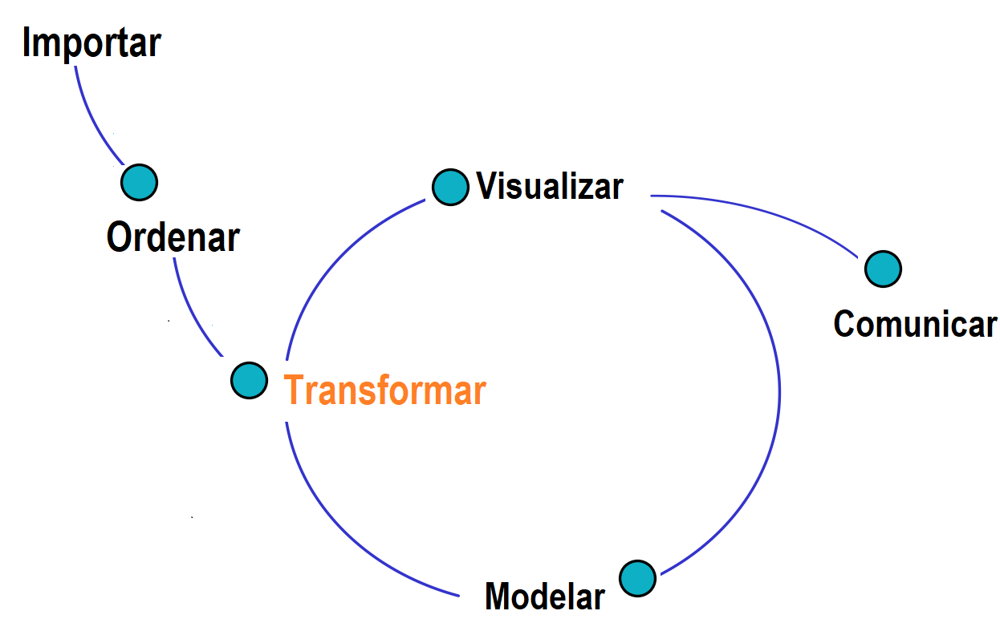

```{r setup, include=FALSE}
knitr::opts_chunk$set(echo = TRUE, message = FALSE, warning = FALSE, comment = NA)

# install.packages('gtools')
# install.packages("TeachingSampling")

#load library
library(gtools)
library(TeachingSampling)
library(readr)
library(paqueteMETODOS)
library(tidyverse)

c1="#FF7F00"
c2="#034A94"
c3="#0EB0C6"
c4="#686868"

library(paqueteMETODOS)
data("vivienda_faltantes")
data("rotacion")
```


<br/><br/>
<h2>Transformar</h2>


```{r, echo=FALSE, out.width="100%", fig.align = "center"}

```

<center>
**Figura 1.47**  Ciclo del análisis de los datos.  <br/>
</center>
<br/><br/>

Una de las etapas clave dentro del ciclo de datos es la **transformación de las variables** (ver **Figura 1.47**), que incluye diversos procesos fundamentales orientados a preparar los datos para el análisis o modelado. Entre los procesos más importantes se encuentran los siguientes:

- **Construcción de nuevas variables:** Generación de variables derivadas a partir de las ya existentes en la base de datos original. Este proceso permite enriquecer la información disponible, crear indicadores o sintetizar datos para análisis específicos.

- **Estandarización de variables:** Transformación de las variables para que compartan una escala común, generalmente ajustándolas para que tengan una media de 0 y una desviación estándar de 1. Este procedimiento es esencial para garantizar que las variables sean comparables y que ninguna domine el análisis debido a su magnitud.

- **Normalización de variables:** Ajuste de las variables para que sus valores se ubiquen en un rango definido, como \([0, 1]\) o \([-1, 1]\). Este proceso es útil en modelos o métodos que requieren que las variables estén acotadas como en el caso de la regresión beta. 

<br/><br/>
<h3>Estandarización</h3>

- **Propósito:** Llevar las variables a una escala común con media 0 y desviación estándar 1.

- **Uso:** En modelos sensibles a la escala, como el Análisis de componentes principales  (PCA) o Support vector machine (SVM).

- **Rango de valores:** Puede incluir valores negativos y positivos.

- **Fórmula:**

\[
z = \frac{x - \mu}{\sigma}
\]

Donde:

  - \(x\) es el valor original.
  
  - \(\mu\) es la media o promedio de la variable.
  
  - \(\sigma\) es la desviación estándar.


<br/><br/>
<h3>Normalización</h3>

- **Propósito:** Ajustar las variables a un rango definido, como \([0, 1]\) o \([-1, 1]\).

- **Uso:** En algoritmos que requieren datos acotados, como la Regresión beta.

- **Rango de valores:** Limitado al rango definido.

- **Fórmula:** 

\[
x' = \frac{x - \text{min}(x)}{\text{max}(x) - \text{min}(x)}
\]

Donde:

  - \(x\) es el valor original.
  
  - \(\text{min}(x)\) y \(\text{max}(x)\) son los valores mínimo y máximo.


Cada uno de estos procesos desempeña un rol fundamental en la preparación de los datos, mejorando su calidad y adecuándolos para aplicaciones analíticas o de modelado. 


<br/><br/>
<div class="caja-ejemplo">
<h3>Ejemplo:</h3>
<p> 

Los siguientes son los códigos de **R** para realizar una estandarización y normalización de un vector formado por los números del 1 al 4.

<pre>
# Crear un vector de datos
x <- c(1, 2, 3, 4, 5)

# Estandarización
x_estandarizado <- scale(x)
print("Estandarización:")
print(x_estandarizado)

# Normalización (Min-Max Scaling)
x_normalizado <- (x - min(x)) / (max(x) - min(x))
print("Normalización:")
print(x_normalizado)
</pre>

```{r,eval=FALSE,echo=FALSE}
# Crear un vector de datos
x <- c(1, 2, 3, 4, 5)

# Estandarización
x_estandarizado <- scale(x)
# print("Estandarización:")
# print(x_estandarizado)

# Normalización (Min-Max Scaling)
x_normalizado <- (x - min(x)) / (max(x) - min(x))
# print("Normalización:")
# print(x_normalizado)
```


Se puede ver notar que en  las salidas los valores normalizados van de 0 a 1. Mientras que los estandarizados tienen valores positivos y negativos.

<pre>
Estandarizados: -1.2649111    -0.6324555  0.0000000  0.6324555  1.2649111
Normalizados: 0.00 0.25 0.50 0.75 1.00
</pre>

</p>
</div>


<div class="caja-ejemplo">
<h3>Ejemplo:</h3>
<p> 

En este ejemplo, se presentan los códigos necesarios para llevar a cabo la normalización y la estandarización de la variable **Edad**, utilizando una muestra de 1,000 registros extraídos de la base de datos `rotacion`. Este procedimiento permite ajustar los valores de la variable a diferentes escalas según los objetivos del análisis.

<pre>
# Carga de las librerías necesarias
library(dplyr)
library(paqueteMETODOS)
library(scales)
library(summarytools)

# Carga del conjunto de datos y selección de una muestra aleatoria
data(rotacion)  # Verifica que el dataset 'rotacion' esté disponible en el entorno de trabajo
set.seed(123)   # Configura una semilla para garantizar la reproducibilidad
datos <- sample_n(rotacion, 1000)  # Selecciona una muestra de 1,000 registros aleatorios

# Estandarización de la variable Edad
# Método manual
datos$Edad_estandarizada1 <- (datos$Edad - mean(datos$Edad)) / sd(datos$Edad)

# Método automático utilizando la función scale()
datos$Edad_estandarizada2 <- scale(datos$Edad)

# Visualización de la estructura de las columnas relacionadas con la variable Edad
str(datos[, c("Edad", "Edad_estandarizada1", "Edad_estandarizada2")])

# Resumen estadístico de las columnas seleccionadas
summarytools::descr(datos[, c("Edad", "Edad_estandarizada1", "Edad_estandarizada2")])

# Normalización de la variable Edad
# Método manual (Min-Max Scaling)
datos$Edad_normalizada1 <- (datos$Edad - min(datos$Edad)) / (max(datos$Edad) - min(datos$Edad))

# Método automático utilizando la función rescale() del paquete
 
</pre>

```{r,eval=FALSE,echo=FALSE}
# Carga de las librerías necesarias
# Carga de las librerías necesarias
library(dplyr)
library(paqueteMETODOS)
library(scales)
library(summarytools)

# Carga del conjunto de datos y selección de una muestra aleatoria
data(rotacion)  # Verifica que el dataset 'rotacion' esté disponible en el entorno de trabajo
set.seed(123)   # Configura una semilla para garantizar la reproducibilidad
datos <- sample_n(rotacion, 1000)  # Selecciona una muestra de 1,000 registros aleatorios

# Estandarización de la variable Edad
# Método manual
datos$Edad_estandarizada1 <- (datos$Edad - mean(datos$Edad)) / sd(datos$Edad)

# Método automático utilizando la función scale()
datos$Edad_estandarizada2 <- scale(datos$Edad)

# Visualización de la estructura de las columnas relacionadas con la variable Edad
# str(datos[, c("Edad", "Edad_estandarizada1", "Edad_estandarizada2")])

# Resumen estadístico de las columnas seleccionadas
# summarytools::descr(datos[, c("Edad", "Edad_estandarizada1", "Edad_estandarizada2")])

# Normalización de la variable Edad
# Método manual (Min-Max Scaling)
datos$Edad_normalizada1 <- (datos$Edad - min(datos$Edad)) / (max(datos$Edad) - min(datos$Edad))

# Método automático utilizando la función rescale() del paquete
```

</p>
</div>

<br/><br/>
<h3>Construcción de variables</h3>


Es común que durante el análisis de datos sea necesario construir nuevas variables a partir de las existentes en el conjunto de datos. Por ejemplo, supongamos que se desea calcular un indicador de razón que relacione las variables **Años de Experiencia** y **Antigüedad** de los empleados. Este indicador puede calcularse utilizando la siguiente fórmula:

\[
\text{Indicador} = \dfrac{\text{Antigüedad}}{\text{Años de Experiencia}}
\]

Este indicador proporciona información sobre si el empleado fue contratado con experiencia previa o si, por el contrario, ha adquirido su experiencia dentro de la empresa. Valores cercanos a 1 podrían sugerir que gran parte de la experiencia del empleado se obtuvo en la organización.

---

Este proceso se puede realizar de dos formas:

1. **Creando la fórmula directamente:** Se puede definir el indicador utilizando operaciones matemáticas básicas en el entorno **R**.

2. **Utilizando la función `mutate` del paquete `dplyr`:** Esta función es especialmente útil cuando se trabaja con grandes conjuntos de datos, ya que permite agregar nuevas variables de forma eficiente.

<br/>

<div class="caja-ejemplo">
<h3>Ejemplo:</h3>
<p> 

En este ejemplo, se presenta el proceso de creación de un nuevo indicador a partir de una muestra de 1,000 registros de la base de datos `rotacion`. El indicador se calcula como la razón entre las variables **Antigüedad** y **Años_Experiencia**, y se almacena como una nueva columna llamada **Indicador1**. Este cálculo permite analizar la proporción entre la antigüedad total de un empleado y los años de experiencia acumulados.

<pre>
# Cargar librerías necesarias
library(dplyr)
library(paqueteMETODOS)

# Cargar datos y extraer una muestra de 1,000 registros
data(rotacion) # Asegúrate de que el dataset esté cargado en el entorno
set.seed(123)  # Garantiza reproducibilidad
datos <- sample_n(rotacion, 1000)

# Seleccionar variables relevantes
datos <- datos[, c(2, 18, 21, 22, 23, 24)] # Subconjunto de variables de interés

# Mostrar la estructura de los datos originales
str(datos)

# Calcular el indicador
datos$Indicador1 <- datos$Antigüedad / datos$Años_Experiencia

# Mostrar la estructura de los datos con el indicador calculado
str(datos)
</pre>


```{r,eval=FALSE,echo=FALSE}
# Cargar librerías necesarias
library(dplyr)
library(paqueteMETODOS)

# Cargar datos y extraer una muestra de 1,000 registros
data(rotacion) # Asegúrate de que el dataset esté cargado en el entorno
set.seed(123)  # Garantiza reproducibilidad
datos <- sample_n(rotacion, 1000)

# Seleccionar variables relevantes
datos <- datos[, c(2, 18, 21, 22, 23, 24)] # Subconjunto de variables de interés

# Mostrar la estructura de los datos originales
# str(datos)

# Calcular el indicador
datos$Indicador1 <- datos$Antigüedad / datos$Años_Experiencia

# Mostrar la estructura de los datos con el indicador calculado
# str(datos)
```
</p>
</div>

<br/>

A continuación se puede visualizar la información de los datos, antes y después de la construcción de la nueva variable.

<pre>
tibble [1,000 × 6] (S3: tbl_df/tbl/data.frame)
 $ Edad                      : num [1:1000] 24 34 46 24 45 39 30 46 34 34 ...
 $ Años_Experiencia          : num [1:1000] 6 10 24 4 22 21 6 12 6 15 ...
 $ Antigüedad                : num [1:1000] 5 10 24 2 20 19 6 9 5 15 ...
 $ Antigüedad_Cargo          : num [1:1000] 3 7 13 2 8 9 4 8 0 14 ...
 $ Años_ultima_promoción     : num [1:1000] 1 5 15 2 11 15 1 4 1 0 ...
 $ Años_acargo_con_mismo_jefe: num [1:1000] 4 7 7 0 8 2 1 7 2 7 ...
</pre>

<pre>
tibble [1,000 × 7] (S3: tbl_df/tbl/data.frame)
 $ Edad                      : num [1:1000] 24 34 46 24 45 39 30 46 34 34 ...
 $ Años_Experiencia          : num [1:1000] 6 10 24 4 22 21 6 12 6 15 ...
 $ Antigüedad                : num [1:1000] 5 10 24 2 20 19 6 9 5 15 ...
 $ Antigüedad_Cargo          : num [1:1000] 3 7 13 2 8 9 4 8 0 14 ...
 $ Años_ultima_promoción     : num [1:1000] 1 5 15 2 11 15 1 4 1 0 ...
 $ Años_acargo_con_mismo_jefe: num [1:1000] 4 7 7 0 8 2 1 7 2 7 ...
 $ Indicador1                : num [1:1000] 0.833 1 1 0.5 0.909 ...
</pre>


<div class="caja-ejemplo">
<h3>Ejemplo:</h3>
<p>
A continuación, se presenta el proceso de creación de un nuevo indicador utilizando una muestra de 1,000 registros extraídos de la base de datos `rotacion`. Para esta transformación, se emplea la función `mutate` del paquete `dplyr`, que permite añadir nuevas variables de manera eficiente y directa al conjunto de datos.

<pre>
# Carga de las librerías necesarias
library(dplyr)
library(paqueteMETODOS)

# Carga del conjunto de datos y selección de una muestra aleatoria
data(rotacion)  # Verifica que el dataset 'rotacion' esté disponible en el entorno de trabajo
set.seed(123)   # Configuración de semilla para garantizar la reproducibilidad
datos <- sample_n(rotacion, 1000)  # Extrae una muestra de 1,000 registros

# Creación de un nuevo indicador utilizando la función mutate
datos <- mutate(datos, Indicador2 = Antigüedad / Años_Experiencia)

# Visualización de la estructura del conjunto de datos resultante
str(datos)
</pre>

```{r,eval=FALSE,echo=FALSE}
# Carga de las librerías necesarias
library(dplyr)
library(paqueteMETODOS)

# Carga del conjunto de datos y selección de una muestra aleatoria
data(rotacion)  # Verifica que el dataset 'rotacion' esté disponible en el entorno de trabajo
set.seed(123)   # Configuración de semilla para garantizar la reproducibilidad
datos <- sample_n(rotacion, 1000)  # Extrae una muestra de 1,000 registros

# Creación de un nuevo indicador utilizando la función mutate
datos <- mutate(datos, Indicador2 = Antigüedad / Años_Experiencia)

# Visualización de la estructura del conjunto de datos resultante
# str(datos)
```

</p>
</div>

<br/><br/>
<div class="caja-nota">
<p>
<h3>Nota:</h3>
>
- **Estandarización**: Este proceso, que consiste en ajustar las variables para que tengan una media de cero y una varianza de uno, es particularmente necesario en algoritmos como regresión lineal, análisis de componentes principales (PCA) o modelos de aprendizaje automático que son sensibles a las escalas de las variables. También resulta esencial en contextos donde se requiere comparar resultados de manera precisa. <br/>
> 
> 
-  **Normalización**: En algunos casos, como en algoritmos de redes neuronales, es necesario que los datos originales se distribuyan dentro de un rango común (por ejemplo, \([0, 1]\)). Este ajuste no solo facilita la interpretación, sino que también puede mejorar la velocidad de convergencia en métodos de optimización al reducir las diferencias de escala entre las variables.<br/>
> 
-  La elección entre estandarización y normalización dependerá del tipo de análisis y del modelo que se desee implementar, así como de los requisitos específicos del problema a resolver.  <br/>
>
</p>
</div>


<br/><br/>
<div class="caja-actividad">
<h3>Actividad:</h3>
>
<p> La actividad se basa en el conjunto de datos mtcars, disponible en R de manera predeterminada. Este dataset contiene información sobre las características de 32 modelos de automóviles, como el consumo de combustible (**mpg**), peso (**wt**), potencia (**hp**), tiempo para recorrer un cuarto de milla (**qsec**), entre otras variables.<br/>
>
- Para realizar comparaciones entre los distintos modelos de automóviles, crea nuevas variables que capturen relaciones entre las características del vehículo y aporten interpretaciones adicionales:
<br/><br/>
Relación peso-potencia (**relacion_wt_hp**):  La relación peso-potencia es un indicador que mide la eficiencia del vehículo en términos de su potencia relativa al peso. Este indicador se calcula mediante la siguiente fórmula:<br/>
\[
\text{Relación Peso-Potencia} = \frac{\text{wt}}{\text{hp}}
\]
<br/>
>
Un valor más bajo de este indicador puede reflejar un vehículo más eficiente, dado que produce mayor potencia relativa a su peso.<br/>
>
<br/><br/>
Velocidad específica (**relacion_qsec_hp**): La velocidad específica es un indicador que analiza cuán rápido puede acelerar un vehículo en función de su potencia. Este indicador se calcula mediante la siguiente fórmula:<br/>
\[
\text{Velocidad Específica} = \frac{\text{qsec}}{\text{hp}}
\]
<br/>
Este indicador permite evaluar la relación entre la capacidad de aceleración y la potencia del vehículo, proporcionando información útil para comparar el rendimiento de distintos modelos.
>
- Un objetivo es ajustar un modelo de regresión lineal simple para predecir el consumo de combustible (**mpg**) a partir de la velocidad específica (**relacion_qsec_hp**). Sin embargo, para evitar que las predicciones del modelo sean negativas, se trabajará con una transformación logarítmica de la variable respuesta. Después de ajustar el modelo en la escala transformada, se aplicará la inversa de la transformación para obtener las predicciones en la escala original. Aplica la transformación logarítmica a la variable **mpg** para garantizar que las predicciones estén siempre dentro de un rango válido. Además, estandariza la variable **relacion_qsec_hp** para que tenga media 0 y desviación estándar 1.<br/>
>

</p>

