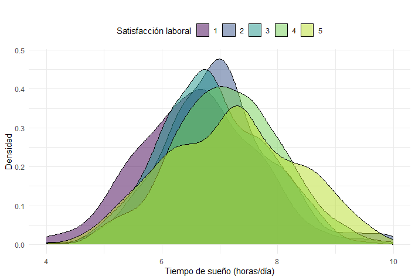

```{r setup, include=FALSE}
knitr::opts_chunk$set(echo = TRUE, message = FALSE, warning = FALSE, comment = NA)

```

</br></br>
<h2>Caso 1</h2>


<h3>Introducción</h3>

En el contexto del desarrollo económico moderno, la productividad, la eficiencia y la eficacia son objetivos clave en el ámbito laboral y empresarial. No obstante, el equilibrio entre la vida personal y profesional se ha convertido en un aspecto fundamental para el bienestar de los empleados. La satisfacción laboral no solo depende del entorno de trabajo, sino también de factores personales como el descanso, la salud física y mental, y las responsabilidades fuera del ámbito laboral. [Descargar Encuesta Empleados](https://raw.githubusercontent.com/Centromagis/metodosySIM1-V2/main/docs/data/Encuesta%20empleados.xlsx)

<div class="caja-nota">
<h3>Observación:</h3>
> -  Estos datos no tienen datos faltantes ni inconsistencas.
</div>

---

<h3>Objetivos</h3>

A partir del análisis de la base de datos, se busca explorar las experiencias de vida de los empleados a través de los siguientes objetivos:

- Estudiar si el descanso, medido en tiempo de sueño por noche, está sociado con la percepción de satisfacción en el entorno de trabajo.

- Determinar si un mayor nivel de ejercicio semanal está relacionado con la duración del sueño.

- Analizar si la percepción del estrés está relacionado con la posición jerárquica dentro de una organización.

---

</br></br>
<h3>Descripción  y clasificación de las variables</h3>

En la **Tabla 1.15** se describen y clasifican las variables, de acuerdo a su naturaleza. 

```{r echo=TRUE, warning=FALSE, message=FALSE,eval=FALSE,echo=FALSE}
# Cargar las bibliotecas necesarias
library(readxl)      # Para leer archivos Excel
library(dplyr)       # Para la manipulación de datos
library(tidyr)       # Para la manipulación de datos
library(kableExtra)  # Para el formateo de tablas

# Leer el archivo de datos
data1 <- read_xlsx("data/Encuesta empleados.xlsx")

# Seleccionar las variables de interés
variables <- data1 %>%
  dplyr::select(JobSatisfaction, SleepHours, Stress, PhysicalActivityHours, JobLevel)

# Renombrar las columnas para mayor claridad
colnames(variables) <- c("Satisfacción laboral", "Tiempo de sueño", "Nivel de estrés",
                         "Tiempo de actividad física", "Cargo")

# Definir los nombres de las variables y sus descripciones
nombre_variables <- colnames(variables)
descripcion_variables <- c(
  "Nivel de satisfacción laboral en una escala del 1 al 5, donde 1 es 'muy poco satisfecho' y 5 es 'muy satisfecho'.", 
  "Tiempo de sueño diarias (horas), con un mínimo de 4 y un máximo de 10.", 
  "Nivel de estrés en una escala del 1 al 5, donde 1 es 'muy bajo' y 5 es 'muy alto'.",
  "Tiempo de actividad física semanal (horas), con un mínimo de 0 y un máximo de 5.", 
  "Categoría del cargo del empleado: gerente, intermedio, junior, líder o pasante."
)

# Clasificación de las variables
clasificacion_variables <- c("Cualitativa ordinal", "Cuantitativa continua", 
                             "Cualitativa ordinal", "Cuantitativa continua",
                             "Cualitativa ordinal")

# Crear un data frame con la información estructurada
tabla_variables <- data.frame(
  Nombre = nombre_variables,
  Descripción = descripcion_variables,
  Clasificación = clasificacion_variables
)

# Generar la tabla con formato mejorado
# kable(tabla_variables, caption = "Tabla 1.11 Descripción y clasificación de las variables seleccionadas") %>%
  # kable_styling(bootstrap_options = c("striped"))  # Aplica un estilo con filas alternas
```

</br>
<center>
**Tabla 1.15** Descripción y clasificación de las variables seleccionadas.
</center>
| Nombre                        | Descripción                                                                                          | Clasificación          |
|--------------------------------|------------------------------------------------------------------------------------------------------|------------------------|
| **Satisfacción laboral**       | Nivel de satisfacción laboral en una escala del 1 al 5, donde 1 es ‘muy poco satisfecho’ y 5 es ‘muy satisfecho’. | Cualitativa ordinal    |
| **Tiempo de sueño**            | Tiempo de sueño diario (horas), con un mínimo de 4 y un máximo de 10.                               | Cuantitativa continua  |
| **Nivel de estrés**            | Nivel de estrés en una escala del 1 al 5, donde 1 es ‘muy bajo’ y 5 es ‘muy alto’.                  | Cualitativa ordinal    |
| **Tiempo de actividad física** | Tiempo de actividad física semanal (horas), con un mínimo de 0 y un máximo de 5.                    | Cuantitativa continua  |
| **Cargo**                      | Categoría del cargo del empleado: gerente, intermedio, junior, líder o pasante.                     | Cualitativa ordinal    |


A partir de las **Tablas 1.16** y **1.17** se pueden hacer las siguientes observaciones:

- Los empleados duermen entre 1 y 10 horas. El 50% duerme como máximo 7 horas (mediana de 7 horas). La variabilidad del tiempo de sueño respecto a la media es moderada (coeficiente de variación de 14.3%), con un sesgo casi nulo (coeficiente de asimetría de 0.08) y una distribución que no se aleja mucho de la normal (curtosis de -0.13).

- Los empleados que practican algún tipo de actividad física lo hacen por un máximo de 5 horas semanales. El 50% lo hace hasta 2 horas (mediana de 2 horas), y la variabilidad con respecto a la media es alta (coeficiente de variación de 47.6%). La distribución es aproximadamente simétrica (coeficiente de asimetría de 0.02) y algo más plana que la normal (curtosis de -0.43).

- Se observa que la mayoría de los empleados reporta un nivel de satisfacción laboral alto (4) con un 41.29%, un nivel de estrés bajo (1) con un 59.80%, y ejercen el cargo de “Gerente” el 35.33%, que constituye la moda en la muestra.


```{r echo=FALSE, warning=FALSE, message=FALSE,eval=FALSE}
# Escribir en español
Sys.setlocale("LC_ALL", "es_ES.UTF-8")

# Cargar las bibliotecas necesarias
library(dplyr)
library(e1071)         # Para calcular asimetría y curtosis
library(knitr)         # Para generar tablas con kable
library(kableExtra)    # Para mejorar el formato de las tablas

# Seleccionar solo las variables de interés
datos_generales <- data1 %>%
  dplyr::select(SleepHours, PhysicalActivityHours)

# Crear función para calcular estadísticas
resumen_estadistico <- function(variable, nombre_variable) {
  tibble(
    Variable = nombre_variable,
    Minimo = min(variable, na.rm = TRUE),
    Maximo = max(variable, na.rm = TRUE),
    Mediana = median(variable, na.rm = TRUE),
    Media = round(mean(variable, na.rm = TRUE), 2),
    Desviacion_Estandar = round(sd(variable, na.rm = TRUE), 2),
    Coef_Variacion = round((sd(variable, na.rm = TRUE) / mean(variable, na.rm = TRUE)) * 100, 1),
    Cuartil_1 = quantile(variable, 0.25, na.rm = TRUE),
    Cuartil_3 = quantile(variable, 0.75, na.rm = TRUE),
    Asimetria = round(skewness(variable, na.rm = TRUE), 2),
    Curtosis = round(kurtosis(variable, na.rm = TRUE), 2)
  )
}

# Aplicar la función a cada variable
estadisticas_sueno <- resumen_estadistico(datos_generales$SleepHours, "Tiempo de Sueño")
estadisticas_actividad <- resumen_estadistico(datos_generales$PhysicalActivityHours, "Tiempo de Actividad Física")

# Unir ambas tablas
estadisticas_generales <- bind_rows(estadisticas_sueno, estadisticas_actividad)

# Crear tabla con kable
kable(estadisticas_generales, format = "html", caption = "Tabla 1.12 Estadísticas descriptivas generales") %>%
  kable_styling(bootstrap_options = c("striped", "hover", "responsive"), full_width = FALSE) %>%
  column_spec(1, bold = TRUE)
```

</br> 
<center>
**Tabla 1.16** Estadísticas descriptivas de las variables cuantitativas seleccionadas.
</center>
| Variable                  | Mínimo | Máximo | Mediana | Media | Desviación estándar | Coef. de variación (%) | Primer cuartil | Tercer cuartil | Asimetría | Curtosis |
|:--------------------------|:------:|:------:|:-------:|:-----:|:--------------------:|:----------------------:|:--------------:|:--------------:|:---------:|:--------:|
| **Tiempo de sueño**       |   1    |   10   |    7    |  7.01 |         1.00        |         14.3          |       6.3      |       7.7      |    0.08   |  -0.13   |
| **Tiempo de actividad física** |   0    |   5    |    2    |  2.03 |         0.97        |         47.6          |       1.3      |       2.7      |    0.02   |  -0.43   |


```{r echo=FALSE, warning=FALSE, message=FALSE,eval=FALSE}
# Cargar las bibliotecas necesarias
library(dplyr)
library(knitr)
library(kableExtra)

# Función para calcular la moda de una variable categórica
moda <- function(x) {
  tab <- table(x)  # Crear tabla de frecuencias
  max_freq <- max(tab)  # Encontrar la frecuencia máxima
  modas <- names(tab[tab == max_freq])  # Obtener las categorías con la frecuencia máxima
  return(paste(modas, collapse = ", "))  # Devolver la moda (o modas si hay empate)
}

# Calcular la moda para cada variable cualitativa
moda_satisfaccion <- moda(data1$JobSatisfaction)
moda_estres <- moda(data1$Stress)
moda_cargo <- moda(data1$JobLevel)

# Crear la tabla de resultados
tabla_moda <- data.frame(
  Variable = c("Satisfacción Laboral", "Nivel de Estrés", "Cargo"),
  Moda = c(moda_satisfaccion, moda_estres, moda_cargo)
)

# Generar la tabla con kable
kable(tabla_moda, format = "html", caption = "Tabla 1.13. Moda de las variables cualitativas") %>%
kable_styling(bootstrap_options = c("striped", "hover", "responsive"), full_width = FALSE) %>%
column_spec(1, bold = TRUE)  # Resalta la columna de la variable analizada
```

</br>
<center>
**Tabla 1.17** Estadística de las variables cualitativas seleccionadas.
</center>
| Variable                 | Moda    |
|:-------------------------|:-------:|
| **Satisfacción laboral** |    4    |
| **Nivel de estrés**      |    1    |
| **Cargo**                | Gerente |


---

<br/></br>
<h3> Descripciones asociadas al objetivo 1</h3>

La información presentada en la **Figura 1.48** corresponde a la **Tabla 1.18**. En la **Figura 1.49**, se superponen las curvas de densidad para facilitar la comparación de la distribución del tiempo de sueño en los diferentes niveles. 


```{r echo=FALSE,eval=FALSE}
# Cargar las librerías necesarias
library(ggplot2)
library(dplyr)

# Asegurarse de que la variable JobSatisfaction es un factor
data1$JobSatisfaction <- as.factor(data1$JobSatisfaction)

# Definir un vector de cortes (breaks)

h<-hist(data1$SleepHours)
breaks_seq <- h$breaks  


# Gráfico de histogramas con frecuencia relativa
plot_histogramas <- ggplot(data1, aes(x = SleepHours, fill = JobSatisfaction)) +
  geom_histogram(aes(y = after_stat(count/sum(count))),
                 breaks = breaks_seq,
                 color = "white", alpha = 0.8) +
  facet_wrap(~ JobSatisfaction, ncol = 2) +
  scale_fill_manual(values = c("#440154FF", "#39568CFF", "#1F968BFF",
                               "#73D055FF", "#B8DE29FF")) +
  labs(x = "Tiempo de sueño (horas/día)",
       y = "Frecuencia relativa",
       fill = "Satisfacción laboral",
       title = "Histogramas del tiempo de sueño por nivel de satisfacción laboral") +
  theme_minimal() +
  theme(legend.position = "top")

# Gráfico de histogramas con densidad
plot_hist_dens <- ggplot(data1, aes(x = SleepHours, fill = JobSatisfaction)) +
  geom_histogram(aes(y = after_stat(density)),
                 breaks = breaks_seq,
                 color = "white", alpha = 0.8) +
  facet_wrap(~ JobSatisfaction, ncol = 2) +
  scale_fill_manual(values = c("#440154FF", "#39568CFF", "#1F968BFF",
                               "#73D055FF", "#B8DE29FF")) +
  labs(x = "Tiempo de sueño (horas/día)",
       y = "Densidad",
       fill = "Satisfacción laboral",
       title = "") +
  theme_minimal() +
  theme(legend.position = "top")

# Para visualizar los gráficos, descomenta:
print(plot_histogramas)
print(plot_hist_dens)


# Generar tablas por cada nivel de JobSatisfaction utilizando los mismos breaks
niveles <- levels(data1$JobSatisfaction)
tabla_list <- list()

for (nivel in niveles) {
  # Filtrar datos por nivel
  subset_data <- data1 %>% filter(JobSatisfaction == nivel)
  
  # Calcular el histograma sin graficar utilizando los breaks comunes
  hist_nivel <- hist(subset_data$SleepHours, breaks = breaks_seq, plot = FALSE)
  
  # Crear la tabla con clases, frecuencia absoluta, relativa y densidad
  tabla_nivel <- data.frame(
    Clase = paste(head(hist_nivel$breaks, -1), hist_nivel$breaks[-1], sep = " - "),
    Frecuencia_Absoluta = hist_nivel$counts,
    Frecuencia_Relativa = hist_nivel$counts / sum(hist_nivel$counts),
    Densidad = hist_nivel$density
  )
  
  # Guardar la tabla en la lista
  tabla_list[[nivel]] <- tabla_nivel
}

# Imprimir las tablas para cada nivel de JobSatisfaction
for (nivel in niveles) {
cat("Tabla para Satisfacción laboral =", nivel, "\n")
print(tabla_list[[nivel]])
cat("\n")
}
```


<center>
```{r, echo=FALSE, out.width="100%", fig.align = "center"}
knitr::include_graphics("img/hist_caso1.png")
```
**Figura 1.48** Distribución del tiempo de sueño por categorías de satisfacción laboral.
</center>
</br>


<center>
**Tabla 1.18** Densidades, frecuencias absoluta y relativa por cada clase (intervalo) del tiempo de sueño (horas).
</center>
<pre>
Tabla para Satisfacción laboral = 1 
      Clase Frecuencia_Absoluta Frecuencia_Relativa    Densidad
1   4 - 4.5                   8         0.019184652 0.038369305
2   4.5 - 5                  13         0.031175060 0.062350120
3   5 - 5.5                  39         0.093525180 0.187050360
4   5.5 - 6                  60         0.143884892 0.287769784
5   6 - 6.5                  75         0.179856115 0.359712230
6   6.5 - 7                  90         0.215827338 0.431654676
7   7 - 7.5                  58         0.139088729 0.278177458
8   7.5 - 8                  45         0.107913669 0.215827338
9   8 - 8.5                  17         0.040767386 0.081534772
10  8.5 - 9                   8         0.019184652 0.038369305
11  9 - 9.5                   3         0.007194245 0.014388489
12 9.5 - 10                   1         0.002398082 0.004796163

Tabla para Satisfacción laboral = 2 
      Clase Frecuencia_Absoluta Frecuencia_Relativa    Densidad
1   4 - 4.5                   1         0.003610108 0.007220217
2   4.5 - 5                   5         0.018050542 0.036101083
3   5 - 5.5                  12         0.043321300 0.086642599
4   5.5 - 6                  23         0.083032491 0.166064982
5   6 - 6.5                  50         0.180505415 0.361010830
6   6.5 - 7                  62         0.223826715 0.447653430
7   7 - 7.5                  59         0.212996390 0.425992780
8   7.5 - 8                  29         0.104693141 0.209386282
9   8 - 8.5                  22         0.079422383 0.158844765
10  8.5 - 9                   5         0.018050542 0.036101083
11  9 - 9.5                   4         0.014440433 0.028880866
12 9.5 - 10                   5         0.018050542 0.036101083

Tabla para Satisfacción laboral = 3 
      Clase Frecuencia_Absoluta Frecuencia_Relativa    Densidad
1   4 - 4.5                   1         0.001766784 0.003533569
2   4.5 - 5                   9         0.015901060 0.031802120
3   5 - 5.5                  28         0.049469965 0.098939929
4   5.5 - 6                  61         0.107773852 0.215547703
5   6 - 6.5                 107         0.189045936 0.378091873
6   6.5 - 7                 135         0.238515901 0.477031802
7   7 - 7.5                  81         0.143109541 0.286219081
8   7.5 - 8                  78         0.137809187 0.275618375
9   8 - 8.5                  44         0.077738516 0.155477032
10  8.5 - 9                  18         0.031802120 0.063604240
11  9 - 9.5                   3         0.005300353 0.010600707
12 9.5 - 10                   1         0.001766784 0.003533569

Tabla para Satisfacción laboral = 4 
      Clase Frecuencia_Absoluta Frecuencia_Relativa    Densidad
1   4 - 4.5                   2         0.001601281 0.003202562
2   4.5 - 5                  19         0.015212170 0.030424339
3   5 - 5.5                  48         0.038430745 0.076861489
4   5.5 - 6                  79         0.063250600 0.126501201
5   6 - 6.5                 193         0.154523619 0.309047238
6   6.5 - 7                 254         0.203362690 0.406725380
7   7 - 7.5                 240         0.192153723 0.384307446
8   7.5 - 8                 205         0.164131305 0.328262610
9   8 - 8.5                 124         0.099279424 0.198558847
10  8.5 - 9                  53         0.042433947 0.084867894
11  9 - 9.5                  25         0.020016013 0.040032026
12 9.5 - 10                   7         0.005604484 0.011208967

Tabla para Satisfacción laboral = 5 
      Clase Frecuencia_Absoluta Frecuencia_Relativa    Densidad
1   4 - 4.5                   1         0.001937984 0.003875969
2   4.5 - 5                  11         0.021317829 0.042635659
3   5 - 5.5                  33         0.063953488 0.127906977
4   5.5 - 6                  41         0.079457364 0.158914729
5   6 - 6.5                  74         0.143410853 0.286821705
6   6.5 - 7                  59         0.114341085 0.228682171
7   7 - 7.5                 112         0.217054264 0.434108527
8   7.5 - 8                  62         0.120155039 0.240310078
9   8 - 8.5                  52         0.100775194 0.201550388
10  8.5 - 9                  44         0.085271318 0.170542636
11  9 - 9.5                  23         0.044573643 0.089147287
12 9.5 - 10                   4         0.007751938 0.015503876
</pre>


```{r, echo=FALSE,eval=FALSE}
# Cargar las librerías necesarias
library(ggplot2)
library(dplyr)

# Asegurarse de que la variable JobSatisfaction es un factor
data1$JobSatisfaction <- as.factor(data1$JobSatisfaction)

# Definir los cortes (breaks) 
h<-hist(data1$SleepHours)
breaks_seq <- h$breaks 
bin_width <- diff(breaks_seq)[1]  # Debe ser 0.2

# Calcular las densidades para cada nivel usando histogramas con cortes fijos
# Se arma un data frame con: JobSatisfaction, el punto central del bin y la densidad
density_data <- lapply(levels(data1$JobSatisfaction), function(lvl) {
  # Filtrar datos para el nivel actual
  subset_data <- data1 %>% filter(JobSatisfaction == lvl)
  
  # Calcular histograma sin graficar con los cortes fijos
  hist_obj <- hist(subset_data$SleepHours, breaks = breaks_seq, plot = FALSE)
  
  # Los puntos centrales (midpoints) de cada bin
  midpoints <- hist_obj$mids
  
  # Calcular la densidad para cada bin:
  # Frecuencia relativa = counts / total, y densidad = frecuencia relativa / ancho del bin
  dens_vals <- (hist_obj$counts / sum(hist_obj$counts)) / bin_width
  
  # Crear un data frame para este nivel
  data.frame(
    JobSatisfaction = lvl,
    x = midpoints,
    density = dens_vals
  )
})
density_data <- do.call(rbind, density_data)

# Para graficar polígonos, es conveniente "cerrar" cada curva:
# agregamos los puntos de inicio y fin, fijando y=0 en los extremos (x=mínimo y x=máximo de los cortes)
polygon_data <- density_data %>%
  group_by(JobSatisfaction) %>%
  arrange(x) %>%
  do({
    df <- .
    data.frame(
      JobSatisfaction = df$JobSatisfaction[1],
      # Agregamos el primer punto en x = mínimo (4) con density = 0,
      # luego los puntos originales y, finalmente, el último punto en x = máximo (10) con density = 0.
      x = c(min(breaks_seq), df$x, max(breaks_seq)),
      density = c(0, df$density, 0)
    )
  }) %>%
  ungroup()

# Ahora, se genera el gráfico con polígonos superpuestos para cada nivel, usando los colores indicados.
plot_overlay <- ggplot(polygon_data, aes(x = x, y = density, fill = JobSatisfaction, group = JobSatisfaction)) +
  geom_polygon(alpha = 0.5, color = "black") +
  scale_fill_manual(values = c("#440154FF", "#39568CFF", "#1F968BFF", "#73D055FF", "#B8DE29FF", "yellow2")) +
  labs(
    x = "Tiempo de sueño (horas/día)",
    y = "Densidad",
    title = "Polígonos de densidad del tiempo de sueño por nivel de satisfacción laboral",
    fill = "Satisfacción laboral"
  ) +
  theme_minimal() +
  theme(legend.position = "top")

# Mostrar el gráfico
print(plot_overlay)


# Gráfico de densidad del tiempo de sueño por categorías de satisfacción laboral
plot_densidades<-ggplot(data1, aes(x = SleepHours, fill = factor(JobSatisfaction))) +
  geom_density(alpha = 0.5) +  # Transparencia para facilitar la visualización de superposiciones
  scale_fill_manual(values = c("#440154FF", "#39568CFF", "#1F968BFF", "#73D055FF", "#B8DE29FF", "yellow2")) +
  labs(
    x = "Tiempo de sueño (horas/día)",
    y = "Densidad",
    fill = "Satisfacción laboral",
    title = ""  # Agregado título
  ) +
  theme_minimal() +
  theme(legend.position = "top")  # Mover la leyenda arriba para mejor visualización

print(plot_densidades)
```

<center>
```{r, echo=FALSE, out.width="100%", fig.align = "center"}
knitr::include_graphics("img/densidades1-caso1.png")
```
**Figura 1.49** Distribución del tiempo de sueño por categorías de satisfacción laboral.
</center>
</br>


En la **Figura 1.49** se muestran los polígonos de densidad que describen la distribución del tiempo de sueño para los cinco niveles de satisfacción laboral. A partir de esta visualización y de las tablas de frecuencia, se pueden destacar los siguientes puntos:

- Se aprecia un desplazamiento progresivo hacia la derecha de las curvas a medida que aumenta el nivel de satisfacción, lo que puede sugerir que las personas más satisfechas tienden a dormir más.

- Las distribuciones asociadas a los niveles 1 y 2 se encuentran concentradas en torno a las 6–7 horas de sueño, con colas más largas hacia los valores bajos.  El nivel 1 muestra un pico de densidad más estrecho y desplazado hacia la izquierda, concentrando a la mayoría de los casos entre 5.5 y 7 horas. En el nivel 2, la distribución se vuelve un poco más simétrica y se empieza a notar una mayor frecuencia de personas que duermen entre 6.5 y 8 horas, aunque todavía persiste una densidad significativa en valores inferiores.

- En el nivel 3 se observa una distribución más equilibrada, con un aumento en la densidad entre 6.5 y 8 horas. La curva es más ancha, lo que sugiere mayor variabilidad en los hábitos de sueño para este grupo, pero con una clara concentración en torno a las 6.5 horas.

- A partir del nivel 4, las curvas de densidad muestran un desplazamiento más claro hacia la derecha, con un aumento en la densidad entre 6.5 y 8.5 horas. La curva correspondiente al nivel 5 es la más extendida hacia valores altos y tiene su moda alrededor de las 7.5 horas.

La **Figura 1.50** muestra curvas de densidad, sin requerir la elaboración detallada de tablas de frecuencias. Estas curvas pueden emplearse en lugar de los presentados en la **Figura 1.49**.

Al complementar la interpretación de las curvas de densidad con los coeficientes de asimetría, curtosis y gráficos de cajas, se destacan los siguientes aspectos:

- Los valores del coeficiente de asimetría (Skewness) varían entre 0.00 y 0.33, indicando que las distribuciones no están fuertemente sesgadas. En los niveles 2 (0.33) y 3 (0.11) se observan colas ligeramente más extendidas hacia la derecha (horas de sueño más elevadas), mientras que en los niveles 1 (0.09) y 4 (0.01) la asimetría es muy baja, lo cual sugiere distribuciones casi simétricas en torno a su media (ver **Tabla 1.19**).

- Los coeficientes de curtosis van de -0.59 a 0.60, lo que indica formas mesocúrticas. El nivel 2 (curtosis = 0.60) presenta colas algo más pesadas o un pico más marcado, mientras que el nivel 5 (curtosis = -0.59) se inclina hacia una distribución algo más plana alrededor del centro (ver **Tabla 1.19**).


<center>
```{r, echo=FALSE, out.width="100%", fig.align = "center"}

```
**Figura 1.50** Distribución del tiempo de sueño por categorías de satisfacción laboral.
</center>
</br>


```{r, echo=FALSE,eval=FALSE}
# Para usar español
Sys.setlocale("LC_ALL", "es_ES.UTF-8")  # Configura el idioma español con UTF-8
 
# Cargar la biblioteca necesaria
library(ggplot2)

# Crear el boxplot mejorado
boxplot_caso1<-ggplot(data1, aes(x = factor(JobSatisfaction), y = SleepHours, fill = factor(JobSatisfaction))) +
  geom_boxplot(outlier.shape = 16, outlier.size = 2, alpha = 0.7) +  # Boxplot con atenuación de color
  scale_fill_manual(values = c("#440154FF", "#39568CFF", "#1F968BFF", "#73D055FF", "#B8DE29FF")) +  
  labs(x = "Satisfacción laboral", 
       y = "Tiempo de sueño (horas/día)", 
       title = "Distribución del tiempo de sueño por nivel de satisfacción laboral") +
  theme_minimal() +  # Estilo limpio y profesional
  theme(legend.position = "none",  # Quitar la leyenda, ya que el eje X ya muestra los niveles
        plot.title = element_text(hjust = 0.5, size = 14, face = "bold"),
        axis.text = element_text(size = 12),
        axis.title = element_text(size = 13))
print(boxplot_caso1)
```


- Al analizar los cinco niveles de satisfacción laboral, se observa que algunos empleados duermen solo 4.0 horas (mínimo). En los niveles 1 y 3, el tiempo de sueño puede llegar hasta 9.6 horas, mientras que en los otros niveles existen empleados que alcanzan incluso las 10.0 horas de descanso (ver **Tabla 1.19** y **Figura 1.51**).  


- En los primeros cuatro niveles de satisfacción laboral se identifican personas con duraciones de sueño atípicas, ya sea significativamente mayores o menores que el rango típico. En el nivel 1, el 0.7 % de los participantes duerme más de lo habitual, registrando entre 9.5 y 9.6 horas de sueño. En los niveles 2 y 4 también se detectan grupos con valores de sueño inusuales (3.6 % en el nivel 2 y 0.4 % en el nivel 4). Quienes duermen menos en el nivel 2 registran entre 4.0 y 4.7 horas, mientras que en el nivel 4 lo hacen entre 4.0 y 4.4 horas. Por su parte, quienes duermen más en el nivel 2 alcanzan entre 9.2 y 10 horas, y en el nivel 4 descansan entre 9.9 y 10 horas. En el nivel 5, por el contrario, no se observan valores de sueño atípicos (ver **Tabla 1.19** y **Figura 1.51**).

- Al analizar los cuartiles de los cinco niveles de satisfacción laboral, se observa que, para los niveles 2, 3 y 4, al menos el 50% de sus empleados duerme más horas que el 50% de los empleados con los tiempos más bajos en el nivel 1. De hecho, la mediana de sueño en el nivel 1 (6.6 horas) es la más baja de todos los niveles. De manera similar, el 25% de los empleados con menos horas de sueño en el nivel 1 registra valores inferiores a, por lo menos, el 75% de los tiempos de los otros cuatro niveles. Por otro lado, el 25% de los empleados con más horas de sueño en el nivel 5 supera, al menos, el 75% de los tiempos registrados en los demás niveles. En conjunto, estos datos indican que los empleados del nivel 1 suelen dormir menos  en comparación con los otros niveles, mientras que los del nivel 5 tienden a registrar las duraciones de sueño más altas (ver **Tabla 1.19** y **Figura 1.51**).


<center>
```{r, echo=FALSE, out.width="100%", fig.align = "center"}
knitr::include_graphics("img/cajas_caso1.png")
```
**Figura 1.51** Distribución del tiempo de sueño por categorías de satisfacción laboral.
</center>
</br>

-  En los niveles 2, 4 y 5, la mediana del tiempo de sueño es igual o supera levemente las 7.0 horas, lo que indica que  la mitad de los empleados en estos niveles duermen aproximadamente 7.0 horas. Esto sugiere un mayor tiempo de descanso  en comparación con los niveles 1 y 3, cuyas medianas se sitúan en 6.6 y 6.8 horas, respectivamente (ver **Tabla 1.19**).


-  Al analizar el rango de los tiempos de sueño en cada nivel de satisfacción laboral, se observa que los niveles 1, 4 y 5 presentan valores similares, alrededor de 6.0 horas, mientras que los niveles 2 y 3 registran rangos de aproximadamente 5.6 horas. En cuanto al coeficiente de variación, los niveles 1 y 5 muestran variabilidad moderada respecto a la media, con valores cercanos (15.1% y 15.8%, respectivamente), mientras que en los niveles 2, 3 y 4 la variabilidad en torno a la media es también moderada y aunque menor es muy parecida (13.8%, 13.3% y 13.3%). Estos resultados indican una variabilidad moderada de los tiempos de sueño con respecto a la media, con diferencias mínimas entre los distintos niveles de satisfacción laboral (ver **Tabla 1.19**).


```{r echo=FALSE,eval=FALSE}
library(dplyr)
library(e1071)
library(knitr)
library(kableExtra)

# Calcular IQR y límites por grupo
data_enriquecida <- data1 %>%
  group_by(JobSatisfaction) %>%
  mutate(
    Q1 = quantile(SleepHours, 0.25, na.rm = TRUE),
    Q3 = quantile(SleepHours, 0.75, na.rm = TRUE),
    IQR = Q3 - Q1,
    L_inf = Q1 - 1.5 * IQR,
    L_sup = Q3 + 1.5 * IQR,
    Atipico = ifelse(SleepHours < L_inf | SleepHours > L_sup, TRUE, FALSE)
  )

# Resumen por grupo
tabla_datosobj1 <- data_enriquecida %>%
  group_by(JobSatisfaction) %>%
  summarise(
    Mínimo = min(SleepHours, na.rm = TRUE),
    Máximo = max(SleepHours, na.rm = TRUE),
    Mediana = median(SleepHours, na.rm = TRUE),
    Media = round(mean(SleepHours, na.rm = TRUE), 2),
    `Primer Cuartil` = unique(Q1),
    `Tercer Cuartil` = unique(Q3),
    `Coef. de Variación` = round((sd(SleepHours, na.rm = TRUE) / mean(SleepHours, na.rm = TRUE)) * 100, 1),
    `Coef. de Asimetría` = round(skewness(SleepHours, na.rm = TRUE), 2),
    Curtosis = round(kurtosis(SleepHours, na.rm = TRUE), 2),
    `% de Atípicos` = round(mean(Atipico, na.rm = TRUE) * 100, 1),
    `Intervalo de Atípicos Menores` = ifelse(
      sum(SleepHours < unique(L_inf), na.rm = TRUE) == 0, 
      "", 
      paste0("[", paste(range(SleepHours[SleepHours < unique(L_inf)], na.rm = TRUE), collapse = ", "), "]")
    ),
    `Intervalo de Atípicos Mayores` = ifelse(
      sum(SleepHours > unique(L_sup), na.rm = TRUE) == 0, 
      "", 
      paste0("[", paste(range(SleepHours[SleepHours > unique(L_sup)], na.rm = TRUE), collapse = ", "), "]")
    )
  )

# Mostrar tabla con formato
kable(tabla_datosobj1,
      col.names = c("Satisfacción Laboral", "Mínimo", "Máximo", "Mediana", "Media", 
                    "Primer Cuartil", "Tercer Cuartil", "Coef. de Variación", 
                    "Coef. de Asimetría", "Curtosis", "% de Atípicos", 
                    "Intervalo de Atípicos Menores", "Intervalo de Atípicos Mayores"),
      caption = "Tabla 1.14 Estadísticas para el tiempo de sueño agrupadas por nivel de satisfacción laboral") %>%
  kable_styling(bootstrap_options = c("striped")) %>%
  add_header_above(c(" " = 1, "Tiempo de Sueño" = 12))
```


<br/><br/>
<center>
**Tabla 1.19** Estadísticas para el tiempo de sueño agrupadas por nivel de satisfacción laboral.
</center>


| Satisfacción laboral | Mínimo | Máximo | Mediana | Media | Primer cuartil | Tercer cuartil | Coef. de variación | Coef. de asimetría | Curtosis | % de atípicos | Intervalo de atípicos menores | Intervalo de atípicos mayores |
|:---------------------|:------:|:------:|:-------:|:-----:|:--------------:|:--------------:|:------------------:|:------------------:|:--------:|:-------------:|:----------------------------:|:----------------------------:|
| 1                   |  4.0   |  9.6   |   6.6   |  6.60 |       5.9      |       7.3      |        15.1        |        0.09        |  -0.03   |      0.7      |                            |    [9.5, 9.6]    |
| 2                   |  4.0   | 10.0   |   7.0   |  6.98 |       6.4      |       7.5      |        13.9        |        0.33        |   0.60   |      3.6      |    [4, 4.7]    |    [9.2, 10]    |
| 3                   |  4.1   |  9.6   |   6.8   |  6.88 |       6.2      |       7.6      |        13.3        |        0.11        |  -0.30   |      0.2      |     [4.1, 4.1]    |                            |
| 4                   |  4.0   | 10.0   |   7.1   |  7.12 |       6.5      |       7.8      |        13.3        |        0.01        |  -0.08   |      0.4      |    [4, 4.4]    |    [9.9, 10]    |
| 5                   |  4.0   | 10.0   |   7.2   |  7.20 |       6.3      |       8.0      |        15.8        |        0.00        |  -0.59   |      0.0      |                            |                            |


<br/><br/>
En conjunto, estos hallazgos sugieren que, conforme sube la satisfacción laboral, el porcentaje de empleados que duerman un número de horas superior tiende a aumentar levemente. La distribución del tiempo de sueño entre los niveles 2 y 3 de satisfacción son parecidas, mientras que en el resto de niveles la diferencia es un poco más pronunciada.

---


<br/></br>
<h3> Descripciones asociadas al objetivo 2</h3>


```{r, echo=FALSE, warning= FALSE,eval=FALSE}
# Cargar las bibliotecas necesarias
library(ggplot2)  # Para la creación de gráficos
library(ggExtra)  # Para agregar distribuciones marginales

# Crear el scatter plot (gráfico de dispersión)
scatter_plot <- ggplot(data1, aes(x = PhysicalActivityHours, y = SleepHours)) +
  geom_point(size = 3, color = "#39568CFF", alpha = 0.7) +  # Puntos con transparencia para mejor visibilidad
  labs(
    x = "Tiempo de actividad física (horas/semana)", 
    y = "Tiempo de sueño (horas/día)", 
    title = "Relación entre actividad física y tiempo de sueño"
  ) +
  theme_classic() +  # Estilo limpio sin cuadrículas de fondo
  theme(
    plot.title = element_text(hjust = 0.5, size = 14, face = "bold"),  # Centrar título y mejorar apariencia
    axis.text = element_text(size = 12), 
    axis.title = element_text(size = 13)
  )

# Agregar densidades marginales en los ejes X e Y
scatter_with_density <- ggMarginal(
  scatter_plot,
  type = "density",  # Tipo de gráfico marginal (distribución de densidad)
  margins = "both",  # Mostrar densidades en ambos ejes
  fill = "skyblue",  # Color de las distribuciones
  alpha = 0.5        # Transparencia para evitar opacidad excesiva
)

# Mostrar el gráfico
scatter_with_density
```


<center>
```{r, echo=FALSE, out.width="100%", fig.align = "center"}
knitr::include_graphics("img/dispersion_caso1.png")
```
**Figura 1.52** Relación entre actividad física y tiempo de sueño.
</center>
</br>


De la **Figura 1.52**  se puede concluir: 

-  Los empleados realizan entre 0 y 5 horas de actividad física semanal, y la mayoría se concentra entre 1 y 3 horas. La variabilidad con respecto a la media es relativamente alta, pues se observan personas que no practican ejercicio alguno y otras que alcanzan el máximo de 5 horas por semana. Esto coincide con las estadísticas descriptivas anteriores, que muestran una media cercana a 2 horas y una variabilidad relativa  alta respecto a la media.

-  El tiempo de sueño de los empleados oscila entre 4 y 10 horas diarias, con la mayor parte de los empleados durmiendo entre 6 y 8 horas, y un punto máximo alrededor de 7 horas. Esto coincide con las estadísticas descriptivas anteriores, que muestran una media cercana a 7 horas y una dispersión relativa moderada respecto a la media.

-   A simple vista, no se aprecia una tendencia claramente creciente o decreciente (ni lineal ni curvilínea) entre el tiempo de sueño y la actividad física. Los puntos están dispersos en la zona central del diagrama, lo que sugiere que no existe una asociación significativa entre ambas variables.

A simple vista, no se aprecia una tendencia claramente creciente o decreciente (ni lineal ni curvilínea) entre el tiempo de sueño y la actividad física. Los puntos están dispersos en la zona central del diagrama, lo que sugiere que no existe una asociación significativa entre ambas variables.

<br/></br>
<h3> Descripciones asociadas al objetivo 3</h3>


```{r, echo=FALSE,eval=FALSE}
# Usar español
Sys.setlocale("LC_ALL", "es_ES.UTF-8")

# Cargar las bibliotecas necesarias
library(ggplot2)
library(dplyr)
library(tidyr)

# Crear tabla cruzada de frecuencia entre Nivel de Estrés y Cargo del Empleado
tabla_cruzada <- as.data.frame(table(Stress = data1$Stress, Cargo = data1$JobLevel))

# Renombrar las columnas para evitar errores de nombres
colnames(tabla_cruzada) <- c("Nivel de estrés", "Cargo", "Frecuencia")

# Convertir las variables en factores para un mejor control en ggplot2 y calcular el porcentaje por Cargo
tabla_cruzada <- tabla_cruzada %>%
  mutate(`Nivel de Estrés` = factor(`Nivel de estrés`, levels = unique(`Nivel de estrés`)),
         Cargo = factor(Cargo, levels = unique(Cargo))) %>%
  group_by(Cargo) %>%
  mutate(Porcentaje = Frecuencia / sum(Frecuencia) * 100) %>%
  ungroup()

# Crear gráfico de barras agrupadas usando porcentajes en el eje Y
barplot1 <- ggplot(tabla_cruzada, aes(x = Cargo, y = Porcentaje, fill = `Nivel de estrés`)) +
  geom_bar(stat = "identity", position = position_dodge(width = 0.8)) +  # Barras agrupadas
  scale_fill_manual(values = c("#440154FF", "#39568CFF", "#1F968BFF", "#73D055FF", "yellow2")) +  # Paleta de colores
  labs(
    x = "Cargo del empleado", 
    y = "Porcentaje", 
    title = "Distribución del nivel de estrés por cargo"
  ) +
  theme_minimal() +  # Estilo limpio sin fondo
  theme(
    plot.title = element_text(hjust = 0.5, size = 14, face = "bold"),  # Centrar título
    axis.text = element_text(size = 12),
    axis.title = element_text(size = 13),
    legend.title = element_text(size = 12, face = "bold"),
    legend.text = element_text(size = 11)
  ) +
  guides(fill = guide_legend(title = "Nivel de estrés")) +
  scale_y_continuous(labels = function(x) paste0(x, "%"))  # Mostrar el porcentaje en el eje Y

# Mostrar el gráfico
print(barplot1)
```

<center>
```{r, echo=FALSE, out.width="100%", fig.align = "center"}
knitr::include_graphics("img/barplot1_caso1.png")
```
**Figura 1.53** Relación entre nivel de estrés y cargo del empleado.
</center>
</br>


```{r, echo=FALSE,eval=FALSE}
# Usar español
Sys.setlocale("LC_ALL", "es_ES.UTF-8")

# Cargar las bibliotecas necesarias
library(ggplot2)  # Para visualización
library(dplyr)    # Para manipulación de datos
library(scales)   # Para formateo de porcentajes

# Crear tabla cruzada asegurando que solo tenga tres columnas
tabla_cruzada <- as.data.frame(table(Stress = data1$Stress, Cargo = data1$JobLevel))


# Si hay una columna vacía, eliminarla
tabla_cruzada <- tabla_cruzada[, colnames(tabla_cruzada) != ""]

# Renombrar columnas asegurando que todas tengan nombres válidos
colnames(tabla_cruzada) <- c("Nivel_Estres", "Cargo", "Frecuencia")


# Convertir a tibble para evitar problemas con `group_by()`
tabla_cruzada <- as_tibble(tabla_cruzada)

# Calcular el porcentaje dentro de cada categoría de "Cargo"
tabla_cruzada <- tabla_cruzada %>%
  group_by(Cargo) %>%
  mutate(Porcentaje = Frecuencia / sum(Frecuencia))

print(tabla_cruzada, n = Inf)

# Definir una paleta de colores personalizada para cada nivel de estrés
colores_estres <- c("1" = "#440154FF", "2" = "#39568CFF", "3" = "#1F968BFF", 
                    "4" = "#73D055FF", "5" = "#B8DE29FF")

# Crear el gráfico de barras apiladas normalizadas
barplot2<-ggplot(tabla_cruzada, aes(x = Cargo, y = Porcentaje, fill = Nivel_Estres)) + 
  geom_bar(stat = "identity", position = "fill") +  # Barras apiladas normalizadas
  scale_fill_manual(values = colores_estres) +  # Aplicar paleta de colores
  geom_text(aes(label = scales::percent(Porcentaje, accuracy = 0.1)), 
            position = position_stack(vjust = 0.5),  # Posicionar etiquetas en el centro
            color = "white", size = 3.0) +  # Texto en color blanco para visibilidad
  labs(
    title = "Distribución del nivel de estrés por cargo",
    x = "Cargo del empleado", 
    y = "Porcentaje", 
    fill = "Nivel de estrés"
  ) +
  scale_y_continuous(labels = scales::percent) +  # Formato del eje Y en porcentaje
  theme_minimal() +  # Estilo visual limpio
  theme(
    plot.title = element_text(hjust = 0.5, size = 14, face = "bold"),  # Centrar título
    axis.text = element_text(size = 12),
    axis.title = element_text(size = 13),
    legend.title = element_text(size = 12, face = "bold"),
    legend.text = element_text(size = 11)
  )

print(barplot2)
```

<center>
```{r, echo=FALSE, out.width="100%", fig.align = "center"}
knitr::include_graphics("img/barplot2_caso1.png")
```
**Figura 1.54** Relación entre nivel de estrés y cargo del empleado.
</center>
</br>


De la **Figura 1.53** y **Figura 1.54** permiten comparar el nivel de estrés por cada uno de los cargos de los empleados. 

- En todos los cargos, el nivel de estrés 1 (el más bajo) concentra el mayor porcentaje de empleados. Esta tendencia es particularmente marcada en los cargos de Gerente (61.0%) y Junior (61.5%). El porcentaje más bajo de este nivel se presenta en los Pasantes (53.5%), lo cual sugiere que, aunque el estrés bajo es predominante, su prevalencia varía ligeramente entre los cargos.

- Los niveles 1 y 2, que representan niveles bajos de estrés, agrupan más del 75% de los empleados en todas las categorías laborales. Este patrón indica una percepción general de estrés controlado en la organización. No obstante, los Pasantes destacan por tener el mayor porcentaje en el nivel 2 (22.8%), lo cual puede reflejar una percepción de mayor presión relativa en este grupo.

- El nivel 3, correspondiente a un estrés moderado, alcanza su valor más alto también en los Pasantes (17.3%). En contraste, Gerentes (13.7%) y Líderes (15.5%) presentan proporciones más bajas en esta categoría, lo que podría estar relacionado con una mayor experiencia en el manejo de situaciones laborales demandantes.

- En cuanto a los niveles más altos de estrés (niveles 4 y 5), las proporciones son relativamente bajas en general. Los porcentajes más cercanos a un 8% se ven en cargos Junior e Intermedios, mientras que los Pasantes tienen los valores más bajos en los niveles 4 y 5 combinados (solo 6.4%).

Estos hallazgos indican que parece no parece existir variaciones en la percepción del estrés según el cargo y la tendencia general es hacia niveles bajos de estrés en toda la organización. Se concluye que la posición jerárquica no parece influir de manera significativa en la percepción del estrés, aunque los pasantes  reportan una mayor carga relativa en los niveles intermedios, mientras que gerentes y líderes tienden a concentrarse más en los niveles bajos.

---

<br/><br/>
<h3>Anexos</h3>

A continuación se presentan los códigos para reproducir las tablas y gráficos que se presentan en los resultados.


<br/><br/>
Códigos que la generan la **Tabla 1.15**.

<pre>
# Cargar las bibliotecas necesarias
library(readxl)      # Para leer archivos Excel
library(dplyr)       # Para la manipulación de datos
library(tidyr)       # Para la manipulación de datos
library(kableExtra)  # Para el formateo de tablas

# Leer el archivo de datos
data1 <- read_xlsx("data/Encuesta empleados.xlsx")

# Seleccionar las variables de interés
variables <- data1 %>%
  dplyr::select(JobSatisfaction, SleepHours, Stress, PhysicalActivityHours, JobLevel)

# Renombrar las columnas para mayor claridad
colnames(variables) <- c("Satisfacción laboral", "Tiempo de sueño", "Nivel de estrés",
                         "Tiempo de actividad física", "Cargo")

# Definir los nombres de las variables y sus descripciones
nombre_variables <- colnames(variables)
descripcion_variables <- c(
  "Nivel de satisfacción laboral en una escala del 1 al 5, donde 1 es 'muy poco satisfecho' y 5 es 'muy satisfecho'.", 
  "Tiempo de sueño diarias (horas), con un mínimo de 4 y un máximo de 10.", 
  "Nivel de estrés en una escala del 1 al 5, donde 1 es 'muy bajo' y 5 es 'muy alto'.",
  "Tiempo de actividad física semanal (horas), con un mínimo de 0 y un máximo de 5.", 
  "Categoría del cargo del empleado: gerente, intermedio, junior, líder o pasante."
)

# Clasificación de las variables
clasificacion_variables <- c("Cualitativa ordinal", "Cuantitativa continua", 
                             "Cualitativa ordinal", "Cuantitativa continua",
                             "Cualitativa ordinal")

# Crear un data frame con la información estructurada
tabla_variables <- data.frame(
  Nombre = nombre_variables,
  Descripción = descripcion_variables,
  Clasificación = clasificacion_variables
)

# Generar la tabla con formato mejorado
kable(tabla_variables, caption = "Tabla 1.11 Descripción y clasificación de las variables seleccionadas") %>%
kable_styling(bootstrap_options = c("striped"))  # Aplica un estilo con filas alternas
</pre>


<br/><br/>
Códigos para generar la **Tablas 1.16**.

<pre>
# Escribir en español
Sys.setlocale("LC_ALL", "es_ES.UTF-8")

# Cargar las bibliotecas necesarias
library(dplyr)
library(e1071)         # Para calcular asimetría y curtosis
library(knitr)         # Para generar tablas con kable
library(kableExtra)    # Para mejorar el formato de las tablas

# Seleccionar solo las variables de interés
datos_generales <- data1 %>%
  dplyr::select(SleepHours, PhysicalActivityHours)

# Crear función para calcular estadísticas
resumen_estadistico <- function(variable, nombre_variable) {
  tibble(
    Variable = nombre_variable,
    Minimo = min(variable, na.rm = TRUE),
    Maximo = max(variable, na.rm = TRUE),
    Mediana = median(variable, na.rm = TRUE),
    Media = round(mean(variable, na.rm = TRUE), 2),
    Desviacion_Estandar = round(sd(variable, na.rm = TRUE), 2),
    Coef_Variacion = round((sd(variable, na.rm = TRUE) / mean(variable, na.rm = TRUE)) * 100, 1),
    Cuartil_1 = quantile(variable, 0.25, na.rm = TRUE),
    Cuartil_3 = quantile(variable, 0.75, na.rm = TRUE),
    Asimetria = round(skewness(variable, na.rm = TRUE), 2),
    Curtosis = round(kurtosis(variable, na.rm = TRUE), 2)
  )
}

# Aplicar la función a cada variable
estadisticas_sueno <- resumen_estadistico(datos_generales$SleepHours, "Tiempo de Sueño")
estadisticas_actividad <- resumen_estadistico(datos_generales$PhysicalActivityHours, "Tiempo de Actividad Física")

# Unir ambas tablas
estadisticas_generales <- bind_rows(estadisticas_sueno, estadisticas_actividad)

# Crear tabla con kable
kable(estadisticas_generales, format = "html", caption = "Tabla 1.12 Estadísticas descriptivas generales") %>%
  kable_styling(bootstrap_options = c("striped", "hover", "responsive"), full_width = FALSE) %>%
  column_spec(1, bold = TRUE)
</pre>


<br/><br/>
Códigos para generar la **Tablas 1.17**.

<pre>
# Escribir en español
Sys.setlocale("LC_ALL", "es_ES.UTF-8")

# Cargar las bibliotecas necesarias
library(dplyr)
library(knitr)
library(kableExtra)

# Función para calcular la moda de una variable categórica
moda <- function(x) {
  tab <- table(x)  # Crear tabla de frecuencias
  max_freq <- max(tab)  # Encontrar la frecuencia máxima
  modas <- names(tab[tab == max_freq])  # Obtener las categorías con la frecuencia máxima
  return(paste(modas, collapse = ", "))  # Devolver la moda (o modas si hay empate)
}

# Calcular la moda para cada variable cualitativa
moda_satisfaccion <- moda(data1$JobSatisfaction)
moda_estres <- moda(data1$Stress)
moda_cargo <- moda(data1$JobLevel)

# Crear la tabla de resultados
tabla_moda <- data.frame(
  Variable = c("Satisfacción Laboral", "Nivel de Estrés", "Cargo"),
  Moda = c(moda_satisfaccion, moda_estres, moda_cargo)
)

# Generar la tabla con kable
kable(tabla_moda, format = "html", caption = "Tabla 1.13. Moda de las variables cualitativas") %>%
kable_styling(bootstrap_options = c("striped", "hover", "responsive"), full_width = FALSE) %>%
column_spec(1, bold = TRUE)  # Resalta la columna de la variable analizada
</pre>


<br/><br/>
Códigos para reproducir los resultados de la **Tabla 1.18** y **Figura 1.48**..


<pre>
# Cargar las librerías necesarias
library(ggplot2)
library(dplyr)

# Asegurarse de que la variable JobSatisfaction es un factor
data1$JobSatisfaction <- as.factor(data1$JobSatisfaction)

# Definir un vector de cortes (breaks)

h<-hist(data1$SleepHours)
breaks_seq <- h$breaks  


# Gráfico de histogramas con frecuencia relativa
plot_histogramas <- ggplot(data1, aes(x = SleepHours, fill = JobSatisfaction)) +
  geom_histogram(aes(y = after_stat(count/sum(count))),
                 breaks = breaks_seq,
                 color = "white", alpha = 0.8) +
  facet_wrap(~ JobSatisfaction, ncol = 2) +
  scale_fill_manual(values = c("#440154FF", "#39568CFF", "#1F968BFF",
                               "#73D055FF", "#B8DE29FF")) +
  labs(x = "Tiempo de sueño (horas/día)",
       y = "Frecuencia relativa",
       fill = "Satisfacción laboral",
       title = "Histogramas del tiempo de sueño por nivel de satisfacción laboral") +
  theme_minimal() +
  theme(legend.position = "top")

# Gráfico de histogramas con densidad
plot_hist_dens <- ggplot(data1, aes(x = SleepHours, fill = JobSatisfaction)) +
  geom_histogram(aes(y = after_stat(density)),
                 breaks = breaks_seq,
                 color = "white", alpha = 0.8) +
  facet_wrap(~ JobSatisfaction, ncol = 2) +
  scale_fill_manual(values = c("#440154FF", "#39568CFF", "#1F968BFF",
                               "#73D055FF", "#B8DE29FF")) +
  labs(x = "Tiempo de sueño (horas/día)",
       y = "Densidad",
       fill = "Satisfacción laboral",
       title = "Histogramas de densidad del tiempo de sueño por nivel de satisfacción laboral") +
  theme_minimal() +
  theme(legend.position = "top")

# Para visualizar los gráficos, descomenta:
print(plot_histogramas)
print(plot_hist_dens)


# Generar tablas por cada nivel de JobSatisfaction utilizando los mismos breaks
niveles <- levels(data1$JobSatisfaction)
tabla_list <- list()

for (nivel in niveles) {
  # Filtrar datos por nivel
  subset_data <- data1 %>% filter(JobSatisfaction == nivel)
  
  # Calcular el histograma sin graficar utilizando los breaks comunes
  hist_nivel <- hist(subset_data$SleepHours, breaks = breaks_seq, plot = FALSE)
  
  # Crear la tabla con clases, frecuencia absoluta, relativa y densidad
  tabla_nivel <- data.frame(
    Clase = paste(head(hist_nivel$breaks, -1), hist_nivel$breaks[-1], sep = " - "),
    Frecuencia_Absoluta = hist_nivel$counts,
    Frecuencia_Relativa = hist_nivel$counts / sum(hist_nivel$counts),
    Densidad = hist_nivel$density
  )
  
  # Guardar la tabla en la lista
  tabla_list[[nivel]] <- tabla_nivel
}

# Imprimir las tablas para cada nivel de JobSatisfaction
for (nivel in niveles) {
cat("Tabla para Satisfacción laboral =", nivel, "\n")
print(tabla_list[[nivel]])
cat("\n")
}
</pre>


<br/><br/>
Códigos para crear los polígonos de densidad de la **Figura 1.48** y **Figura 1.49**.

<pre>
# Cargar las librerías necesarias
library(ggplot2)
library(dplyr)

# Asegurarse de que la variable JobSatisfaction es un factor
data1$JobSatisfaction <- as.factor(data1$JobSatisfaction)

# Definir los cortes (breaks) 
h<-hist(data1$SleepHours)
breaks_seq <- h$breaks 

bin_width <- diff(breaks_seq)[1]  # Debe ser 0.2

# Calcular las densidades para cada nivel usando histogramas con cortes fijos
# Se arma un data frame con: JobSatisfaction, el punto central del bin y la densidad
density_data <- lapply(levels(data1$JobSatisfaction), function(lvl) {
  # Filtrar datos para el nivel actual
  subset_data <- data1 %>% filter(JobSatisfaction == lvl)
  
  # Calcular histograma sin graficar con los cortes fijos
  hist_obj <- hist(subset_data$SleepHours, breaks = breaks_seq, plot = FALSE)
  
  # Los puntos centrales (midpoints) de cada bin
  midpoints <- hist_obj$mids
  
  # Calcular la densidad para cada bin:
  # Frecuencia relativa = counts / total, y densidad = frecuencia relativa / ancho del bin
  dens_vals <- (hist_obj$counts / sum(hist_obj$counts)) / bin_width
  
  # Crear un data frame para este nivel
  data.frame(
    JobSatisfaction = lvl,
    x = midpoints,
    density = dens_vals
  )
})
density_data <- do.call(rbind, density_data)

# Para graficar polígonos, es conveniente "cerrar" cada curva:
# agregamos los puntos de inicio y fin, fijando y=0 en los extremos (x=mínimo y x=máximo de los cortes)
polygon_data <- density_data %>%
  group_by(JobSatisfaction) %>%
  arrange(x) %>%
  do({
    df <- .
    data.frame(
      JobSatisfaction = df$JobSatisfaction[1],
      # Agregamos el primer punto en x = mínimo (4) con density = 0,
      # luego los puntos originales y, finalmente, el último punto en x = máximo (10) con density = 0.
      x = c(min(breaks_seq), df$x, max(breaks_seq)),
      density = c(0, df$density, 0)
    )
  }) %>%
  ungroup()

# Ahora, se genera el gráfico con polígonos superpuestos para cada nivel, usando los colores indicados.
plot_overlay <- ggplot(polygon_data, aes(x = x, y = density, fill = JobSatisfaction, group = JobSatisfaction)) +
  geom_polygon(alpha = 0.5, color = "black") +
  scale_fill_manual(values = c("#440154FF", "#39568CFF", "#1F968BFF", "#73D055FF", "#B8DE29FF", "yellow2")) +
  labs(
    x = "Tiempo de sueño (horas/día)",
    y = "Densidad",
    title = "Polígonos de densidad del tiempo de sueño por nivel de satisfacción laboral",
    fill = "Satisfacción laboral"
  ) +
  theme_minimal() +
  theme(legend.position = "top")

# Mostrar el gráfico
print(plot_overlay)


# Gráfico de densidad del tiempo de sueño por categorías de satisfacción laboral
plot_densidades<-ggplot(data1, aes(x = SleepHours, fill = factor(JobSatisfaction))) +
  geom_density(alpha = 0.5) +  # Transparencia para facilitar la visualización de superposiciones
  scale_fill_manual(values = c("#440154FF", "#39568CFF", "#1F968BFF", "#73D055FF", "#B8DE29FF", "yellow2")) +
  labs(
    x = "Tiempo de sueño (horas/día)",
    y = "Densidad",
    fill = "Satisfacción laboral",
    title = ""  # Agregado título
  ) +
  theme_minimal() +
  theme(legend.position = "top")  # Mover la leyenda arriba para mejor visualización

print(plot_densidades)
</pre>


<br/><br/>
Códigos para reproducir la **Figura 1.50**.

<pre>
# Para usar español
Sys.setlocale("LC_ALL", "es_ES.UTF-8")  
 
# Cargar la biblioteca necesaria
library(ggplot2)

# Crear el boxplot mejorado
boxplot_caso1<-ggplot(data1, aes(x = factor(JobSatisfaction), y = SleepHours, fill = factor(JobSatisfaction))) +
  geom_boxplot(outlier.shape = 16, outlier.size = 2, alpha = 0.7) +  # Boxplot con atenuación de color
  scale_fill_manual(values = c("#440154FF", "#39568CFF", "#1F968BFF", "#73D055FF", "#B8DE29FF")) +  
  labs(x = "Satisfacción laboral", 
       y = "Tiempo de sueño (horas/día)", 
       title = "Distribución del tiempo de sueño por nivel de satisfacción laboral") +
  theme_minimal() +  # Estilo limpio y profesional
  theme(legend.position = "none",  # Quitar la leyenda, ya que el eje X ya muestra los niveles
        plot.title = element_text(hjust = 0.5, size = 14, face = "bold"),
        axis.text = element_text(size = 12),
        axis.title = element_text(size = 13))
print(boxplot_caso1)
</pre>


<br/><br/>
Códigos para crear la **Tabla 1.19**.

<pre>
library(dplyr)
library(e1071)
library(knitr)
library(kableExtra)

# Calcular IQR y límites por grupo
data_enriquecida <- data1 %>%
  group_by(JobSatisfaction) %>%
  mutate(
    Q1 = quantile(SleepHours, 0.25, na.rm = TRUE),
    Q3 = quantile(SleepHours, 0.75, na.rm = TRUE),
    IQR = Q3 - Q1,
    L_inf = Q1 - 1.5 * IQR,
    L_sup = Q3 + 1.5 * IQR,
    Atipico = ifelse(SleepHours < L_inf | SleepHours > L_sup, TRUE, FALSE)
  )

# Resumen por grupo
tabla_datosobj1 <- data_enriquecida %>%
  group_by(JobSatisfaction) %>%
  summarise(
    Mínimo = min(SleepHours, na.rm = TRUE),
    Máximo = max(SleepHours, na.rm = TRUE),
    Mediana = median(SleepHours, na.rm = TRUE),
    Media = round(mean(SleepHours, na.rm = TRUE), 2),
    `Primer Cuartil` = unique(Q1),
    `Tercer Cuartil` = unique(Q3),
    `Coef. de Variación` = round((sd(SleepHours, na.rm = TRUE) / mean(SleepHours, na.rm = TRUE)) * 100, 1),
    `Coef. de Asimetría` = round(skewness(SleepHours, na.rm = TRUE), 2),
    Curtosis = round(kurtosis(SleepHours, na.rm = TRUE), 2),
    `% de Atípicos` = round(mean(Atipico, na.rm = TRUE) * 100, 1),
    `Intervalo de Atípicos Menores` = ifelse(
      sum(SleepHours < unique(L_inf), na.rm = TRUE) == 0, 
      "", 
      paste0("[", paste(range(SleepHours[SleepHours < unique(L_inf)], na.rm = TRUE), collapse = ", "), "]")
    ),
    `Intervalo de Atípicos Mayores` = ifelse(
      sum(SleepHours > unique(L_sup), na.rm = TRUE) == 0, 
      "", 
      paste0("[", paste(range(SleepHours[SleepHours > unique(L_sup)], na.rm = TRUE), collapse = ", "), "]")
    )
  )

# Mostrar tabla con formato
kable(tabla_datosobj1,
      col.names = c("Satisfacción Laboral", "Mínimo", "Máximo", "Mediana", "Media", 
                    "Primer Cuartil", "Tercer Cuartil", "Coef. de Variación", 
                    "Coef. de Asimetría", "Curtosis", "% de Atípicos", 
                    "Intervalo de Atípicos Menores", "Intervalo de Atípicos Mayores"),
      caption = "Tabla 1.14 Estadísticas para el tiempo de sueño agrupadas por nivel de satisfacción laboral") %>%
  kable_styling(bootstrap_options = c("striped")) %>%
  add_header_above(c(" " = 1, "Tiempo de Sueño" = 12))

</pre>


<br/><br/>
Códigos para reproducir la **Figura 1.52**.

<pre>
# Cargar las bibliotecas necesarias
library(ggplot2)  # Para la creación de gráficos
library(ggExtra)  # Para agregar distribuciones marginales

# Crear el scatter plot (gráfico de dispersión)
scatter_plot <- ggplot(data1, aes(x = PhysicalActivityHours, y = SleepHours)) +
  geom_point(size = 3, color = "#39568CFF", alpha = 0.7) +  # Puntos con transparencia para mejor visibilidad
  labs(
    x = "Tiempo de actividad física (horas/semana)", 
    y = "Tiempo de sueño (horas/día)", 
    title = "Relación entre actividad física y tiempo de sueño"
  ) +
  theme_classic() +  # Estilo limpio sin cuadrículas de fondo
  theme(
    plot.title = element_text(hjust = 0.5, size = 14, face = "bold"),  # Centrar título y mejorar apariencia
    axis.text = element_text(size = 12), 
    axis.title = element_text(size = 13)
  )

# Agregar densidades marginales en los ejes X e Y
scatter_with_density <- ggMarginal(
  scatter_plot,
  type = "density",  # Tipo de gráfico marginal (distribución de densidad)
  margins = "both",  # Mostrar densidades en ambos ejes
  fill = "skyblue",  # Color de las distribuciones
  alpha = 0.5        # Transparencia para evitar opacidad excesiva
)

# Mostrar el gráfico
scatter_with_density
</pre>


<br/><br/>
Códigos para generar la **Figura 1.53**.

<pre>
# Usar español
Sys.setlocale("LC_ALL", "es_ES.UTF-8")

# Cargar las bibliotecas necesarias
library(ggplot2)
library(dplyr)
library(tidyr)

# Crear tabla cruzada de frecuencia entre Nivel de Estrés y Cargo del Empleado
tabla_cruzada <- as.data.frame(table(Stress = data1$Stress, Cargo = data1$JobLevel))

# Renombrar las columnas para evitar errores de nombres
colnames(tabla_cruzada) <- c("Nivel de estrés", "Cargo", "Frecuencia")

# Convertir las variables en factores para un mejor control en ggplot2 y calcular el porcentaje por Cargo
tabla_cruzada <- tabla_cruzada %>%
  mutate(`Nivel de Estrés` = factor(`Nivel de estrés`, levels = unique(`Nivel de estrés`)),
         Cargo = factor(Cargo, levels = unique(Cargo))) %>%
  group_by(Cargo) %>%
  mutate(Porcentaje = Frecuencia / sum(Frecuencia) * 100) %>%
  ungroup()

# Crear gráfico de barras agrupadas usando porcentajes en el eje Y
barplot1 <- ggplot(tabla_cruzada, aes(x = Cargo, y = Porcentaje, fill = `Nivel de estrés`)) +
  geom_bar(stat = "identity", position = position_dodge(width = 0.8)) +  # Barras agrupadas
  scale_fill_manual(values = c("#440154FF", "#39568CFF", "#1F968BFF", "#73D055FF", "yellow2")) +  # Paleta de colores
  labs(
    x = "Cargo del empleado", 
    y = "Porcentaje", 
    title = "Distribución del nivel de estrés por cargo"
  ) +
  theme_minimal() +  # Estilo limpio sin fondo
  theme(
    plot.title = element_text(hjust = 0.5, size = 14, face = "bold"),  # Centrar título
    axis.text = element_text(size = 12),
    axis.title = element_text(size = 13),
    legend.title = element_text(size = 12, face = "bold"),
    legend.text = element_text(size = 11)
  ) +
  guides(fill = guide_legend(title = "Nivel de estrés")) +
  scale_y_continuous(labels = function(x) paste0(x, "%"))  # Mostrar el porcentaje en el eje Y

# Mostrar el gráfico
print(barplot1)
</pre>


<br/><br/>
Códigos para reproducir la **Figura 1.54**.

<pre>
# Usar español
Sys.setlocale("LC_ALL", "es_ES.UTF-8")

# Cargar las bibliotecas necesarias
library(ggplot2)  # Para visualización
library(dplyr)    # Para manipulación de datos
library(scales)   # Para formateo de porcentajes

# Crear tabla cruzada asegurando que solo tenga tres columnas
tabla_cruzada <- as.data.frame(table(Stress = data1$Stress, Cargo = data1$JobLevel))


# Si hay una columna vacía, eliminarla
tabla_cruzada <- tabla_cruzada[, colnames(tabla_cruzada) != ""]

# Renombrar columnas asegurando que todas tengan nombres válidos
colnames(tabla_cruzada) <- c("Nivel_Estres", "Cargo", "Frecuencia")


# Convertir a tibble para evitar problemas con `group_by()`
tabla_cruzada <- as_tibble(tabla_cruzada)

# Calcular el porcentaje dentro de cada categoría de "Cargo"
tabla_cruzada <- tabla_cruzada %>%
  group_by(Cargo) %>%
  mutate(Porcentaje = Frecuencia / sum(Frecuencia))
  
  print(tabla_cruzada, n = Inf)

# Definir una paleta de colores personalizada para cada nivel de estrés
colores_estres <- c("1" = "#440154FF", "2" = "#39568CFF", "3" = "#1F968BFF", 
                    "4" = "#73D055FF", "5" = "#B8DE29FF")

# Crear el gráfico de barras apiladas normalizadas
barplot2<-ggplot(tabla_cruzada, aes(x = Cargo, y = Porcentaje, fill = Nivel_Estres)) + 
  geom_bar(stat = "identity", position = "fill") +  # Barras apiladas normalizadas
  scale_fill_manual(values = colores_estres) +  # Aplicar paleta de colores
  geom_text(aes(label = scales::percent(Porcentaje, accuracy = 0.1)), 
            position = position_stack(vjust = 0.5),  # Posicionar etiquetas en el centro
            color = "white", size = 3.0) +  # Texto en color blanco para visibilidad
  labs(
    title = "Distribución del nivel de estrés por cargo",
    x = "Cargo del empleado", 
    y = "Porcentaje", 
    fill = "Nivel de estrés"
  ) +
  scale_y_continuous(labels = scales::percent) +  # Formato del eje Y en porcentaje
  theme_minimal() +  # Estilo visual limpio
  theme(
    plot.title = element_text(hjust = 0.5, size = 14, face = "bold"),  # Centrar título
    axis.text = element_text(size = 12),
    axis.title = element_text(size = 13),
    legend.title = element_text(size = 12, face = "bold"),
    legend.text = element_text(size = 11)
  )

print(barplot2)
</pre>


