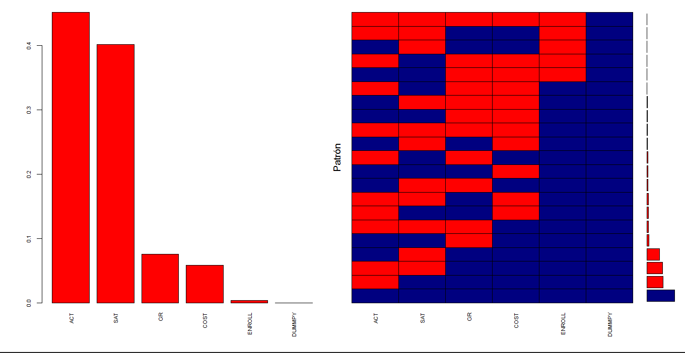

```{r setup, include=FALSE}
knitr::opts_chunk$set(echo = TRUE, message = FALSE, warning = FALSE, comment = NA)

```

</br></br>
<h2>Caso 2</h2>

<h3>Introducción</h3>

El objetivo principal de este caso de estudio es predecir y explicar la variable 'tasa de graduación', identificando los factores que mejor la describen. Para ello, es necesario seleccionar métodos de imputación adecuados para los datos faltantes y determinar cuáles variables, como el promedio de la prueba SAT, el número de nuevos estudiantes matriculados o la categoría de la universidad, están más fuertemente asociadas con la tasa de graduación.

Una vez realizada la limpieza de los datos, se debe analizar el tipo de datos faltantes. Posteriormente, se procede con la imputación de los mismos. Luego, se plantean dos modelos para explicar la variable de respuesta. El manejo adecuado de los datos faltantes es crucial para garantizar predicciones confiables sobre la tasa de graduación.  [Acceder a los datos de universidades](https://lib.stat.cmu.edu/datasets/colleges/)


<h3>Objetivos</h3>

En esta sección se presenta una discusión sobre el enfoque de análisis, centrado en el manejo de los datos faltantes, el cual debe realizarse antes de la modelación. Por lo tanto, solo se abordarán los resultados relacionados con los siguientes objetivos. La implementación de estas actividades queda como tarea para que se apliquen los conocimientos adquiridos en este módulo:

- Calcular el porcentaje de valores faltantes en cada una de las variables de interés para el caso en cuestión.

- Identificar el mecanismo de los datos faltantes (MCAR, MAR o MNAR).

- Proponer una estrategia para la imputación de los valores faltantes.


</br></br>
<h3>Respecto al objetivo 1</h3>

El conjunto de datos incluye información de 1,302 universidades de EE.UU. y abarca 35 variables. Para este trabajo, se seleccionaron las siguientes variables clave:

- Graduate rate (GR): Proporción de estudiantes que se gradúan en relación con los matriculados cuatro años antes.

- Average combined SAT score (SAT): Promedio combinado de los puntajes verbales y matemáticos del examen SAT.

- Number of new students enrolled (ENROLL): Número de nuevos estudiantes matriculados.

- Public/private indicator (DUMMYP): Indicador del tipo de universidad (1= pública, 2= privada).

- Room and board costs (COST): Costo total anual de alojamiento y comida (en miles de dólares estadounidenses).

- Average ACT score (ACT): Promedio de puntajes en la prueba ACT.

La **Tabla 1.20** presenta un análisis descriptivo de las variables. La falta de datos varía desde un 0.38% hasta un 45.16%, como ocurre con la variable ACT. Se observa que el 40.17% y el 45.16% de las universidades no reportan el promedio combinado de los resultados en la prueba SAT (verbal y matemática) y el promedio de puntajes en la prueba ACT, respectivamente. Estos son los porcentajes más altos de omisión. En contraste, solo el 0.38%, 5.84% y 7.53% de las universidades no reportan el número de nuevos estudiantes matriculados, los costos de alojamiento y comida, y la proporción de graduados entre los alumnos matriculados cuatro años antes, respectivamente.


</br></br>
<center>
**Tabla 1.20** Algunas estadístisticas de las variables seleccionadas.
</center>
| Variable  | N    | Promedio | Desv. Estándar | Faltantes | % Faltantes | Mínimo | Máximo |
|:----------|:----:|:--------:|:--------------:|:---------:|:-----------:|:------:|:------:|
| **DUMMYP** | 1302 | 1.64  | 0.48  | 0  | 0.00  | 1  | 2  |
| **SAT**    | 779  | 967.87  | 123.58  | 523  | 40.17  | 600  | 1410  |
| **ACT**    | 714  | 22.12  | 2.58  | 588  | 45.16  | 11  | 31  |
| **ENROLL** | 1297 | 778.88  | 884.58  | 5  | 0.38  | 18  | 7425  |
| **COST**   | 1226 | 4162.11  | 1179.28  | 76  | 5.84  | 1260  | 8700  |
| **GR**     | 1204 | 60.41  | 18.89  | 98  | 7.53  | 8  | 118  |


Asimismo, en la **Tabla 1.20**  se observa que la variable 'proporción de graduados' presenta valores superiores a 100, es decir, valores fuera del rango permitido, que debería estar entre 0% y 100%. Como resultado, se clasificó esta observación como un dato faltante y se aplicaron diversas técnicas de imputación para reemplazar el valor por uno dentro del rango establecido.


</br></br>
<center>
```{r, echo=FALSE, out.width="100%", fig.align = "center"}

```
**Figura 1.55** Proporción y patrón de datos faltantes.
</center>
</br>

La gráfica de la derecha de la **Figura 1.55** muestra el porcentaje de datos faltantes en cada variable. También, se presenta en la misma figura los 21 patrones de datos faltantes presentes en la base de datos. El color azul indica los datos observados, mientras que el rojo señala los datos faltantes.

En la **Figura 1.55**, en el primer gráfico, se observa que el porcentaje de universidades con observaciones faltantes es significativamente mayor en las variables ACT y SAT en comparación con las demás. En el segundo gráfico, se muestran las combinaciones de observaciones faltantes y no faltantes. Se puede notar que el patrón de datos faltantes es aleatorio y multivariado, no siendo monótono ni univariado.

Antes de proceder al análisis, es necesario discernir los mecanismos de generación de datos faltantes, siendo
MCAR, MAR o MNAR. Porter S. (1999) analiza datos reportados por \U.S. News and World Report 2 menciona
que "la falta de datos probablemente se deba a que las universidades no pudieron recoger los datos", sin embargo,
también dice que "las razones son un misterio".

</br></br>
<h3>Respecto al objetivo 2</h3>

Al aplicar el test de Little para MCAR en **R**, se obtuvo un $valor-p$ menor a 0.05, lo que sugiere que los datos faltantes no cumplen con el supuesto de MCAR. Por lo tanto, la estimación utilizando solo la submuestra completa no parece ser la opción más adecuada en esta situación. Se puede trabajar bajo el supuesto de MAR, aunque esto no implica que el mecanismo de datos faltantes no sea MNAR, ya que las universidades con bajas tasas de graduación podrían estar inclinadas a omitir estas tasas para evitar publicidad adversa o un posible desprestigio institucional.


</br></br>
<h3>Respecto al objetivo 3</h3>

Consideraciones para los análisis posteriores:

- Se puede asumir el supuesto de MAR, dado que no se conocen las razones detrás de los datos faltantes y el test rechaza la hipótesis de que el mecanismo de generación de los datos faltantes sea MCAR.

- Bajo el supuesto de MAR y el patrón observado en los datos faltantes, se sugiere utilizar la imputación múltiple como método de imputación. Consulta alternativas para imputar condicionalmente.

- Una vez realizada la imputación de los datos faltantes, se podrá proceder con la selección del modelo adecuado para explicar la tasa de graduación. Para ello, se pueden evaluar dos técnicas iniciales de modelización para construir modelos predictivos e inferenciales, tales como regresión beta y random forest.


